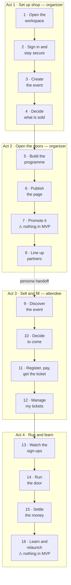

# Eventa — User Story Map

| | |
|---|---|
| **Product** | Eventa — Event Registration & Management Platform |
| **Author** | Product Owner |
| **Format** | Story map — journey backbone (across) × release slices (down) |
| **Version** | 1.0 |
| **Date** | 2026-07-30 |
| **Source of truth** | [functional-requirements.md](functional-requirements.md) — every `US-*` in the backlog appears here exactly once |

> **How to read this.** The [backlog](functional-requirements.md) groups stories by **feature area**
> (13 epics). This document re-cuts the *same* stories by **when the user meets them** — the journey
> backbone — and then slices them into release bands. Nothing here is new scope; it is the backlog
> viewed along a different axis, so two questions the epic list cannot answer become answerable:
> *does every step of the journey have something in the MVP?* and *which stories of a split epic ship
> when?*
>
> **Conventions.** A conventional story map runs activities left-to-right and releases top-to-bottom.
> That transposes badly to Markdown at 16 activities, so the tables below put **activities down the
> left and releases across** — same map, rotated 90°.
>
> **This document deliberately carries no dates and no story totals.** Dates and gates belong to
> [project-plan.md §4.1](../02-project-plan/project-plan.md); MoSCoW totals belong to
> [functional-requirements.md](functional-requirements.md). Gates are referenced **by name only**
> (M3 / M4 / M5) so this map cannot drift out of sync with the schedule.

---

## 1. The backbone

Sixteen activities in the order a real event actually happens — not the order the epics are
documented in. Two personas share one axis, so the **handoff** (the organizer publishes; the attendee
discovers) is visible for the first time.



Activity 16 closes the loop: `EVT-13` duplicates a finished event straight back into activity 3, so a
repeat organizer re-enters the journey there rather than at activity 1.

| # | Activity | Persona | What it covers | Feeding epics |
|---|----------|---------|----------------|---------------|
| 1 | Open the workspace | Organizer | Org profile, tax details, branding, payment account, checkout prefs, teammates & roles | [E2](functional-requirements.md#epic-e02) |
| 2 | Sign in & stay secure | Organizer | Account creation, sign-in, password reset, 2FA, sessions, personal profile & prefs | [E1](functional-requirements.md#epic-e01), [E2](functional-requirements.md#epic-e02) |
| 3 | Create the event | Organizer | Wizard, drafts, basics, date/time/location, seating model, categories, calendar | [E3](functional-requirements.md#epic-e03) |
| 4 | Decide what's sold | Organizer | Ticket types, pricing, capacity, registration rules, inventory, availability | [E3](functional-requirements.md#epic-e03), [E5](functional-requirements.md#epic-e05) |
| 5 | Build the programme | Organizer | Sessions, schedule feasibility, speaker directory & line-up | [E10](functional-requirements.md#epic-e10), [E3](functional-requirements.md#epic-e03) |
| 6 | Publish the page | Organizer | Template choice, branding, preview, visibility, stable public link | [E4](functional-requirements.md#epic-e04), [E3](functional-requirements.md#epic-e03) |
| 7 | **Promote it** | Organizer | Share links, printable flyer, rich search results, discount codes, announcements | [E3](functional-requirements.md#epic-e03), [E5](functional-requirements.md#epic-e05), [E4](functional-requirements.md#epic-e04), [E7](functional-requirements.md#epic-e07) |
| 8 | Line up partners | Organizer | Meetings with speakers, sponsors, venues, vendors; invites, video links, reminders | [E12](functional-requirements.md#epic-e12) |
| 9 | Discover the event | **Attendee** | Browse, search & filter, save for later | [E6](functional-requirements.md#epic-e06) |
| 10 | Decide to come | Attendee | Public page: identity, about, highlights, agenda, tiers, FAQ, add-to-calendar | [E4](functional-requirements.md#epic-e04) |
| 11 | Register, pay, get the ticket | Attendee | Guest or signed-in checkout, tickets/seats, card & PromptPay, discount code, **confirmation + QR ticket** | [E6](functional-requirements.md#epic-e06), [E1](functional-requirements.md#epic-e01), [E5](functional-requirements.md#epic-e05), [E7](functional-requirements.md#epic-e07) |
| 12 | Manage my tickets | Attendee | Attendee sign-in, upcoming & past tickets, receipts, profile, prefs, deletion | [E6](functional-requirements.md#epic-e06) |
| 13 | Watch the sign-ups | Organizer | Queue, approvals, waitlist, invites, attendee directory, tagging, exports, dashboard, alert feed | [E8](functional-requirements.md#epic-e08), [E11](functional-requirements.md#epic-e11), [E3](functional-requirements.md#epic-e03), [E7](functional-requirements.md#epic-e07) |
| 14 | Run the door | Both | Manual check-in list, live QR station, manual fallback, live turnout | [E8](functional-requirements.md#epic-e08) |
| 15 | Settle the money | Organizer | Payments, refunds, balances & payouts, invoices, VAT ledger & returns, cancellation | [E9](functional-requirements.md#epic-e09), [E3](functional-requirements.md#epic-e03) |
| 16 | **Learn & relaunch** | Both | Reports & exports, attendee feedback & surveys, speaker ratings, duplicate the event | [E13](functional-requirements.md#epic-e13), [E7](functional-requirements.md#epic-e07), [E6](functional-requirements.md#epic-e06), [E10](functional-requirements.md#epic-e10), [E3](functional-requirements.md#epic-e03) |

---

## 2. The map

Cells hold `US-*` ids only — ids are stable and never renumbered, so this map does not drift when
story titles are reworded. Look up any id in [functional-requirements.md](functional-requirements.md).

**Columns are releases, not priorities.** Almost everywhere the two coincide (R1 = Must, R2 = Should,
R3 = Could), and the two places they *don't* are marked — those are the exceptions worth knowing
about, recorded in [project-plan.md §4.1](../02-project-plan/project-plan.md):

- **†** `US-REG-04` is priority **Should** but ships in **R1** — `US-DISC-01` (Must) shows a
  "Waitlist" badge on sold-out events, so organizer-side waitlist management has to exist at launch.
- **‡** six **Must** stories ship in **R2** — E12 Meetings is organizer-internal logistics, off the
  core money path, so it is deferred by decision rather than by accident.

| Activity | **R1 · MVP** → gate M3 | **R2 · Growth** → gate M4 | **R3 · v1.0** → gate M5 |
|---|---|---|---|
| **Act 1 — Set up shop** | | | |
| 1 · Open the workspace | `SET-07` `SET-08` `SET-09` `SET-10` `SET-11` `SET-12` | — | `SET-13` |
| 2 · Sign in & stay secure | `ACC-01` `ACC-02` `ACC-04` `ACC-05` `ACC-08` `ACC-10` `ACC-11` `ACC-12` `SET-01` `SET-02` | `ACC-06` `ACC-07` `ACC-09` `SET-03` `SET-04` `SET-05` `SET-06` | — |
| 3 · Create the event | `EVT-01` `EVT-02` `EVT-03` `EVT-04` `EVT-05` `EVT-11` | `EVT-12` | — |
| 4 · Decide what's sold | `EVT-06` `EVT-10` `TKT-01` `TKT-02` `TKT-03` | `TKT-04` `TKT-05` | — |
| **Act 2 — Open the doors** | | | |
| 5 · Build the programme | `PROG-01` `PROG-02` `PROG-03` `PROG-04` `PROG-05` `PROG-08` `PROG-09` `PROG-10` `PROG-11` `EVT-09` | `PROG-06` `PROG-12` | `PROG-07` |
| 6 · Publish the page | `PAGE-09` `PAGE-10` `EVT-07` | — | — |
| 7 · Promote it | ⚠ **nothing** | `EVT-15` `TKT-06` `TKT-07` `TKT-09` `TKT-12` `PAGE-08` `MSG-04` | `TKT-08` `TKT-10` `MSG-05` |
| 8 · Line up partners | ⚠ **nothing** | `MTG-01`‡ `MTG-02`‡ `MTG-03`‡ `MTG-04`‡ `MTG-05`‡ `MTG-07`‡ `MTG-06` `MTG-08` | `MTG-09` |
| **Act 3 — Sell & fill** | | | |
| 9 · Discover the event | `DISC-01` `DISC-02` | `DISC-03` | — |
| 10 · Decide to come | `PAGE-01` `PAGE-02` `PAGE-03` `PAGE-05` | `PAGE-04` `PAGE-07` | `PAGE-06` |
| 11 · Register, pay, get the ticket | `ACC-03` `DISC-04` `DISC-05` `DISC-06` `DISC-07` `DISC-15` `MSG-01` | `TKT-11` `MSG-02` | — |
| 12 · Manage my tickets | `DISC-08` `DISC-09` `DISC-10` `DISC-11` | `DISC-12` | `DISC-14` |
| **Act 4 — Run & learn** | | | |
| 13 · Watch the sign-ups | `REG-01` `REG-02` `REG-03` `REG-05` `REG-06` `REG-04`† `DASH-01` `DASH-02` `DASH-06` `DASH-08` `DASH-09` `DASH-12` `DASH-13` | `REG-07` `REG-08` `REG-09` `REG-10` `DASH-03` `DASH-04` `DASH-10` `DASH-11` `EVT-14` `MSG-03` | `DASH-05` `DASH-07` |
| 14 · Run the door | `REG-11` `REG-12` `REG-13` | `REG-14` | — |
| 15 · Settle the money | `FIN-01` `FIN-02` `FIN-03` `FIN-05` `FIN-06` `FIN-07` `FIN-08` `FIN-10` `FIN-11` `FIN-12` `FIN-14` `EVT-08` | `FIN-04` `FIN-09` `FIN-13` | — |
| 16 · Learn & relaunch | ⚠ **nothing** | `RPT-01` `RPT-02` `RPT-04` `RPT-05` `RPT-07` `RPT-08` `RPT-09` `RPT-11` `RPT-12` `DISC-13` `MSG-06` `MSG-08` `MSG-09` `PROG-13` `EVT-13` | `RPT-03` `RPT-06` `RPT-10` `MSG-07` `MSG-10` |

---

## 3. Is R1 a walking skeleton?

**Yes, for the money path.** Read the R1 column straight down and one attendee can be admitted to one
paid event end to end, with the organizer paid: set up the org and connect payments (1) → sign in (2)
→ create the event (3) → define tickets (4) → build the programme (5) → publish (6) → *[handoff]* →
be discovered (9) → be evaluated (10) → register, pay and receive a QR ticket (11) → see the ticket
in the attendee account (12) → be managed and admitted (13, 14) → be settled and invoiced (15).

Every one of those steps has R1 content. There is no gap in the chain that carries money.

### Holes in the MVP slice

Three activities ship **empty** at M3. Each is defensible; none was previously written down as a
decision, which is the point of drawing this.

| Activity | Why it's empty | Consequence at launch | Verdict |
|---|---|---|---|
| **7 · Promote it** | All six promotion stories (`TKT-07`…`12`) plus `EVT-15`, `TKT-06`, `PAGE-08` are Should/Could. E5 is only 3 Must of 12 — the ticket-*type* half is Must, the promotion half is not | An organizer can publish an event but has **no discount codes, no share/flyer tooling, no announcements**. Promotion happens off-platform (their own social/email) | **Accept.** Sellable without it; nothing is unrecoverable |
| **8 · Line up partners** | E12's six Must stories are deferred to R2 by decision (‡) | Speaker/sponsor/venue coordination happens in the organizer's own calendar and inbox until M4 | **Accept.** Organizer-internal; no attendee impact |
| **16 · Learn & relaunch** | **All 12 E13 stories are non-Must (0 of 12)** — plus `DISC-13`, `MSG-08`/`09`, `PROG-13`, `EVT-13` | The MVP launches an event the organizer **cannot measure and cannot collect feedback on**, and cannot duplicate to relaunch. The `US-DASH-*` KPI tiles in R1 are the only numbers they get | **Accept with a caveat** — see below |

**The caveat on activity 16.** `US-DISC-01` (Must) states that event cards show *"an average rating
when the event has been reviewed."* Ratings come from attendee feedback — `US-DISC-13` — which is
**Should** and sits in R2. At M3 that acceptance criterion is therefore unsatisfiable: no event can
have a rating, because nothing collects one. This is a genuine cross-activity dependency between a
Must story and a Should story, and it is only visible when the map places them side by side.

*Recommended resolution (PO decision, not yet applied to the backlog):* either promote `US-DISC-13`
to Must, or amend `US-DISC-01`'s criterion to note that ratings appear from R2 onward. The second is
cheaper and does not move the MVP boundary.

### Narrow bands worth watching

- **Activity 11 rests on E7's single Must.** `US-MSG-01` is 1 of 10 stories in its epic, and it is
  the one that delivers the attendee's ticket on successful payment. It is now pulled into Phase 1
  (WBS 3.5, sprint 5) rather than shipping with the rest of E7 in R2. If it slips, the MVP has no
  ticket delivery — treat it as a launch-blocking dependency of `US-DISC-06`.
- **Activity 6 has three stories and no slack.** Publishing is the hinge between the two personas:
  nothing in Act 3 is reachable until `PAGE-09`, `PAGE-10` and `EVT-07` are all done.
- **Activity 12 rests entirely on one story in activity 11.** `US-DISC-15` is the only way an
  attendee account comes into existence, and all four R1 stories in "Manage my tickets"
  (`DISC-08`…`11`) are unreachable without one. It sits one column to the left of everything that
  needs it, which is easy to miss: an attendee area shipped without `DISC-15` has no way for a real
  person to get in. Social sign-in is not a substitute — it creates the account in the organizer's
  workspace rather than the platform realm, which is the wrong realm for "all my tickets in one
  place" (see `US-DISC-08`).

---

## 4. What the ordering exposes

Re-sorting the backlog by journey rather than by feature area surfaces two things that are harmless
but worth knowing when reading the epic list:

- **The first thing an organizer does is documented last.** Activity 1 is
  [E2](functional-requirements.md#epic-e02) — you cannot create a sellable event before the org has
  tax details and a connected payment account. The plan already handles this correctly (E2 is in
  sprint 1), so this is a documentation-order observation only, not a sequencing defect.
- **[E11](functional-requirements.md#epic-e11) (a dashboard *of* events) is numbered before
  [E3](functional-requirements.md#epic-e03) (which creates them).** Again the plan builds them in the
  right order (E3 sprint 2, E11 sprint 7); only the epic numbering reads backwards.

Epic ids are stable references and must not be renumbered to fix either of these.

---

## 5. Maintenance

This map is a **derived view**. It holds no story titles, no dates and no totals, so the only thing
that can invalidate it is adding, removing or re-prioritising a story.

When the backlog changes:

1. Place the new/changed `US-*` id in exactly one activity row and one release column.
2. Check whether the change empties or fills an activity's R1 cell — if so, update §3.
3. If a Must/Should exception is created or resolved, update the **†**/**‡** notes here **and**
   [project-plan.md §4.1](../02-project-plan/project-plan.md).

**Invariant:** every `US-*` in [functional-requirements.md](functional-requirements.md) appears in
§2 exactly once — no duplicates, no omissions. Verify with:

```bash
grep -oE 'US-[A-Z]+-[0-9]+' 01-requirements-and-features/functional-requirements.md | sort -u > /tmp/backlog.txt
grep -oE 'US-[A-Z]+-[0-9]+|`[A-Z]+-[0-9]+`' 01-requirements-and-features/user-story-map.md | tr -d '`' | sed -E 's/^([A-Z]+-[0-9]+)$/US-\1/' | sort -u > /tmp/map.txt
diff /tmp/backlog.txt /tmp/map.txt && echo "map covers the backlog exactly"
```

## Related documents

- [functional-requirements.md](functional-requirements.md) — the backlog these stories come from (source of truth for titles, acceptance criteria and MoSCoW).
- [non-functional-requirements.md](non-functional-requirements.md) — quality requirements (`NFR-*`); not mapped here, they cut across every activity.
- [project-plan.md](../02-project-plan/project-plan.md) — the dates, gates, sprint schedule and WBS this map's release bands refer to.
- [design-reference.md](../03-ux-ui-design/design-reference.md) — the screen inventory and route-level user flows that realise activities 9–12 and 13–15.
- [test-cases.md](../06-testing/test-cases.md) — `TC-*` cases verifying each `US-*`.
