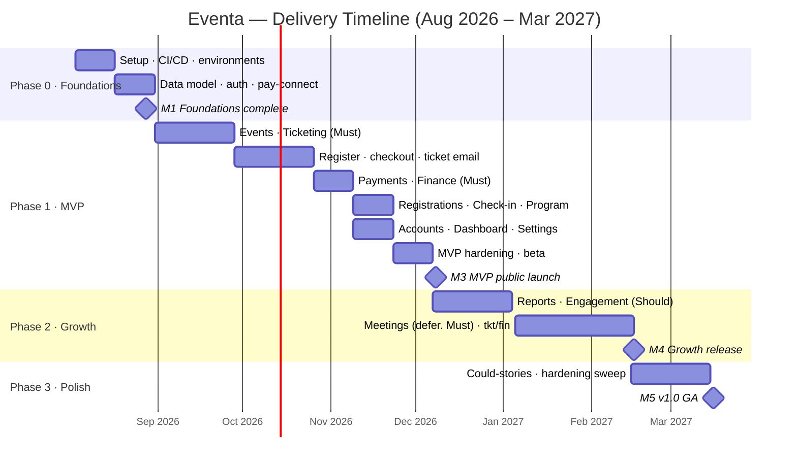

# Eventa — Project Plan

| | |
|---|---|
| **Product** | Eventa — Event Registration & Management Platform |
| **Author** | Project Manager |
| **Version** | 1.1 |
| **Date** | 2026-07-23 |
| **Planning basis** | [Product backlog](../01-requirements-and-features/functional-requirements.md) — 161 user stories (89 Must / 57 Should / 15 Could) + [46 quality requirements](../01-requirements-and-features/non-functional-requirements.md) |
| **Delivery approach** | Agile / Scrum · 2-week sprints |
| **Target** | MVP public launch **Dec 2026** · v1.0 GA **Mar 2027** |

**Plan coverage** — this plan includes all eight elements of a complete project plan:

| Element | Section |
|---|---|
| 1. Project objectives (SMART) | [§1](#1-project-objectives-smart) |
| 2. Scope statement | [§2](#2-scope-statement) |
| 3. Work breakdown structure (WBS) | [§3](#3-work-breakdown-structure-wbs) |
| 4. Timeline & milestones | [§4](#4-timeline--milestones) |
| 5. Resource allocation | [§5](#5-resource-allocation) |
| 6. Budget estimation | [§6](#6-budget-estimation) |
| 7. Risk management plan | [§7](#7-risk-management-plan) |
| 8. Communication plan | [§8](#8-communication-plan) |

---

## 1. Project objectives (SMART)

The project delivers a production platform where attendees discover, register and pay (card/PromptPay)
and receive a QR ticket, and organizers create events, sell tickets, admit attendees, and get paid —
replacing the current front-end prototype. Objectives are SMART:

| ID | Objective | Measure (M) | Target (T) |
|----|-----------|-------------|-----------|
| **O1** | Launch the MVP taking **real registrations & payments** | MVP live; ≥1 real paid registration & QR check-in in production | **2026-12-08** |
| **O2** | Deliver **v1.0** (all Must + Should + selected Could) within budget | 146+ of 161 stories accepted; ≤ approved budget (§6) | **2027-03-16** |
| **O3** | Meet **launch-critical quality bars** | Must-priority NFRs verified (checkout confirm < 2s p95; page load < 2.5s p95; PDPA-compliant) | at **M3** (2026-12-08) |
| **O4** | Ship at an agreed **quality level** | Zero open Sev-1/Sev-2 defects at each release; ≥ 90% of Must stories accepted first-pass | each release |

*(Each objective is **S**pecific (named outcome), **M**easurable (column M), **A**chievable (staffed per §5, scoped per §2), **R**elevant (tied to the core money path), and **T**ime-bound (column T).)*

## 2. Scope statement

**In scope** — the 13 epics / 161 user stories in the backlog; a backend + datastore; real
authentication; Stripe + PromptPay payments; email/SMS; and the integrations in the spec.

**Out of scope (this release train)** — native mobile apps; multi-currency beyond THB; a public
API / partner marketplace; AI/recommendation features. Parked for a future roadmap.

**Assumptions** — team staffed by kickoff; Stripe (Thailand) + PromptPay merchant accounts
obtainable; UI is covered by the existing prototype ([Stage 3](../03-ux-ui-design/)); PDPA counsel
available.

**Constraints** — fixed team (§5); year-end freeze **2026-12-21 → 2027-01-04**; payment & PDPA
compliance are hard gates before handling real money/data.

**Change control** — scope changes go through the PO and are reflected in the backlog; the MoSCoW
order is the lever (cut **Could** first). This statement exists to prevent scope creep.

## 3. Work breakdown structure (WBS)

The project decomposes into deliverables (WBS level 2) and work packages (level 3), each mapping to
backlog epics / `US-*` stories for traceability. Where an epic is **split across phases**, the split is
named at story level so the phase boundary is unambiguous — see the
[user story map](../01-requirements-and-features/user-story-map.md) for the full story-to-release
placement.

| WBS | Deliverable / work package | Backlog | Phase |
|-----|----------------------------|---------|-------|
| **1.0** | **Project management** — planning, tracking, reporting, risk | — | all |
| **2.0** | **Foundations** | | 0 |
| 2.1 | Repo, CI/CD, environments (dev/staging/prod) | platform | 0 |
| 2.2 | Data model & datastore (from [ERD](../04-architecture/erd.md)) | E-data | 0 |
| 2.3 | Authentication & session backbone | E1 (core) | 0 |
| 2.4 | Payment-provider connection (Stripe/PromptPay, test) | E2 | 0 |
| **3.0** | **MVP — core money path** | | 1 |
| 3.1 | Create & manage events, categories | E3 | 1 |
| 3.2 | Ticket types (Must) | E5 | 1 |
| 3.3 | Public event pages & discovery/search | E4, E6 | 1 |
| 3.4 | Registration & checkout (card/PromptPay), QR ticket | E6 | 1 |
| 3.5 | Transactional messaging — confirmation + ticket, receipt, reminder (`US-MSG-01`) | E7 (Must) | 1 |
| 3.6 | Payments, invoices, payouts (Must) | E9 | 1 |
| 3.7 | Registration management, waitlist, check-in tool | E8 (+ `US-REG-04`) | 1 |
| 3.8 | Event program (agenda & speakers) | E10 | 1 |
| 3.9 | Organizer home & dashboard | E11 | 1 |
| 3.10 | Accounts, settings, org & team | E1, E2 | 1 |
| **4.0** | **Growth** | | 2 |
| 4.1 | Insights & reports | E13 | 2 |
| 4.2 | Engagement — templates, announcements, delivery log, feedback (`US-MSG-02`…`10`) | E7 (rest) | 2 |
| 4.3 | Meetings — **incl. 6 deferred Must stories**, see §4.1 note | E12 | 2 |
| 4.4 | Advanced ticketing/discounts & finance (Should) | E5, E9 | 2 |
| **5.0** | **Polish & v1.0** — Could stories, accessibility & i18n | Could | 3 |
| **6.0** | **Quality & testing** — test plan, automation, regression, UAT | see [Stage 6](../06-testing/) | all |
| **7.0** | **Release & deployment** — infra, launch, runbooks, monitoring | see [Stage 7](../07-deployment/) | 1–3 |

## 4. Timeline & milestones

**Approach:** Scrum, **2-week sprints**. Ceremonies: planning (day 1), daily stand-up, mid-sprint
refinement, review/demo + retro (last day). Sequencing is dependency-driven (§4.2).

### 4.1 Milestones

| # | Milestone | Target date | Exit criteria |
|---|---|---|---|
| **M0** | Project kickoff | **2026-08-03** | Team onboarded, environments provisioned |
| **M1** | Foundations complete | **2026-08-28** | Auth, data model, CI/CD, Stripe/PromptPay in test |
| **M2** | MVP feature-complete | **2026-11-20** | **83 of 89** Must stories built & QA-passed in staging (all except the 6 deferred E12 Meetings stories — see note) |
| **M3** | 🚀 **MVP public launch (GA)** | **2026-12-08** | Beta hardening done; launch NFRs met; real payments live |
| **M4** | Growth release | **2027-02-16** | 57 Should stories + the 6 deferred Must stories delivered |
| **M5** | 🏁 **v1.0 GA** | **2027-03-16** | Could stories + full accessibility/performance/PDPA sign-off |

**Note — Must stories deferred past M2 (recorded decision).** Six Must stories in **E12 Coordinate
Meetings** (`US-MTG-01`…`05`, `07`) are scheduled in Phase 2 (sprint 11), *after* M2. They are
organizer-internal logistics and sit off the core money path, so deferring them does not block the
M3 launch. M2's exit criterion is scoped accordingly rather than claiming all 89.

Two consequences of this that are **also** deliberate, and are called out here so they are choices
rather than arithmetic accidents:

- **`US-MSG-01` is not deferred.** It delivers the confirmation message carrying the attendee's
  ticket on successful payment, which the MVP definition ends in ("…get a QR ticket"). It is pulled
  into Phase 1 (WBS 3.5, sprint 5) alongside checkout and QR issuance. The other nine E7 stories
  stay in Phase 2.
- **`US-REG-04` (waitlist, priority Should) is pulled forward** into Phase 1 (WBS 3.7). `US-DISC-01`
  (Must) already shows a "Waitlist" badge on sold-out events, so the organizer-side waitlist has to
  exist at launch for that to mean anything.

At M3 the product ships with **no promotion tooling and no reporting** — every story in those two
activities is Should or Could. See the [user story map](../01-requirements-and-features/user-story-map.md)
§"Holes in the MVP slice" for what that means operationally.

### 4.2 Sprint plan & dependencies

Sequencing: **accounts + data model** unlock everything; **events** precede **tickets**; **tickets**
precede **registration**; **registration + payment** precede **check-in** and **finance**;
**payment** precedes **ticket delivery** (`US-MSG-01` ships with checkout, not with the rest of E7);
**reporting** needs live transactional data.

| Sprint | Dates | Focus | Epics |
|---|---|---|---|
| 0 | Aug 03–14 | Repo, CI/CD, environments, backend skeleton, auth backbone | platform, E1 |
| 1 | Aug 17–28 | Data model, org/workspace + payment-provider setup | E2, E1 |
| 2 | Aug 31–Sep 11 | Create & manage events; categories | E3 |
| 3 | Sep 14–25 | Ticket types (Must); public event pages | E5, E4 |
| 4 | Sep 28–Oct 09 | Discover, search; guest registration | E6 |
| 5 | Oct 12–23 | Checkout (card/PromptPay); QR ticket issuance + **confirmation/ticket delivery (`US-MSG-01`)** | E6, E9, E7 (Must) |
| 6 | Oct 26–Nov 06 | Payments, invoices, payouts (Must); attendee account | E9, E6 |
| 7 | Nov 09–20 | Registrations mgmt, **waitlist (`US-REG-04`)**, check-in, program, dashboard, settings | E8, E10, E11, E2 |
| 8 | Nov 23–Dec 04 | MVP hardening, beta, load/security/PDPA checks | all Phase-1 Must |
| — | **Dec 08** | 🚀 **MVP launch** | — |
| 9 | Dec 07–18 | Insights & reports | E13 |
| 10 | Jan 05–15 | Engagement: templates, announcements, log, feedback | E7 (rest) |
| 11 | Jan 18–29 | Meetings (**incl. 6 deferred Must**); advanced ticketing/discounts (Should) | E12, E5 |
| 12 | Feb 01–12 | Advanced finance/registration/dashboard (Should) | E9, E8, E11 |
| — | **Feb 16** | Growth release | — |
| 13 | Feb 15–26 | Could stories; accessibility & i18n polish | Could |
| 14 | Mar 01–12 | Performance/security hardening; release candidate | all |
| — | **Mar 16** | 🏁 **v1.0 GA** | — |

*(Year-end freeze 2026-12-21 → 2027-01-04 absorbed in the Phase-2 window.)*

## 5. Resource allocation

### 5.1 Team

| Role | FTE | Responsibility |
|---|:--:|---|
| Project Manager | 1.0 | Schedule, risk, coordination, reporting |
| Product Owner | 1.0 | Backlog, priorities, acceptance |
| Tech Lead / Architect | 1.0 | Architecture, code quality, key decisions |
| Backend Engineer | 2.0 | API, data model, payments, integrations |
| Frontend Engineer | 2.0 | React app against the prototype |
| QA Engineer | 1.0 | Test plan, automation, release sign-off |
| UX/UI Designer | 0.5 | Design polish, gaps beyond the prototype |
| DevOps | 0.5 | CI/CD, environments, infra, observability |
| **Total** | **9.0 FTE** | |

**Velocity:** ~12 delivered stories / 2-week sprint at steady state (~4 dev pairs).

**RACI (key activities):**

| Activity | PM | PO | Tech Lead | Devs | QA |
|---|:--:|:--:|:--:|:--:|:--:|
| Prioritise backlog | C | **A/R** | C | I | I |
| Sprint planning | **A** | R | R | R | C |
| Architecture & design | I | C | **A/R** | R | I |
| Build stories | I | C | R | **A/R** | C |
| Test & release sign-off | A | C | C | R | **A/R** |
| Stakeholder reporting | **A/R** | C | I | I | I |

### 5.2 Tools & technologies

| Category | Choice |
|---|---|
| Frontend | React 19 · TypeScript · Vite · Tailwind v4 (existing prototype in `../../eventa-web`) |
| Backend | Node.js/TypeScript service · REST API |
| Database | PostgreSQL 15+ (per the [ERD](../04-architecture/erd.md)) |
| Payments | Stripe (cards, Connect payouts) · PromptPay |
| Messaging | Transactional email provider · SMS gateway (Thai) |
| Calendar | Google Calendar / Google Meet |
| Infra / hosting | Cloud host · CDN · object storage · managed Postgres |
| CI/CD & quality | Git · CI pipeline · automated tests · linting |
| Project & docs | Jira (keyed on `US-*` IDs) · this `sdlc/` repo |
| Observability | Error tracking · metrics/alerting · uptime monitoring |

## 6. Budget estimation

Indicative, in Thai Baht. **Rates are planning assumptions — validate with Finance/HR before commitment.**
Stripe/PromptPay processing fees are transaction pass-through and excluded.

**Labour** — 9.0 FTE over ~7.5 months (2026-08-03 → 2027-03-16) ≈ **~67 person-months**.

| Cost line | Basis (assumption) | Estimate (฿) |
|---|---|---|
| Labour | ~67 person-months × ฿180,000 blended/loaded | ~12,060,000 |
| Cloud infra / hosting / CDN / DB | ~฿40,000/mo × 8 mo | ~320,000 |
| Third-party services (email/SMS/Meet) | ~฿20,000/mo × 8 mo | ~160,000 |
| Tooling (Jira, CI, monitoring, design) | ~฿15,000/mo × 8 mo | ~120,000 |
| Security & PDPA counsel / audit | one-off | ~300,000 |
| **Subtotal** | | **~12,960,000** |
| Contingency | 15% | ~1,944,000 |
| **Total (indicative)** | | **≈ ฿14.9M** *(range ฿13–17M by rate)* |

**Cost control:** budget is tracked per sprint against burn; the MoSCoW order is the release valve —
if trending over, **Could** then lower-value **Should** stories are cut before dates or quality.

## 7. Risk management plan

| ID | Risk | Likelihood | Impact | Mitigation | Owner |
|---|---|:--:|:--:|---|---|
| R1 | Stripe/PromptPay onboarding or integration delays | Med | High | Start account setup Sprint 0; sandbox-first; Phase-0 buffer | Tech Lead |
| R2 | PDPA compliance gaps block launch | Med | High | Counsel engaged early; privacy stories Must; audit before M3 | PO / PM |
| R3 | On-sale traffic spikes cause overselling / outages | Med | High | Load test Sprint 8; capacity/idempotency in NFRs; queueing | Tech Lead |
| R4 | Scope creep beyond MoSCoW | High | Med | Change control via PO; Could-first cuts; strict DoD | PM |
| R5 | Team ramp-up / key-person dependency | Med | Med | Pairing, docs, cross-training; TL off the sole critical path | PM |
| R6 | Camera/QR check-in unreliable on venue devices | Low | Med | Manual fallback (specified); device test matrix pre-launch | QA |
| R7 | Third-party (email/SMS/Meet) outages | Low | Med | Retry + delivery log; provider fallbacks | Backend |
| R8 | Year-end freeze compresses Phase 2 | High | Low | Baked into schedule; no launches across the freeze | PM |
| R9 | Budget rate assumptions understate cost | Med | Med | Validate rates at kickoff; 15% contingency; monthly burn review | PM |

Risks are reviewed every sprint; RAG status and top risks go in the weekly report (§8).

## 8. Communication plan

| Cadence | Forum / channel | Audience | Purpose |
|---|---|---|---|
| Daily | Stand-up (15 min) · team chat | Delivery team | Blockers, coordination |
| Per sprint | Planning · review/demo · retro | Team + PO | Commit, demo, improve |
| Weekly | Status report (RAG, burndown, budget burn, top risks) | Stakeholders | Progress & escalation |
| Per milestone | Go/no-go review | Stakeholders + sponsor | Release decision |
| Ad-hoc | Escalation path: Team → PM → Sponsor | as needed | Unblock decisions |

Single source of truth: Jira (delivery, keyed on `US-*` IDs) + this `sdlc/` repo (plans & specs).
Decisions are logged; the plan is republished at each milestone.

## 9. Definition of Done & release criteria (supporting)

**Story DoD:** acceptance criteria pass · code reviewed & merged · unit/integration tests green ·
meets applicable NFRs · no known Sev-1/2 defects · PO-accepted in staging.

**Release criteria (per milestone):** all in-scope stories Done · regression suite green · launch-
critical NFRs verified · rollback plan ready · support/on-call in place.

---

_This plan is a living document; scope, dates, and budget are reviewed each sprint and at every milestone._
