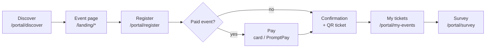
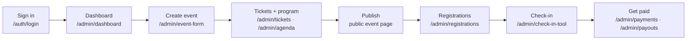

# Eventa — UX / UI Design Reference

| | |
|---|---|
| **Stage** | 3 — UX / UI Design |
| **Version** | 1.0 · 2026-07-23 |
| **Nature** | The design is **implemented as a working prototype** (design-in-code). This document is a **map/index** that points at that prototype — it is deliberately *not* a re-documentation of the pixels. |

> **Source of truth = the prototype.** The living UX/UI design is the code, not this file. When the
> design changes, change the prototype; this reference only indexes it. Do not add mockups or a token
> dump here that would drift out of sync.

## Where the design lives
- **[`../../eventa-web`](../../eventa-web)** — the React implementation of the design: the full,
  clickable screen set (attendee portal, public landing pages, organizer admin console), with
  light/dark theming. **This is the high-fidelity, interactive design spec.**
- **[`../../eventa-ui-kit`](../../eventa-ui-kit)** — the static HTML/Tailwind **design kit** the app
  was built from: the visual source of truth for colours, typography, spacing and components.

**To view the design live:** run the prototype (`pnpm dev` in `eventa-web`, dev server on port 5180)
and browse the routes below, or open the static kit in `eventa-ui-kit`.

## Screen inventory

Grouped by product area, with route and the backlog epic each screen serves (traceability into the
[product backlog](../01-requirements-and-features/functional-requirements.md)).

### Attendee portal & public (guest-facing)
| Screen | Route | Epic |
|---|---|---|
| Discover events | `/portal/discover` | E6 |
| Register & checkout (tickets, seats, card/PromptPay) | `/portal/register` | E6 |
| My account (tickets · payments · profile · settings) | `/portal/my-events` | E6 |
| Post-event survey | `/portal/survey` | E6 |
| Attendee sign-in | `/portal/login` | E1 |
| Public event page — Aurora / Noir / Minimal / Atlas | `/landing/{aurora,noir,minimal,atlas}` | E4 |

### Organizer authentication
| Screen | Route | Epic |
|---|---|---|
| Sign in · Register · Forgot password | `/auth/{login,register,forgot-password}` | E1 |

### Admin console (`/admin/*`)
| Area | Screens (routes) | Epic |
|---|---|---|
| Overview | `home`, `dashboard` | E11 |
| Events | `events`, `events-upcoming`, `event-form` (create wizard), `event-detail`, `event-categories`, `landing-pages` | E3 |
| Ticketing | `tickets`, `discounts` | E5 |
| Program | `agenda`, `speakers` | E10 |
| Attendees & check-in | `registrations`, `attendees`, `check-in`, `check-in-tool` | E8 |
| Meetings | `meetings` | E12 |
| Finance | `payments`, `payouts`, `invoices`, `taxes` | E9 |
| Insights | `reports`, `reports-income`, `-transactions`, `-payouts`, `-registrations`, `-attendance`, `-discounts`, `-events` | E13 |
| Engagement | `notifications`, `messaging-templates`, `messaging-announcements`, `messaging-log`, `feedback`, `feedback-detail` | E7 |
| Settings & team | `settings-profile`, `-security`, `-notifications`, `-organization`, `-payments`, `users`, `roles` | E2 |

*System:* a 404 screen for unknown routes.

## Key user flows

**Attendee — discover to ticket (the core money path):**

**Organizer — create to get paid:**

## Design system (pointer)
Rather than restate it, refer to the implementation:
- **Visual kit:** `../../eventa-ui-kit` — colours, typography, spacing, component look.
- **Shared UI primitives:** `../../eventa-web/src/components/ui` — Button, Badge, Card, Field inputs,
  Panel/Modal, Paginator, Tabs, Avatar, PageHeader, DataTable, Icon, and dependency-free SVG charts.
- **Design tokens & theming:** `../../eventa-web/src/styles` (semantic colour tokens) with class-based
  **light/dark** mode; icon set is Hugeicons.

## Traceability & maintenance
Each screen above is tagged with the epic it serves, so [Stage 6 — Testing](../06-testing/) can map
`US-*` stories → screens → test cases. **Maintenance rule:** the prototype is authoritative — update
`eventa-web` / `eventa-ui-kit`, and only adjust this index if screens are added or removed.

Status: ✅ Documented (design delivered as the prototype; this reference indexes it).
