# Eventa — Entity Relationship Diagram (ERD)

> **What this models.** The complete relational schema of **Eventa**, the
> Thai-market multi-tenant *event registration & management* SaaS (currency
> Thai Baht ฿, VAT 7%, PromptPay + card, `Asia/Bangkok`, EN/TH). It covers the
> attendee portal, public landing pages, and the organizer admin console:
> tenancy and access control, events and program, ticketing and discounts, the
> order→ticket commerce path, reserved seating, check-in, payments and finance,
> messaging, feedback, meetings, and the audit trail.
>
> **Derivation.** This ERD is generated **directly from and is faithful to** the
> authoritative data dictionary [entities.md](entities.md). Every entity,
> attribute, key, foreign key, junction table, and cardinality shown here is
> taken from that catalog and its *Relationship summary*; nothing is renamed,
> added, or removed. Where the two documents could ever disagree,
> [entities.md](entities.md) wins.
>
> **Target DBMS.** PostgreSQL 15+. Surrogate `id` primary keys (`bigint identity`
> for high-volume commerce/ledger tables, `uuid` for aggregate roots), native
> `ENUM` types, integer-satang money, `timestamptz` in UTC, 3NF normalization,
> row-level tenant isolation via `organization_id`.
>
> **Scale.** 47 tables · 83 catalogued relationships (69 domain foreign keys plus
> the tenant `organization_id` edge shared by 42 tenant-owned tables).

---

## How to read this ERD

The diagrams use **Mermaid `erDiagram`** with **crow's-foot** notation. Mermaid
renders natively on GitHub and in most Markdown viewers (VS Code, Obsidian,
GitLab, etc.), so these diagrams display without any tooling.

**Crow's-foot cardinality.** Each relationship line has a symbol at *each* end
describing how many rows of *that* entity participate. Reading the pair of
glyphs nearest each entity:

| Glyph | Mermaid | Meaning |
|---|---|---|
| `\|\|` | `\|\|` | **one and only one** (exactly one) |
| `o\|` / `\|o` | `\|o` | **zero or one** (optional, at most one) |
| `}o` / `o{` | `o{` | **zero or many** (optional, any number) |
| `}\|` / `\|{` | `\|{` | **one or many** (mandatory, at least one) |

So `ORGANIZATION ||--o{ EVENT : "hosts"` reads *one organization hosts zero or
many events; each event belongs to exactly one organization*. A nullable FK is
shown by relaxing the parent end to `|o` (zero-or-one), e.g. an event's optional
`category_id` renders `CATEGORIES |o--o{ EVENTS`.

**Identifying vs non-identifying.** In classic ERD practice an *identifying*
relationship (the child cannot exist without — and is existentially owned by —
its parent, typically `ON DELETE CASCADE` composition and every junction row) is
drawn with a **solid** line, and a *non-identifying* relationship (an optional or
merely-referential FK, typically `ON DELETE SET NULL` or `RESTRICT`) with a
**dashed** line. Mermaid expresses this with `--` (solid, identifying) versus
`..` (dashed, non-identifying). Because Eventa uses surrogate PKs everywhere, no
child literally embeds its parent's key in its PK; we therefore apply the
*existential* reading — composition and junctions are identifying, attribution
and optional links are not. The **Relationship matrix** states the identifying
verdict per edge.

**Junction (associative) tables.** Every many-to-many is resolved by a junction
table named `<parent>_<child>` (`role_permissions`, `session_speakers`,
`discount_redemptions`, `seat_assignments`, `payout_items`) plus the `memberships`
associative entity. In the diagrams a junction sits between its two parents with a
solid, identifying `||--o{` edge to each; the conceptual M:N is annotated in the
Relationship matrix as `}o--o{`.

**Tenancy edge.** Almost every table carries `organization_id` (42 of 47 tables).
To keep the domain views legible, that shared edge is drawn explicitly only in the
Master ERD and the *Identity & Access* view; in the other domain views the tenant
column is listed as an attribute (`bigint organization_id FK`) and its edge to
`ORGANIZATIONS` is implied. The five tables **without** `organization_id` are
`organizations` (the root), the global lookups `permissions` and
`landing_templates`, and the sub-children `recovery_codes` and `role_permissions`.

---

## Master ERD

The single canonical picture: **all 47 entities** and **all** their foreign-key
relationships, including the tenant `organization_id` fan from `ORGANIZATIONS`.
Attributes are trimmed to the primary key, the salient foreign keys, and one to
three defining columns per table — the domain views below carry fuller attribute
lists. This diagram is intentionally large; it is the authoritative wiring
diagram.

```mermaid
erDiagram
    ORGANIZATIONS {
        bigint id PK
        text name
        text slug UK
        numeric vat_rate
    }
    USERS {
        uuid id PK
        bigint organization_id FK
        citext email UK
        user_persona persona
        bigint attendee_id FK
    }
    ROLES {
        bigint id PK
        bigint organization_id FK
        member_role name
    }
    PERMISSIONS {
        permission_key key PK
        permission_group group
        text label
    }
    ROLE_PERMISSIONS {
        bigint id PK
        bigint role_id FK
        permission_key permission_key FK
        boolean granted
    }
    MEMBERSHIPS {
        bigint id PK
        bigint organization_id FK
        uuid user_id FK
        bigint role_id FK
        member_status status
    }
    AUTH_SESSIONS {
        uuid id PK
        bigint organization_id FK
        uuid user_id FK
        text device
    }
    TWO_FACTORS {
        bigint id PK
        bigint organization_id FK
        uuid user_id FK,UK
        two_factor_method method
    }
    RECOVERY_CODES {
        bigint id PK
        bigint two_factor_id FK
        text code_hash UK
    }
    API_KEYS {
        bigint id PK
        bigint organization_id FK
        uuid created_by FK
        text key_prefix UK
    }
    NOTIFICATION_PREFERENCES {
        bigint id PK
        bigint organization_id FK
        uuid user_id FK
        notification_kind category
    }
    CATEGORIES {
        bigint id PK
        bigint organization_id FK
        text name UK
        category_color color
    }
    LANDING_TEMPLATES {
        template_id id PK
        text title
        text badge
    }
    EVENTS {
        uuid id PK
        bigint organization_id FK
        bigint category_id FK
        template_id landing_template_id FK
        uuid created_by FK
        text slug UK
        event_status status
        seating_mode seating_mode
    }
    SPEAKERS {
        uuid id PK
        bigint organization_id FK
        uuid event_id FK
        text name
    }
    SESSIONS {
        uuid id PK
        bigint organization_id FK
        uuid event_id FK
        session_type type
    }
    SESSION_SPEAKERS {
        bigint id PK
        uuid session_id FK
        uuid speaker_id FK
    }
    TICKET_TYPES {
        uuid id PK
        bigint organization_id FK
        uuid event_id FK
        bigint price_satang
        ticket_status status
    }
    DISCOUNT_CODES {
        uuid id PK
        bigint organization_id FK
        uuid event_id FK
        text code UK
        discount_type type
    }
    DISCOUNT_REDEMPTIONS {
        bigint id PK
        bigint organization_id FK
        uuid discount_code_id FK
        uuid order_id FK
        bigint amount_satang
    }
    ATTENDEES {
        bigint id PK
        bigint organization_id FK
        citext email UK
        attendee_tag tag
    }
    ORDERS {
        uuid id PK
        bigint organization_id FK
        uuid event_id FK
        bigint attendee_id FK
        uuid discount_code_id FK
        uuid created_by FK
        text reference UK
        order_status status
        bigint total_satang
    }
    ORDER_ITEMS {
        bigint id PK
        bigint organization_id FK
        uuid order_id FK
        uuid ticket_type_id FK
        smallint quantity
    }
    TICKETS {
        uuid id PK
        bigint organization_id FK
        uuid order_id FK
        bigint order_item_id FK
        uuid event_id FK
        uuid ticket_type_id FK
        bigint attendee_id FK
        text qr_token UK
        issued_ticket_status status
    }
    SEAT_MAPS {
        bigint id PK
        bigint organization_id FK
        uuid event_id FK,UK
        text name
    }
    SEATS {
        bigint id PK
        bigint organization_id FK
        bigint seat_map_id FK
        uuid ticket_type_id FK
        seat_status status
    }
    SEAT_ASSIGNMENTS {
        bigint id PK
        bigint organization_id FK
        bigint seat_id FK
        uuid ticket_id FK,UK
    }
    CHECK_INS {
        bigint id PK
        bigint organization_id FK
        uuid event_id FK
        uuid ticket_id FK
        uuid scanned_by FK
        uuid other_event_id FK
        scan_state state
    }
    PAYMENTS {
        uuid id PK
        bigint organization_id FK
        uuid order_id FK
        uuid event_id FK
        text txn UK
        payment_status status
    }
    REFUNDS {
        uuid id PK
        bigint organization_id FK
        uuid payment_id FK
        uuid order_id FK
        uuid issued_by FK
        refund_status status
    }
    INVOICES {
        bigint id PK
        bigint organization_id FK
        uuid order_id FK
        uuid event_id FK
        text number UK
        invoice_status status
    }
    PAYOUTS {
        bigint id PK
        bigint organization_id FK
        uuid event_id FK
        text reference UK
        payout_status status
    }
    PAYOUT_ITEMS {
        bigint id PK
        bigint organization_id FK
        bigint payout_id FK
        uuid payment_id FK
        bigint net_satang
    }
    TAX_PERIODS {
        bigint id PK
        bigint organization_id FK
        text period UK
        tax_status status
    }
    MESSAGE_TEMPLATES {
        bigint id PK
        bigint organization_id FK
        text slug UK
    }
    ANNOUNCEMENTS {
        uuid id PK
        bigint organization_id FK
        uuid event_id FK
        uuid created_by FK
        announcement_status status
    }
    MESSAGE_DELIVERIES {
        uuid id PK
        bigint organization_id FK
        bigint recipient_attendee_id FK
        uuid order_id FK
        uuid announcement_id FK
        bigint message_template_id FK
        delivery_status status
    }
    NOTIFICATIONS {
        uuid id PK
        bigint organization_id FK
        uuid user_id FK
        notification_kind kind
    }
    SURVEYS {
        uuid id PK
        bigint organization_id FK
        uuid event_id FK
        survey_status status
    }
    SURVEY_QUESTIONS {
        uuid id PK
        bigint organization_id FK
        uuid survey_id FK
        question_type type
    }
    SURVEY_RESPONSES {
        uuid id PK
        bigint organization_id FK
        uuid survey_id FK
        bigint attendee_id FK
    }
    SURVEY_ANSWERS {
        bigint id PK
        bigint organization_id FK
        uuid response_id FK
        uuid question_id FK
    }
    MEETINGS {
        uuid id PK
        bigint organization_id FK
        uuid event_id FK
        uuid created_by FK
        meeting_type type
    }
    AUDIT_EVENTS {
        bigint id PK
        bigint organization_id FK
        uuid actor_user_id FK
        audit_type type
    }
    OUTBOX_EVENTS {
        bigint id PK
        bigint organization_id FK
        text aggregate_type
        text routing_key
        timestamptz published_at
    }
    SEAT_HOLDS {
        bigint id PK
        bigint organization_id FK
        uuid event_id FK
        uuid order_id FK
        uuid ticket_type_id FK
        bigint seat_id FK
        hold_status status
        timestamptz expires_at
    }
    WEBHOOK_EVENTS {
        bigint id PK
        bigint organization_id FK
        text provider UK
        text provider_event_id UK
        webhook_status status
    }

    ORGANIZATIONS ||--o{ USERS : "owns"
    ORGANIZATIONS ||--o{ ROLES : "owns"
    ORGANIZATIONS ||--o{ MEMBERSHIPS : "owns"
    ORGANIZATIONS ||--o{ API_KEYS : "owns"
    ORGANIZATIONS ||--o{ NOTIFICATION_PREFERENCES : "owns"
    ORGANIZATIONS ||--o{ AUTH_SESSIONS : "owns"
    ORGANIZATIONS ||--o{ TWO_FACTORS : "owns"
    ORGANIZATIONS ||--o{ CATEGORIES : "owns"
    ORGANIZATIONS ||--o{ EVENTS : "hosts"
    ORGANIZATIONS ||--o{ SPEAKERS : "owns"
    ORGANIZATIONS ||--o{ SESSIONS : "owns"
    ORGANIZATIONS ||--o{ TICKET_TYPES : "owns"
    ORGANIZATIONS ||--o{ DISCOUNT_CODES : "owns"
    ORGANIZATIONS ||--o{ DISCOUNT_REDEMPTIONS : "owns"
    ORGANIZATIONS ||--o{ ATTENDEES : "owns"
    ORGANIZATIONS ||--o{ ORDERS : "owns"
    ORGANIZATIONS ||--o{ ORDER_ITEMS : "owns"
    ORGANIZATIONS ||--o{ TICKETS : "owns"
    ORGANIZATIONS ||--o{ SEAT_MAPS : "owns"
    ORGANIZATIONS ||--o{ SEATS : "owns"
    ORGANIZATIONS ||--o{ SEAT_ASSIGNMENTS : "owns"
    ORGANIZATIONS ||--o{ CHECK_INS : "owns"
    ORGANIZATIONS ||--o{ PAYMENTS : "owns"
    ORGANIZATIONS ||--o{ REFUNDS : "owns"
    ORGANIZATIONS ||--o{ INVOICES : "owns"
    ORGANIZATIONS ||--o{ PAYOUTS : "owns"
    ORGANIZATIONS ||--o{ PAYOUT_ITEMS : "owns"
    ORGANIZATIONS ||--o{ TAX_PERIODS : "owns"
    ORGANIZATIONS ||--o{ MESSAGE_TEMPLATES : "owns"
    ORGANIZATIONS ||--o{ ANNOUNCEMENTS : "owns"
    ORGANIZATIONS ||--o{ MESSAGE_DELIVERIES : "owns"
    ORGANIZATIONS ||--o{ NOTIFICATIONS : "owns"
    ORGANIZATIONS ||--o{ SURVEYS : "owns"
    ORGANIZATIONS ||--o{ SURVEY_QUESTIONS : "owns"
    ORGANIZATIONS ||--o{ SURVEY_RESPONSES : "owns"
    ORGANIZATIONS ||--o{ SURVEY_ANSWERS : "owns"
    ORGANIZATIONS ||--o{ MEETINGS : "owns"
    ORGANIZATIONS ||--o{ AUDIT_EVENTS : "records"
    ORGANIZATIONS ||--o{ OUTBOX_EVENTS : "owns"
    ORGANIZATIONS ||--o{ SEAT_HOLDS : "owns"
    ORGANIZATIONS |o--o{ WEBHOOK_EVENTS : "receives"

    ATTENDEES |o--o| USERS : "portal login"
    USERS ||--o{ MEMBERSHIPS : "member via"
    ROLES ||--o{ MEMBERSHIPS : "assigned in"
    ROLES ||--o{ ROLE_PERMISSIONS : "grants"
    PERMISSIONS ||--o{ ROLE_PERMISSIONS : "granted by"
    USERS ||--o{ AUTH_SESSIONS : "signs in"
    USERS ||--o| TWO_FACTORS : "enrolls"
    TWO_FACTORS ||--o{ RECOVERY_CODES : "backs up"
    USERS ||--o{ NOTIFICATIONS : "receives"
    USERS ||--o{ NOTIFICATION_PREFERENCES : "sets"
    USERS |o--o{ AUDIT_EVENTS : "acts in"
    USERS ||--o{ API_KEYS : "issues"

    CATEGORIES |o--o{ EVENTS : "categorizes"
    LANDING_TEMPLATES |o--o{ EVENTS : "styles"
    USERS |o--o{ EVENTS : "creates"
    EVENTS ||--o{ TICKET_TYPES : "sells"
    EVENTS |o--o{ DISCOUNT_CODES : "offers"
    EVENTS ||--o{ ORDERS : "booked as"
    EVENTS ||--o{ SPEAKERS : "features"
    EVENTS ||--o{ SESSIONS : "schedules"
    EVENTS ||--o{ SURVEYS : "surveys"
    EVENTS ||--o{ ANNOUNCEMENTS : "broadcasts"
    EVENTS |o--o{ MEETINGS : "coordinates"
    EVENTS ||--o| SEAT_MAPS : "seats"
    EVENTS ||--o{ TICKETS : "admits"
    EVENTS ||--o{ PAYMENTS : "reported on"
    EVENTS ||--o{ INVOICES : "billed for"
    EVENTS |o--o{ PAYOUTS : "attributes"
    EVENTS ||--o{ CHECK_INS : "scanned at"

    SESSIONS ||--o{ SESSION_SPEAKERS : "presented in"
    SPEAKERS ||--o{ SESSION_SPEAKERS : "presents"

    TICKET_TYPES ||--o{ ORDER_ITEMS : "priced in"
    TICKET_TYPES ||--o{ TICKETS : "issued as"
    TICKET_TYPES |o--o{ SEATS : "tiers"
    DISCOUNT_CODES |o--o{ ORDERS : "applied to"
    DISCOUNT_CODES ||--o{ DISCOUNT_REDEMPTIONS : "redeemed as"
    ORDERS ||--o{ DISCOUNT_REDEMPTIONS : "redeems"

    ATTENDEES |o--o{ ORDERS : "books"
    ATTENDEES |o--o{ TICKETS : "holds"
    ATTENDEES |o--o{ SURVEY_RESPONSES : "answers"
    ATTENDEES |o--o{ MESSAGE_DELIVERIES : "receives"

    ORDERS ||--o{ ORDER_ITEMS : "contains"
    ORDERS ||--o{ TICKETS : "issues"
    ORDERS ||--o{ PAYMENTS : "charged via"
    ORDERS ||--o{ REFUNDS : "refunded via"
    ORDERS ||--o{ INVOICES : "invoiced by"
    ORDERS |o--o{ MESSAGE_DELIVERIES : "confirmed by"
    ORDER_ITEMS ||--o{ TICKETS : "materializes"

    SEAT_MAPS ||--o{ SEATS : "holds"
    SEATS ||--o{ SEAT_ASSIGNMENTS : "assigned in"
    TICKETS ||--o| SEAT_ASSIGNMENTS : "bound to"
    TICKETS |o--o{ CHECK_INS : "scanned as"
    USERS |o--o{ CHECK_INS : "scans"
    EVENTS |o--o{ CHECK_INS : "wrong-event of"

    PAYMENTS ||--o{ REFUNDS : "reversed by"
    PAYMENTS ||--o{ PAYOUT_ITEMS : "settled in"
    PAYOUTS ||--o{ PAYOUT_ITEMS : "batches"
    USERS ||--o{ REFUNDS : "issues"

    SURVEYS ||--o{ SURVEY_QUESTIONS : "asks"
    SURVEYS ||--o{ SURVEY_RESPONSES : "collects"
    SURVEY_RESPONSES ||--o{ SURVEY_ANSWERS : "records"
    SURVEY_QUESTIONS ||--o{ SURVEY_ANSWERS : "answered by"

    MESSAGE_TEMPLATES |o--o{ MESSAGE_DELIVERIES : "sends"
    ANNOUNCEMENTS |o--o{ MESSAGE_DELIVERIES : "delivers"
    USERS |o--o{ ANNOUNCEMENTS : "authors"
    USERS |o--o{ MEETINGS : "organizes"

    EVENTS ||--o{ SEAT_HOLDS : "holds"
    ORDERS |o--o{ SEAT_HOLDS : "reserves"
    TICKET_TYPES |o--o{ SEAT_HOLDS : "held for"
    SEATS |o--o{ SEAT_HOLDS : "held as"
```

---

## Domain views

One `erDiagram` per bounded context, with **fuller attribute lists** for that
context's tables. Cross-context foreign keys are shown as attributes flagged `FK`
and noted in prose; the referenced entity lives in the view named in the note.

### Identity & Access

Tenancy, login identities and personas, the role→permission preset matrix, the
`memberships` associative entity binding users↔orgs↔roles, sign-in sessions, and
TOTP two-factor with one-time recovery codes.

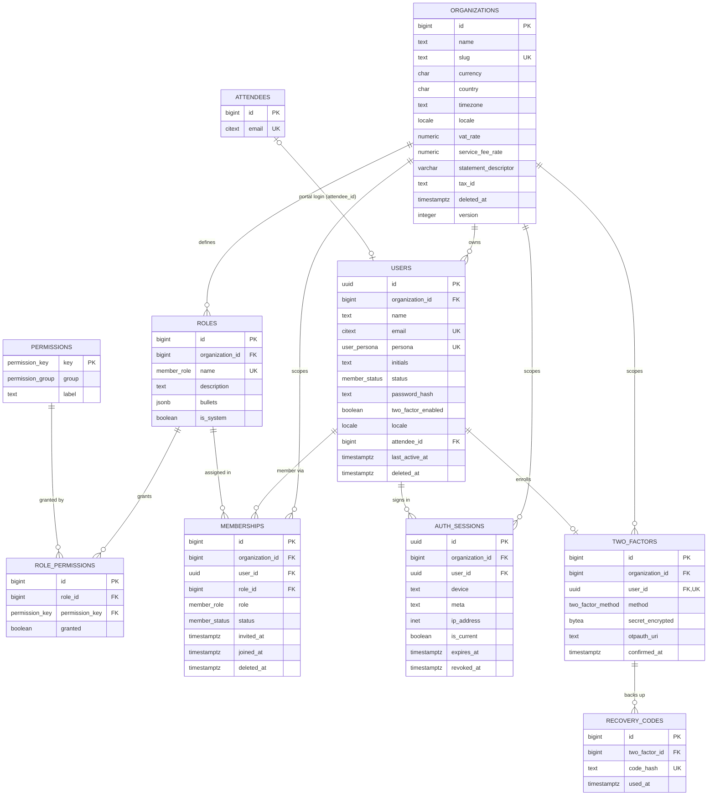

- `memberships` resolves the **users ⇄ organizations** M:N (a user may belong to
  many orgs), carrying the assigned `role_id` and `status`.
- `role_permissions` resolves the **roles ⇄ permissions** M:N — the 12 fixed
  `permissions` presets per role (`ROLE_PERMS`). Neither `role_permissions` nor
  `permissions` is tenant-scoped.
- `attendees` here is a stub; its full definition is in *Registration, Orders &
  Seating*. `users.attendee_id` is the optional 1:1 portal-persona link.

### Organization & Settings

Integration API credentials and per-user notification-channel preferences.

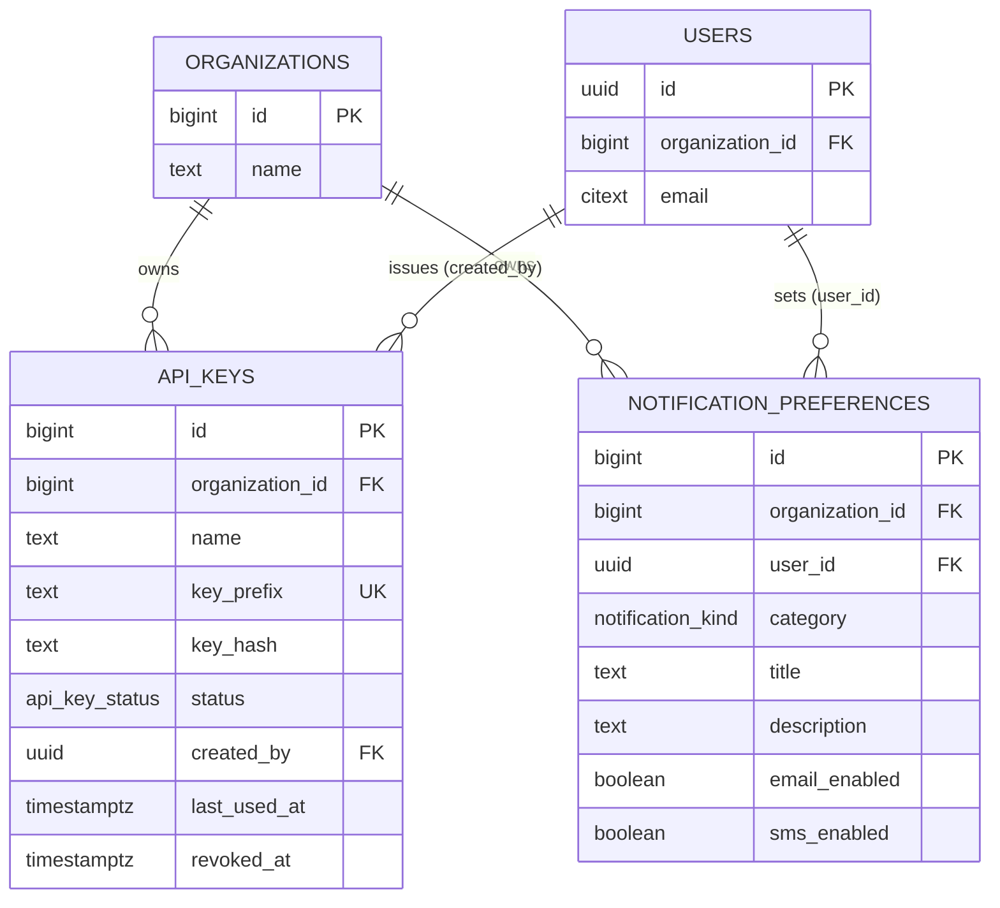

- `api_keys.created_by → users` is `ON DELETE RESTRICT` (the issuer requires
  `setIntegrations` and cannot be deleted out from under a live key).
- `notification_preferences` is unique per `(user_id, category)` and gates whether
  a `message_deliveries` row is generated for that category. `users` is defined in
  *Identity & Access*.

### Events & Program

The central `events` aggregate with its optional category and landing-template
styling, plus speakers, agenda sessions, and the session⇄speaker junction.

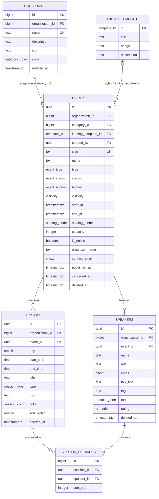

- `session_speakers` resolves the **sessions ⇄ speakers** M:N (a speaker owns many
  sessions; `Break` sessions have no rows). Both FKs cascade.
- `events.category_id`, `events.landing_template_id`, and `events.created_by` are
  all `ON DELETE SET NULL` (optional/attribution). `landing_templates` is a global
  seed, not tenant-scoped. `events.created_by → users` (Identity & Access).

### Ticketing & Discounts

Sellable ticket tiers, redeemable discount codes (event or org-wide), and the
`discount_redemptions` junction that enforces once-per-order idempotency.

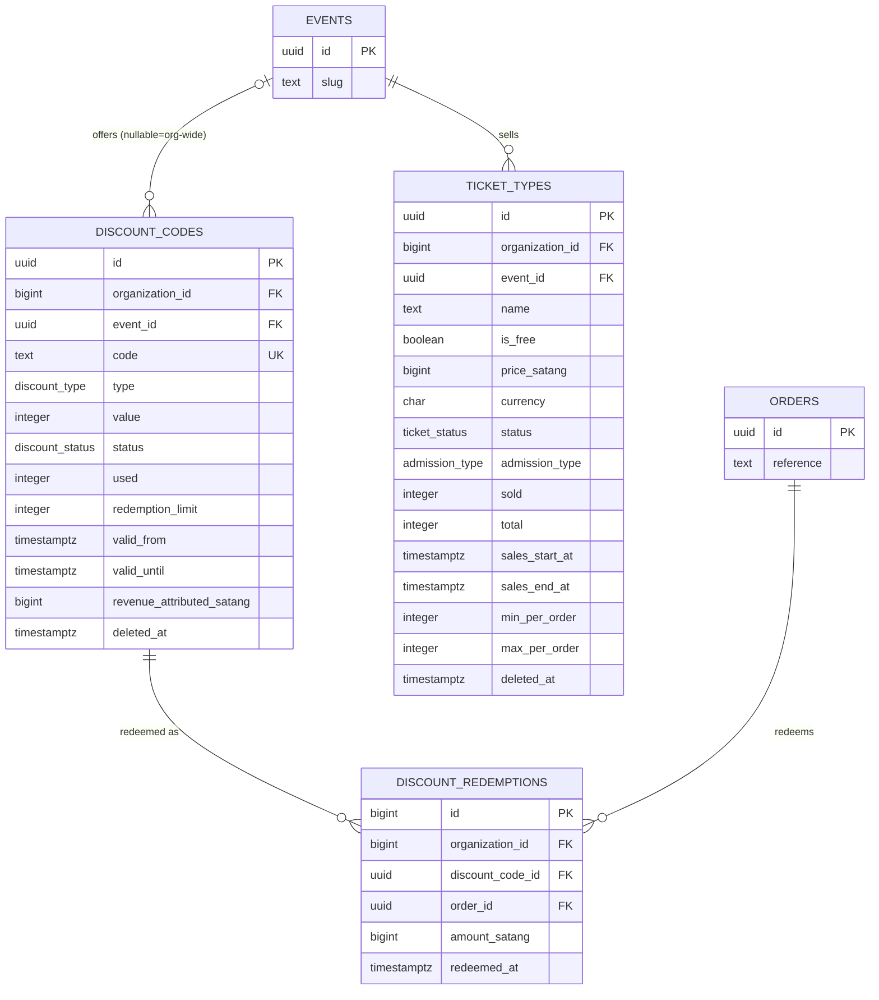

- `discount_codes.event_id` is nullable — a null means an **org-wide** code; the
  uniqueness is `(organization_id, event_id, code)`.
- `discount_redemptions` resolves the **discount_codes ⇄ orders** M:N; its
  `UNIQUE (discount_code_id, order_id)` makes re-submitting the same code on the
  same order a no-op, and drives the `used` counter. `discount_code_id` is
  `RESTRICT`, `order_id` is `CASCADE`. `events` and `orders` are defined in their
  own views.

### Registration, Orders & Seating

The commerce core: the attendee CRM, the `orders` booking header, its
`order_items` lines, the issued `tickets` (one per admitted seat, carrying the QR
token), and the reserved-seating model (`seat_maps` → `seats` → `seat_assignments`).

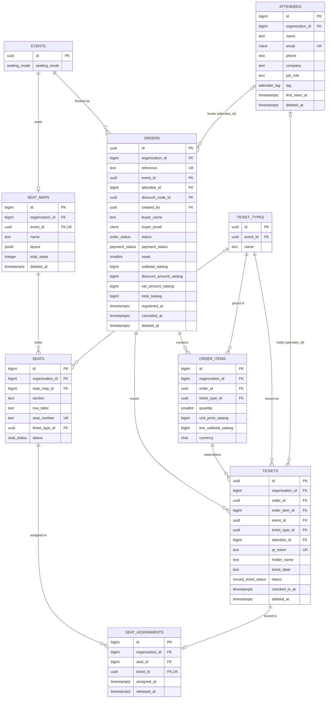

- **Order→ticket commerce.** An `order` is the booking header; each `order_items`
  line is a quantity of one `ticket_type`; each `tickets` row is one issued
  admission materialized from a line (`order_item_id`), denormalizing `event_id`
  and `ticket_type_id` for fast door scans.
- **Reserved seating.** `seat_maps` is 1:1 with an `event` (`UNIQUE (event_id)`),
  present only when `events.seating_mode = reserved`. `seats` belong to a map;
  `seat_assignments` resolves the **seats ⇄ tickets** M:N with a partial unique
  `uq_seat_active (seat_id) WHERE released_at IS NULL` (one live holder per seat)
  and `UNIQUE (ticket_id)` (one seat per ticket).
- Cross-context: `orders.event_id/discount_code_id/created_by`, `tickets.event_id`
  live in Events, Ticketing, and Identity views respectively.

### Attendance & Check-in

The append-only door-scan log. Every scan attempt — success or failure — is one
`check_ins` row carrying its `ScanState`.

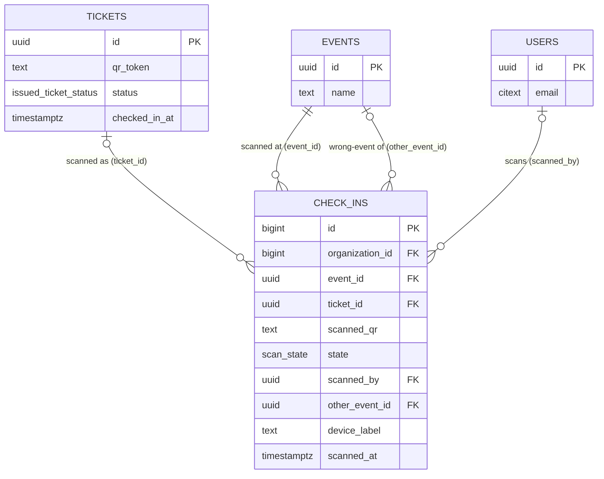

- `check_ins.ticket_id` is nullable and `SET NULL` — an `invalid` scan matches no
  ticket and records only the raw `scanned_qr`.
- `other_event_id` captures a `wrong`-event scan (the event the ticket actually
  belongs to). `scanned_by → users` needs `regCheckin`; `SET NULL` on delete.
- `event_id` is `RESTRICT` (protect attendance history). The first successful
  (`ok`) scan authoritatively sets `tickets.status = checked_in` and
  `tickets.checked_in_at`. `tickets`, `events`, `users` are defined elsewhere.

### Payments & Finance

The append-only payment/refund ledgers, tax invoices, organizer payouts with the
`payout_items` settlement junction, and monthly VAT/WHT `tax_periods`.

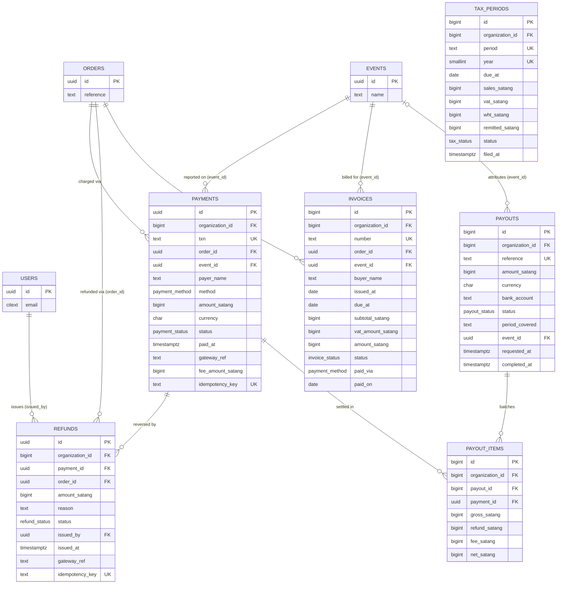

- **Money as satang.** Every `*_satang` column is `bigint` integer minor units
  (1 THB = 100 satang), `>= 0`, paired with `currency char(3) DEFAULT 'THB'`.
- `payments` and `refunds` are append-only ledgers keyed by an `idempotency_key`
  for exactly-once capture. Both are `RESTRICT` to `orders`/`payments` to protect
  financial history. `refunds.issued_by → users` requires `finRefund`.
- `payout_items` resolves **payments ⇄ payouts** M:N with `UNIQUE (payment_id)` —
  a payment settles in **at most one** payout (`net = gross − refund − fee`).
- `tax_periods` is unique per `(organization_id, period, year)`. `orders`,
  `events`, `users` are defined in their own views.

### Engagement & Messaging

Automated templates, one-off event announcements, the per-recipient
`message_deliveries` ledger (materialized by either a template or an announcement),
and the in-app `notifications` inbox.

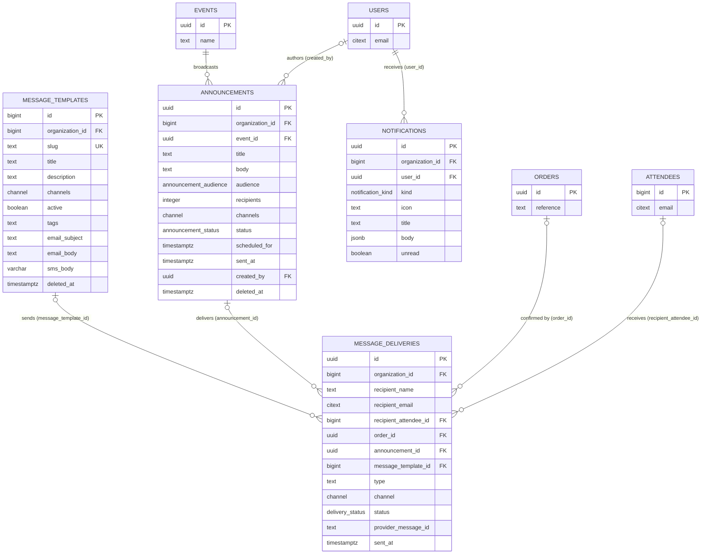

- `message_deliveries` has a `CHECK` that **exactly one** of `announcement_id` /
  `message_template_id` is set — every delivery traces to one source. All four of
  its optional source FKs (`recipient_attendee_id`, `order_id`, `announcement_id`,
  `message_template_id`) are `SET NULL`, since the ledger outlives its sources.
- `channels`/`channel` use the `channel` enum (`email`, `sms`); `channels` is an
  array subset. `notifications.body` is JSONB rich segments. `events`, `users`,
  `orders`, `attendees` are defined elsewhere.

### Feedback & Surveys

Per-event surveys, their ordered questions, submitted responses (optionally
anonymous), and the normalized per-question answers.

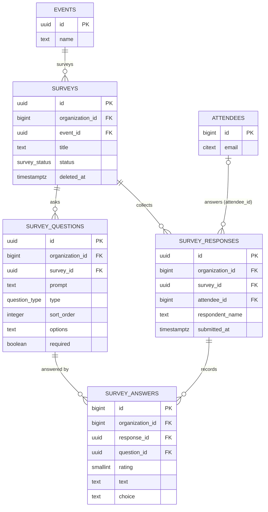

- `survey_answers` normalizes the prototype's flattened rating/text into one row
  per `(response_id, question_id)` (unique), with a `CHECK rating BETWEEN 1 AND 5`.
- `survey_answers.question_id → survey_questions` is `RESTRICT` (an answered
  question is protected); `response_id` is `CASCADE`. `survey_responses.attendee_id`
  is `SET NULL` (anonymous). `events` and `attendees` are defined elsewhere.

### Meetings

Operational coordination meetings, optionally tied to an event.

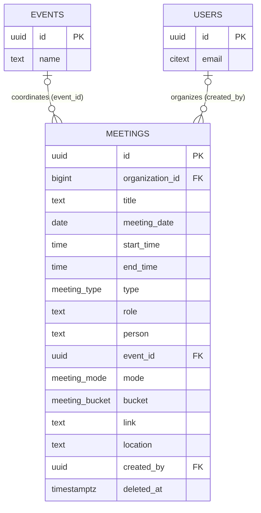

- `meetings.event_id` is nullable (`SET NULL`) — event-agnostic meetings are
  allowed. `created_by → users` is `SET NULL`. `events`, `users` defined elsewhere.

### System & Audit

The append-only, immutable security/finance audit trail.

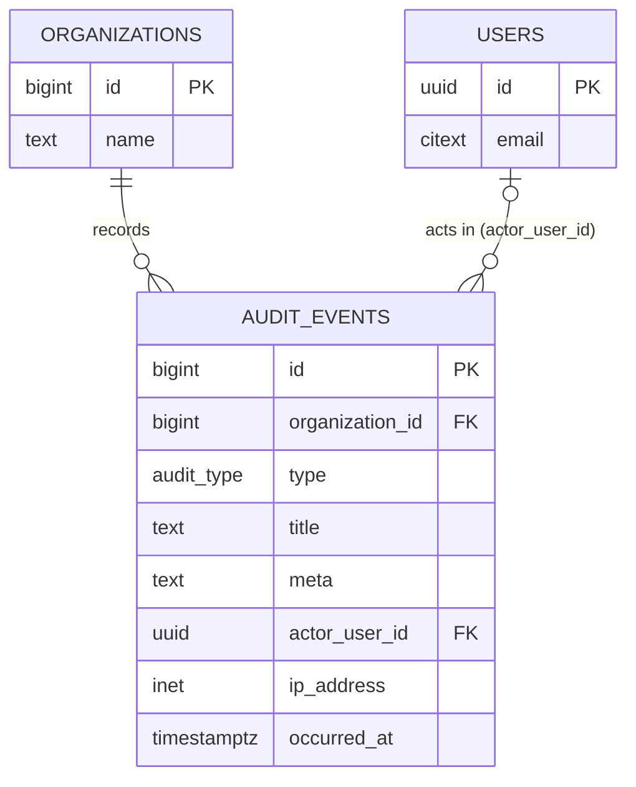

- `audit_events` is never soft- or hard-deleted. Its `organization_id` FK is
  uniquely `ON DELETE RESTRICT` (the trail must survive), and `actor_user_id` is
  `SET NULL` (anonymous or failed sign-ins have no actor).

### Platform & Infrastructure

The Platform bounded context: the transactional `outbox_events` relay that
publishes domain events to RabbitMQ, the short-lived `seat_holds` that reserve
inventory during checkout, and the inbound `webhook_events` log for
signature-verified, idempotent provider callbacks. `outbox_events` and
`webhook_events` are high-volume, append-mostly infrastructure logs.

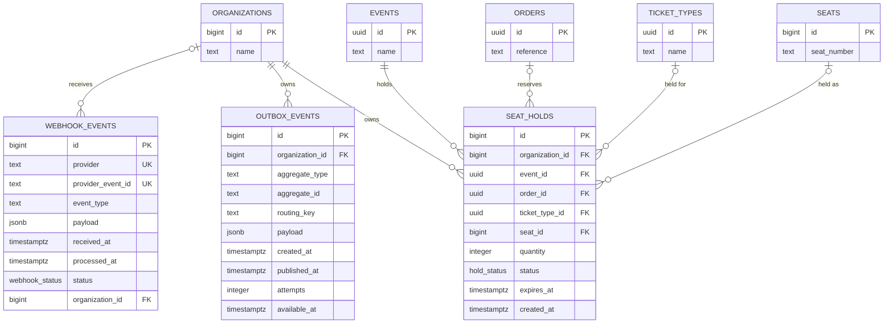

- `outbox_events` is written in the same transaction as its aggregate change; a
  relay polls the partial `ix_outbox_unpublished` index and publishes to RabbitMQ,
  then stamps `published_at` (with `attempts`/`available_at` driving backoff).
  `organization_id` is `CASCADE`.
- `seat_holds` is a short-lived checkout reservation; the partial unique
  `uq_seat_hold_active (seat_id) WHERE status = 'active'` permits at most one active
  hold per seat, and an expiry sweeper releases rows past `expires_at`.
  `event_id`/`ticket_type_id`/`seat_id` are `CASCADE`; `order_id` is `SET NULL`
  (a hold may be cart-only). `events`, `orders`, `ticket_types`, `seats` are defined
  in their own views.
- `webhook_events` gives exactly-once processing via
  `UNIQUE (provider, provider_event_id)`; its nullable `organization_id` is the
  resolved tenant (`SET NULL`).

---

## Relationship matrix

One row per relationship, mirroring the *Relationship summary* in
[entities.md](entities.md). Parent→child is the FK direction (for the
attribution edges `refunds.issued_by` and `meetings.created_by`, the FK owner is
the child). Cardinality is the crow's-foot pair as drawn in the diagrams.
**Identifying?** = existential ownership (composition/junction = Yes; optional or
merely-referential = No).

| # | Parent | Child | Cardinality | FK column | On delete | Identifying? |
|---|---|---|---|---|---|---|
| 1 | organizations | users | `\|\|--o{` | users.organization_id | CASCADE | No |
| 2 | organizations | memberships | `\|\|--o{` | memberships.organization_id | CASCADE | Yes |
| 3 | organizations | roles | `\|\|--o{` | roles.organization_id | CASCADE | No |
| 4 | organizations | api_keys | `\|\|--o{` | api_keys.organization_id | CASCADE | No |
| 5 | organizations | categories | `\|\|--o{` | categories.organization_id | CASCADE | No |
| 6 | organizations | events | `\|\|--o{` | events.organization_id | CASCADE | No |
| 7 | organizations | payouts | `\|\|--o{` | payouts.organization_id | CASCADE | No |
| 8 | organizations | tax_periods | `\|\|--o{` | tax_periods.organization_id | CASCADE | No |
| 9 | organizations | audit_events | `\|\|--o{` | audit_events.organization_id | RESTRICT | No |
| 10 | organizations | *(all 42 tenant-owned tables)* | `\|\|--o{` | `organization_id` | CASCADE (RESTRICT for audit_events, SET NULL for webhook_events) | No |
| 11 | users | memberships | `\|\|--o{` | memberships.user_id | CASCADE | Yes |
| 12 | roles | memberships | `\|\|--o{` | memberships.role_id | RESTRICT | No |
| 13 | roles | role_permissions | `\|\|--o{` | role_permissions.role_id | CASCADE | Yes |
| 14 | permissions | role_permissions | `\|\|--o{` | role_permissions.permission_key | RESTRICT | Yes |
| 15 | roles ⇄ permissions | role_permissions | `}o--o{` | junction role_permissions | CASCADE / RESTRICT | Yes |
| 16 | users ⇄ organizations | memberships | `}o--o{` | junction memberships | CASCADE | Yes |
| 17 | users | auth_sessions | `\|\|--o{` | auth_sessions.user_id | CASCADE | Yes |
| 18 | users | two_factors | `\|\|--o\|` | two_factors.user_id (UK) | CASCADE | Yes |
| 19 | two_factors | recovery_codes | `\|\|--o{` | recovery_codes.two_factor_id | CASCADE | Yes |
| 20 | users | notifications | `\|\|--o{` | notifications.user_id | CASCADE | Yes |
| 21 | users | notification_preferences | `\|\|--o{` | notification_preferences.user_id | CASCADE | Yes |
| 22 | users | audit_events | `\|o--o{` | audit_events.actor_user_id | SET NULL | No |
| 23 | users | api_keys | `\|\|--o{` | api_keys.created_by | RESTRICT | No |
| 24 | attendees | users | `\|o--o\|` | users.attendee_id (UK) | SET NULL | No |
| 25 | categories | events | `\|o--o{` | events.category_id | SET NULL | No |
| 26 | landing_templates | events | `\|o--o{` | events.landing_template_id | SET NULL | No |
| 27 | organizations | events | `\|\|--o{` | events.organization_id | CASCADE | No |
| 28 | events | ticket_types | `\|\|--o{` | ticket_types.event_id | CASCADE | Yes |
| 29 | events | discount_codes | `\|o--o{` | discount_codes.event_id | CASCADE | No |
| 30 | events | orders | `\|\|--o{` | orders.event_id | RESTRICT | No |
| 31 | events | speakers | `\|\|--o{` | speakers.event_id | CASCADE | Yes |
| 32 | events | sessions | `\|\|--o{` | sessions.event_id | CASCADE | Yes |
| 33 | events | surveys | `\|\|--o{` | surveys.event_id | CASCADE | Yes |
| 34 | events | announcements | `\|\|--o{` | announcements.event_id | CASCADE | Yes |
| 35 | events | meetings | `\|o--o{` | meetings.event_id | SET NULL | No |
| 36 | events | seat_maps | `\|\|--o\|` | seat_maps.event_id (UK) | CASCADE | Yes |
| 37 | events | tickets | `\|\|--o{` | tickets.event_id | RESTRICT | No |
| 38 | events | payments | `\|\|--o{` | payments.event_id | RESTRICT | No |
| 39 | events | invoices | `\|\|--o{` | invoices.event_id | RESTRICT | No |
| 40 | events | payouts | `\|o--o{` | payouts.event_id | SET NULL | No |
| 41 | events | check_ins | `\|\|--o{` | check_ins.event_id | RESTRICT | No |
| 42 | sessions ⇄ speakers | session_speakers | `}o--o{` | junction session_speakers | CASCADE | Yes |
| 43 | ticket_types | order_items | `\|\|--o{` | order_items.ticket_type_id | RESTRICT | No |
| 44 | ticket_types | tickets | `\|\|--o{` | tickets.ticket_type_id | RESTRICT | No |
| 45 | ticket_types | seats | `\|o--o{` | seats.ticket_type_id | SET NULL | No |
| 46 | discount_codes | orders | `\|o--o{` | orders.discount_code_id | SET NULL | No |
| 47 | discount_codes ⇄ orders | discount_redemptions | `}o--o{` | junction discount_redemptions | RESTRICT / CASCADE | Yes |
| 48 | attendees | orders | `\|o--o{` | orders.attendee_id | SET NULL | No |
| 49 | attendees | tickets | `\|o--o{` | tickets.attendee_id | SET NULL | No |
| 50 | attendees | survey_responses | `\|o--o{` | survey_responses.attendee_id | SET NULL | No |
| 51 | attendees | message_deliveries | `\|o--o{` | message_deliveries.recipient_attendee_id | SET NULL | No |
| 52 | orders | order_items | `\|\|--o{` | order_items.order_id | CASCADE | Yes |
| 53 | orders | tickets | `\|\|--o{` | tickets.order_id | CASCADE | Yes |
| 54 | orders | payments | `\|\|--o{` | payments.order_id | RESTRICT | No |
| 55 | orders | refunds | `\|\|--o{` | refunds.order_id | RESTRICT | No |
| 56 | orders | invoices | `\|\|--o{` | invoices.order_id | RESTRICT | No |
| 57 | orders | message_deliveries | `\|o--o{` | message_deliveries.order_id | SET NULL | No |
| 58 | orders | discount_redemptions | `\|\|--o{` | discount_redemptions.order_id | CASCADE | Yes |
| 59 | order_items | tickets | `\|\|--o{` | tickets.order_item_id | CASCADE | Yes |
| 60 | seat_maps | seats | `\|\|--o{` | seats.seat_map_id | CASCADE | Yes |
| 61 | seats ⇄ tickets | seat_assignments | `}o--o{` | junction seat_assignments | RESTRICT / CASCADE | Yes |
| 62 | tickets | seat_assignments | `\|\|--o\|` | seat_assignments.ticket_id (UK) | CASCADE | Yes |
| 63 | tickets | check_ins | `\|o--o{` | check_ins.ticket_id | SET NULL | No |
| 64 | payments | refunds | `\|\|--o{` | refunds.payment_id | RESTRICT | No |
| 65 | payments ⇄ payouts | payout_items | `}o--o{` | junction payout_items | RESTRICT / CASCADE | Yes |
| 66 | payouts | payout_items | `\|\|--o{` | payout_items.payout_id | CASCADE | Yes |
| 67 | users | refunds | `\|\|--o{` | refunds.issued_by | RESTRICT | No |
| 68 | surveys | survey_questions | `\|\|--o{` | survey_questions.survey_id | CASCADE | Yes |
| 69 | surveys | survey_responses | `\|\|--o{` | survey_responses.survey_id | CASCADE | Yes |
| 70 | survey_responses | survey_answers | `\|\|--o{` | survey_answers.response_id | CASCADE | Yes |
| 71 | survey_questions | survey_answers | `\|\|--o{` | survey_answers.question_id | RESTRICT | No |
| 72 | message_templates | message_deliveries | `\|o--o{` | message_deliveries.message_template_id | SET NULL | No |
| 73 | announcements | message_deliveries | `\|o--o{` | message_deliveries.announcement_id | SET NULL | No |
| 74 | users | check_ins | `\|o--o{` | check_ins.scanned_by | SET NULL | No |
| 75 | events | check_ins | `\|o--o{` | check_ins.other_event_id | SET NULL | No |
| 76 | users | meetings | `\|o--o{` | meetings.created_by | SET NULL | No |
| 77 | organizations | outbox_events | `\|\|--o{` | outbox_events.organization_id | CASCADE | No |
| 78 | organizations | seat_holds | `\|\|--o{` | seat_holds.organization_id | CASCADE | No |
| 79 | organizations | webhook_events | `\|o--o{` | webhook_events.organization_id | SET NULL | No |
| 80 | events | seat_holds | `\|\|--o{` | seat_holds.event_id | CASCADE | Yes |
| 81 | orders | seat_holds | `\|o--o{` | seat_holds.order_id | SET NULL | No |
| 82 | ticket_types | seat_holds | `\|o--o{` | seat_holds.ticket_type_id | CASCADE | No |
| 83 | seats | seat_holds | `\|o--o{` | seat_holds.seat_id | CASCADE | No |

> **Note on rows 15/16/42/47/61/65.** These are the *conceptual* M:N edges named
> in the catalog; each is physically realized by its junction table's two
> constituent `||--o{` foreign keys (which also appear as their own numbered rows,
> e.g. 13+14 realize 15, 11+row-2/user realize 16). The `On delete` column lists
> the two junction-arm behaviors.

---

## Design notes

**Normalization (3NF).** Every non-key attribute depends on the whole key and
nothing but the key. Repeating groups are extracted into child tables
(`order_items`, `survey_questions`, `seats`), and every many-to-many is resolved
by an associative table rather than an array column: `role_permissions`,
`memberships`, `session_speakers`, `discount_redemptions`, `seat_assignments`,
`payout_items`. Derived/reporting values named in the catalog
(`ticket_types.soldout`/`revenue`, `attendees.events_count`, `speakers.rating`,
survey aggregates, `meetings.bucket`, `events.bucket`) are **computed at read
time**, not stored as duplicated fact — the few stored counters (`ticket_types.sold`,
`discount_codes.used`) are guarded atomic denormalizations kept for hot-path
booking checks, with `CHECK` constraints (`sold BETWEEN 0 AND total`).

**Multi-tenancy via `organization_id`.** 42 of 47 tables carry
`organization_id … REFERENCES organizations(id)` (NOT NULL except the inbound
`webhook_events` log, whose tenant is resolved after signature verification), and
every read/write is filtered by the caller's org (row-level tenant isolation). The
five tables with no tenant column are the root `organizations`, the globally-seeded
lookups `permissions` and `landing_templates` (shared across tenants), and the
sub-children `recovery_codes` and `role_permissions` (isolated transitively through
their parents). Tenant tables cascade from `organizations` on delete, except
`audit_events` (`RESTRICT`, so the compliance trail cannot be dropped) and
`webhook_events` (`SET NULL`).

**Order→ticket commerce model.** The "registration" is modeled as a commerce
**order** (`orders`, `REG-YYYY-NNNNNN`) that is the aggregate root for a booking.
Its `order_items` capture *quantity × ticket_type* with the unit price frozen at
purchase (`unit_price_satang`), and each admitted seat is materialized as one
`tickets` row bearing a signed, globally-unique `qr_token`. Money flows into the
append-only `payments` ledger (idempotency-keyed, exactly-once capture),
reversals into `refunds`, billing into `invoices` (VAT 7%, 14-day terms), and
settlement into `payouts` via `payout_items` (a payment settles in at most one
payout). VAT is captured on the order (`vat_amount_satang`) and re-aggregated into
monthly `tax_periods`.

**Reserved-seating model.** When `events.seating_mode = reserved`, a single
`seat_maps` row (1:1, `UNIQUE (event_id)`) holds the geometry; individual `seats`
carry a `seat_status` lifecycle (`available → held → reserved → sold`/`blocked`)
and an optional tier (`ticket_type_id`). Binding an issued ticket to a physical
seat is the `seat_assignments` junction, whose partial unique index
`uq_seat_active (seat_id) WHERE released_at IS NULL` guarantees at most one *live*
holder per seat while preserving historical assignments (a released seat can be
re-sold), and `UNIQUE (ticket_id)` guarantees one seat per ticket. GA events
simply omit the seat map.

**Money as satang.** All monetary values are stored as `bigint` integer minor
units (1 THB = 100 satang), `>= 0` via `CHECK`, paired with
`currency char(3) DEFAULT 'THB'` — never `float`/`numeric`. `bigint` (not
`integer`) prevents overflow on large payout/tax aggregates. Rates
(`vat_rate 0.0700`, `service_fee_rate 0.0500`) are `numeric(5,4)`; whole-percent
discounts are `smallint`. Display strings are derived at render time
(`format.baht`), never persisted.

**Soft deletes.** Aggregate roots and user-editable entities carry
`deleted_at timestamptz NULL` and are recovered/filtered logically; a partial
index like `ix_organizations_deleted_at` supports the "live rows" query. The
append-only ledgers — `payments`, `refunds`, `audit_events`, `check_ins`,
`message_deliveries` — deliberately **omit** `deleted_at`: they are immutable
history. `version integer` provides optimistic concurrency (stale writes →
`409 Conflict`).

**Indexing strategy.** Beyond every PK and the `organization_id` tenant edge,
the catalog defines: uniqueness on natural keys (`orders.reference`,
`invoices.number`, `payments.txn`, `tickets.qr_token`, `api_keys.key_prefix`);
composite hot-path indexes for tenant-scoped list/filter screens
(`ix_events_org_status`, `ix_orders_status`, `ix_payments_status`,
`ix_invoices_status`, `ix_payouts_status`, `ix_tickets_status` on
`(event_id, status)`); time-range indexes (`ix_events_start_at`,
`ix_check_ins_scanned_at`, `ix_audit_events_org_time`); FK-target indexes on every
child (`ix_*_event`, `ix_*_order`, `ix_*_user`); and **partial** indexes for
sparse predicates (`ix_auth_sessions_active WHERE revoked_at IS NULL`,
`ix_notifications_unread WHERE unread`, `uq_seat_active WHERE released_at IS NULL`).

**Extensibility.** The schema is intentionally forward-compatible: `roles.is_system`
distinguishes seeded presets from future custom roles; `permissions` is a lookup
so new permission keys extend the enum and seed rows without schema change;
`seat_maps.layout` and `notifications.body` are JSONB for evolving structure;
`message_templates.tags`/`channels` and `announcements.channels` are arrays for new
merge tags/channels; and `landing_templates` can gain rows for new public themes.
Native PostgreSQL `ENUM`s make new status/kind tokens an `ALTER TYPE … ADD VALUE`
rather than a structural migration.
