# Eventa — Entity Relationship Diagram (ERD)

> **What this models.** The complete relational schema of **Eventa**, the
> Thai-market multi-tenant *event registration & management* SaaS (currency
> Thai Baht ฿, VAT 7%, PromptPay + card, `Asia/Bangkok`, EN/TH). It covers the
> attendee portal, public landing pages, and the organizer admin console:
> tenancy and access control, events and program, ticketing and discounts, the
> order→ticket commerce path, reserved seating, check-in, payments and finance,
> messaging, feedback, meetings, and the audit trail.
>
> **Derivation.** This ERD is **verified against the live PostgreSQL schema** —
> every entity, attribute, type, key, foreign key, junction table, and cardinality
> below was read back from `information_schema.columns` and `pg_constraint` on
> **2026-10-09**. The database, not a document, is the source of truth here.
>
> **Scope of that claim.** "The database wins" is a rule about *facts*, not a
> ranking of documents. It settles what tables, columns, types, keys, constraints
> and cardinalities exist right now; it says nothing about *why* any of them
> exist. The repository guide now draws the same line — the live schema is the
> reference for the data model, and both this ERD and the design catalog
> [entities.md](entities.md) **describe** it (`CLAUDE.md`, *Architecture is
> layered*) — so the catalog is not a rival inventory to be out-counted but the
> data dictionary a reader goes to for a table's purpose. The 57 here is the
> implementation inventory, and a shipped table needs an entry in both documents;
> where either lags the schema, the document is what gets corrected. See
> [Design notes → Which document describes the schema](#which-document-governs).
> Column-level differences — things the catalog designed that the database does
> not have — are recorded in
> [Design notes → Designed but not built](#designed-but-not-built) rather than
> quietly dropped. The drifts closed in this pass are listed there too.
>
> **Target DBMS.** PostgreSQL 15+. Surrogate `id` primary keys (`bigint identity`
> for high-volume commerce/ledger tables, `uuid` for aggregate roots), native
> `ENUM` types, integer-satang money, `timestamptz` in UTC, 3NF normalization,
> row-level tenant isolation via `organization_id`.
>
> **Measured scale.** 57 tables · 129 enforced foreign-key constraints (50 of them
> the shared tenant `organization_id` edge) · 7 conceptual many-to-many edges
> resolved by junction tables · **6 reference columns carried with no foreign-key
> constraint behind them** (see
> [Unenforced references](#unenforced-references)).

---

## How to read this ERD

The diagrams use **Mermaid `erDiagram`** with **crow's-foot** notation. Mermaid
renders natively on GitHub and in most Markdown viewers (VS Code, Obsidian,
GitLab, etc.), so these diagrams display without any tooling.

**Crow's-foot cardinality.** Each relationship line has a symbol at *each* end
describing how many rows of *that* entity participate. Reading the pair of
glyphs nearest each entity:

| Glyph | Mermaid | Meaning |
|---|---|---|
| `\|\|` | `\|\|` | **one and only one** (exactly one) |
| `o\|` / `\|o` | `\|o` | **zero or one** (optional, at most one) |
| `}o` / `o{` | `o{` | **zero or many** (optional, any number) |
| `}\|` / `\|{` | `\|{` | **one or many** (mandatory, at least one) |

So `ORGANIZATION ||--o{ EVENT : "hosts"` reads *one organization hosts zero or
many events; each event belongs to exactly one organization*. A nullable FK is
shown by relaxing the parent end to `|o` (zero-or-one), e.g. an event's optional
`category_id` renders `CATEGORIES |o--o{ EVENTS`.

**Identifying vs non-identifying.** In classic ERD practice an *identifying*
relationship (the child cannot exist without — and is existentially owned by —
its parent, typically `ON DELETE CASCADE` composition and every junction row) is
drawn with a **solid** line, and a *non-identifying* relationship (an optional or
merely-referential FK, typically `ON DELETE SET NULL` or `RESTRICT`) with a
**dashed** line. Mermaid expresses this with `--` (solid, identifying) versus
`..` (dashed, non-identifying). Because Eventa uses surrogate PKs everywhere, no
child literally embeds its parent's key in its PK; we therefore apply the
*existential* reading — composition and junctions are identifying, attribution
and optional links are not. The **Relationship matrix** states the identifying
verdict per edge.

**The `(no FK)` marker.** Six edges are drawn with `(no FK)` appended to the
label. Those are real reference columns — a `uuid`/`bigint` holding another
table's `id`, read and joined by the application — that carry **no foreign-key
constraint** in the database. The line is drawn because the relationship is real
in the domain; the marker is there because PostgreSQL is not enforcing it, so
nothing stops an orphan row. Mermaid has no notation for an unenforced edge, so
the label carries it. They are tabulated under
[Unenforced references](#unenforced-references).

**Junction (associative) tables.** Seven tables resolve a conceptual
many-to-many. Five are named `<parent>_<child>` — `role_permissions`,
`session_speakers`, `discount_redemptions`, `seat_assignments`, `payout_items` —
and two are named for the domain fact they record rather than for their two
parents: `memberships` (users ⇄ organizations) and `saved_events`
(users ⇄ events).

`saved_events` **is a junction table, not a domain entity that happens to link two
things**, and it is counted as one everywhere below. The name is not the test; the
physical shape is, and the live table meets it on every count: a surrogate `id`,
exactly two `NOT NULL` foreign-key columns (`user_id`, `event_id`), a composite
`UNIQUE` over that pair (`uq_saved_events_user_event`), both arms
`ON DELETE CASCADE`, and no payload of its own beyond the `saved_at`/`created_at`
timestamps. By that measure it is a *stricter* junction than `memberships`
(`role`, `status`, `invited_at`, `joined_at`, soft delete, `version`) or
`discount_redemptions` (`buyer_email`, `amount_satang`), both of which this
document has always counted as junctions. The absent `organization_id` does not
disqualify it: `role_permissions` and `session_speakers` carry no tenant column
either. So it appears as the seventh M:N in the headline above, as row 96
of the Relationship matrix (physically realized by rows 27 and 85), and in the
associative-table list under [Normalization](#normalization-3nf).

In the diagrams a junction sits between its two parents with a solid, identifying
`||--o{` edge to each; the conceptual M:N is annotated in the Relationship matrix
as `}o--o{`.

**Tenancy edge.** Most tables carry `organization_id` (50 of 57 tables).
To keep the domain views legible, that shared edge is drawn explicitly only in the
Master ERD and the *Identity & Access* view; in the other domain views the tenant
column is listed as an attribute (`bigint organization_id FK`) and its edge to
`ORGANIZATIONS` is implied. The seven tables **without** `organization_id` are
`organizations` (the root), the global lookups `permissions` and
`landing_templates`, the transitively-scoped children `recovery_codes`,
`role_permissions`, and `session_speakers`, and the cross-tenant, user-scoped
`saved_events` bookmark table.

---

## Master ERD

The single canonical picture: **all 57 entities** and **all** their foreign-key
relationships, including the tenant `organization_id` fan from `ORGANIZATIONS`.
Attributes are trimmed to the primary key, the salient foreign keys, and one to
three defining columns per table — the domain views below carry fuller attribute
lists. This diagram is intentionally large; it is the authoritative wiring
diagram.

`erd/eventa-full.drawio` is a second rendering of the same schema, generated
straight from the database rather than hand-maintained. **It is one table behind
this one.** It was generated before migration `0068` and so draws 56 entities and
124 foreign-key edges, missing `scan_attempts` and its five FKs; the Mermaid below
draws all 57 and 129. Edit the Mermaid here; the `.drawio` is a generated artifact
and must be **regenerated from the database**, never hand-reconciled — patching one
table into it by hand is how it would stop being a second, independent reading of
the schema and become a copy of this diagram's mistakes.


<details>
<summary>Mermaid source</summary>


```mermaid
erDiagram
    ORGANIZATIONS {
        bigint id PK
        text name
        text slug UK
        numeric vat_rate
    }
    USERS {
        uuid id PK
        bigint organization_id FK
        citext email UK
        user_persona persona UK
        bigint attendee_id
    }
    ROLES {
        bigint id PK
        bigint organization_id FK
        text name UK
    }
    PERMISSIONS {
        permission_key key PK
        permission_group group
        text label
    }
    ROLE_PERMISSIONS {
        bigint id PK
        bigint role_id FK
        permission_key permission_key FK
        boolean granted
    }
    MEMBERSHIPS {
        bigint id PK
        bigint organization_id FK
        uuid user_id FK
        bigint role_id FK
        member_status status
    }
    AUTH_SESSIONS {
        uuid id PK
        bigint organization_id FK
        uuid user_id FK
        text device
    }
    SOCIAL_IDENTITIES {
        bigint id PK
        bigint organization_id FK
        uuid user_id FK
        social_provider provider UK
        text subject UK
    }
    TWO_FACTORS {
        bigint id PK
        bigint organization_id FK
        uuid user_id FK,UK
        two_factor_method method
    }
    RECOVERY_CODES {
        bigint id PK
        bigint two_factor_id FK
        text code_hash UK
    }
    API_KEYS {
        bigint id PK
        bigint organization_id FK
        uuid created_by FK
        text key_prefix UK
    }
    NOTIFICATION_PREFERENCES {
        bigint id PK
        bigint organization_id FK
        uuid user_id FK
        notification_kind category
    }
    NOTIFICATION_READS {
        bigint id PK
        bigint organization_id FK,UK
        uuid user_id FK,UK
        timestamptz read_at
    }
    PAYMENT_SETTINGS {
        bigint id PK
        bigint organization_id FK,UK
        payment_provider provider
        payment_mode mode
        payment_connection_status status
    }
    PAYMENT_CREDENTIALS {
        bigint id PK
        bigint organization_id FK,UK
        payment_mode mode UK
        text publishable_key
        bytea secret_key_cipher
    }
    PAYMENT_METHOD_SETTINGS {
        bigint id PK
        bigint organization_id FK
        payment_method method UK
        boolean enabled
    }
    CATEGORIES {
        bigint id PK
        bigint organization_id FK
        text name UK
        category_color color
    }
    LANDING_TEMPLATES {
        template_id id PK
        text title
        text badge
    }
    EVENTS {
        uuid id PK
        bigint organization_id FK
        bigint category_id FK
        template_id landing_template_id FK
        uuid created_by FK
        text slug UK
        event_status status
        seating_mode seating_mode
        locale locale
    }
    EVENT_HIGHLIGHTS {
        bigint id PK
        bigint organization_id FK
        uuid event_id FK
        text text
        integer position
    }
    EVENT_FAQS {
        bigint id PK
        bigint organization_id FK
        uuid event_id FK
        text question
        integer position
    }
    EVENT_INVITATIONS {
        bigint id PK
        bigint organization_id FK,UK
        uuid event_id FK,UK
        citext recipient_email UK
        uuid invited_by FK
        timestamptz sent_at
    }
    SPEAKERS {
        uuid id PK
        bigint organization_id FK
        uuid event_id FK
        text name
    }
    SESSIONS {
        uuid id PK
        bigint organization_id FK
        uuid event_id FK
        session_type type
    }
    SESSION_SPEAKERS {
        bigint id PK
        uuid session_id FK
        uuid speaker_id FK
    }
    TICKET_TYPES {
        uuid id PK
        bigint organization_id FK
        uuid event_id FK
        bigint price_satang
        ticket_status status
    }
    DISCOUNT_CODES {
        uuid id PK
        bigint organization_id FK
        uuid event_id FK
        text code UK
        discount_type type
    }
    DISCOUNT_REDEMPTIONS {
        bigint id PK
        bigint organization_id FK
        uuid discount_code_id FK
        uuid order_id FK
        bigint amount_satang
    }
    SAVED_EVENTS {
        bigint id PK
        uuid user_id FK
        uuid event_id FK
        timestamptz saved_at
    }
    ATTENDEES {
        bigint id PK
        bigint organization_id FK
        citext email UK
        attendee_tag tag
    }
    ORDERS {
        uuid id PK
        bigint organization_id FK
        uuid event_id FK
        bigint attendee_id FK
        uuid discount_code_id FK
        uuid created_by FK
        uuid decided_by FK
        uuid offered_by FK
        text reference UK
        order_status status
        bigint total_satang
    }
    ORDER_ITEMS {
        bigint id PK
        bigint organization_id FK
        uuid order_id FK
        uuid ticket_type_id FK
        smallint quantity
    }
    TICKETS {
        uuid id PK
        bigint organization_id FK
        uuid order_id FK
        bigint order_item_id FK
        uuid event_id FK
        uuid ticket_type_id FK
        bigint attendee_id FK
        text qr_token UK
        issued_ticket_status status
    }
    SEAT_MAPS {
        bigint id PK
        bigint organization_id FK
        uuid event_id FK,UK
        text name
    }
    SEATS {
        bigint id PK
        bigint organization_id FK
        bigint seat_map_id FK
        uuid ticket_type_id FK
        seat_status status
    }
    SEAT_ASSIGNMENTS {
        bigint id PK
        bigint organization_id FK
        bigint seat_id FK
        uuid ticket_id FK,UK
    }
    CHECK_INS {
        bigint id PK
        bigint organization_id FK
        uuid event_id FK
        uuid ticket_id FK,UK
        bigint attendee_id FK
        uuid checked_in_by FK
        check_in_method method
        timestamptz checked_in_at
    }
    SCAN_ATTEMPTS {
        bigint id PK
        bigint organization_id FK
        uuid event_id FK
        uuid ticket_id FK
        uuid ticket_event_id FK
        uuid scanned_by FK
        scan_outcome outcome
        timestamptz scanned_at
    }
    PAYMENTS {
        uuid id PK
        bigint organization_id FK
        uuid order_id FK
        uuid event_id FK
        text txn UK
        payment_status status
    }
    REFUNDS {
        uuid id PK
        bigint organization_id FK
        uuid payment_id FK
        uuid order_id FK
        uuid issued_by FK
        refund_status status
    }
    INVOICES {
        bigint id PK
        bigint organization_id FK
        uuid order_id FK
        uuid event_id FK
        uuid voided_by FK
        text number UK
        invoice_status status
    }
    PAYOUTS {
        bigint id PK
        bigint organization_id FK
        uuid event_id FK
        text reference UK
        payout_status status
    }
    PAYOUT_ITEMS {
        bigint id PK
        bigint organization_id FK
        bigint payout_id FK
        uuid payment_id FK
        bigint net_satang
    }
    TAX_PERIODS {
        bigint id PK
        bigint organization_id FK
        text period UK
        tax_status status
    }
    MESSAGE_TEMPLATES {
        bigint id PK
        bigint organization_id FK
        text slug UK
    }
    ANNOUNCEMENTS {
        bigint id PK
        bigint organization_id FK
        uuid event_id
        text subject
        uuid sent_by_user_id FK
        uuid cancelled_by_user_id FK
        announcement_status status
    }
    MESSAGE_DELIVERIES {
        bigint id PK
        bigint organization_id FK
        uuid event_id
        text kind
        message_channel channel
        text recipient_email
        delivery_status status
    }
    EVENT_MESSAGE_RUNS {
        bigint id PK
        bigint organization_id FK
        uuid event_id UK
        text kind UK
        timestamptz requested_at
        timestamptz completed_at
    }
    SURVEYS {
        bigint id PK
        bigint organization_id FK
        uuid event_id
        survey_status status
    }
    SURVEY_QUESTIONS {
        bigint id PK
        bigint organization_id FK
        bigint survey_id FK
        survey_question_type type
        integer position
    }
    SURVEY_RESPONSES {
        bigint id PK
        bigint organization_id FK
        bigint survey_id FK,UK
        uuid event_id
        uuid user_id FK,UK
    }
    SURVEY_ANSWERS {
        bigint id PK
        bigint organization_id FK
        bigint response_id FK,UK
        bigint question_id FK,UK
    }
    MEETINGS {
        uuid id PK
        bigint organization_id FK
        uuid event_id FK
        uuid created_by FK
        meeting_type type
        meeting_status status
    }
    AUDIT_EVENTS {
        bigint id PK
        bigint organization_id FK
        uuid actor_user_id FK
        audit_type type
    }
    OUTBOX_EVENTS {
        bigint id PK
        bigint organization_id FK
        text aggregate_type
        text routing_key
        timestamptz published_at
    }
    SEAT_HOLDS {
        bigint id PK
        bigint organization_id FK
        uuid event_id FK
        uuid order_id FK
        uuid ticket_type_id FK
        bigint seat_id FK
        hold_status status
        timestamptz expires_at
    }
    WEBHOOK_EVENTS {
        bigint id PK
        bigint organization_id FK
        text provider UK
        text provider_event_id UK
        webhook_status status
    }

    ORGANIZATIONS ||--o{ USERS : "owns"
    ORGANIZATIONS ||--o{ ROLES : "owns"
    ORGANIZATIONS ||--o{ MEMBERSHIPS : "owns"
    ORGANIZATIONS ||--o{ API_KEYS : "owns"
    ORGANIZATIONS ||--o{ NOTIFICATION_PREFERENCES : "owns"
    ORGANIZATIONS ||--o{ NOTIFICATION_READS : "owns"
    ORGANIZATIONS ||--o{ AUTH_SESSIONS : "owns"
    ORGANIZATIONS ||--o{ SOCIAL_IDENTITIES : "owns"
    ORGANIZATIONS ||--o{ TWO_FACTORS : "owns"
    ORGANIZATIONS ||--o| PAYMENT_SETTINGS : "configures"
    ORGANIZATIONS ||--o{ PAYMENT_CREDENTIALS : "holds keys for"
    ORGANIZATIONS ||--o{ PAYMENT_METHOD_SETTINGS : "enables"
    ORGANIZATIONS ||--o{ CATEGORIES : "owns"
    ORGANIZATIONS ||--o{ EVENTS : "hosts"
    ORGANIZATIONS ||--o{ EVENT_HIGHLIGHTS : "owns"
    ORGANIZATIONS ||--o{ EVENT_FAQS : "owns"
    ORGANIZATIONS ||--o{ EVENT_INVITATIONS : "owns"
    ORGANIZATIONS ||--o{ SPEAKERS : "owns"
    ORGANIZATIONS ||--o{ SESSIONS : "owns"
    ORGANIZATIONS ||--o{ TICKET_TYPES : "owns"
    ORGANIZATIONS ||--o{ DISCOUNT_CODES : "owns"
    ORGANIZATIONS ||--o{ DISCOUNT_REDEMPTIONS : "owns"
    ORGANIZATIONS ||--o{ ATTENDEES : "owns"
    ORGANIZATIONS ||--o{ ORDERS : "owns"
    ORGANIZATIONS ||--o{ ORDER_ITEMS : "owns"
    ORGANIZATIONS ||--o{ TICKETS : "owns"
    ORGANIZATIONS ||--o{ SEAT_MAPS : "owns"
    ORGANIZATIONS ||--o{ SEATS : "owns"
    ORGANIZATIONS ||--o{ SEAT_ASSIGNMENTS : "owns"
    ORGANIZATIONS ||--o{ CHECK_INS : "owns"
    ORGANIZATIONS ||--o{ SCAN_ATTEMPTS : "owns"
    ORGANIZATIONS ||--o{ PAYMENTS : "owns"
    ORGANIZATIONS ||--o{ REFUNDS : "owns"
    ORGANIZATIONS ||--o{ INVOICES : "owns"
    ORGANIZATIONS ||--o{ PAYOUTS : "owns"
    ORGANIZATIONS ||--o{ PAYOUT_ITEMS : "owns"
    ORGANIZATIONS ||--o{ TAX_PERIODS : "owns"
    ORGANIZATIONS ||--o{ MESSAGE_TEMPLATES : "owns"
    ORGANIZATIONS ||--o{ ANNOUNCEMENTS : "owns"
    ORGANIZATIONS ||--o{ MESSAGE_DELIVERIES : "owns"
    ORGANIZATIONS ||--o{ EVENT_MESSAGE_RUNS : "owns"
    ORGANIZATIONS ||--o{ SURVEYS : "owns"
    ORGANIZATIONS ||--o{ SURVEY_QUESTIONS : "owns"
    ORGANIZATIONS ||--o{ SURVEY_RESPONSES : "owns"
    ORGANIZATIONS ||--o{ SURVEY_ANSWERS : "owns"
    ORGANIZATIONS ||--o{ MEETINGS : "owns"
    ORGANIZATIONS ||--o{ AUDIT_EVENTS : "records"
    ORGANIZATIONS ||--o{ OUTBOX_EVENTS : "owns"
    ORGANIZATIONS ||--o{ SEAT_HOLDS : "owns"
    ORGANIZATIONS |o--o{ WEBHOOK_EVENTS : "receives"

    ATTENDEES |o--o| USERS : "portal login (no FK)"
    USERS ||--o{ MEMBERSHIPS : "member via"
    ROLES ||--o{ MEMBERSHIPS : "assigned in"
    ROLES ||--o{ ROLE_PERMISSIONS : "grants"
    PERMISSIONS ||--o{ ROLE_PERMISSIONS : "granted by"
    USERS ||--o{ AUTH_SESSIONS : "signs in"
    USERS ||--o{ SOCIAL_IDENTITIES : "links"
    USERS ||--o| TWO_FACTORS : "enrolls"
    TWO_FACTORS ||--o{ RECOVERY_CODES : "backs up"
    USERS ||--o{ NOTIFICATION_READS : "has read up to"
    USERS ||--o{ NOTIFICATION_PREFERENCES : "sets"
    USERS |o--o{ AUDIT_EVENTS : "acts in"
    USERS ||--o{ API_KEYS : "issues"

    CATEGORIES |o--o{ EVENTS : "categorizes"
    LANDING_TEMPLATES |o--o{ EVENTS : "styles"
    USERS |o--o{ EVENTS : "creates"
    EVENTS ||--o{ TICKET_TYPES : "sells"
    EVENTS |o--o{ DISCOUNT_CODES : "offers"
    EVENTS ||--o{ ORDERS : "booked as"
    EVENTS ||--o{ SPEAKERS : "features"
    EVENTS ||--o{ SESSIONS : "schedules"
    EVENTS ||--o{ EVENT_HIGHLIGHTS : "highlights"
    EVENTS ||--o{ EVENT_FAQS : "answers"
    EVENTS ||--o{ EVENT_INVITATIONS : "invites to"
    EVENTS ||--o{ SURVEYS : "surveys (no FK)"
    EVENTS ||--o{ SURVEY_RESPONSES : "feedback on (no FK)"
    EVENTS ||--o{ ANNOUNCEMENTS : "broadcasts (no FK)"
    EVENTS ||--o{ EVENT_MESSAGE_RUNS : "bulk-messaged by (no FK)"
    EVENTS |o--o{ MESSAGE_DELIVERIES : "delivered for (no FK)"
    EVENTS |o--o{ MEETINGS : "coordinates"
    EVENTS ||--o| SEAT_MAPS : "seats"
    EVENTS ||--o{ TICKETS : "admits"
    EVENTS ||--o{ PAYMENTS : "reported on"
    EVENTS ||--o{ INVOICES : "billed for"
    EVENTS |o--o{ PAYOUTS : "attributes"
    EVENTS ||--o{ CHECK_INS : "checked in at"
    EVENTS ||--o{ SCAN_ATTEMPTS : "scanned at"
    EVENTS |o--o{ SCAN_ATTEMPTS : "pass belonged to"
    USERS ||--o{ SAVED_EVENTS : "bookmarks"
    EVENTS ||--o{ SAVED_EVENTS : "saved as"

    SESSIONS ||--o{ SESSION_SPEAKERS : "presented in"
    SPEAKERS ||--o{ SESSION_SPEAKERS : "presents"

    TICKET_TYPES ||--o{ ORDER_ITEMS : "priced in"
    TICKET_TYPES ||--o{ TICKETS : "issued as"
    TICKET_TYPES |o--o{ SEATS : "tiers"
    DISCOUNT_CODES |o--o{ ORDERS : "applied to"
    DISCOUNT_CODES ||--o{ DISCOUNT_REDEMPTIONS : "redeemed as"
    ORDERS ||--o{ DISCOUNT_REDEMPTIONS : "redeems"

    ATTENDEES |o--o{ ORDERS : "books"
    ATTENDEES |o--o{ TICKETS : "holds"
    ATTENDEES |o--o{ CHECK_INS : "checked in as"

    ORDERS ||--o{ ORDER_ITEMS : "contains"
    ORDERS ||--o{ TICKETS : "issues"
    ORDERS ||--o{ PAYMENTS : "charged via"
    ORDERS ||--o{ REFUNDS : "refunded via"
    ORDERS ||--o{ INVOICES : "invoiced by"
    ORDER_ITEMS ||--o{ TICKETS : "materializes"
    USERS |o--o{ ORDERS : "creates"
    USERS |o--o{ ORDERS : "decides"
    USERS |o--o{ ORDERS : "offers"

    SEAT_MAPS ||--o{ SEATS : "holds"
    SEATS ||--o{ SEAT_ASSIGNMENTS : "assigned in"
    TICKETS ||--o| SEAT_ASSIGNMENTS : "bound to"
    TICKETS ||--o| CHECK_INS : "admitted by"
    USERS |o--o{ CHECK_INS : "checks in"
    TICKETS |o--o{ SCAN_ATTEMPTS : "presented as"
    USERS |o--o{ SCAN_ATTEMPTS : "scans"

    PAYMENTS ||--o{ REFUNDS : "reversed by"
    PAYMENTS ||--o| PAYOUT_ITEMS : "settled in"
    PAYOUTS ||--o{ PAYOUT_ITEMS : "batches"
    USERS ||--o{ REFUNDS : "issues"
    USERS |o--o{ INVOICES : "voids"

    SURVEYS ||--o{ SURVEY_QUESTIONS : "asks"
    SURVEYS ||--o{ SURVEY_RESPONSES : "collects"
    USERS ||--o{ SURVEY_RESPONSES : "answers"
    SURVEY_RESPONSES ||--o{ SURVEY_ANSWERS : "records"
    SURVEY_QUESTIONS ||--o{ SURVEY_ANSWERS : "answered by"

    USERS |o--o{ ANNOUNCEMENTS : "sends"
    USERS |o--o{ ANNOUNCEMENTS : "cancels"
    USERS |o--o{ EVENT_INVITATIONS : "invites"
    USERS |o--o{ MEETINGS : "organizes"

    EVENTS ||--o{ SEAT_HOLDS : "holds"
    ORDERS |o--o{ SEAT_HOLDS : "reserves"
    TICKET_TYPES |o--o{ SEAT_HOLDS : "held for"
    SEATS |o--o{ SEAT_HOLDS : "held as"
```

</details>

---

## Domain views

One `erDiagram` per bounded context, with **fuller attribute lists** for that
context's tables. The **Master ERD above is the exhaustive edge set**; a domain
view may render a cross-context foreign key as an attribute flagged `FK` plus a
prose note instead of drawing the line, naming the view the referenced entity
lives in. Three edges are only ever drawn in the master for that reason:
`events.created_by → users`, `orders.discount_code_id → discount_codes`, and
`tickets.event_id → events`.

### Identity & Access

Tenancy, login identities and personas, the role→permission preset matrix, the
`memberships` associative entity binding users↔orgs↔roles, sign-in sessions,
linked social identities, and TOTP two-factor with one-time recovery codes.

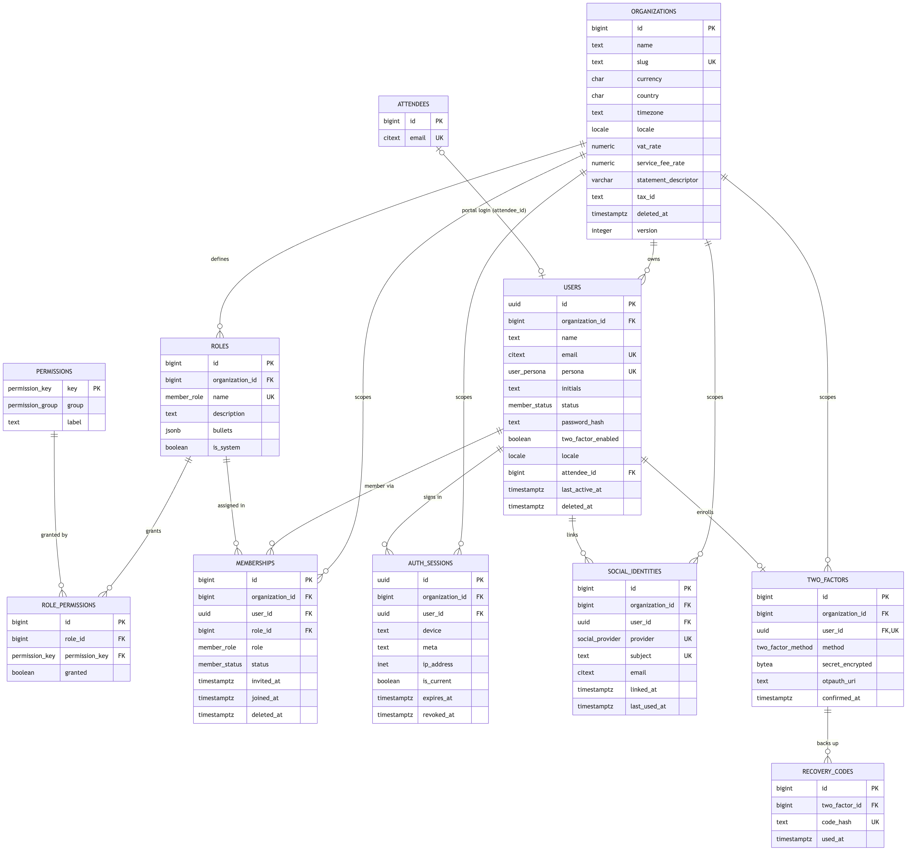

<details>
<summary>Mermaid source</summary>

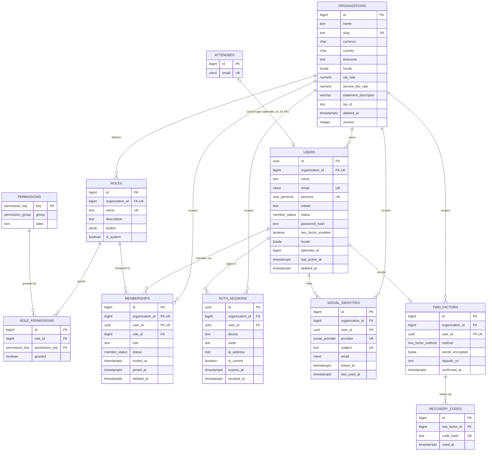
```mermaid
erDiagram
    ORGANIZATIONS {
        bigint id PK
        text name
        text slug UK
        char currency
        char country
        text timezone
        locale locale
        numeric vat_rate
        numeric service_fee_rate
        varchar statement_descriptor
        text tax_id
        timestamptz deleted_at
        integer version
    }
    USERS {
        uuid id PK
        bigint organization_id FK,UK
        text name
        citext email UK
        user_persona persona UK
        text initials
        member_status status
        text password_hash
        boolean two_factor_enabled
        locale locale
        bigint attendee_id
        timestamptz last_active_at
        timestamptz deleted_at
    }
    ROLES {
        bigint id PK
        bigint organization_id FK,UK
        text name UK
        text description
        jsonb bullets
        boolean is_system
    }
    PERMISSIONS {
        permission_key key PK
        permission_group group
        text label
    }
    ROLE_PERMISSIONS {
        bigint id PK
        bigint role_id FK
        permission_key permission_key FK
        boolean granted
    }
    MEMBERSHIPS {
        bigint id PK
        bigint organization_id FK,UK
        uuid user_id FK,UK
        bigint role_id FK
        text role
        member_status status
        timestamptz invited_at
        timestamptz joined_at
        timestamptz deleted_at
    }
    AUTH_SESSIONS {
        uuid id PK
        bigint organization_id FK
        uuid user_id FK
        text device
        text meta
        inet ip_address
        boolean is_current
        timestamptz expires_at
        timestamptz revoked_at
    }
    SOCIAL_IDENTITIES {
        bigint id PK
        bigint organization_id FK
        uuid user_id FK
        social_provider provider UK
        text subject UK
        citext email
        timestamptz linked_at
        timestamptz last_used_at
    }
    TWO_FACTORS {
        bigint id PK
        bigint organization_id FK
        uuid user_id FK,UK
        two_factor_method method
        bytea secret_encrypted
        text otpauth_uri
        timestamptz confirmed_at
    }
    RECOVERY_CODES {
        bigint id PK
        bigint two_factor_id FK
        text code_hash UK
        timestamptz used_at
    }
    ATTENDEES {
        bigint id PK
        citext email UK
    }

    ORGANIZATIONS ||--o{ USERS : "owns"
    ORGANIZATIONS ||--o{ ROLES : "defines"
    ORGANIZATIONS ||--o{ MEMBERSHIPS : "scopes"
    ORGANIZATIONS ||--o{ AUTH_SESSIONS : "scopes"
    ORGANIZATIONS ||--o{ SOCIAL_IDENTITIES : "scopes"
    ORGANIZATIONS ||--o{ TWO_FACTORS : "scopes"
    ATTENDEES |o--o| USERS : "portal login (attendee_id, no FK)"
    USERS ||--o{ MEMBERSHIPS : "member via"
    ROLES ||--o{ MEMBERSHIPS : "assigned in"
    ROLES ||--o{ ROLE_PERMISSIONS : "grants"
    PERMISSIONS ||--o{ ROLE_PERMISSIONS : "granted by"
    USERS ||--o{ AUTH_SESSIONS : "signs in"
    USERS ||--o{ SOCIAL_IDENTITIES : "links"
    USERS ||--o| TWO_FACTORS : "enrolls"
    TWO_FACTORS ||--o{ RECOVERY_CODES : "backs up"
```

</details>

- `memberships` resolves the **users ⇄ organizations** M:N (a user may belong to
  many orgs), carrying the assigned `role_id` and `status`.
- `role_permissions` resolves the **roles ⇄ permissions** M:N — the 12 fixed
  `permissions` presets per role (`ROLE_PERMS`). Neither `role_permissions` nor
  `permissions` is tenant-scoped.
- `roles.name` and `memberships.role` are plain `text`, not the `member_role`
  enum. The enum type exists and the application validates against it, but the
  columns were built as `text`, so the database will accept any string.
- `social_identities` stores non-secret provider subjects for Google, Apple, or
  LinkedIn. Both its tenant and user FKs cascade; `(provider, subject)` and
  `(user_id, provider)` are unique.
- `attendees` here is a stub; its full definition is in *Registration, Orders &
  Seating*. `users.attendee_id` is the optional 1:1 portal-persona link — and it
  carries **no foreign-key constraint**, so a user row can point at an attendee id
  that was never created or has since been hard-deleted. It is the only unenforced
  reference in this view; see [Unenforced references](#unenforced-references).
- Uniqueness on `users` is the triple `(organization_id, email, persona)`, so the
  same address can exist once as an organizer and once as a portal attendee within
  one tenant.

### Organization & Settings

Integration API credentials, per-user notification-channel preferences, and
workspace payment-connection and checkout-method configuration.

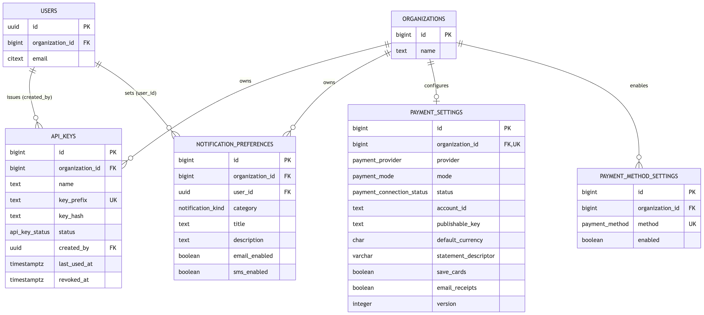

<details>
<summary>Mermaid source</summary>

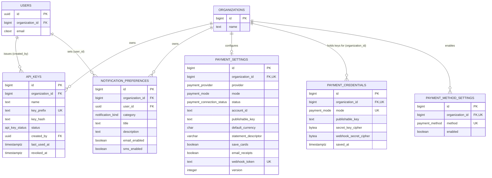
```mermaid
erDiagram
    ORGANIZATIONS {
        bigint id PK
        text name
    }
    USERS {
        uuid id PK
        bigint organization_id FK
        citext email
    }
    API_KEYS {
        bigint id PK
        bigint organization_id FK
        text name
        text key_prefix UK
        text key_hash
        api_key_status status
        uuid created_by FK
        timestamptz last_used_at
        timestamptz revoked_at
    }
    NOTIFICATION_PREFERENCES {
        bigint id PK
        bigint organization_id FK
        uuid user_id FK
        notification_kind category
        text title
        text description
        boolean email_enabled
        boolean sms_enabled
    }
    PAYMENT_SETTINGS {
        bigint id PK
        bigint organization_id FK,UK
        payment_provider provider
        payment_mode mode
        payment_connection_status status
        text account_id
        text publishable_key
        char default_currency
        varchar statement_descriptor
        boolean save_cards
        boolean email_receipts
        text webhook_token UK
        integer version
    }
    PAYMENT_CREDENTIALS {
        bigint id PK
        bigint organization_id FK,UK
        payment_mode mode UK
        text publishable_key
        bytea secret_key_cipher
        bytea webhook_secret_cipher
        timestamptz saved_at
    }
    PAYMENT_METHOD_SETTINGS {
        bigint id PK
        bigint organization_id FK,UK
        payment_method method UK
        boolean enabled
    }

    ORGANIZATIONS ||--o{ API_KEYS : "owns"
    ORGANIZATIONS ||--o{ NOTIFICATION_PREFERENCES : "owns"
    ORGANIZATIONS ||--o| PAYMENT_SETTINGS : "configures"
    ORGANIZATIONS ||--o{ PAYMENT_CREDENTIALS : "holds keys for (organization_id)"
    ORGANIZATIONS ||--o{ PAYMENT_METHOD_SETTINGS : "enables"
    USERS ||--o{ API_KEYS : "issues (created_by)"
    USERS ||--o{ NOTIFICATION_PREFERENCES : "sets (user_id)"
```

</details>

- `api_keys.created_by → users` is `ON DELETE RESTRICT` (the issuer requires
  `setIntegrations` and cannot be deleted out from under a live key).
- `notification_preferences` is unique per `(user_id, category)` and gates whether
  a `message_deliveries` row is generated for that category. `users` is defined in
  *Identity & Access*. Its companion `notification_reads`, which records how far a
  member has read the in-app feed, is drawn in *Engagement & Messaging*.
- `payment_settings` is optional and unique per organization; it stores only
  non-secret provider references. `payment_method_settings` is unique per
  `(organization_id, method)`, with an absent row meaning disabled.
- **`payment_credentials` holds the secret half** that `payment_settings`
  deliberately does not: the secret API key and webhook signing secret, both
  encrypted at rest as `bytea` ciphertext. It is unique per
  `(organization_id, mode)`, so one tenant keeps a `test` row and a `live` row side
  by side and can swap modes without re-entering keys. The split is the point —
  `payment_settings` is safe to read on any screen that shows connection state,
  while `payment_credentials` is read only by the server-side payment client.

### Events & Program

The central `events` aggregate with its optional category and landing-template
styling, public-page highlights and FAQs, plus speakers, agenda sessions, and
the session⇄speaker junction.

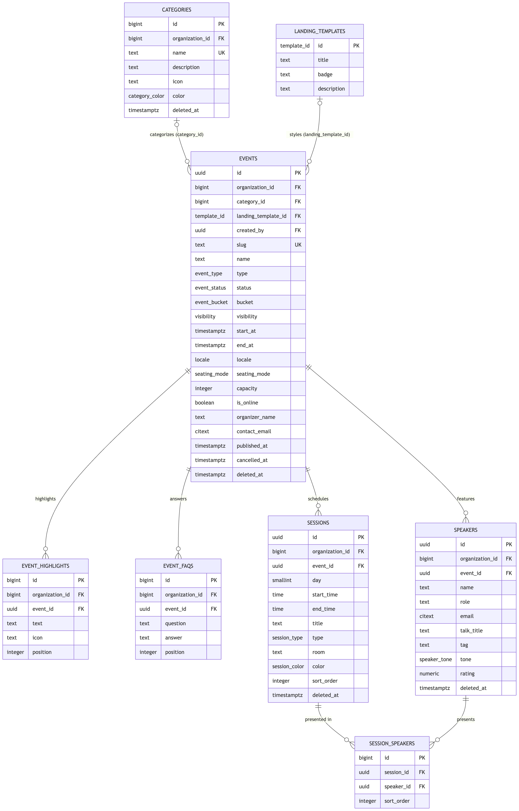

<details>
<summary>Mermaid source</summary>

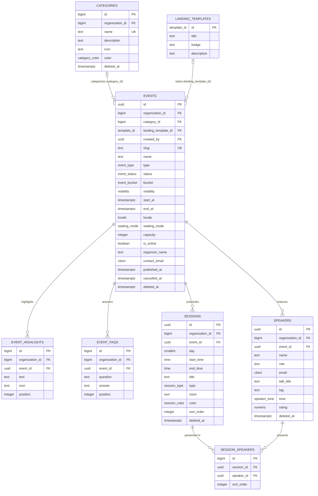
```mermaid
erDiagram
    CATEGORIES {
        bigint id PK
        bigint organization_id FK
        text name UK
        text description
        text icon
        category_color color
        timestamptz deleted_at
    }
    LANDING_TEMPLATES {
        template_id id PK
        text title
        text badge
        text description
    }
    EVENTS {
        uuid id PK
        bigint organization_id FK
        bigint category_id FK
        template_id landing_template_id FK
        uuid created_by FK
        text slug UK
        text name
        event_type type
        event_status status
        event_bucket bucket
        visibility visibility
        timestamptz start_at
        timestamptz end_at
        locale locale
        seating_mode seating_mode
        integer capacity
        boolean is_online
        text organizer_name
        citext contact_email
        timestamptz published_at
        timestamptz cancelled_at
        timestamptz deleted_at
    }
    EVENT_HIGHLIGHTS {
        bigint id PK
        bigint organization_id FK
        uuid event_id FK
        text text
        text icon
        integer position
    }
    EVENT_FAQS {
        bigint id PK
        bigint organization_id FK
        uuid event_id FK
        text question
        text answer
        integer position
    }
    SPEAKERS {
        uuid id PK
        bigint organization_id FK
        uuid event_id FK
        text name
        text role
        citext email
        text talk_title
        text tag
        speaker_tone tone
        numeric rating
        timestamptz deleted_at
    }
    SESSIONS {
        uuid id PK
        bigint organization_id FK
        uuid event_id FK
        smallint day
        time start_time
        time end_time
        text title
        session_type type
        text room
        session_color color
        integer sort_order
        timestamptz deleted_at
    }
    SESSION_SPEAKERS {
        bigint id PK
        uuid session_id FK
        uuid speaker_id FK
        integer sort_order
    }

    CATEGORIES |o--o{ EVENTS : "categorizes (category_id)"
    LANDING_TEMPLATES |o--o{ EVENTS : "styles (landing_template_id)"
    EVENTS ||--o{ SPEAKERS : "features"
    EVENTS ||--o{ SESSIONS : "schedules"
    EVENTS ||--o{ EVENT_HIGHLIGHTS : "highlights"
    EVENTS ||--o{ EVENT_FAQS : "answers"
    SESSIONS ||--o{ SESSION_SPEAKERS : "presented in"
    SPEAKERS ||--o{ SESSION_SPEAKERS : "presents"
```

</details>

- `session_speakers` resolves the **sessions ⇄ speakers** M:N (a speaker owns many
  sessions; `Break` sessions have no rows). Both FKs cascade.
- `event_highlights` and `event_faqs` are ordered, tenant-scoped children of the
  event. Both their event and organization FKs cascade.
- `events.category_id`, `events.landing_template_id`, and `events.created_by` are
  all `ON DELETE SET NULL` (optional/attribution). `landing_templates` is a global
  seed, not tenant-scoped. `events.created_by → users` (Identity & Access).

### Ticketing & Discounts

Sellable ticket tiers, redeemable discount codes (event or org-wide), and the
`discount_redemptions` junction that enforces once-per-order idempotency.

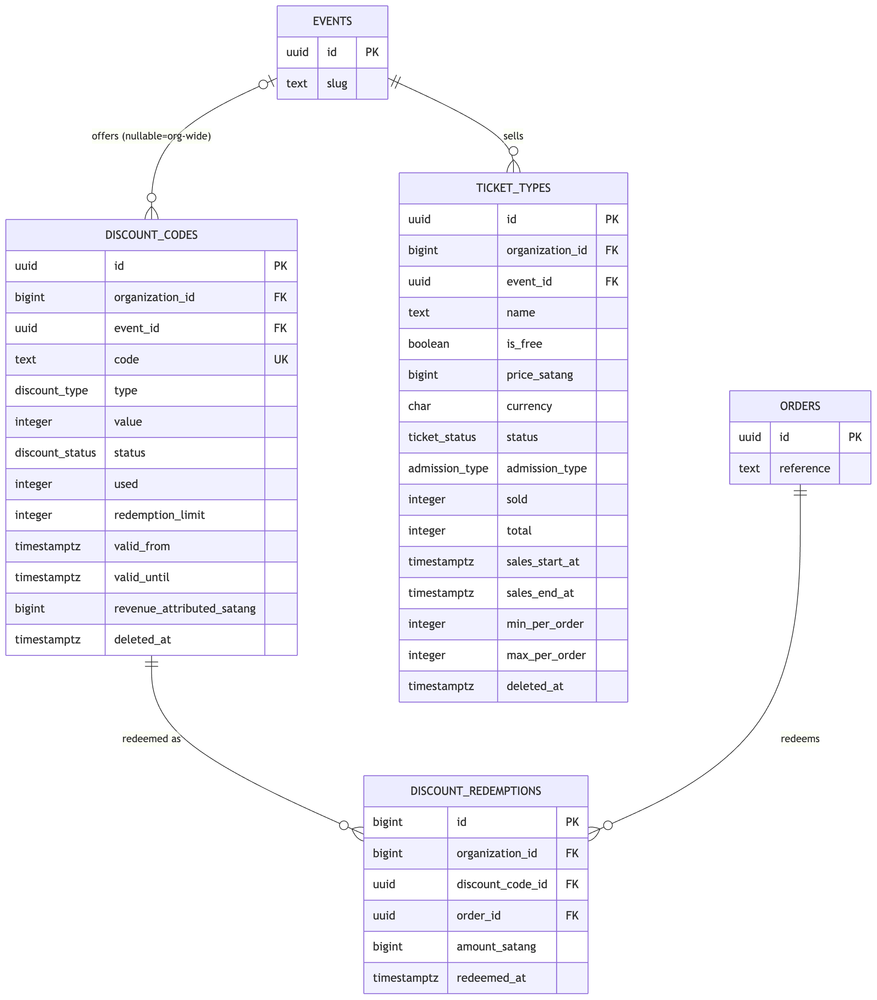

<details>
<summary>Mermaid source</summary>

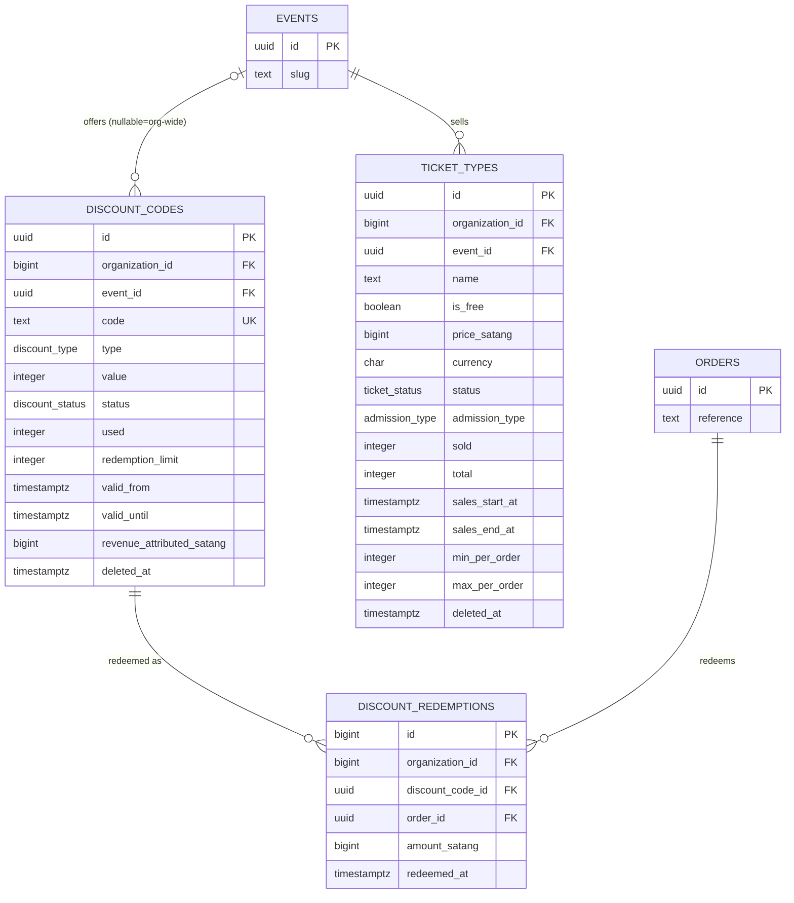
```mermaid
erDiagram
    EVENTS {
        uuid id PK
        text slug
    }
    ORDERS {
        uuid id PK
        text reference
    }
    TICKET_TYPES {
        uuid id PK
        bigint organization_id FK
        uuid event_id FK
        text name
        boolean is_free
        bigint price_satang
        char currency
        ticket_status status
        admission_type admission_type
        integer sold
        integer total
        timestamptz sales_start_at
        timestamptz sales_end_at
        integer min_per_order
        integer max_per_order
        timestamptz deleted_at
    }
    DISCOUNT_CODES {
        uuid id PK
        bigint organization_id FK
        uuid event_id FK
        text code UK
        discount_type type
        integer value
        discount_status status
        integer used
        integer redemption_limit
        timestamptz valid_from
        timestamptz valid_until
        bigint revenue_attributed_satang
        timestamptz deleted_at
    }
    DISCOUNT_REDEMPTIONS {
        bigint id PK
        bigint organization_id FK
        uuid discount_code_id FK
        uuid order_id FK
        bigint amount_satang
        timestamptz redeemed_at
    }

    EVENTS ||--o{ TICKET_TYPES : "sells"
    EVENTS |o--o{ DISCOUNT_CODES : "offers (nullable=org-wide)"
    DISCOUNT_CODES ||--o{ DISCOUNT_REDEMPTIONS : "redeemed as"
    ORDERS ||--o{ DISCOUNT_REDEMPTIONS : "redeems"
```

</details>

- `discount_codes.event_id` is nullable — a null means an **org-wide** code; the
  uniqueness is `(organization_id, event_id, code)`.
- `discount_redemptions` resolves the **discount_codes ⇄ orders** M:N; its
  `UNIQUE (discount_code_id, order_id)` makes re-submitting the same code on the
  same order a no-op, and drives the `used` counter. `discount_code_id` is
  `RESTRICT`, `order_id` is `CASCADE`. `events` and `orders` are defined in their
  own views.

### Registration, Orders & Seating

The commerce core: cross-organizer `saved_events`, the attendee CRM, the `orders`
booking header, its `order_items` lines, the issued `tickets` (one per admitted
seat, carrying the QR token), and the reserved-seating model (`seat_maps` →
`seats` → `seat_assignments`).

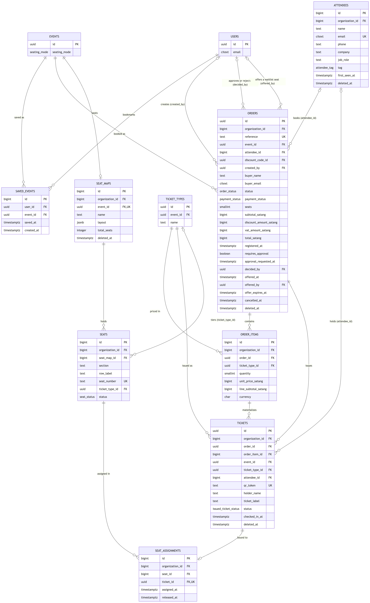

<details>
<summary>Mermaid source</summary>

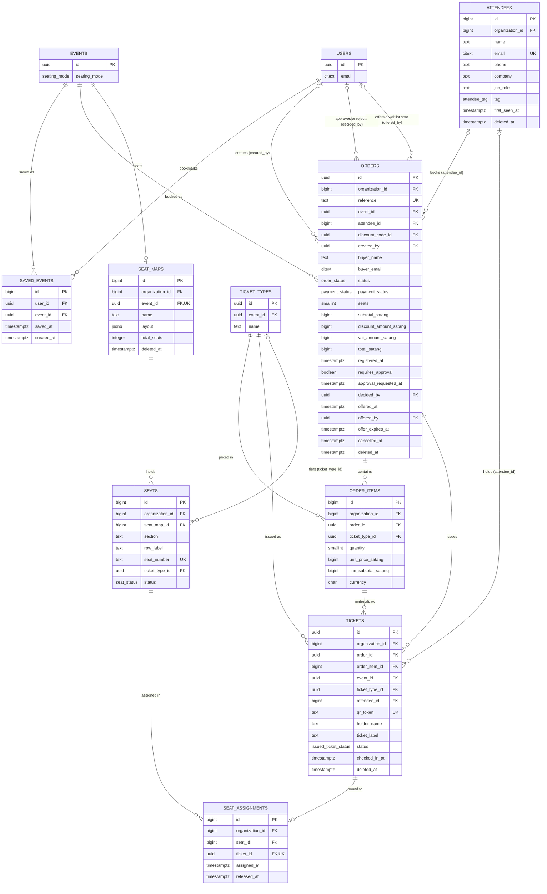
```mermaid
erDiagram
    SAVED_EVENTS {
        bigint id PK
        uuid user_id FK
        uuid event_id FK
        timestamptz saved_at
        timestamptz created_at
    }
    ATTENDEES {
        bigint id PK
        bigint organization_id FK
        text name
        citext email UK
        text phone
        text company
        text job_role
        attendee_tag tag
        timestamptz first_seen_at
        timestamptz deleted_at
    }
    ORDERS {
        uuid id PK
        bigint organization_id FK
        text reference UK
        uuid event_id FK
        bigint attendee_id FK
        uuid discount_code_id FK
        uuid created_by FK
        text buyer_name
        citext buyer_email
        order_status status
        payment_status payment_status
        smallint seats
        bigint subtotal_satang
        bigint discount_amount_satang
        bigint vat_amount_satang
        bigint total_satang
        timestamptz registered_at
        boolean requires_approval
        timestamptz approval_requested_at
        uuid decided_by FK
        timestamptz offered_at
        uuid offered_by FK
        timestamptz offer_expires_at
        timestamptz cancelled_at
        timestamptz deleted_at
    }
    ORDER_ITEMS {
        bigint id PK
        bigint organization_id FK
        uuid order_id FK
        uuid ticket_type_id FK
        smallint quantity
        bigint unit_price_satang
        bigint line_subtotal_satang
        char currency
    }
    TICKETS {
        uuid id PK
        bigint organization_id FK
        uuid order_id FK
        bigint order_item_id FK
        uuid event_id FK
        uuid ticket_type_id FK
        bigint attendee_id FK
        text qr_token UK
        text holder_name
        text ticket_label
        issued_ticket_status status
        timestamptz checked_in_at
        timestamptz deleted_at
    }
    TICKET_TYPES {
        uuid id PK
        uuid event_id FK
        text name
    }
    SEAT_MAPS {
        bigint id PK
        bigint organization_id FK
        uuid event_id FK,UK
        text name
        jsonb layout
        integer total_seats
        timestamptz deleted_at
    }
    SEATS {
        bigint id PK
        bigint organization_id FK
        bigint seat_map_id FK
        text section
        text row_label
        text seat_number UK
        uuid ticket_type_id FK
        seat_status status
    }
    SEAT_ASSIGNMENTS {
        bigint id PK
        bigint organization_id FK
        bigint seat_id FK
        uuid ticket_id FK,UK
        timestamptz assigned_at
        timestamptz released_at
    }
    EVENTS {
        uuid id PK
        seating_mode seating_mode
    }
    USERS {
        uuid id PK
        citext email
    }

    USERS ||--o{ SAVED_EVENTS : "bookmarks"
    EVENTS ||--o{ SAVED_EVENTS : "saved as"
    EVENTS ||--o{ ORDERS : "booked as"
    ATTENDEES |o--o{ ORDERS : "books (attendee_id)"
    USERS |o--o{ ORDERS : "creates (created_by)"
    USERS |o--o{ ORDERS : "approves or rejects (decided_by)"
    USERS |o--o{ ORDERS : "offers a waitlist seat (offered_by)"
    ORDERS ||--o{ ORDER_ITEMS : "contains"
    TICKET_TYPES ||--o{ ORDER_ITEMS : "priced in"
    ORDERS ||--o{ TICKETS : "issues"
    ORDER_ITEMS ||--o{ TICKETS : "materializes"
    TICKET_TYPES ||--o{ TICKETS : "issued as"
    ATTENDEES |o--o{ TICKETS : "holds (attendee_id)"
    EVENTS ||--o| SEAT_MAPS : "seats"
    SEAT_MAPS ||--o{ SEATS : "holds"
    TICKET_TYPES |o--o{ SEATS : "tiers (ticket_type_id)"
    SEATS ||--o{ SEAT_ASSIGNMENTS : "assigned in"
    TICKETS ||--o| SEAT_ASSIGNMENTS : "bound to"
```

</details>

- **Order→ticket commerce.** An `order` is the booking header; each `order_items`
  line is a quantity of one `ticket_type`; each `tickets` row is one issued
  admission materialized from a line (`order_item_id`), denormalizing `event_id`
  and `ticket_type_id` for fast door scans.
- **Saved events.** `saved_events` is the junction resolving the
  **users ⇄ events** M:N ("bookmarks"): unique by `(user_id, event_id)`, cascading
  from both parents, carrying no payload beyond `saved_at`. It has no
  `organization_id`: access is scoped to the portal user so one personal list can
  span organizers.
- **Reserved seating.** `seat_maps` is 1:1 with an `event` (`UNIQUE (event_id)`),
  present only when `events.seating_mode = reserved`. `seats` belong to a map;
  `seat_assignments` resolves the **seats ⇄ tickets** M:N with a partial unique
  `uq_seat_active (seat_id) WHERE released_at IS NULL` (one live holder per seat)
  and `UNIQUE (ticket_id)` (one seat per ticket).
- **Three staff attributions on one order.** Beyond `created_by` (who keyed the
  booking), `orders` carries `decided_by` for the approve/reject decision on an
  event with `requires_approval`, and `offered_by` for the organizer who offered a
  waitlist seat. All three are `uuid → users` with `ON DELETE SET NULL`, so the
  order survives the staff member leaving. They are drawn as three separate edges
  because they answer three different questions.
- Cross-context: `orders.event_id/discount_code_id`, `tickets.event_id` live in
  the Events and Ticketing views; `users` is defined in *Identity & Access*.

### Attendance & Check-in

Two tables that answer two different questions. `check_ins` is the **state of the
room**: one row per admitted ticket, `ticket_id` `NOT NULL` and `UNIQUE`, so it is
a set of successful admissions and the authority on who is inside.
`scan_attempts` is the **history of the door**: one append-only row per scan
presented, refusals included, so a bad QR or a pass for the wrong event leaves a
trace. An admission writes both rows in one transaction; undoing a check-in
deletes the `check_ins` row and leaves the `admitted` scan standing, because the
admission was reversed but the scan still happened.

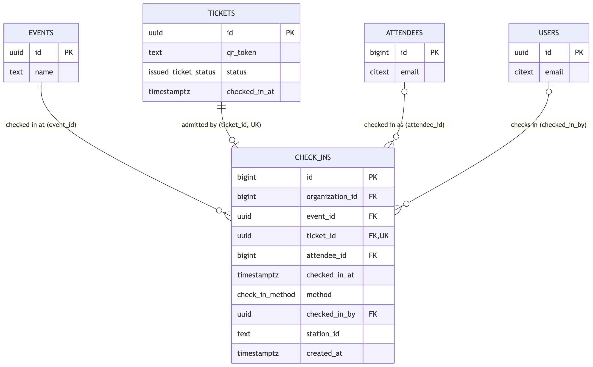

<details>
<summary>Mermaid source</summary>

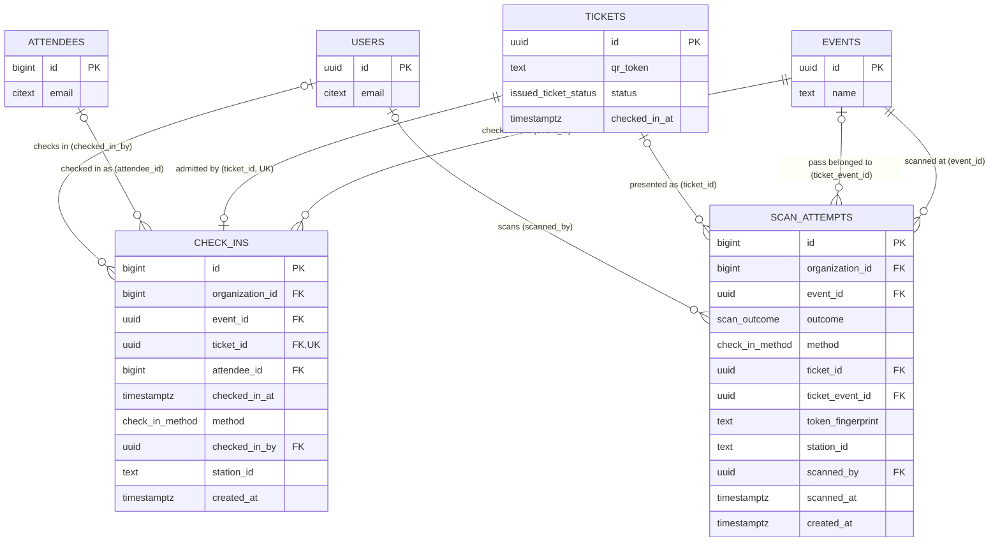
```mermaid
erDiagram
    CHECK_INS {
        bigint id PK
        bigint organization_id FK
        uuid event_id FK
        uuid ticket_id FK,UK
        bigint attendee_id FK
        timestamptz checked_in_at
        check_in_method method
        uuid checked_in_by FK
        text station_id
        timestamptz created_at
    }
    SCAN_ATTEMPTS {
        bigint id PK
        bigint organization_id FK
        uuid event_id FK
        scan_outcome outcome
        check_in_method method
        uuid ticket_id FK
        uuid ticket_event_id FK
        text token_fingerprint
        text station_id
        uuid scanned_by FK
        timestamptz scanned_at
        timestamptz created_at
    }
    EVENTS {
        uuid id PK
        text name
    }
    TICKETS {
        uuid id PK
        text qr_token
        issued_ticket_status status
        timestamptz checked_in_at
    }
    ATTENDEES {
        bigint id PK
        citext email
    }
    USERS {
        uuid id PK
        citext email
    }

    EVENTS ||--o{ CHECK_INS : "checked in at (event_id)"
    TICKETS ||--o| CHECK_INS : "admitted by (ticket_id, UK)"
    ATTENDEES |o--o{ CHECK_INS : "checked in as (attendee_id)"
    USERS |o--o{ CHECK_INS : "checks in (checked_in_by)"
    EVENTS ||--o{ SCAN_ATTEMPTS : "scanned at (event_id)"
    EVENTS |o--o{ SCAN_ATTEMPTS : "pass belonged to (ticket_event_id)"
    TICKETS |o--o{ SCAN_ATTEMPTS : "presented as (ticket_id)"
    USERS |o--o{ SCAN_ATTEMPTS : "scans (scanned_by)"
```

</details>

- **One admission per ticket.** `uq_check_ins_ticket (ticket_id)` plus a `NOT NULL`
  `ticket_id` makes the relationship `TICKETS ||--o| CHECK_INS`, not one-to-many: a
  ticket is either admitted (one row) or not (no row). `ON DELETE CASCADE` — the
  admission is existentially owned by the ticket.
- `event_id` is `RESTRICT` (protect attendance history). `attendee_id` and
  `checked_in_by` are both `SET NULL`, so the record survives a deleted attendee
  CRM row or a departed gate steward; `checked_in_by → users` needs `regCheckin`.
- `method` is the `check_in_method` enum (`qr`, `manual`, `upload`) — *how* the
  person came through the door, which is a different axis from *what the scanner
  decided*. Both tables carry it: the outcome taxonomy lives in `scan_attempts`
  as the separate `scan_outcome` enum.
- `station_id` identifies the door/kiosk. Writing a row authoritatively sets
  `tickets.status = checked_in` and `tickets.checked_in_at`. `tickets`, `events`,
  `attendees`, `users` are defined elsewhere.
- **`scan_attempts` exists because a refusal is not shaped like an admission.**
  The design asked for the failed-scan half as columns on `check_ins`
  (`scanned_qr`, `state`, `other_event_id`), and that cannot work:
  `uq_check_ins_ticket` is a `UNIQUE` on `ticket_id` alone, and that one
  constraint is the whole concurrency story of the door — two staff scanning the
  same code both insert, one wins, and the loser reads back the winner's arrival
  time instead of letting a second person in. One row per ticket is the guarantee.
  Refusals break it on both arms: the same damaged pass is presented five times in
  a minute, and an unrecognised code has no ticket to be unique *on*, so
  `ticket_id` could not stay `NOT NULL` either. Widening `check_ins` would have
  meant weakening the only constraint protecting the admission, which is almost
  certainly why those columns were drawn and never built. The ledger is additive —
  `check_ins` is untouched.
- **It records admissions too, not just refusals,** because a refusal count has no
  meaning without a denominator: "19 invalid scans" is unreadable without the
  1,340 that worked, and it is the refusal *rate* that tells a busy door from a
  broken scanner. `outcome` is the `scan_outcome` enum — `admitted`,
  `already_checked_in`, `invalid`, `wrong_event`, `cancelled` — the enum created
  by migration `0039` and left without a column until `0068`.
- **`token_fingerprint` is a SHA-256 digest of the code presented, never the code.**
  `tickets.qr_token` is a bearer credential: holding the string is the entitlement
  to walk in. This table is append-only, outlives both the event and the ticket,
  and is readable by anyone who may review a door — so raw tokens would turn a
  door-incident log into a list of working passes and an export of it into a set
  of usable tickets. The digest loses nothing needed: a recognised code already
  carries its `ticket_id`, and grouping on the digest still separates "one broken
  pass presented forty times" from "forty different bad codes", which is the
  difference between a faulty ticket and somebody probing the door. `NULL` means
  no code was presented at all, which is precisely what a manual admission is.
  The same digest-not-credential choice is already made in `api_keys.key_hash`.
- `event_id` is `RESTRICT`, matching `check_ins.event_id` — what happened at a door
  is history and must outlive the event row. `ticket_id`, `ticket_event_id` and
  `scanned_by` are all `SET NULL`: deleting a ticket must not erase the evidence
  that it was turned away, deleting some *other* event must not be blocked by a
  refusal recorded here, and the row has to survive a departed gate steward.
  `ticket_event_id` — the design's `other_event_id` — is written **only when it
  differs from `event_id`**, which is what lets `ticket_event_id IS NOT NULL` read
  as "a pass for somewhere else turned up here" instead of also matching every row
  where it would merely repeat the event we already know.
- **Append-only is a property of the writer, not of the schema.**
  `CheckInRepository` has no update or delete path for this table, which is what
  makes it evidence; no constraint enforces that, and a `REVOKE` would not bind an
  application connecting as the schema owner — the same reason its RLS policy is
  defence in depth rather than the guarantee.

### Payments & Finance

The append-only payment/refund ledgers, tax invoices, organizer payouts with the
`payout_items` settlement junction, and monthly VAT/WHT `tax_periods`.

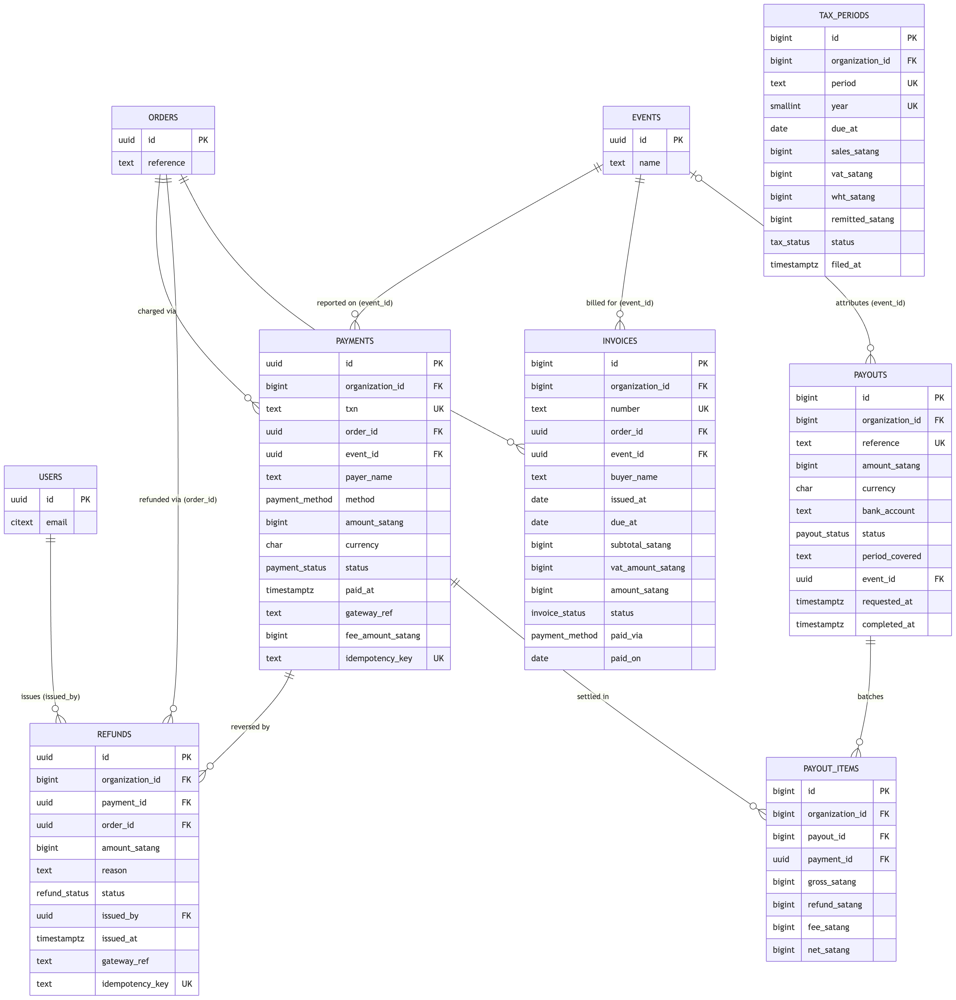

<details>
<summary>Mermaid source</summary>

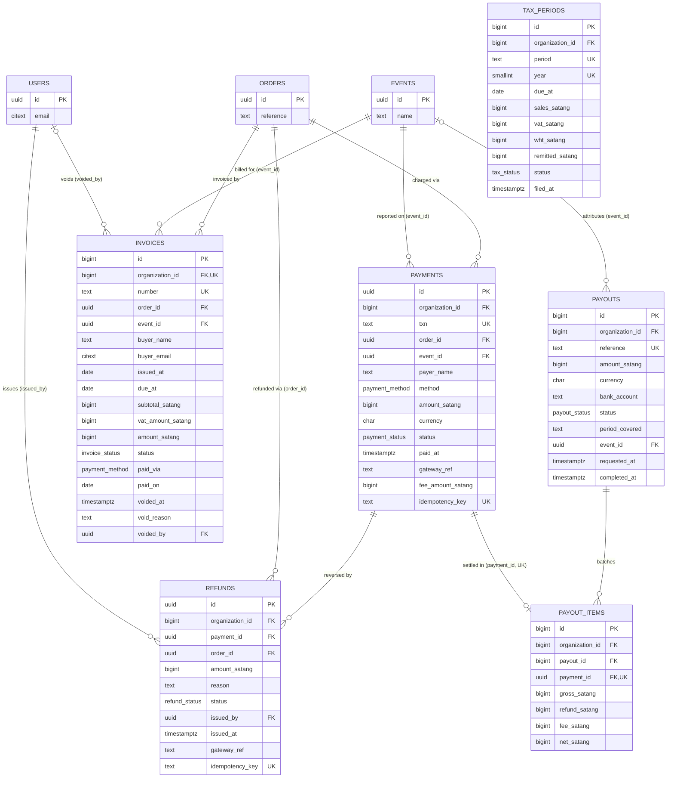
```mermaid
erDiagram
    ORDERS {
        uuid id PK
        text reference
    }
    EVENTS {
        uuid id PK
        text name
    }
    USERS {
        uuid id PK
        citext email
    }
    PAYMENTS {
        uuid id PK
        bigint organization_id FK
        text txn UK
        uuid order_id FK
        uuid event_id FK
        text payer_name
        payment_method method
        bigint amount_satang
        char currency
        payment_status status
        timestamptz paid_at
        text gateway_ref
        bigint fee_amount_satang
        text idempotency_key UK
    }
    REFUNDS {
        uuid id PK
        bigint organization_id FK
        uuid payment_id FK
        uuid order_id FK
        bigint amount_satang
        text reason
        refund_status status
        uuid issued_by FK
        timestamptz issued_at
        text gateway_ref
        text idempotency_key UK
    }
    INVOICES {
        bigint id PK
        bigint organization_id FK,UK
        text number UK
        uuid order_id FK
        uuid event_id FK
        text buyer_name
        citext buyer_email
        date issued_at
        date due_at
        bigint subtotal_satang
        bigint vat_amount_satang
        bigint amount_satang
        invoice_status status
        payment_method paid_via
        date paid_on
        timestamptz voided_at
        text void_reason
        uuid voided_by FK
    }
    PAYOUTS {
        bigint id PK
        bigint organization_id FK
        text reference UK
        bigint amount_satang
        char currency
        text bank_account
        payout_status status
        text period_covered
        uuid event_id FK
        timestamptz requested_at
        timestamptz completed_at
    }
    PAYOUT_ITEMS {
        bigint id PK
        bigint organization_id FK
        bigint payout_id FK
        uuid payment_id FK,UK
        bigint gross_satang
        bigint refund_satang
        bigint fee_satang
        bigint net_satang
    }
    TAX_PERIODS {
        bigint id PK
        bigint organization_id FK
        text period UK
        smallint year UK
        date due_at
        bigint sales_satang
        bigint vat_satang
        bigint wht_satang
        bigint remitted_satang
        tax_status status
        timestamptz filed_at
    }

    ORDERS ||--o{ PAYMENTS : "charged via"
    EVENTS ||--o{ PAYMENTS : "reported on (event_id)"
    PAYMENTS ||--o{ REFUNDS : "reversed by"
    ORDERS ||--o{ REFUNDS : "refunded via (order_id)"
    USERS ||--o{ REFUNDS : "issues (issued_by)"
    ORDERS ||--o{ INVOICES : "invoiced by"
    EVENTS ||--o{ INVOICES : "billed for (event_id)"
    USERS |o--o{ INVOICES : "voids (voided_by)"
    EVENTS |o--o{ PAYOUTS : "attributes (event_id)"
    PAYOUTS ||--o{ PAYOUT_ITEMS : "batches"
    PAYMENTS ||--o| PAYOUT_ITEMS : "settled in (payment_id, UK)"
```

</details>

- **Money as satang.** Every `*_satang` column is `bigint` integer minor units
  (1 THB = 100 satang), `>= 0`, paired with `currency char(3) DEFAULT 'THB'`.
- `payments` and `refunds` are append-only ledgers keyed by an `idempotency_key`
  for exactly-once capture. Both are `RESTRICT` to `orders`/`payments` to protect
  financial history. `refunds.issued_by → users` requires `finRefund`.
- `payout_items` resolves **payments ⇄ payouts** M:N with `UNIQUE (payment_id)` —
  a payment settles in **at most one** payout (`net = gross − refund − fee`). That
  uniqueness is why the `payments` end of the edge is drawn `||--o|`.
- **Invoices are voided, never deleted.** A tax invoice that must be withdrawn gets
  `voided_at`, `void_reason` and `voided_by → users` (`SET NULL`) rather than a
  soft-delete flag, and the partial unique `uq_invoices_live_order (order_id) WHERE
  status <> 'void'` lets the order be re-invoiced exactly once afterwards. Numbering
  is unique per `(organization_id, number)`.
- `tax_periods` is unique per `(organization_id, period, year)`. `orders`,
  `events`, `users` are defined in their own views.

### Engagement & Messaging

Automated templates, one-off event announcements, per-event invitation sends, the
once-per-`(event, kind)` bulk-run guard, the per-recipient `message_deliveries`
ledger, and the per-member read watermark for the in-app feed.

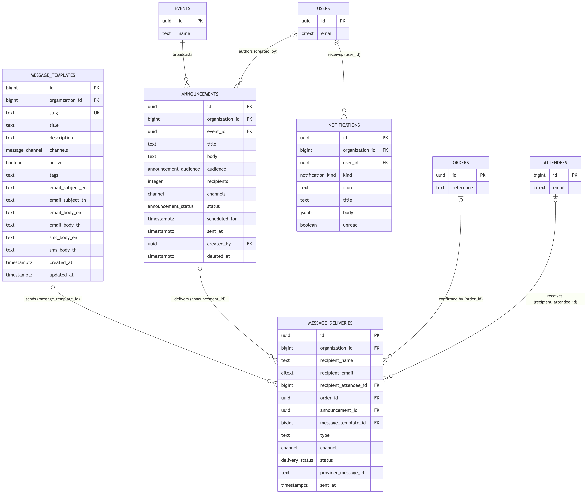

<details>
<summary>Mermaid source</summary>

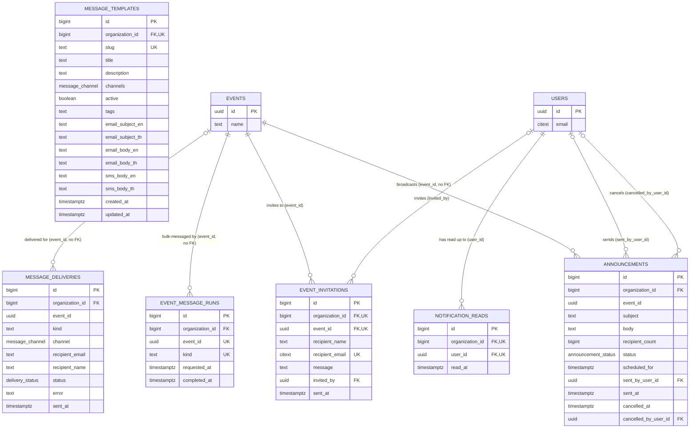
```mermaid
erDiagram
    MESSAGE_TEMPLATES {
        bigint id PK
        bigint organization_id FK,UK
        text slug UK
        text title
        text description
        message_channel channels
        boolean active
        text tags
        text email_subject_en
        text email_subject_th
        text email_body_en
        text email_body_th
        text sms_body_en
        text sms_body_th
        timestamptz created_at
        timestamptz updated_at
    }
    ANNOUNCEMENTS {
        bigint id PK
        bigint organization_id FK
        uuid event_id
        text subject
        text body
        bigint recipient_count
        announcement_status status
        timestamptz scheduled_for
        uuid sent_by_user_id FK
        timestamptz sent_at
        timestamptz cancelled_at
        uuid cancelled_by_user_id FK
    }
    EVENT_INVITATIONS {
        bigint id PK
        bigint organization_id FK,UK
        uuid event_id FK,UK
        text recipient_name
        citext recipient_email UK
        text message
        uuid invited_by FK
        timestamptz sent_at
    }
    EVENT_MESSAGE_RUNS {
        bigint id PK
        bigint organization_id FK
        uuid event_id UK
        text kind UK
        timestamptz requested_at
        timestamptz completed_at
    }
    MESSAGE_DELIVERIES {
        bigint id PK
        bigint organization_id FK
        uuid event_id
        text kind
        message_channel channel
        text recipient_email
        text recipient_name
        delivery_status status
        text error
        timestamptz sent_at
    }
    NOTIFICATION_READS {
        bigint id PK
        bigint organization_id FK,UK
        uuid user_id FK,UK
        timestamptz read_at
    }
    EVENTS {
        uuid id PK
        text name
    }
    USERS {
        uuid id PK
        citext email
    }

    EVENTS ||--o{ ANNOUNCEMENTS : "broadcasts (event_id, no FK)"
    USERS |o--o{ ANNOUNCEMENTS : "sends (sent_by_user_id)"
    USERS |o--o{ ANNOUNCEMENTS : "cancels (cancelled_by_user_id)"
    EVENTS ||--o{ EVENT_INVITATIONS : "invites to (event_id)"
    USERS |o--o{ EVENT_INVITATIONS : "invites (invited_by)"
    EVENTS ||--o{ EVENT_MESSAGE_RUNS : "bulk-messaged by (event_id, no FK)"
    EVENTS |o--o{ MESSAGE_DELIVERIES : "delivered for (event_id, no FK)"
    USERS ||--o{ NOTIFICATION_READS : "has read up to (user_id)"
```

</details>

- **`message_deliveries` is a flat send log.** It records the channel, the
  recipient address, the outcome (`sent` / `failed`) and the provider `error`
  string, keyed to the event by a bare `event_id`. It does **not** link back to the
  announcement, template, order or attendee that caused the send: those four link
  columns, and the provider's own message id, were designed and never built, so a
  delivery cannot currently be traced to its source. See
  [Designed but not built](#designed-but-not-built).
- **`event_invitations` is the one properly-constrained send table** in this view:
  `event_id → events` cascades, `invited_by → users` is `SET NULL`, and
  `uq_event_invitations_recipient (organization_id, event_id, recipient_email)`
  makes re-inviting the same address a no-op rather than a duplicate email.
- **`event_message_runs` is an idempotency guard, not a message.** One row per
  `(event_id, kind)` — enforced by `uq_event_message_runs` — with `requested_at`
  stamped when a bulk run starts and `completed_at` when it finishes, so a
  "message all attendees" action cannot be fired twice for the same event. A row
  whose `completed_at` is still null is a run in flight.
- **`notification_reads` is a watermark, not an inbox.** One row per
  `(organization_id, user_id)` holding a single `read_at` timestamp: everything
  older than it counts as read. There is **no table of notification rows** — the
  feed itself is assembled at read time from domain activity, and only the read
  cursor is persisted. The `notifications` entity this ERD used to draw does not
  exist; see [Designed but not built](#designed-but-not-built).
- `message_templates.channels` and `tags` are PostgreSQL arrays
  (`message_channel[]`, `text[]`) and the template stores separate English/Thai
  subject and body fields. **Nothing joins to `message_templates`** — it is a
  standalone catalog the sender reads by `slug`, which is why it has no edge other
  than the tenant one.
- `announcements` enforces its lifecycle in the database: `ck_announcements_state`
  requires `sent_at` and `recipient_count` when `status = sent`, `scheduled_for`
  when `scheduled`, and `cancelled_at` when `cancelled`. `events` and `users` are
  defined elsewhere.

### Feedback & Surveys

Per-event surveys, their ordered questions, one response per signed-in portal
user, and the normalized per-question answers.

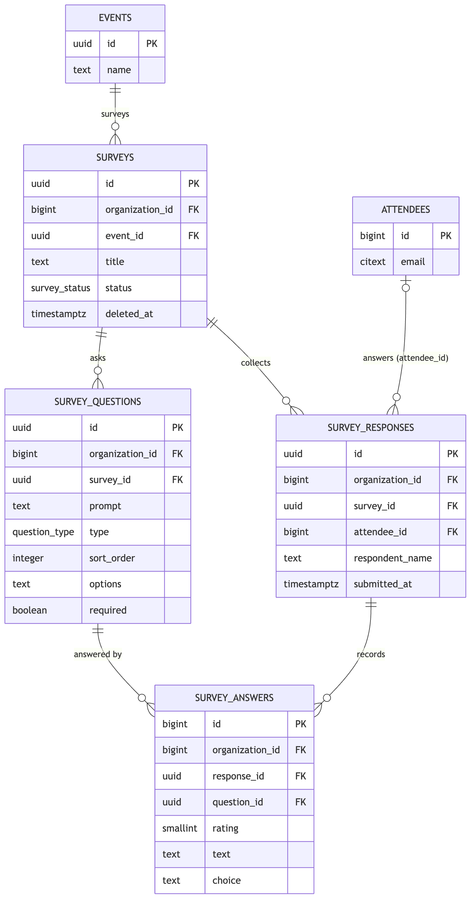

<details>
<summary>Mermaid source</summary>

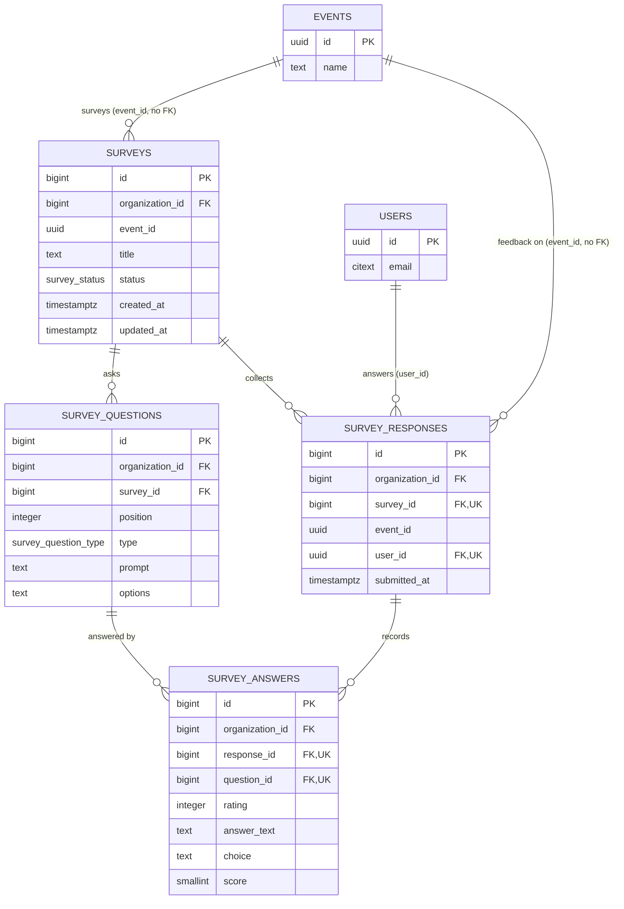
```mermaid
erDiagram
    SURVEYS {
        bigint id PK
        bigint organization_id FK
        uuid event_id
        text title
        survey_status status
        timestamptz created_at
        timestamptz updated_at
    }
    SURVEY_QUESTIONS {
        bigint id PK
        bigint organization_id FK
        bigint survey_id FK
        integer position
        survey_question_type type
        text prompt
        text options
    }
    SURVEY_RESPONSES {
        bigint id PK
        bigint organization_id FK
        bigint survey_id FK,UK
        uuid event_id
        uuid user_id FK,UK
        timestamptz submitted_at
    }
    SURVEY_ANSWERS {
        bigint id PK
        bigint organization_id FK
        bigint response_id FK,UK
        bigint question_id FK,UK
        integer rating
        text answer_text
        text choice
        smallint score
    }
    EVENTS {
        uuid id PK
        text name
    }
    USERS {
        uuid id PK
        citext email
    }

    EVENTS ||--o{ SURVEYS : "surveys (event_id, no FK)"
    EVENTS ||--o{ SURVEY_RESPONSES : "feedback on (event_id, no FK)"
    SURVEYS ||--o{ SURVEY_QUESTIONS : "asks"
    SURVEYS ||--o{ SURVEY_RESPONSES : "collects"
    USERS ||--o{ SURVEY_RESPONSES : "answers (user_id)"
    SURVEY_RESPONSES ||--o{ SURVEY_ANSWERS : "records"
    SURVEY_QUESTIONS ||--o{ SURVEY_ANSWERS : "answered by"
```

</details>

- **Respondents are users, not attendees.** `survey_responses.user_id → users` is
  `NOT NULL` and `CASCADE`, and `uq_survey_responses_person (survey_id, user_id)`
  allows exactly one response per person per survey. The ERD previously drew this
  as a nullable `attendee_id → attendees` link, which made the response look
  anonymous-capable; it is not. Answering requires a signed-in portal user, and
  deleting that user deletes their feedback.
- `survey_answers` normalizes the prototype's flattened rating/text into one row
  per `(response_id, question_id)` (unique). Both `response_id` and `question_id`
  are `CASCADE`: editing a published survey by deleting a question removes the
  answers given to it, so a question is not protected once answered.
- The whole family keys on `bigint identity`, not `uuid` — `surveys`,
  `survey_questions`, `survey_responses` and `survey_answers` all do, and this ERD
  used to draw the first three as `uuid`.
- `survey_questions.options` is a `text[]` array of choice labels, ordered by
  `position`. `events` and `users` are defined elsewhere. Both `event_id` columns
  in this view are **unenforced references** — see
  [Unenforced references](#unenforced-references).

### Meetings

Operational coordination meetings, optionally tied to an event.

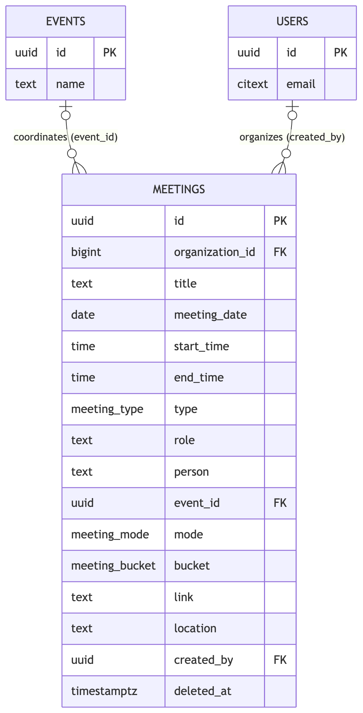

<details>
<summary>Mermaid source</summary>

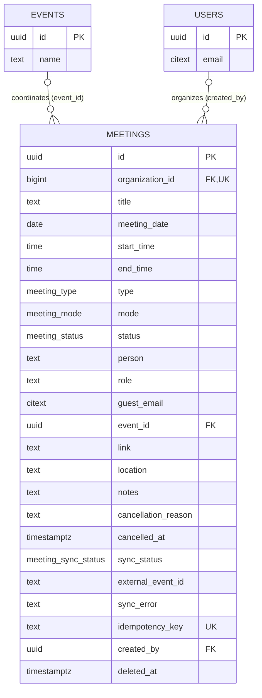
```mermaid
erDiagram
    MEETINGS {
        uuid id PK
        bigint organization_id FK,UK
        text title
        date meeting_date
        time start_time
        time end_time
        meeting_type type
        meeting_mode mode
        meeting_status status
        text person
        text role
        citext guest_email
        uuid event_id FK
        text link
        text location
        text notes
        text cancellation_reason
        timestamptz cancelled_at
        meeting_sync_status sync_status
        text external_event_id
        text sync_error
        text idempotency_key UK
        uuid created_by FK
        timestamptz deleted_at
    }
    EVENTS {
        uuid id PK
        text name
    }
    USERS {
        uuid id PK
        citext email
    }

    EVENTS |o--o{ MEETINGS : "coordinates (event_id)"
    USERS |o--o{ MEETINGS : "organizes (created_by)"
```

</details>

- `meetings.event_id` is nullable (`SET NULL`) — event-agnostic meetings are
  allowed. `created_by → users` is `SET NULL`. `events`, `users` defined elsewhere.
- **`status` is the persisted lifecycle, `bucket` was never a column.** The ERD
  used to draw `meeting_bucket bucket`; the table carries
  `status meeting_status` (`scheduled`, `cancelled`) with `cancelled_at` and
  `cancellation_reason` beside it. The upcoming/past "bucket" the organizer UI
  groups by is derived from `meeting_date` at read time, exactly as
  [Design notes](#design-notes) says derived values should be.
- `sync_status`, `external_event_id` and `sync_error` track the one-way push to the
  organizer's external calendar; `idempotency_key`, unique per organization, keeps
  a retried create from booking the same slot twice.

### System & Audit

The append-only, immutable security/finance audit trail.

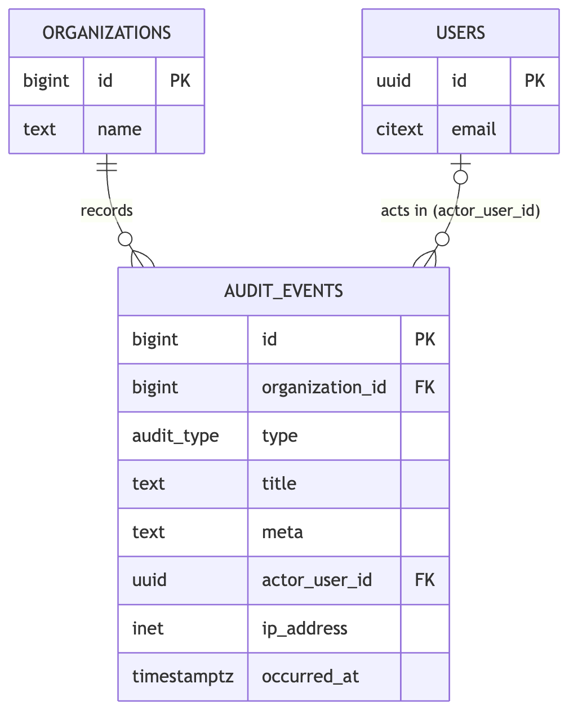

<details>
<summary>Mermaid source</summary>

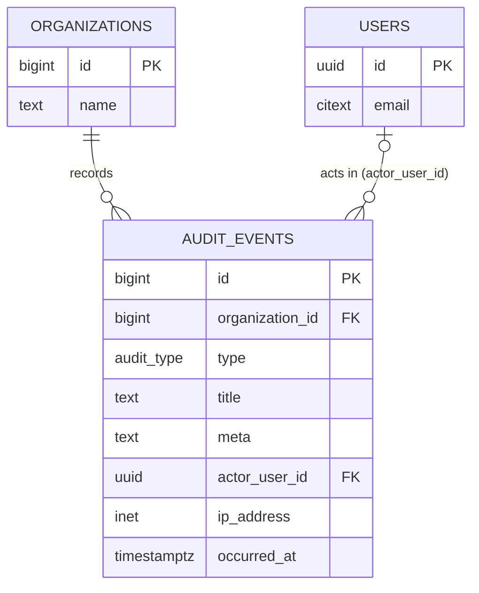
```mermaid
erDiagram
    AUDIT_EVENTS {
        bigint id PK
        bigint organization_id FK
        audit_type type
        text title
        text meta
        uuid actor_user_id FK
        inet ip_address
        timestamptz occurred_at
    }
    ORGANIZATIONS {
        bigint id PK
        text name
    }
    USERS {
        uuid id PK
        citext email
    }

    ORGANIZATIONS ||--o{ AUDIT_EVENTS : "records"
    USERS |o--o{ AUDIT_EVENTS : "acts in (actor_user_id)"
```

</details>

- `audit_events` is never soft- or hard-deleted. Its `organization_id` FK is
  uniquely `ON DELETE RESTRICT` (the trail must survive), and `actor_user_id` is
  `SET NULL` (anonymous or failed sign-ins have no actor).

### Platform & Infrastructure

The Platform bounded context: the transactional `outbox_events` relay that
publishes domain events to RabbitMQ, the short-lived `seat_holds` that reserve
inventory during checkout, and the inbound `webhook_events` log for
signature-verified, idempotent provider callbacks. `outbox_events` and
`webhook_events` are high-volume, append-mostly infrastructure logs.

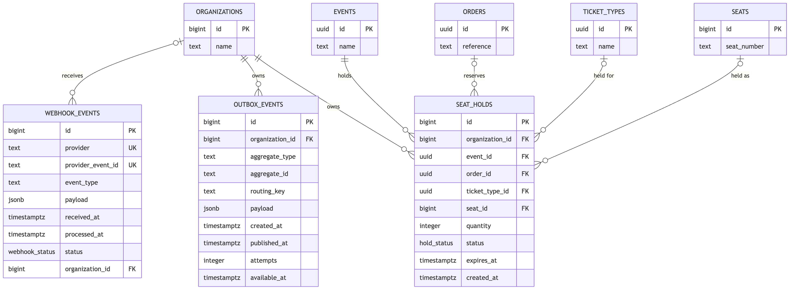

<details>
<summary>Mermaid source</summary>

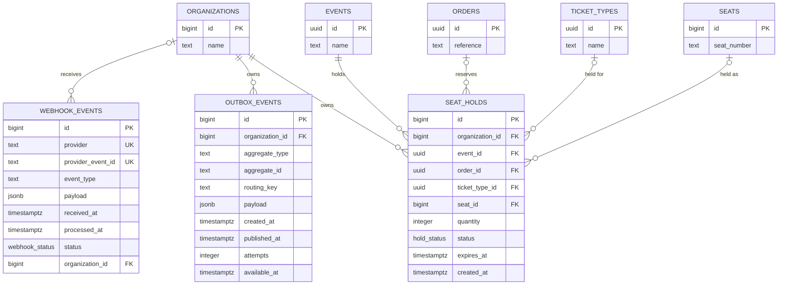
```mermaid
erDiagram
    OUTBOX_EVENTS {
        bigint id PK
        bigint organization_id FK
        text aggregate_type
        text aggregate_id
        text routing_key
        jsonb payload
        timestamptz created_at
        timestamptz published_at
        integer attempts
        timestamptz available_at
    }
    SEAT_HOLDS {
        bigint id PK
        bigint organization_id FK
        uuid event_id FK
        uuid order_id FK
        uuid ticket_type_id FK
        bigint seat_id FK
        integer quantity
        hold_status status
        timestamptz expires_at
        timestamptz created_at
    }
    WEBHOOK_EVENTS {
        bigint id PK
        text provider UK
        text provider_event_id UK
        text event_type
        jsonb payload
        timestamptz received_at
        timestamptz processed_at
        webhook_status status
        bigint organization_id FK
    }
    ORGANIZATIONS {
        bigint id PK
        text name
    }
    EVENTS {
        uuid id PK
        text name
    }
    ORDERS {
        uuid id PK
        text reference
    }
    TICKET_TYPES {
        uuid id PK
        text name
    }
    SEATS {
        bigint id PK
        text seat_number
    }

    ORGANIZATIONS ||--o{ OUTBOX_EVENTS : "owns"
    ORGANIZATIONS ||--o{ SEAT_HOLDS : "owns"
    ORGANIZATIONS |o--o{ WEBHOOK_EVENTS : "receives"
    EVENTS ||--o{ SEAT_HOLDS : "holds"
    ORDERS |o--o{ SEAT_HOLDS : "reserves"
    TICKET_TYPES |o--o{ SEAT_HOLDS : "held for"
    SEATS |o--o{ SEAT_HOLDS : "held as"
```

</details>

- `outbox_events` is written in the same transaction as its aggregate change; a
  relay polls the partial `ix_outbox_unpublished` index and publishes to RabbitMQ,
  then stamps `published_at` (with `attempts`/`available_at` driving backoff).
  `organization_id` is `CASCADE`.
- `seat_holds` is a short-lived checkout reservation; the partial unique
  `uq_seat_hold_active (seat_id) WHERE status = 'active'` permits at most one active
  hold per seat, and an expiry sweeper releases rows past `expires_at`.
  `event_id`/`ticket_type_id`/`seat_id` are `CASCADE`; `order_id` is `SET NULL`
  (a hold may be cart-only). `events`, `orders`, `ticket_types`, `seats` are defined
  in their own views.
- `webhook_events` gives exactly-once processing via
  `UNIQUE (provider, provider_event_id)`; its nullable `organization_id` is the
  resolved tenant (`SET NULL`).

---

## Relationship matrix

One row per **enforced foreign-key constraint**, read back from `pg_constraint`.
Parent→child is the FK direction (for attribution edges such as
`refunds.issued_by` or `meetings.created_by`, the FK owner is the child).
Cardinality is the crow's-foot pair as drawn in the diagrams: the parent end is
`|o` when the FK column is nullable and `||` when it is `NOT NULL`, and the child
end is `o|` when a single-column unique index makes the child at-most-one.
**Identifying?** = existential ownership (composition/junction = Yes; optional or
merely-referential = No).

Rows 1–10 cover the tenant `organization_id` fan, which is 50 of the 129
constraints and would otherwise swamp the table; rows 11–89 are the remaining 79
constraints, one row each; rows 90–96 are the conceptual many-to-many edges that
junction tables resolve. The six **unenforced** reference columns are not foreign
keys and are tabulated separately below.

| # | Parent | Child | Cardinality | FK column | On delete | Identifying? |
|---|---|---|---|---|---|---|
| 1 | organizations | users | `\|\|--o{` | users.organization_id | CASCADE | No |
| 2 | organizations | memberships | `\|\|--o{` | memberships.organization_id | CASCADE | Yes |
| 3 | organizations | roles | `\|\|--o{` | roles.organization_id | CASCADE | No |
| 4 | organizations | api_keys | `\|\|--o{` | api_keys.organization_id | CASCADE | No |
| 5 | organizations | events | `\|\|--o{` | events.organization_id | CASCADE | No |
| 6 | organizations | orders | `\|\|--o{` | orders.organization_id | CASCADE | No |
| 7 | organizations | payment_credentials | `\|\|--o{` | payment_credentials.organization_id | CASCADE | No |
| 8 | organizations | audit_events | `\|\|--o{` | audit_events.organization_id | RESTRICT | No |
| 9 | organizations | webhook_events | `\|o--o{` | webhook_events.organization_id | SET NULL | No |
| 10 | organizations | *(all 50 tenant-scoped tables)* | `\|\|--o{` — except `\|\|--o\|` for payment_settings (`UNIQUE (organization_id)`) | `organization_id` | CASCADE (RESTRICT for audit_events, SET NULL for webhook_events) | No |
| 11 | attendees | check_ins | `\|o--o{` | check_ins.attendee_id | SET NULL | No |
| 12 | attendees | orders | `\|o--o{` | orders.attendee_id | SET NULL | No |
| 13 | attendees | tickets | `\|o--o{` | tickets.attendee_id | SET NULL | No |
| 14 | categories | events | `\|o--o{` | events.category_id | SET NULL | No |
| 15 | discount_codes | discount_redemptions | `\|\|--o{` | discount_redemptions.discount_code_id | RESTRICT | Yes |
| 16 | discount_codes | orders | `\|o--o{` | orders.discount_code_id | SET NULL | No |
| 17 | events | check_ins | `\|\|--o{` | check_ins.event_id | RESTRICT | No |
| 18 | events | discount_codes | `\|o--o{` | discount_codes.event_id | CASCADE | No |
| 19 | events | event_faqs | `\|\|--o{` | event_faqs.event_id | CASCADE | Yes |
| 20 | events | event_highlights | `\|\|--o{` | event_highlights.event_id | CASCADE | Yes |
| 21 | events | event_invitations | `\|\|--o{` | event_invitations.event_id | CASCADE | Yes |
| 22 | events | invoices | `\|\|--o{` | invoices.event_id | RESTRICT | No |
| 23 | events | meetings | `\|o--o{` | meetings.event_id | SET NULL | No |
| 24 | events | orders | `\|\|--o{` | orders.event_id | RESTRICT | No |
| 25 | events | payments | `\|\|--o{` | payments.event_id | RESTRICT | No |
| 26 | events | payouts | `\|o--o{` | payouts.event_id | SET NULL | No |
| 27 | events | saved_events | `\|\|--o{` | saved_events.event_id | CASCADE | Yes |
| 28 | events | scan_attempts | `\|\|--o{` | scan_attempts.event_id | RESTRICT | No |
| 29 | events | scan_attempts | `\|o--o{` | scan_attempts.ticket_event_id | SET NULL | No |
| 30 | events | seat_holds | `\|\|--o{` | seat_holds.event_id | CASCADE | Yes |
| 31 | events | seat_maps | `\|\|--o\|` | seat_maps.event_id (UK) | CASCADE | Yes |
| 32 | events | sessions | `\|\|--o{` | sessions.event_id | CASCADE | Yes |
| 33 | events | speakers | `\|\|--o{` | speakers.event_id | CASCADE | Yes |
| 34 | events | ticket_types | `\|\|--o{` | ticket_types.event_id | CASCADE | Yes |
| 35 | events | tickets | `\|\|--o{` | tickets.event_id | RESTRICT | No |
| 36 | landing_templates | events | `\|o--o{` | events.landing_template_id | SET NULL | No |
| 37 | order_items | tickets | `\|\|--o{` | tickets.order_item_id | CASCADE | Yes |
| 38 | orders | discount_redemptions | `\|\|--o{` | discount_redemptions.order_id | CASCADE | Yes |
| 39 | orders | invoices | `\|\|--o{` | invoices.order_id | RESTRICT | No |
| 40 | orders | order_items | `\|\|--o{` | order_items.order_id | CASCADE | Yes |
| 41 | orders | payments | `\|\|--o{` | payments.order_id | RESTRICT | No |
| 42 | orders | refunds | `\|\|--o{` | refunds.order_id | RESTRICT | No |
| 43 | orders | seat_holds | `\|o--o{` | seat_holds.order_id | SET NULL | No |
| 44 | orders | tickets | `\|\|--o{` | tickets.order_id | CASCADE | Yes |
| 45 | payments | payout_items | `\|\|--o\|` | payout_items.payment_id (UK) | RESTRICT | Yes |
| 46 | payments | refunds | `\|\|--o{` | refunds.payment_id | RESTRICT | No |
| 47 | payouts | payout_items | `\|\|--o{` | payout_items.payout_id | CASCADE | Yes |
| 48 | permissions | role_permissions | `\|\|--o{` | role_permissions.permission_key | RESTRICT | Yes |
| 49 | roles | memberships | `\|\|--o{` | memberships.role_id | RESTRICT | No |
| 50 | roles | role_permissions | `\|\|--o{` | role_permissions.role_id | CASCADE | Yes |
| 51 | seat_maps | seats | `\|\|--o{` | seats.seat_map_id | CASCADE | Yes |
| 52 | seats | seat_assignments | `\|\|--o{` | seat_assignments.seat_id | RESTRICT | Yes |
| 53 | seats | seat_holds | `\|o--o{` | seat_holds.seat_id | CASCADE | No |
| 54 | sessions | session_speakers | `\|\|--o{` | session_speakers.session_id | CASCADE | Yes |
| 55 | speakers | session_speakers | `\|\|--o{` | session_speakers.speaker_id | CASCADE | Yes |
| 56 | survey_questions | survey_answers | `\|\|--o{` | survey_answers.question_id | CASCADE | Yes |
| 57 | survey_responses | survey_answers | `\|\|--o{` | survey_answers.response_id | CASCADE | Yes |
| 58 | surveys | survey_questions | `\|\|--o{` | survey_questions.survey_id | CASCADE | Yes |
| 59 | surveys | survey_responses | `\|\|--o{` | survey_responses.survey_id | CASCADE | Yes |
| 60 | ticket_types | order_items | `\|\|--o{` | order_items.ticket_type_id | RESTRICT | No |
| 61 | ticket_types | seat_holds | `\|o--o{` | seat_holds.ticket_type_id | CASCADE | No |
| 62 | ticket_types | seats | `\|o--o{` | seats.ticket_type_id | SET NULL | No |
| 63 | ticket_types | tickets | `\|\|--o{` | tickets.ticket_type_id | RESTRICT | No |
| 64 | tickets | check_ins | `\|\|--o\|` | check_ins.ticket_id (UK) | CASCADE | Yes |
| 65 | tickets | scan_attempts | `\|o--o{` | scan_attempts.ticket_id | SET NULL | No |
| 66 | tickets | seat_assignments | `\|\|--o\|` | seat_assignments.ticket_id (UK) | CASCADE | Yes |
| 67 | two_factors | recovery_codes | `\|\|--o{` | recovery_codes.two_factor_id | CASCADE | Yes |
| 68 | users | announcements | `\|o--o{` | announcements.cancelled_by_user_id | SET NULL | No |
| 69 | users | announcements | `\|o--o{` | announcements.sent_by_user_id | SET NULL | No |
| 70 | users | api_keys | `\|\|--o{` | api_keys.created_by | RESTRICT | No |
| 71 | users | audit_events | `\|o--o{` | audit_events.actor_user_id | SET NULL | No |
| 72 | users | auth_sessions | `\|\|--o{` | auth_sessions.user_id | CASCADE | Yes |
| 73 | users | check_ins | `\|o--o{` | check_ins.checked_in_by | SET NULL | No |
| 74 | users | event_invitations | `\|o--o{` | event_invitations.invited_by | SET NULL | No |
| 75 | users | events | `\|o--o{` | events.created_by | SET NULL | No |
| 76 | users | invoices | `\|o--o{` | invoices.voided_by | SET NULL | No |
| 77 | users | meetings | `\|o--o{` | meetings.created_by | SET NULL | No |
| 78 | users | memberships | `\|\|--o{` | memberships.user_id | CASCADE | Yes |
| 79 | users | notification_preferences | `\|\|--o{` | notification_preferences.user_id | CASCADE | Yes |
| 80 | users | notification_reads | `\|\|--o{` | notification_reads.user_id | CASCADE | Yes |
| 81 | users | orders | `\|o--o{` | orders.created_by | SET NULL | No |
| 82 | users | orders | `\|o--o{` | orders.decided_by | SET NULL | No |
| 83 | users | orders | `\|o--o{` | orders.offered_by | SET NULL | No |
| 84 | users | refunds | `\|\|--o{` | refunds.issued_by | RESTRICT | No |
| 85 | users | saved_events | `\|\|--o{` | saved_events.user_id | CASCADE | Yes |
| 86 | users | scan_attempts | `\|o--o{` | scan_attempts.scanned_by | SET NULL | No |
| 87 | users | social_identities | `\|\|--o{` | social_identities.user_id | CASCADE | Yes |
| 88 | users | survey_responses | `\|\|--o{` | survey_responses.user_id | CASCADE | Yes |
| 89 | users | two_factors | `\|\|--o\|` | two_factors.user_id (UK) | CASCADE | Yes |
| 90 | roles ⇄ permissions | role_permissions | `}o--o{` | junction role_permissions | CASCADE / RESTRICT | Yes |
| 91 | users ⇄ organizations | memberships | `}o--o{` | junction memberships | CASCADE | Yes |
| 92 | sessions ⇄ speakers | session_speakers | `}o--o{` | junction session_speakers | CASCADE | Yes |
| 93 | discount_codes ⇄ orders | discount_redemptions | `}o--o{` | junction discount_redemptions | RESTRICT / CASCADE | Yes |
| 94 | seats ⇄ tickets | seat_assignments | `}o--o{` | junction seat_assignments | RESTRICT / CASCADE | Yes |
| 95 | payments ⇄ payouts | payout_items | `}o--o{` | junction payout_items | RESTRICT / CASCADE | Yes |
| 96 | users ⇄ events | saved_events | `}o--o{` | junction saved_events | CASCADE | Yes |

> **Note on rows 90–96.** These are the *conceptual* M:N edges; each is physically
> realized by its junction table's two constituent foreign keys, which also appear
> as their own numbered rows (e.g. 48+50 realize 90; 85+27 realize 96). The
> `On delete` column lists the two junction-arm behaviors.

> **Note on row 10 — one cardinality exception.** Row 10 carves out exceptions for
> `ON DELETE` behaviour, but the tenant fan is not uniform in *cardinality*
> either. `payment_settings` is the only one of the 50 tenant-scoped tables whose
> `organization_id` carries a single-column `UNIQUE` index
> (`uq_payment_settings_org`), so an organization has **at most one**
> `payment_settings` row: that edge is `||--o|`, a 1:1, not the `||--o{` 1:N every
> other tenant table gets. The diagrams already draw it that way
> (`ORGANIZATIONS ||--o| PAYMENT_SETTINGS : "configures"` in the Master ERD and in
> *Organization & Settings*). Its near-namesakes are genuinely 1:N and are **not**
> exceptions: `payment_credentials` (row 7) is unique on
> `(organization_id, mode)`, one credential row per live/test mode, and
> `payment_method_settings` on `(organization_id, method)`, one row per enabled
> method. That composite shape is the general case — every other unique index
> touching an `organization_id` in this schema is composite
> (`uq_memberships_org_user`, `uq_orders_org_reference`, `uq_invoices_org_number`,
> `uq_events_org_slug`, …), which constrains a natural key *within* a tenant and
> leaves the tenant edge 1:N. `uq_payment_settings_org` is the single exception,
> so `payment_settings` is the schema's only 1:1 with `organizations`.

<a id="unenforced-references"></a>
### Unenforced references

Six columns hold another table's `id` and are joined on by the application, but
carry **no foreign-key constraint**. This is a data-integrity gap, not only a
drawing problem: PostgreSQL will accept an `event_id` that names no event, and
nothing cascades or nulls these columns when the parent row goes away, so the
orphans are silent. They are drawn in the diagrams with `(no FK)` on the label.

| Child column | Intended parent | Null? | What is missing |
|---|---|---|---|
| `announcements.event_id` | `events.id` | NOT NULL | No constraint; a broadcast can outlive or precede its event |
| `surveys.event_id` | `events.id` | NOT NULL | No constraint; the survey→event link is application-only |
| `survey_responses.event_id` | `events.id` | NOT NULL | No constraint; denormalized from `surveys`, and nothing keeps the two agreeing |
| `message_deliveries.event_id` | `events.id` | nullable | No constraint; the send log's only link to the domain |
| `event_message_runs.event_id` | `events.id` | NOT NULL | No constraint, although `uq_event_message_runs (event_id, kind)` indexes it |
| `users.attendee_id` | `attendees.id` | nullable | No constraint; the portal-persona link can dangle |

Five of the six point at `events.id`, and all five sit in the messaging and survey
tables — the newest areas of the schema. The pattern suggests these tables were
added without the `REFERENCES` clause their siblings carry rather than for any
deliberate reason, so adding the constraints (after a one-off orphan sweep) is the
obvious follow-up. Deciding that is a schema change and therefore out of scope for
this document; recording it is not.

---

## Design notes

<a id="which-document-governs"></a>
### Which document describes the schema

**Answered.** Earlier revisions of this section recorded a genuine conflict: the
repository guide named the design catalog [entities.md](entities.md) the schema
**source of truth** and called this ERD *derived from it*, while this ERD's own
Derivation note claimed the database wins. Both could not govern, and the
disagreement was left open here because it was a decision for whoever owned those
files, not a fact readable out of `pg_catalog`.

`CLAUDE.md` (*Architecture is layered*) now settles it, and the ruling is not that
one document beat the other:

- **The live PostgreSQL schema is the reference for the data model.** Where a
  document and the database disagree, the database wins and **the document is what
  gets corrected** — which is the licence this pass and the one before it acted on.
- **`entities.md` and `erd.md` both *describe* that schema**, in different
  registers. This ERD is read back from `information_schema.columns` and
  `pg_constraint` and answers *what exists*. The catalog stays the **data
  dictionary** and is the only place a reader learns *why* a table exists.
- **A shipped table therefore needs an entry in both.** Neither document is
  derived from the other, and neither is a target the other is behind.

**What that changes in practice.** The old framing made a count difference look
like a contradiction to be adjudicated, so drift could sit unresolved while the
two documents disagreed in public. Under the new rule a difference is simply a
defect in whichever document is behind, with a known fix: read the database and
correct the document. Counts are measured, never copied between documents — the
57 in this file was taken from `pg_catalog`, and so was every figure derived from
it.

**The drift that remains is one-directional and in the catalog's column.** One
catalogued entity, `notifications`, describes a table the database does not have
(see [Designed but not built](#designed-but-not-built)); whether it is still a
target or abandoned is a product decision and not something this ERD can read. In
the other direction, tables shipped ahead of their catalog entries are now a
correction task rather than an open question. Do not take any list of them from
this document — it is a snapshot that goes stale on the next migration. Measure it:

```sh
docker exec eventa-postgres-1 psql -U eventa -d eventa -At -c \
  "SELECT table_name FROM information_schema.tables
    WHERE table_schema='public' AND table_type='BASE TABLE' ORDER BY table_name;"
```

and check each name against both documents. `scan_attempts` was the newest such
table when this pass ran; see [The 57th table](#the-57th-table).

<a id="designed-but-not-built"></a>
### Designed but not built

These are the places where the design catalog describes something the database
does not have. They are listed rather than deleted because each one is a product
capability a reader could reasonably assume exists — a reader who sees
"`announcements.audience`" in a diagram will go looking for audience targeting and
find nothing. Eleven columns and one whole entity fall in this class — three
columns fewer than before migration `0068`, which built the failed-scan capability
on a new table instead and moved it out of this list into the remodels below.

| Designed | Status in the database | What the product therefore cannot do |
|---|---|---|
| `notifications` entity (`kind`, `icon`, `title`, `body`, `unread`) | **No such table.** Only `notification_reads` (a per-member `read_at` watermark) and `notification_preferences` (per-category channel opt-ins) exist | No stored notification rows, so no per-item read state, no notification history, and no server-side rendering of an inbox — the feed must be re-derived from domain activity on every request |
| `announcements.audience`, `announcements.channels` | Columns absent; the `announcement_audience` and `channel` enums were never created either | An announcement cannot be targeted at a subset of attendees, and cannot choose SMS — every announcement is email to everyone |
| `announcements.deleted_at` | Absent; `cancelled_at` + `cancelled_by_user_id` were built instead | No soft delete; withdrawing a scheduled announcement is a cancellation, which is the better model and should be folded back into the catalog |
| `message_deliveries.recipient_attendee_id`, `.order_id`, `.announcement_id`, `.message_template_id` | All four absent | **A delivery cannot be traced to its cause.** There is no join from a send back to the announcement or template that produced it, the order it confirmed, or the attendee CRM row it went to — only a bare `recipient_email`. The `CHECK` that "exactly one source is set" cannot exist because no source column does |
| `message_deliveries.provider_message_id` | Absent | No way to reconcile a send against the email provider's own record, so bounces and complaints cannot be matched back |
| `survey_questions.required` | Absent | No question can be made mandatory; completeness must be enforced in the client, where it can be bypassed |
| `survey_responses.respondent_name` | Absent; `user_id` is `NOT NULL` | Responses are never anonymous and never from a non-user — the catalog's "optionally anonymous" survey does not exist |
| `surveys.deleted_at` | Absent | Surveys are hard-deleted or not deleted; there is no recoverable archive, and deleting one cascades its questions, responses and answers away |

Two further differences are **remodels**, not gaps — the capability exists, but not
where or how the catalog drew it, so looking for the designed column still fails.

- **Failed scans.** The catalog puts them on `check_ins` as `scanned_qr`, `state`
  (`scan_state`) and `other_event_id`. Those three columns do not exist and will
  not be added: `uq_check_ins_ticket` is a `UNIQUE` on `ticket_id` alone and is the
  concurrency guarantee of the door, and a refusal is neither unique per ticket nor
  guaranteed to have a ticket at all, so the designed shape would have cost that
  constraint. Migration `0068` built the capability as a separate append-only
  ledger, `scan_attempts`, with `outcome` carrying the `scan_outcome` enum,
  `ticket_event_id` standing in for `other_event_id`, and one deliberate
  divergence: `token_fingerprint` stores a SHA-256 digest where the catalog asked
  for the raw `scanned_qr`, because the raw value is a bearer credential. Door
  incidents are reportable; the designed columns are not the way in. See
  [Attendance & Check-in](#attendance--check-in) and
  [The 57th table](#the-57th-table).
- **Survey respondents.** The catalog gives `survey_responses` a nullable
  `attendee_id → attendees`; the table has a `NOT NULL` `user_id → users`. The
  parent changed, so the old edge was removed rather than renamed.

<a id="what-this-pass-changed"></a>
### What the 56-table pass changed in the diagrams and the counts

*This records the pass that moved the document from 53 to 56. The 57th table
arrived afterwards and is recorded in the next subsection.*

**The diagrams and the counts in this document were brought onto the live schema
in the same pass that produced the notes above.** Three entities the Mermaid
source had never drawn — `notification_reads`, `payment_credentials` and
`event_invitations` — were added, each to the [Master ERD](#master-erd) and to
the one domain view it belongs in (`payment_credentials` to *Organization &
Settings*; the other two to *Engagement & Messaging*). **Nine** of the rendered
diagrams in [`erd/`](erd/) were re-rendered from the updated source over that
pass — the ones the new entities, the renames below and the corrected
cardinalities appear in. The entity count was moved off the catalog's **53**
target and onto the **56** measured in the database, at the five statements that
carried the old `53 tables / 46 tenant-scoped` pair: the *Measured scale*
headline at the top, the tenancy-edge line under
[How to read this ERD](#how-to-read-this-erd),
the [Master ERD](#master-erd) preamble, row 10 of the
[Relationship matrix](#relationship-matrix), and the multi-tenancy paragraph
under [Normalization (3NF)](#normalization-3nf).

**Why that is recorded here rather than left to the history.** The commit
carrying those changes (`18bf34d`) describes them incorrectly: its message
states that no Mermaid source changed, that no diagram therefore needed
re-rendering, and that no count was changed. All three are false of that same
commit — it is the one that added the three entities, re-rendered the nine
diagrams and moved the counts. That message is already published, and rewriting
released history to fix a description is not worth the cost, so the record is
corrected in the document a reader actually opens. **Only the description was
wrong; nothing above needs changing as a result.** The content was re-verified
against the live schema when that pass ran — 56 tables, 49 of them carrying
`organization_id`, 124 enforced foreign-key constraints. Those three figures were
correct that day and are **superseded**: migration `0068` landed afterwards and
every count in this document now reads 57 / 50 / 129. They are left here as the
record of what that pass measured, not as current figures.

**One derived artifact is still behind.** That pass edited Mermaid fences without
regenerating the `erd.tldr` companion, which the repository guide flags as an
artifact that goes stale silently; the three entities above are therefore missing
from the canvas file, and `scan_attempts` now with them. The Markdown here stays
the source of truth, so the `.tldr` should be regenerated rather than
hand-reconciled.

<a id="the-57th-table"></a>
### The 57th table — `scan_attempts`

**Why a reader arriving at a 57th table finds one more than the pass above left.**
Migration `0068_scan_attempts.sql` was applied after that reconciliation, so this
document went from correct to one table short without anything in it changing. The
table is real and applied; the API code that writes it was still uncommitted when
this pass ran, which is a reason to document the table and no reason to leave it
out of the diagrams.

**It exists because a refused scan at the door left no trace.** Migration `0039`
created the `scan_outcome` enum — `admitted`, `already_checked_in`, `invalid`,
`wrong_event`, `cancelled` — and then gave it no column. A query for
`information_schema.columns WHERE udt_name = 'scan_outcome'` returned zero rows
for twenty-nine migrations. Earlier revisions of this document called that orphan
enum "the clearest evidence this was built halfway", and it was: a bad QR, a pass
for another event, or a refunded ticket turned away at the gate produced no row
anywhere, so there was no count, nothing to settle a disputed entry with, and **no
way to tell a quiet night from a scanner that had stopped working**. `0068` is
where that enum finally lands.

**Why a new table and not columns on `check_ins`.** The design asked for the
failed-scan half as `check_ins.scanned_qr`, `.state` and `.other_event_id`, and
that shape is unbuildable without giving up `uq_check_ins_ticket` — the
single-column `UNIQUE` on `ticket_id` that makes two staff scanning one code
resolve to one admission. A refusal is not one row per ticket, and an unknown code
has no ticket at all. The reasoning is set out in full under
[Attendance & Check-in](#attendance--check-in) and in the migration's own header;
the short version is that `check_ins` is the state of the room and
`scan_attempts` is the history of the door, and the two were conflated in the
design.

**What moved in this document.** `SCAN_ATTEMPTS` was added to the
[Master ERD](#master-erd) and to the *Attendance & Check-in* domain view, the one
context it belongs in, with its columns, keys and foreign keys read from
`information_schema.columns` and `pg_constraint`. Four foreign-key rows were added
to the [Relationship matrix](#relationship-matrix) — 28 and 29
(`events`, via `event_id` and `ticket_event_id`), 65 (`tickets`) and 86 (`users`) —
and because the matrix is numbered sequentially, **every row from 28 onward shifted
and the three cross-references into it were repointed** (rows 48+50 realize 90;
rows 85+27 realize 96; the `saved_events` note in
[How to read this ERD](#how-to-read-this-erd) now names rows 96, 27 and 85). Each
count was re-measured against `pg_constraint` rather than incremented: **57**
tables, **50** carrying `organization_id`, **129** enforced foreign keys, at the
*Measured scale* headline, the tenancy-edge line, the
[Master ERD](#master-erd) preamble, the matrix preamble, row 10 and both notes
below the matrix, and the multi-tenancy paragraph under
[Normalization (3NF)](#normalization-3nf). The seven tables with no tenant column
are unchanged — `scan_attempts` carries `organization_id`, so it joins the fan.
The two rendered diagrams whose Mermaid changed, `erd/full.png` and
`erd/checkin.png`, were re-rendered in the same pass.

**`erd/eventa-full.drawio` was deliberately not touched.** It is generated from
the live database, and the copy in the repository predates `0068`, so it draws 56
entities and 124 edges. Hand-patching one table into a generated file would
destroy the only thing that makes it useful — that it is an independent reading of
the schema rather than a second copy of this diagram. It needs regenerating; that
is recorded in the [Master ERD](#master-erd) preamble so a reader comparing the two
is not misled in the meantime.

### Renames the diagrams had missed

Ten drawn columns existed under a different name. These were corrected in place —
the relationship and the meaning are unchanged, only the identifier:
`check_ins.scanned_at` → `checked_in_at`, `check_ins.scanned_by` →
`checked_in_by`, `check_ins.device_label` → `station_id`, `meetings.bucket` →
`status`, `survey_questions.sort_order` → `position`, `survey_answers.text` →
`answer_text`, `announcements.title` → `subject`, `announcements.recipients` →
`recipient_count`, `announcements.created_by` → `sent_by_user_id`, and
`message_deliveries.type` → `kind`.

Alongside them, five entities were drawn with the wrong key type: `surveys`,
`survey_questions`, `survey_responses`, `announcements` and `message_deliveries`
are all `bigint identity`, not `uuid`.

### Normalization (3NF)

Every non-key attribute depends on the whole key and
nothing but the key. Repeating groups are extracted into child tables
(`order_items`, `survey_questions`, `seats`), and every many-to-many is resolved
by an associative table rather than an array column: `role_permissions`,
`memberships`, `session_speakers`, `discount_redemptions`, `seat_assignments`,
`payout_items`, `saved_events`. Derived/reporting values named in the catalog
(`ticket_types.soldout`/`revenue`, `attendees.events_count`, `speakers.rating`,
survey aggregates, the meeting upcoming/past bucket, `events.bucket`) are
**computed at read time**, not stored as duplicated fact — the few stored counters
(`ticket_types.sold`, `discount_codes.used`) are guarded atomic denormalizations
kept for hot-path booking checks, with `CHECK` constraints
(`sold BETWEEN 0 AND total`).

One documented exception: `events.bucket` *is* a stored `event_bucket` column
(`active`, `completed`), not a read-time derivation.

**Multi-tenancy via `organization_id`.** 50 of 57 tables carry
`organization_id … REFERENCES organizations(id)` (NOT NULL except the inbound
`webhook_events` log, whose tenant is resolved after signature verification), and
every read/write is filtered by the caller's org (row-level tenant isolation). The
seven tables with no tenant column are the root `organizations`, the globally-seeded
lookups `permissions` and `landing_templates` (shared across tenants), the
sub-children `recovery_codes`, `role_permissions`, and `session_speakers`
(isolated transitively through their parents), and `saved_events` (isolated by
`user_id` so a personal bookmark list can cross tenant boundaries). Tenant tables cascade from `organizations` on delete, except
`audit_events` (`RESTRICT`, so the compliance trail cannot be dropped) and
`webhook_events` (`SET NULL`).

**Order→ticket commerce model.** The "registration" is modeled as a commerce
**order** (`orders`, `REG-YYYY-NNNNNN`) that is the aggregate root for a booking.
Its `order_items` capture *quantity × ticket_type* with the unit price frozen at
purchase (`unit_price_satang`), and each admitted seat is materialized as one
`tickets` row bearing a signed, globally-unique `qr_token`. Money flows into the
append-only `payments` ledger (idempotency-keyed, exactly-once capture),
reversals into `refunds`, billing into `invoices` (VAT 7%, 14-day terms), and
settlement into `payouts` via `payout_items` (a payment settles in at most one
payout). VAT is captured on the order (`vat_amount_satang`) and re-aggregated into
monthly `tax_periods`.

**Reserved-seating model.** When `events.seating_mode = reserved`, a single
`seat_maps` row (1:1, `UNIQUE (event_id)`) holds the geometry; individual `seats`
carry a `seat_status` lifecycle (`available → held → reserved → sold`/`blocked`)
and an optional tier (`ticket_type_id`). Binding an issued ticket to a physical
seat is the `seat_assignments` junction, whose partial unique index
`uq_seat_active (seat_id) WHERE released_at IS NULL` guarantees at most one *live*
holder per seat while preserving historical assignments (a released seat can be
re-sold), and `UNIQUE (ticket_id)` guarantees one seat per ticket. GA events
simply omit the seat map.

**Money as satang.** All monetary values are stored as `bigint` integer minor
units (1 THB = 100 satang), `>= 0` via `CHECK`, paired with
`currency char(3) DEFAULT 'THB'` — never `float`/`numeric`. `bigint` (not
`integer`) prevents overflow on large payout/tax aggregates. Rates
(`vat_rate 0.0700`, `service_fee_rate 0.0500`) are `numeric(5,4)`; whole-percent
discounts are `smallint`. Display strings are derived at render time
(`format.baht`), never persisted.

**Soft deletes.** Most aggregate roots and user-editable entities carry
`deleted_at timestamptz NULL` and are recovered/filtered logically. The
append-only ledgers — `payments`, `refunds`, `audit_events`, `check_ins`,
`message_deliveries`, `scan_attempts` — deliberately **omit** `deleted_at`: they
are immutable history, and `invoices` reaches the same end through `voided_at`
instead. `check_ins` is the exception that proves the rule: it has no `deleted_at`
yet its rows *are* deleted, because undoing a check-in means the person is not in
the room, and that is exactly why `scan_attempts` exists beside it to keep the
scan itself.
`surveys` and `announcements` have no `deleted_at` either, which is a gap rather
than a decision for `surveys` (see
[Designed but not built](#designed-but-not-built)) and the right model for
`announcements`, where cancellation replaced deletion. `version integer` provides
optimistic concurrency on the tables that carry it (stale writes →
`409 Conflict`); the ledgers and the newer messaging tables do not.

**Indexing strategy.** Beyond every PK and the `organization_id` tenant edge, the
schema carries: uniqueness on natural keys (`uq_orders_org_reference`,
`uq_invoices_org_number`, `uq_payments_org_txn`, `uq_tickets_qr_token`,
`api_keys_keyPrefix_unique`); composite hot-path indexes for tenant-scoped
list/filter screens (`ix_events_org_status`, `ix_orders_status`,
`ix_payments_status`, `ix_invoices_status`, `ix_payouts_status`, and
`ix_tickets_status` on `(event_id, status)`); time-range indexes
(`ix_events_start_at`, `ix_check_ins_feed` on `(event_id, checked_in_at)`,
`ix_audit_events_org_time`); FK-target indexes on every child (`ix_*_event`,
`ix_*_order`, `ix_*_user`); expression indexes over a `search_norm()` helper for
discovery (`ix_events_search_name`/`_city`/`_venue`); and **partial** indexes for
sparse predicates (`ix_auth_sessions_active WHERE revoked_at IS NULL`,
`ix_events_discover WHERE deleted_at IS NULL AND visibility = 'public'`,
`ix_outbox_unpublished WHERE published_at IS NULL`,
`uq_seat_active WHERE released_at IS NULL`,
`uq_invoices_live_order WHERE status <> 'void'`).

**Extensibility.** The schema is intentionally forward-compatible: `roles.is_system`
distinguishes seeded presets from future custom roles; `permissions` is a lookup
so new permission keys extend the enum and seed rows without schema change;
`seat_maps.layout`, `ticket_types.includes`, `speakers.social_links` and
`outbox_events.payload` are JSONB for evolving structure;
`message_templates.channels`/`tags` and `survey_questions.options` are arrays for
new channels, merge tags and choice sets; and `landing_templates` can gain rows for
new public themes. Native PostgreSQL `ENUM`s make new status/kind tokens an
`ALTER TYPE … ADD VALUE` rather than a structural migration — with the caveat that
an enum can also be created and then never wired up, as `scan_outcome` sat from
migration `0039` until `0068` finally gave it a column on `scan_attempts`. Nothing
in PostgreSQL complains about an unused type, so the gap stayed invisible for
twenty-nine migrations. A periodic check for enums no column references is cheap
insurance:

```sql
SELECT t.typname FROM pg_type t
 WHERE t.typtype = 'e'
   AND NOT EXISTS (SELECT 1 FROM pg_attribute a WHERE a.atttypid = t.oid);
```

Run on 2026-10-09 that returns one row — **`member_role`** (`Admin`, `Organizer`,
`Staff`, `Attendee`), which no column uses because `memberships.role` is plain
`text` and the authoritative grant is `memberships.role_id → roles`. So the same
pattern that hid the failed-scan gap is still present once over, though here the
enum looks like a superseded draft rather than an unbuilt feature. Confirming that
is a schema question, not a drawing one, and is out of scope for this document.
