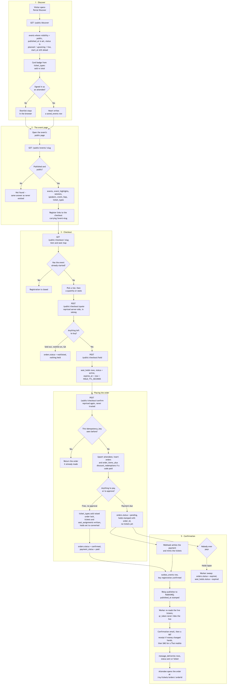
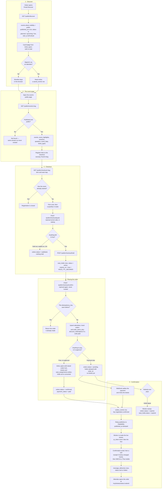

# Discover and register

**Screens:** Portal Discover, Event landing page, Checkout

The attendee's whole funnel, from browsing with no account to holding a ticket. It starts on the public Discover grid, goes through the event's own landing page into checkout, and ends with an order, its `tickets` rows and the confirmation eventa-worker posts. Nothing on this path needs an account, and nothing on it creates one — the attendee persona is separate from the organizer persona, even for the same email address.

1. **Discover.** `GET /public/discover` is anonymous and read-only. It returns `events` rows that pass every part of the public floor: `visibility = 'public'`, `deleted_at IS NULL`, `published_at IS NOT NULL`, `status` in `planned` / `upcoming` / `live`, and `start_at` still in the future — an event already under way is no longer worth discovering. Search matches the event's `name`, `city` or `venue_name` and its `categories.name`, accent- and tone-insensitively, which is what makes Thai titles findable from a Latin keyboard. Each card's urgency badge is read across the whole event rather than one tier: **Waitlist** when every tier is exhausted (`ticket_types.sold >= total`, with `total = 0` meaning unlimited and a `status = 'paused'` tier not counting, because that is the organizer withholding stock rather than demand), **Selling fast** at 90% of the bounded allocation. The "from" price is the cheapest tier a visitor could actually buy, formatted from `price_satang` at the edge; when none remain there is no price, and the card says nothing rather than `฿0`. The heart writes a `saved_events` row when an attendee is signed in, and otherwise keeps the shortlist in the browser, because requiring an account to bookmark something would put a sign-in wall in front of the one page meant to be shareable.
2. **The event page.** A card opens one of the four landing templates; the canonical, shareable address of the same page is `/e/<slug>`. Either way it is one anonymous call, `GET /public/events/:slug`, which resolves the event only when it is published and public — a draft, unlisted or private event is simply "not found", indistinguishable from one that never existed, so the lookup *is* the authorization check. The payload is assembled from `events` plus `event_highlights`, `sessions`, `speakers`, `event_faqs` and `ticket_types`, with the section headings the organizer chose (`events.agenda_title`, `events.speakers_title`). `GET /public/events/:slug/calendar.ics` serves the same event as a calendar file. The **Register** call to action is a link to the checkout carrying `?event=<slug>`.
3. **Checkout.** `GET /public/checkout/:slug` resolves the event the same way and returns its tiers and, for a `seating_mode = 'reserved'` event, its seat map with taken seats greyed out; registration is refused once `events.start_at` has passed. Every change of tier, quantity, seat or discount code re-posts to `/public/checkout/quote`, which writes nothing — the subtotal is `ticket_types.price_satang` times the quantity, the discount is what Discounts quotes for the code, the service fee is charged on the discounted amount and rounded down, and VAT is restated out of the resulting total. All of it is integer satang worked out by the API; the browser only formats. Pressing **Book** calls `/public/checkout/hold`, which inserts `seat_holds` with `status = 'active'` and `expires_at = now + HOLD_TTL_SECONDS` (ten minutes by default): one row carrying `quantity` for general admission, where availability is `total − sold − active held` under a row lock, and one row per `seat_id` for reserved seating, where the partial unique index `uq_seat_hold_active` is what actually stops two buyers holding the same seat. A booking is 1–8 seats. A sold-out tier offers the line instead when `events.waitlist_enabled` is on and the event is general admission — an order with `status = 'waitlisted'` that holds nothing (see [Waitlist](04-waitlist.md)).
4. **Placing the order.** `POST /public/checkout/confirm` re-prices the selection server-side rather than trusting the request, then writes everything in one transaction. An `orders` row already carrying this `idempotency_key` short-circuits the whole thing — `uq_orders_org_idem` is why a double-tapped Confirm returns the first registration instead of placing a second — otherwise the holds are re-read as still `active`, `attendees` is upserted so a repeat buyer updates rather than duplicates, and `orders` is written with a random reference like `ORD-7K2M9QX4`, its satang columns, and `requires_approval` copied from the event as a snapshot so flipping the event's switch later cannot change the deal this buyer made. One `order_items` line follows, plus a `discount_redemptions` row when a code paid off. A free registration on an event needing no decision finishes here: `ticket_types.sold` raised under a `FOR UPDATE` lock, one `tickets` row per admission with its `qr_token`, `seat_assignments` bound to those tickets, holds moved to `'converted'`, and the order at `status = 'confirmed'` / `payment_status = 'paid'` (see [Free registration and confirmation](03-free-registration-and-confirmation.md)). Anything owed is placed as `status = 'pending'` / `payment_status = 'pending'` with its holds stamped with `order_id` and still running down, and deliberately **no `tickets` rows** — nobody holds a QR for something they have not paid for. On an event that requires approval, nothing is ticketed here either: a free registration waits with `approval_requested_at` set and its places already counted, and a paid one starts waiting when the money lands (see [Approval](05-approval.md)).
5. **Confirmation.** Money is only ever confirmed by a signature-verified provider webhook, which settles the payment and mints the tickets in the same transaction that writes the `registration.confirmed` row to `outbox_events` — so "paid", "ticketed" and "told" cannot drift apart (see [Checkout and payment](02-checkout-and-payment.md)). The relay publishes that row to RabbitMQ and stamps `published_at`; eventa-worker consumes it, re-reads the live `tickets` from the database rather than the message — a `qr_token` is a bearer credential and never travels on the bus — and sends the confirmation email, then the itemised VAT receipt when money actually changed hands, then an SMS if the buyer gave a Thai mobile and the workspace has that channel on. Each part is recorded as it is sent, so a redelivery sends only what is still owed, and every send lands a `message_deliveries` row with `status` `sent` or `failed`. The email links to `/my/tickets/orders/:orderId`, which anyone holding the uuid may open: registration never required an account, so reading what you bought must not either. If the buyer never pays, a worker cron sweeping every minute closes orders still `pending` / `pending` and not awaiting a decision whose last hold has lapsed — `orders.status = 'expired'`, `seat_holds.status = 'expired'` — which is how an abandoned checkout gives its seats back. All of these timestamps are UTC in the database and render in Asia/Bangkok on screen.

Mermaid source

[← All flows](README.md)
