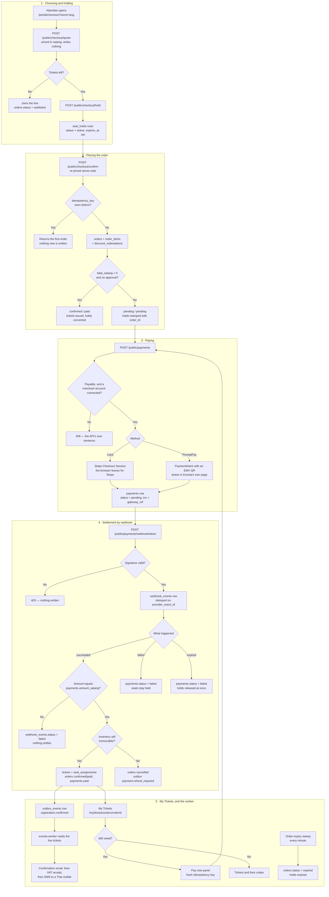

# Checkout and payment

**Screens:** Checkout, Stripe Elements / PromptPay, My Tickets

How an attendee turns a chosen ticket into an admission they can show at the door. It starts on the public checkout page, where nobody needs an account, and ends when the money has settled, the `tickets` rows exist and eventa-worker has posted the confirmation. Free registrations take the same path and simply skip steps 3 and 4.

1. **Choosing and holding.** The attendee lands on `/portal/checkout?event=<slug>`; `GET /public/checkout/:slug` resolves a published, public event and its `ticket_types`. Every change of quantity, seat or discount code re-posts to `/public/checkout/quote`, which writes nothing — the tier's `price_satang` times the quantity is the VAT-inclusive subtotal, the discount is whatever Discounts quotes for the code, the service fee is `floor(discounted × service_fee_rate)`, and VAT is restated out of the resulting total. Every figure is integer satang worked out by the API; the browser only formats it. Pressing **Book** calls `/public/checkout/hold`, which inserts `seat_holds` with `status = 'active'` and `expires_at = now + HOLD_TTL_SECONDS`: one row carrying `quantity` for general admission, one row per `seat_id` for reserved seating, where the partial unique index `uq_seat_hold_active` is what actually stops two buyers holding the same seat. A booking is 1–8 seats, and a tier with too few left is refused in words the buyer can act on ("Only 3 left — please reduce your quantity."). A sold-out tier offers the line instead, writing an order with `status = 'waitlisted'` that holds nothing.
2. **Placing the order.** `POST /public/checkout/confirm` re-prices the selection server-side rather than trusting the request, then does everything in one transaction. An `orders` row already carrying this `idempotency_key` short-circuits the whole thing — `uq_orders_org_idem` is why a double-tapped Confirm returns the first registration instead of placing a second — otherwise the holds are re-read as still `active`, `attendees` is upserted, and `orders` is written with a random reference like `ORD-7K2M9QX4`, the satang columns `subtotal_satang` / `discount_amount_satang` / `vat_amount_satang` / `total_satang`, and `requires_approval` copied from the event as a snapshot so flipping the event's switch later cannot change the deal this buyer made. One `order_items` line is written, plus a `discount_redemptions` row when a code paid off. A free registration on an event that needs no decision is finished here: `status = 'confirmed'`, `payment_status = 'paid'`, `ticket_types.sold` raised under a `FOR UPDATE` lock, one `tickets` row per admission with its `qr_token`, `seat_assignments` bound to those tickets, and the holds moved to `'converted'`. Anything owed is placed as `status = 'pending'`, `payment_status = 'pending'`, with its holds stamped with `order_id` and still running down — and deliberately **no `tickets` rows**, so nobody holds a QR for something they have not paid for. If confirming throws, the web action releases the holds rather than leaving seats locked away.
3. **Paying.** `POST /public/payments` names an order and a method, never an amount: the charge is `orders.total_satang`, read server-side. It is refused with a sentence written for the buyer when the order is already paid, has `status = 'expired'`, is no longer `pending`, costs nothing, or belongs to a workspace whose `payment_settings` row is not `connected` with a real account id — collecting into the platform's own account would take money the organizer could never reach. **Card** opens a Stripe Checkout Session and the browser leaves for Stripe's own page; this app hosts no card field anywhere, and the `payments` row records the session's PaymentIntent as `gateway_ref`. **PromptPay** stays in Eventa's page: Stripe returns an EMV payload, which the browser draws as a QR, and the deadline on it is Eventa's own (`PROMPTPAY_EXPIRY_SECONDS`, anchored to the intent's creation) because Stripe publishes none. Either way a `payments` row is written with `method`, `amount_satang`, `status = 'pending'`, `txn` and `gateway_ref` set to the provider reference, and `gateway_account_id` stamped now so a later refund reverses on the same account. `uq_payments_org_idem` makes a replayed request find its own attempt.
4. **Settlement, which only the webhook decides.** Landing back on the return URL means the buyer finished at the provider, not that money moved. `POST /public/payments/webhook/:token` resolves the workspace from the token in the URL — a callback carries no session, and the signature cannot be checked until we know whose signing secret to check it against — verifies the signature over the raw bytes, and refuses anything unsigned. A `webhook_events` row deduplicated on `(provider, provider_event_id)` makes processing exactly-once across retries and replicas. On `succeeded` the reported amount is compared with `payments.amount_satang`, and a mismatch settles nothing and leaves `webhook_events.status = 'failed'` for a person to look at. Otherwise one transaction locks the `orders` row, raises `ticket_types.sold`, inserts the `tickets` and their `seat_assignments`, moves the holds to `'converted'`, sets `orders.status = 'confirmed'` with `payment_status = 'paid'` and `confirmed_at`, marks the `payments` row `paid` with `paid_at`, and writes the `registration.confirmed` outbox row — so "paid", "ticketed" and "told" cannot drift apart. If the inventory can no longer be honoured (the tier was removed or sold out, a seat went to someone else), the order is cancelled, its holds released, and a `payment.refund_required` outbox row queued instead: money wins over a mere hold, but never over an assigned seat. A second payment settling an already-confirmed order queues the same event with reason `duplicate_payment`. A `failed` callback marks the attempt `failed` and leaves the seats held so the buyer can retry or switch method; an `expired` one (a PromptPay code nobody scanned) releases the holds at once. On an event that requires approval the money lands but no ticket is minted — the order stays `pending` with `approval_requested_at` set, its places counted (see [Approval](05-approval.md)).
5. **My Tickets, and what happens afterwards.** The confirmation links to `/my/tickets/orders/:orderId`, which `GET /public/orders/:orderId` serves to whoever holds the id — registration never required an account, so reading what you bought must not either, and the uuid is the capability. The page shows the order's status, its satang figures formatted at the edge, and each ticket's code; an order still owed shows a countdown to its hold's `expires_at` and a **Pay now** panel that starts a fresh attempt with a new idempotency key, re-polling every five seconds while a PromptPay code is on screen, because a scanned code clears out of band. Meanwhile eventa-worker consumes the `registration.confirmed` outbox row: it reads the live `tickets` from the database rather than from the message — a `qr_token` is a bearer credential and never travels on the bus — and sends the confirmation email, then the itemised VAT receipt when the order was paid and both the message template and the workspace's `email_receipts` preference are on, then an SMS if the buyer gave a Thai mobile. Each part is recorded as it goes, so a redelivery sends only what is still owed. `payment.refund_required` reaches its own handler, which emails the organizer and the buyer but moves no money — a refund needs a real user on `refunds.issued_by`. Finally, a cron in the worker sweeps every minute: orders still `pending` / `pending`, not awaiting a decision, whose last `seat_holds.expires_at` is older than `now − ORDER_EXPIRY_GRACE_MS` become `status = 'expired'` with their holds expired, which is how abandoned checkouts give their seats back. Times in all of these rows are UTC; the screens render them in Asia/Bangkok.

Mermaid source

[← All flows](README.md)
