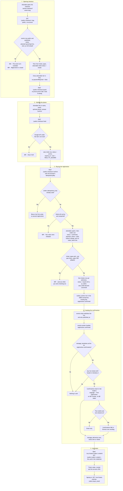

# Free registration and confirmation

**Screens:** Checkout, My Tickets, email and SMS

What happens when an attendee signs up for an event whose ticket costs nothing. It starts on the public checkout page and ends with the attendee holding their tickets — on their own order page, in an email, and, where they gave a Thai mobile number, in a text. Registration never requires an account, and because nothing is owed there is no payment step at all: the registration is complete in the same transaction that places it. Where money is involved the flow forks at step 3 into [Checkout and payment](02-checkout-and-payment.md), and an event with `events.requires_approval` set forks into [Approval](05-approval.md) instead.

1. **Opening checkout.** The attendee opens `/portal/checkout?event={slug}`, which calls `GET /public/checkout/{slug}`. Every route on this controller is public — forcing a sign-up before somebody can see a price is the friction this flow exists to remove — so resolving the event *is* the authorization check: only an `events` row that is `visibility = public`, has `published_at` set and is in `status` `planned`, `upcoming` or `live` resolves at all, and anything else is a plain "This event isn't available." An event whose `start_at` has already passed is refused separately with "Registration is closed for this event." The tiers come from `ticket_types` and are selectable while `status = onsale` (the other values are `scheduled`, `paused` and `soldout`); a sold-out tier on an event with `waitlist_enabled` offers the [Waitlist](04-waitlist.md) instead. The response's `paymentRequired` is false when every selectable tier has `is_free = true` or `price_satang = 0`, and that one flag is what makes this the free path — the page then hides the payment methods and labels its button "Confirm registration". Changing the tier or the quantity posts `POST /public/checkout/quote`, which re-reads the price from `ticket_types.price_satang` rather than trusting the browser. The service fee is `organizations.service_fee_rate` applied to the discounted amount and VAT is restated at `organizations.vat_rate`, so a free selection's subtotal, fee and total all come out as `0` satang without a special case. Every figure crosses the wire as integer satang; the summary's `labels` are the only formatted form.
2. **Holding the places.** Pressing Confirm posts `POST /public/checkout/hold` before anything is placed. That writes a `seat_holds` row with `status = active` and `expires_at` set `HOLD_TTL_SECONDS` ahead — a general-admission hold carries a `quantity` against the tier, while a reserved-seating event takes one row per seat, kept to one live hold each by the partial unique index `uq_seat_hold_active`. A free registration holds for the same reason a paid one does: `hold` and `confirm` are two round trips, and without the hold two people could take the last place in between. If there is not enough left the API refuses under the tier's row lock with "Only *N* left — please reduce your quantity." If the confirm that follows fails, the checkout route releases the hold rather than leaving the places locked away until the clock runs out.
3. **Placing the registration.** `POST /public/checkout/confirm` carries the buyer's name, email, optional phone, the hold ids and an `idempotencyKey` the browser generated for this attempt. The API re-prices the selection from scratch — what is recorded is what the tier is worth at this instant, never what the page showed — and then does everything else in one transaction. An `orders` row whose `idempotency_key` matches (unique per workspace as `uq_orders_org_idem`) short-circuits the whole thing and returns the first registration, so a double-tapped Confirm never places a second. The holds are re-checked as still `active` and unexpired, or the buyer is told "Your seats were released while you were checking out." An `attendees` row is upserted on `(organization_id, email)`, so a repeat buyer updates the workspace's CRM rather than duplicating in it. The `orders` row is then written with `status = confirmed` and `payment_status = paid` — nothing was owed, so nothing is outstanding — a human-readable `reference` of the form `ORD-7K2M9QX4`, `seats` set to the quantity, and `subtotal_satang`, `discount_amount_satang`, `vat_amount_satang` and `total_satang` all `0`. Note that `confirmed_at` is written only by the settlement path that paid and approved orders go through, so a free registration placed here leaves that column null; `registered_at` is the timestamp this flow sets. One `order_items` line follows, then `ticket_types.sold` is raised by the quantity under a `FOR UPDATE` lock on the tier — the one place overselling is prevented, refusing with "Those tickets sold out while you were checking out" rather than pushing `sold` past `total`. One `tickets` row per admission is minted with `status = issued` (the other values are `checked_in`, `void`, `refunded` and `transferred`) and a 24-character `qr_token`; on reserved seating each ticket is bound to its seat through `seat_assignments`, where the partial unique index `uq_seat_active` is the real guard against two buyers winning the same seat. The holds become `status = converted`, because they have turned into tickets and no longer reserve anything. Last, an `outbox_events` row with `routing_key = registration.confirmed` is written **inside the same transaction** — that is the whole point of the transactional outbox, and it is why an attendee can never end up with a ticket and no email, or an email for an order that rolled back. The payload deliberately carries no QR tokens.
4. **Sending the confirmation.** `eventa-api` does not talk to the broker. `eventa-relay` polls `outbox_events` for rows with `published_at IS NULL`, publishes them to RabbitMQ and stamps `published_at`; it is the quiet single point of failure here, since the site keeps working and tickets keep issuing while no mail ever leaves. `eventa-worker` then consumes `registration.confirmed`. It first checks `message_templates.active` for the slug `registration-confirmation` — an absent row means the catalog's default, which is on, so a workspace that has never opened its settings still sends confirmations. It re-reads the order's tickets live and sends nothing if none are still `issued` or `checked_in`, because an email promising a ticket that no longer admits anyone is worse than no email. Language follows the person: the buyer's own `users.locale` if they have an attendee account, then `events.locale`, then `organizations.locale`, then English. The email carries the booking reference, the start time formatted in `events.timezone`, the venue or the online note, a line for each ticket, and — since `paid` is false on a free order — the words "Free registration" in place of a total, with **no VAT receipt**; a receipt is only sent where money actually changed hands. The QR tokens never leave the database: they are bearer credentials that admit someone at the door, and plain-text mail is logged and forwarded, so the email links to the tickets page instead. A **text** goes last, and only where all four hold — the deployment has an SMS transport, `orders.buyer_phone` normalises to a Thai mobile (`+66` with a leading 6, 8 or 9; a landline or foreign number is refused), the workspace's `message_templates.channels` includes `sms`, and there are still live tickets. It is sent last on purpose: a text repeats what the email already carried, so no SMS outage may hold back somebody's ticket. Its wording is Eventa's own — `message_templates` has `sms_body_en`/`sms_body_th` columns but nothing reads them yet, so an organizer's rewording reaches the email only. Each send writes a `message_deliveries` row with `channel` `email` or `sms` and `status` `sent` or `failed`; there is deliberately no `delivered` or `opened`, as this product has neither a provider webhook nor a tracking pixel. The three parts are recorded separately in Redis, so a crash between them replays only what is still owed rather than sending a second copy of the tickets.
5. **My tickets.** The email, the text and the "You're registered!" overlay all point at `/my/tickets/orders/{orderId}`, served by `GET /public/orders/{orderId}`. There is no guard: registration never required an account, so seeing what you registered for must not either, and the order's unguessable uuid is the capability. A wrong id 404s with exactly the message somebody else's order gives, so the endpoint cannot be used to probe for orders. The page shows the order state, each ticket's code as text — the portal has no encoder, and the check-in station accepts a typed code for this reason — and a receipt whose "VAT included" line is restated from the total, with a discount shown only where there was one rather than as `฿0`. Times are read as UTC from the database and rendered in Asia/Bangkok. At the bottom sits an offer to create an account for the same address, which is the only link between the two personas: an attendee account lives in the platform organization and is entirely separate from an organizer's login for the same email, and `GET /me/tickets` surfaces a guest's past registrations purely by matching `orders.buyer_email` against the signed-in account's address.

```mermaid
flowchart TD
  subgraph ONE["1 · Opening checkout"]
    A["Attendee opens the checkout<br/>/portal/checkout?event=slug"] --> B["GET /public/checkout/:slug<br/>public, no account"]
    B --> C{"events row public and published,<br/>status planned/upcoming/live,<br/>start_at still ahead?"}
    C -- "No" --> D["404 — This event isn't available<br/>409 — Registration is closed"]
    C -- "Yes" --> E["Tiers from ticket_types,<br/>selectable while status = onsale"]
    E --> F["Every selectable tier is free,<br/>so paymentRequired = false"]
    F --> G["POST /public/checkout/quote<br/>re-prices server-side: total 0 satang"]
  end

  subgraph TWO["2 · Holding the places"]
    H["Attendee fills in name, email,<br/>optional phone, presses Confirm"] --> I["POST /public/checkout/hold"]
    I --> J{"Enough left under<br/>the tier's row lock?"}
    J -- "No" --> K["409 — Only N left"]
    J -- "Yes" --> L["seat_holds row, status = active,<br/>expires_at = now + HOLD_TTL_SECONDS"]
  end

  subgraph THREE["3 · Placing the registration"]
    M["POST /public/checkout/confirm<br/>with the browser's idempotencyKey"] --> N{"orders.idempotency_key<br/>already used?"}
    N -- "Yes" --> O["Return the first order,<br/>no second registration"]
    N -- "No" --> P{"Holds still active<br/>and unexpired?"}
    P -- "No" --> Q["409 — Your seats were released"]
    P -- "Yes" --> R["attendees upsert, then orders row<br/>status = confirmed, payment_status = paid,<br/>totals 0 satang, plus its order_items line"]
    R --> S{"ticket_types.sold + qty<br/>past total, under FOR UPDATE?"}
    S -- "Yes" --> T["409 — sold out while<br/>you were checking out"]
    S -- "No" --> U["One tickets row per admission,<br/>status = issued with a qr_token;<br/>seat_holds become converted"]
    U --> V["outbox_events row in the SAME transaction,<br/>routing_key registration.confirmed"]
  end

  subgraph FOUR["4 · Sending the confirmation"]
    W["eventa-relay publishes the row<br/>and sets published_at"] --> X["eventa-worker handles<br/>registration.confirmed"]
    X --> Y{"message_templates.active for<br/>registration-confirmation?"}
    Y -- "No" --> Z["Nothing is sent"]
    Y -- "Yes" --> AA{"Any live tickets left?<br/>issued or checked_in"}
    AA -- "No" --> Z
    AA -- "Yes" --> AB["Confirmation email in the reader's<br/>language — Free registration,<br/>no VAT receipt, no QR token"]
    AB --> AC{"Thai mobile and<br/>sms channel on?"}
    AC -- "Yes" --> AD["Confirmation SMS in<br/>Eventa's own wording"]
    AC -- "No" --> AE["Email only"]
    AB --> AF["message_deliveries rows,<br/>status sent or failed"]
    AD --> AF
  end

  subgraph FIVE["5 · My tickets"]
    AG["Open /my/tickets/orders/:orderId<br/>GET /public/orders/:orderId —<br/>the uuid is the credential"] --> AH["Ticket codes, receipt<br/>and the account offer"]
    AH --> AI["Signing in: GET /me/tickets<br/>matches orders.buyer_email"]
  end

  G --> H
  L --> M
  V --> W
  AF --> AG
```

Mermaid source

[← All flows](README.md)
