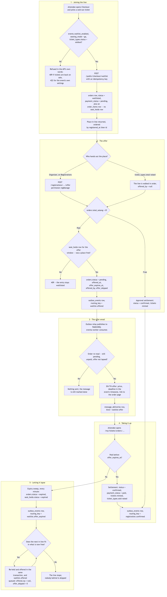
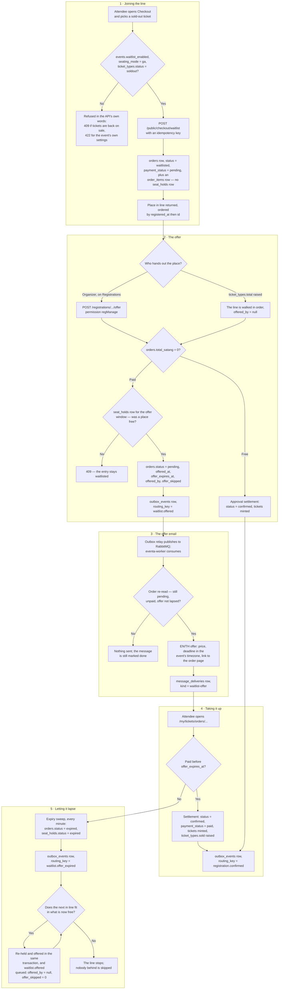

# Waitlist: join, offer and pass-on

**Screens:** Checkout, Admin Registrations, email

What happens when a general-admission ticket sells out and `events.waitlist_enabled` is on: the attendee joins a line instead of buying, and later gets a time-limited offer to pay for a place that freed up. It starts at checkout and ends either with the offer paid for — the ordinary payment of [Checkout and payment](02-checkout-and-payment.md) — or with the offer lapsing and the place passing to the next person in line. A waitlist entry is not a separate kind of record: it is an `orders` row in the `waitlisted` status, which is why taking up an offer is just checkout finishing.

1. **Joining the line.** `GET /public/checkout/{slug}` returns each tier with a `waitlist` flag, true only when all three of `events.waitlist_enabled`, `events.seating_mode = 'ga'` and `ticket_types.status = 'soldout'` hold. The three refusals mean different things and are worded differently: the waitlist being switched off and the event seating people by seat are the organizer's settings and will not change on a retry, so they are 422; a tier that is no longer `soldout` is a race the buyer can act on, so it is 409 and the page can send them back to buy. `POST /public/checkout/waitlist` then writes, in one transaction, an `orders` row with `status = 'waitlisted'` and `payment_status = 'pending'`, priced from the catalogue exactly as a purchase would be (`subtotal_satang`, `vat_amount_satang`, `total_satang` — integer satang, formatted only on screen), plus one `order_items` line naming the `ticket_type_id` and quantity, and upserts the buyer into `attendees`. No `seat_holds` row is written: nothing is reserved and nothing is charged. The call is safe to repeat twice over — a repeated `orders.idempotency_key` returns the row it already made, and a buyer already `waitlisted` for the same ticket gets their existing entry back rather than a second place behind it. The response carries their position, counted as the number of `waitlisted` entries for the same ticket ordered by `(registered_at, id)`, plus one. Nothing is emailed on joining; the message that matters is the offer.
2. **The offer.** A place is handed out in one of two ways, and both run the same code. An organizer works the **Waitlist** tab of **Admin Registrations** (`/admin/registrations`, `GET /registrations?status=waitlisted`) and presses Offer, which calls `POST /registrations/{id}/offer` and needs `regManage` — handing out a place is a decision, not queue work. Or an organizer raises a tier's `ticket_types.total`, and the save is followed by a walk down that ticket's line in order; that automatic walk is skipped entirely on an event with `events.requires_approval`, because giving somebody a place there would be a decision nobody made. Either way, a **free** entry (`orders.total_satang = 0`) is not offered but confirmed outright through the approval settlement — there is nothing to pay for by a deadline — issuing its `tickets` rows and stamping `confirmed_at` and `approved_at` (see [Approval](05-approval.md)). A **paid** entry is held first and recorded second: the seat-hold engine writes a `seat_holds` row with `status = 'active'` and `expires_at` set `WAITLIST_OFFER_HOURS` ahead (24 by default), under the tier's row lock so an offer can never oversell; with nothing free the API answers 409 and the entry stays `waitlisted`. Only then, under the order's own row lock, does `orders` take `status = 'pending'`, `offered_at`, `offer_expires_at`, `offered_by` and `offer_skipped`. `offered_by` is the organizer's `users.id` when a person chose, and `null` when the line chose by itself. `offer_skipped` is how many were ahead of this entry — offering someone further back is allowed, and the number is how that choice is recorded rather than refused. If recording the offer fails the hold is released immediately, so a lost race does not keep a place off sale for the whole window.
3. **The offer email.** The same transaction that records the offer writes an `outbox_events` row with `routing_key = 'waitlist.offered'`, so the offer and the message about it commit together. The outbox relay publishes it to RabbitMQ and eventa-worker consumes it — this is the part readers get wrong: eventa-api never sends mail itself. The handler re-reads the order before sending, because the outbox and the queue can run behind, and only sends while `status = 'pending'`, `payment_status = 'pending'` and `offer_expires_at` is still in the future; otherwise nothing goes out and the message is still marked done. Sending is gated by the organizer's `message_templates` switch for the slug `waitlist-offer`, and each send writes a `message_deliveries` row under that kind. The body is EN or TH by the reader's locale, and always carries Eventa's own figures — the ticket name and count, the price formatted from `total_satang`, the deadline rendered in the event's `events.timezone` (`Asia/Bangkok` by default, never the browser's), and an absolute link to `/my/tickets/orders/{orderId}`. An organizer may reword the greeting; they cannot send an offer that no longer says what to pay, by when, or where.
4. **Taking it up.** The link needs no account — the order's uuid is the credential, and the attendee persona is a separate account from the organizer's even for the same email address. The page shows the order as payable while it is `pending`, unpaid and its hold is still live, and paying runs the ordinary payment: `POST /public/payments` writes a `payments` row, and the provider's webhook runs the settlement transaction, which mints one `tickets` row per admission with `status = 'issued'` and a fresh `qr_token`, raises `ticket_types.sold`, turns the order's `seat_holds` rows `converted`, and sets `orders.status = 'confirmed'` with `payment_status = 'paid'` and `confirmed_at`. An `outbox_events` row with `routing_key = 'registration.confirmed'` is written in the same transaction and eventa-worker sends the confirmation from it.
5. **Letting it lapse.** eventa-worker runs an expiry sweep every minute. It closes orders that are `pending`, `payment_status = 'pending'`, have no `approval_requested_at`, and whose latest `seat_holds.expires_at` is older than now minus `ORDER_EXPIRY_GRACE_MS` — setting `orders.status = 'expired'` and their holds `status = 'expired'`. `expired` is deliberately not `cancelled`: nobody decided anything, the clock simply ran out. Any of those orders with `offer_expires_at` set was a waitlist offer, so for each one the sweep queues an `outbox_events` row with `routing_key = 'waitlist.offer_expired'` — a second eventa-worker handler sends that notice, governed by the same `waitlist-offer` switch (somebody never told of an offer should not be told it expired) but logged in `message_deliveries` under `waitlist-offer-expired`. Then, **in the same transaction**, the freed places are passed on: the `ticket_types` row is locked, what is free is computed as `total - sold -` the sum of live `active` holds, and the next `waitlisted` entry for that ticket is taken by `(registered_at, id)` with `FOR UPDATE SKIP LOCKED` — a row an organizer is already acting on is skipped rather than waited for. If their `orders.seats` fits, a `seat_holds` row is inserted, the order becomes `pending` with `offered_at`, `offer_expires_at`, `offered_by = null` and `offer_skipped = 0`, and another `waitlist.offered` row is queued, in exactly the shape eventa-api writes so the same handler cannot tell the two apart. The loop stops at the first person who does not fit; nobody behind them is served, because jumping someone is a choice an organizer may make and have recorded, not one a timer makes silently. Doing all of this inside the one transaction is the point — there is no moment in which the freed places are back on public sale ahead of the people waiting for them. One caveat: with `PUBLIC_WEB_URL` unset the worker cannot write a pay link, so nothing is passed on and a warning is logged.

Mermaid source

[← All flows](README.md)
