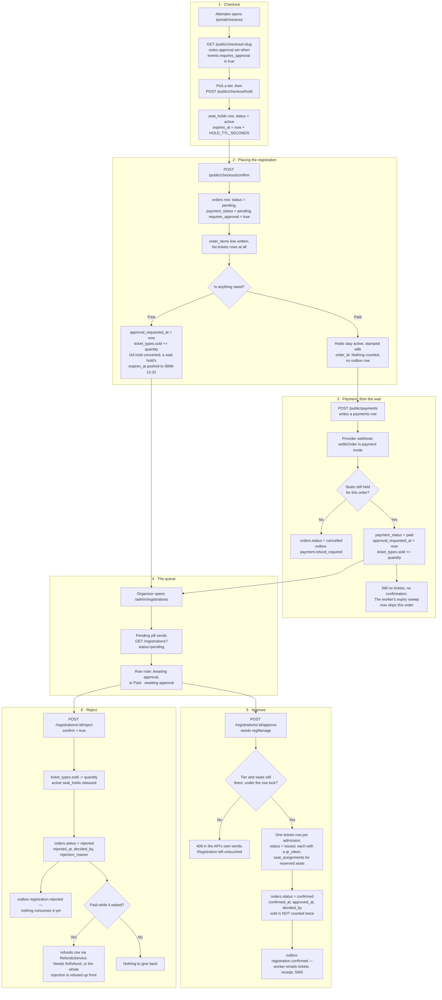

# Approval on a require-approval event

**Screens:** Checkout, Admin Registrations

What happens when an event has `events.requires_approval` set: the attendee pays first and the registration then waits for the organizer. It starts at checkout and ends either with tickets issued on approval, or with the sign-up rejected and any money given back. The ordinary path, where checkout confirms outright, is [Checkout and payment](02-checkout-and-payment.md).

1. **Checkout.** `GET /public/checkout/{slug}` returns the tiers plus a `notes.approval` line — the buyer is told, before they pay, that the organizer reviews each registration and that an unapproved one is refunded in full. Choosing a tier and quantity calls `POST /public/checkout/hold`, which writes a `seat_holds` row with `status = active` and `expires_at` set `HOLD_TTL_SECONDS` ahead, so the places cannot be sold to anyone else while the buyer fills in the form.
2. **Placing the registration.** `POST /public/checkout/confirm` re-prices the selection server-side and writes, in one transaction, an `orders` row with `status = pending`, `payment_status = pending` and `requires_approval = true` — a snapshot of the event's rule at that instant, so flipping the event's switch later never changes the deal this buyer made — plus its `order_items` line. No `tickets` row is written on either branch. A **free** registration has nothing left but the decision, so `approval_requested_at` is stamped now, `ticket_types.sold` is raised by the line quantity under a `FOR UPDATE` lock on the tier (the public count and the sold-out badge therefore tell the truth while it waits), a general-admission hold becomes `status = converted`, and a reserved seat's hold has its `expires_at` pushed to the sentinel `9999-12-31` — a decision, not a clock, ends that hold. A **paid** registration counts nothing yet: its holds stay `active` and are merely stamped with `order_id`.
3. **Payment, then the wait.** `POST /public/payments` writes a `payments` row, and the provider's webhook runs the settlement transaction. Because `orders.requires_approval` is true, the money buys places rather than tickets: `payment_status` becomes `paid`, `approval_requested_at` is stamped, and `ticket_types.sold` is raised — the same bookkeeping the free branch did at placement. Nothing is issued and no confirmation is queued; both belong to the approval. If one of the order's seats lost its hold while the money was in flight, the seat may already be someone else's, so the order is `cancelled` and an `outbox_events` row with `routing_key = payment.refund_required` is written instead. From this point the eventa-worker order-expiry sweep leaves the order alone: it only closes orders with `approval_requested_at IS NULL`, because a registration on the organizer's clock is on nobody's checkout clock.
4. **The queue.** The organizer opens **Admin Registrations** (`/admin/registrations`) and the Pending pill sends `GET /registrations?status=pending`. The row's note distinguishes the two waits — "Awaiting approval" for a free one, "Paid · awaiting approval" once money has landed — because "Pending" on its own reads as "not paid yet". Amounts come from `total_satang`; a caller without `finView` sees `null`, which renders as "—" and never as `฿0`. Deciding needs `regManage`, which Staff working the door (`regCheckin`) do not have.
5. **Approve.** `POST /registrations/{id}/approve` runs the *same* settlement transaction a card payment runs, in approval mode, so a hand-approved and a bought registration are issued by identical code. A paid registration cannot be approved until `payment_status = paid`. Under the order's row lock the tier and seats are re-checked, because a sell-out or a lost seat can happen between the organizer reading the list and clicking; if they have gone, nothing is written and the API answers 409 with its own sentence ("offer the attendee the waitlist instead" — see [Waitlist](04-waitlist.md)). Otherwise one `tickets` row per admission is minted with `status = issued` and a fresh `qr_token`, reserved seats get their `seat_assignments`, holds are `converted`, and the order becomes `status = confirmed` with `confirmed_at`, `approved_at` and `decided_by` stamped. `sold` is **not** raised again — these places were counted when the registration started waiting. An `outbox_events` row with `routing_key = registration.confirmed` is written in the same transaction, so the ticket and the email promising it commit together; eventa-worker consumes that row and sends the confirmation email, the VAT receipt when the order was paid for, and a text when the buyer gave a Thai mobile. The QR tokens are read live from the database and never travel on the bus or into the email body — the email links to the tickets page instead.
6. **Reject.** `POST /registrations/{id}/reject` requires `confirm = true`, since a rejection is terminal and `rejected` can never be re-approved. The counted places go back to `ticket_types.sold`, any `active` hold on the order becomes `released`, and the order takes `status = rejected` with `rejected_at`, `decided_by` and the organizer's `rejection_reason`. An `outbox_events` row with `routing_key = registration.rejected` is written in the same transaction — note that eventa-worker has no handler bound to that key, so the row is written and published but nothing acts on it yet. If money was taken while the registration waited — `payment_status = paid` with `approval_requested_at` set — the rejection commits first, so an approval racing it cannot issue tickets after the money has gone, and the refund is then issued through the ordinary refund path, writing a `refunds` row per settled `payments` row. That makes this rejection a refund, so it needs `finRefund` as well as `regManage`; without it the API refuses before anything is written. `payment_status` stays `paid` until the refund lands, and the queue row says "Payment not yet refunded" meanwhile.

Mermaid source

[← All flows](README.md)
