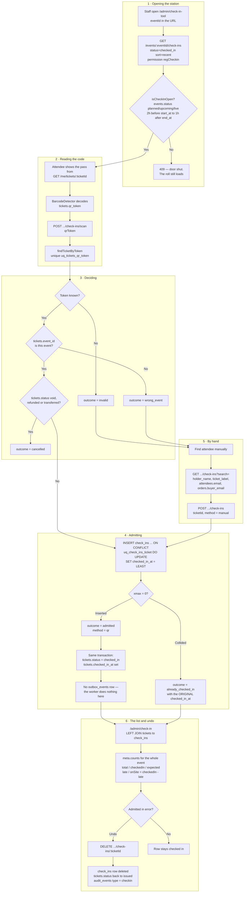

# Check-in by QR and by hand

**Screens:** Check-in tool, Check-in list

Admitting one person per ticket at the door, however the code reaches the station. It starts when an attendee presents the QR on their pass and ends with an admission recorded in `check_ins` and the organizer's attendance list agreeing with the room. The tickets being scanned were issued earlier, by [Checkout and payment](02-checkout-and-payment.md), [Free registration and confirmation](03-free-registration-and-confirmation.md) or an organizer's [approval](05-approval.md).

1. **Opening the station.** Staff open **Check-in tool** (`/admin/check-in-tool`), whose loader reads `GET /events/{eventId}/check-ins?page=1&limit=8&status=checked_in&sort=recent` — the last eight arrivals, newest first. The event being worked lives in the URL as `?eventId=`, defaulting to the most recent event, because a station is bound to one door. Every route under `/events/:eventId/check-ins` requires the `regCheckin` permission: watching the door and working it are different privileges, and the seeded Staff role holds `regView` and `regCheckin` but deliberately not `regManage`, so somebody on the door cannot approve or reject a registration. Whether the door is open at all is derived rather than stored — `isCheckInOpen` admits only an event whose `events.status` is `planned`, `upcoming` or `live`, from two hours before `events.start_at` until one hour after `events.end_at`, or after `start_at` when the event has no end time, so a single-session event does not become un-checkinable the moment it begins. A shut door answers **409** with the API's own sentence, "Check-in is not open for this event yet — or has already closed." Reading the roll is not gated on that window: an organizer checks the list before the doors open and reconciles it afterwards, which is exactly when the window is shut.
2. **Reading the code.** The attendee presents the pass from their own account — `GET /me/tickets/{ticketId}`, or the printable `pass.svg` the API renders — which encodes `tickets.qr_token`, minted at issue and unique across the workspace through `uq_tickets_qr_token`. That token is a bearer credential, so it never travels in the confirmation mail: the worker's email names the ticket and links to the authenticated page instead. Note that the attendee reading it is signed in to an **attendee** account, which is a different account from the organizer's door login even when the two share an email address. At the station the browser's own `BarcodeDetector` decodes the frame and submits `POST /events/{eventId}/check-ins/scan` with `qrToken`; a badge that will not present — a cracked screen, a printout photographed earlier — can be decoded from a still image through the same endpoint. Where the platform has no detector, Safari and Firefox today, the station says so and falls back to the manual search in step 5. The API resolves the token with `findTicketByToken`, scoped to the caller's `organization_id`.
3. **Deciding.** Four refusals and one admission, settled in the order the door needs them, and all of them returned as **200** with an `outcome` rather than as an HTTP error — an unknown code, a ticket for next week and a refunded one are three different things for the person on the door to do, and an exception would collapse all three into "no". No ticket behind the token gives `outcome = invalid`; a ticket whose `tickets.event_id` is not the station's event gives `wrong_event`; a `tickets.status` of `void`, `refunded` or `transferred` gives `cancelled`, because a refunded ticket no longer entitles anyone to walk in (see [Refund and cancellation](07-refund-and-cancellation.md)). Anything else is admitted. The `scan_outcome` enum spells all five: `admitted`, `already_checked_in`, `invalid`, `wrong_event`, `cancelled`.
4. **Admitting.** The admission is one statement, not a read followed by a write: `INSERT INTO check_ins … ON CONFLICT ON CONSTRAINT uq_check_ins_ticket DO UPDATE SET checked_in_at = LEAST(check_ins.checked_in_at, EXCLUDED.checked_in_at) RETURNING checked_in_at, (xmax = 0) AS inserted`. The row carries `organization_id`, `event_id`, `ticket_id`, `attendee_id`, `checked_in_at`, `method`, `checked_in_by` and the optional `station_id` for reconciling a busy entrance; `method` comes from the `check_in_method` enum, `qr` for a scan. `uq_check_ins_ticket` is a unique on `ticket_id` alone and is the whole correctness story — two staff scanning the same badge at the same instant both attempt the insert, exactly one wins, and the loser reads back the winner's row. `DO UPDATE` rather than `DO NOTHING` so `RETURNING` always yields a row, `LEAST` so a replayed or out-of-order admission never rewrites the time somebody actually walked in, and `xmax = 0` is how the caller learns whether it admitted someone. A collision therefore reports `already_checked_in` with the **original** arrival time, which the station shows as "Arrived at 14:32" — stored UTC, rendered on the Asia/Bangkok clock. In the same transaction `tickets.status` becomes `checked_in` and `tickets.checked_in_at` is set, so the attendee's own ticket view agrees; `check_ins` is the ledger and that pair is the projection. Nothing is queued: check-in writes **no** `outbox_events` row, so unlike a registration this flow sends no mail and eventa-worker has nothing to consume.
5. **By hand.** When the code will not read at all, the station's collapsed "Can't scan? Find attendee manually" panel searches the same roll through `GET /events/{eventId}/check-ins?search=…`, matching case-insensitively on `tickets.holder_name`, `tickets.ticket_label`, `attendees.email` and `orders.buyer_email` — the buyer's address because somebody who bought four tickets stays the contact for all four until they are handed on. Admitting the row found calls `POST /events/{eventId}/check-ins` with its `ticketId`, and `method` defaults to `manual` (the enum also allows `upload` for a code decoded from a photograph). From there it is step 4 unchanged — the same `admit` path, so a hand-admission cannot become a second, subtly different way of letting somebody in, and a manual admit after a scan still collides on `uq_check_ins_ticket` rather than admitting twice.
6. **The list and undo.** **Check-in list** (`/admin/check-in`) reads the same endpoint sorted by name and paged server-side, with the tab, the search and the page number in the URL so the counts and the rows cannot disagree. It is a LEFT JOIN from `tickets` to `check_ins`, not a filter, so somebody still expected appears with no admission row and `status = expected`; tickets that deny entry are excluded, since a refunded ticket is not somebody the door is waiting for. The figures ride on `meta.counts` and are counted across the whole event rather than the page on screen: `total`, `checkedIn`, `expected`, `late` (admitted after `events.start_at`) and `onSite`, derived as `checkedIn − late` so the two can never disagree. An admission made in error is reversed with `DELETE /events/{eventId}/check-ins/{ticketId}`, which deletes the `check_ins` row outright rather than flagging it — an admission that was reversed did not happen, and a tombstone would force every count and the unique constraint itself to reason about it — then puts `tickets.status` back to `issued` with `checked_in_at` cleared, and writes an `audit_events` row with `type = 'checkin'` naming the actor, which is the only remaining evidence that the person was ever admitted. Nothing to undo answers **404**, "That ticket has not been checked in." Undo gates on the same open door as an admission, so a mistake is corrected at the event rather than weeks later.

Mermaid source

[← All flows](README.md)
