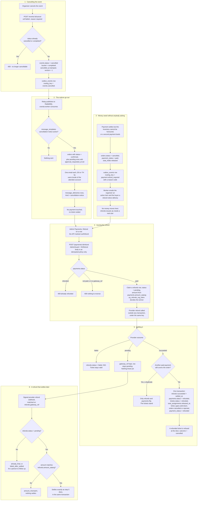

# Refund and cancellation

**Screens:** Admin Payments, Event detail, email

How money goes back, and what calling an event off actually does. It starts either with an organizer cancelling an event, with a rejected registration (see [Approval](05-approval.md)), or with a payment the product could not honour, and it ends with a `refunds` row settled, the tickets void and the places back on sale. The thread running through it: nothing here moves money on its own — a refund is always a person's act, and every automatic path only produces an obligation and an email about it.

1. **Cancelling the event.** `POST /events/{id}/cancel` needs `evPublish` and a non-empty `reason` of at most 500 characters; an optional `version` makes it a stale-view check against `events.version`. An event already `cancelled` or `completed` is refused with a 409 ("This event can no longer be cancelled."). Otherwise `events.status` becomes `cancelled`, `events.bucket` becomes `completed` — so the event leaves the Active list but is kept for reporting — `cancelled_at` is stamped in UTC, and `version` goes up by one. An `outbox_events` row with `routing_key = events.cancelled` carries the `reason` and `cancelled_by`. Note what cancelling does **not** do: no `payments` row changes, no `tickets` row is voided, no `refunds` row is written. The Event detail screen renders the resulting `Cancelled` status; eventa-web has no cancel control wired to this endpoint yet.
2. **The notices go out.** eventa-api's outbox relay publishes the row to RabbitMQ and eventa-worker's `events.cancelled` handler consumes it — this is the part readers get wrong, because the API's response ("Event cancelled. Refunds and attendee notices are being processed.") is returned long before any email is sent. The handler first asks whether `message_templates` has the `cancellation-notice` slug switched off for the workspace; an absent row counts as on, and a switched-off one sends nothing rather than quietly sending Eventa's own words. It then reads the recipients from `orders` for that event: `status = confirmed`, plus `status = pending` rows with `approval_requested_at` set, which may have paid and have no ticket to show for it. Grouping is by `buyer_email`. Language follows the **person**: their own `users.locale` where an attendee account exists for that address, then the event's, then the workspace's — attendee and organizer are separate accounts, so the lookup is scoped to `persona = 'attendee'` in the platform organization and would find nobody in the organizer's workspace. The organizer's own subject and body (US-MSG-02) replace the explanation but never the refund line, which is always last and always Eventa's; someone still awaiting approval gets a different one, since they have no ticket to speak of. Each send writes a `message_deliveries` row with `kind = 'cancellation-notice'` and `status` of `sent` or `failed`, and a partial failure throws so the message is retried.
3. **Money owed without anybody asking.** Two paths produce a refund obligation with no one pressing anything, both from the payment webhook (see [Checkout and payment](02-checkout-and-payment.md)). Money that arrives for inventory that can no longer be honoured cancels the order in the settlement transaction — `orders.status = cancelled`, `payment_status = paid`, `cancelled_at` stamped, the order's `active` `seat_holds` set to `released` — and writes an `outbox_events` row with `routing_key = payment.refund_required` carrying a reason code: `soldout`, `seats_unavailable`, `seat_mismatch`, `seats_released`, `tier_removed` or `order_closed`. A second live payment settling an order another payment already paid for queues the same event with `reason = duplicate_payment`; the registration stands and only the extra money is owed. eventa-worker's handler sends two emails — an action item to the event's contact address, and a reassurance to the order's `buyer_email`, the latter logged as a `message_deliveries` row with `kind = 'refund-notice'` — and deliberately issues nothing: `refunds.issued_by` references a real `users` row, so a refund cannot be made by a background job. A workspace with no contact address throws to the dead-letter queue rather than failing quietly, because having nobody to alert is exactly the case where the money would go missing.
4. **Issuing the refund.** Admin Payments (`/admin/payments`) lists the ledger from `GET /payments`, which needs `finView`. Whether a charge may be refunded is the server's verdict, not the page's: `canRefund` is true only for `payments.status = 'paid'`, and `refundBlockedReason` travels with it so a disabled Refund button can say why. `POST /payments/{id}/refund` is guarded twice — `AdminGuard`, because the story restricts refunds to Admins rather than Organizers, and `finRefund`, because moving money is a different capability from reading the ledger. The body carries an `idempotencyKey` and nothing else: full refunds only this release, and the figure is read from `payments.amount_satang` rather than from the request, so a client cannot ask for more than was ever charged. A payment that is `refunded` gives a 409, one that never cleared gives another, and one with no `gateway_ref` cannot be reversed automatically. The first write is the claim — a `refunds` row with `status = 'pending'`, the payment's own `amount_satang` and `issued_by` set to the admin — and `uq_refunds_org_idem` on `(organization_id, idempotency_key)` is what decides who refunds, so a double-clicked button issues one refund and a crash after the provider call still leaves evidence that one was attempted. Only then is the provider called, outside any transaction, under that same key. Rejecting a paid registration enters here too, through the same service, with one refund per settled `payments` row keyed `registration-rejected:{orderId}:{paymentId}`.
5. **Settling it.** Three outcomes. **Refused**: `refunds.status` becomes `failed` with the provider's reason, and the API answers 502 repeating it — the buyer keeps a valid ticket, because nothing went back. **Accepted but not settled** — a PromptPay refund, where Stripe has still to collect the buyer's bank details: the row keeps the provider's `gateway_ref` and stays `pending`, and frees nothing, because voiding the admission before the money lands would take it away for a refund that has not happened. **Settled**: one transaction sets `refunds.status = 'succeeded'` with `settled_at` — the month the money actually moved, which is what the VAT figures group on, and not the month of the sale — `payments.status = 'refunded'`, every live `tickets` row on the order (`issued` or `checked_in`) to `refunded`, `seat_assignments.released_at` for those tickets, `ticket_types.sold` down by the tickets this call voided (with `GREATEST(sold - n, 0)`, so a repeated refund cannot drive it negative and sell places that do not exist), and the order to `payment_status = 'refunded'` with `status = 'cancelled'` — or `rejected`, which stays `rejected`, because the refund is the consequence of that decision rather than a second one. A registration refunded while it was still awaiting approval has no tickets at all, so its counted places and its decision hold go back instead. The exception is a duplicate: while another `paid` payment still covers the order, only that payment's own ledger lines flip, since the buyer paid once and keeps what they bought. From here the ticket is refused at the door with `scan_outcome = 'cancelled'`.
6. **A refund that settles later.** Stripe's refund callback arrives at `POST /public/payments/webhook/{token}`, verified against the exact raw bytes, and the refund is found by `refunds.gateway_ref` scoped to the workspace the callback's URL named — so no workspace's callback can finish another's refund. Only a `pending` row moves, which is what makes a redelivered event change nothing. A reported amount that differs from `refunds.amount_satang` settles nothing, for the same reason a partial refund does not void a ticket. A success runs exactly the transaction step 5 runs, so a refund settled days later lands identically to one settled at once. A failure marks the row `failed` and the ticket stays valid. The one case nothing can repair by itself is a failure reported *after* the refund settled — Stripe can take a refund back when the buyer's bank returns it, and by then the tickets are void and the seat may have been sold again, so it is logged for a person to follow up rather than guessed at. Either way the outcome is recorded on the `webhook_events` row.

Mermaid source

[← All flows](README.md)
