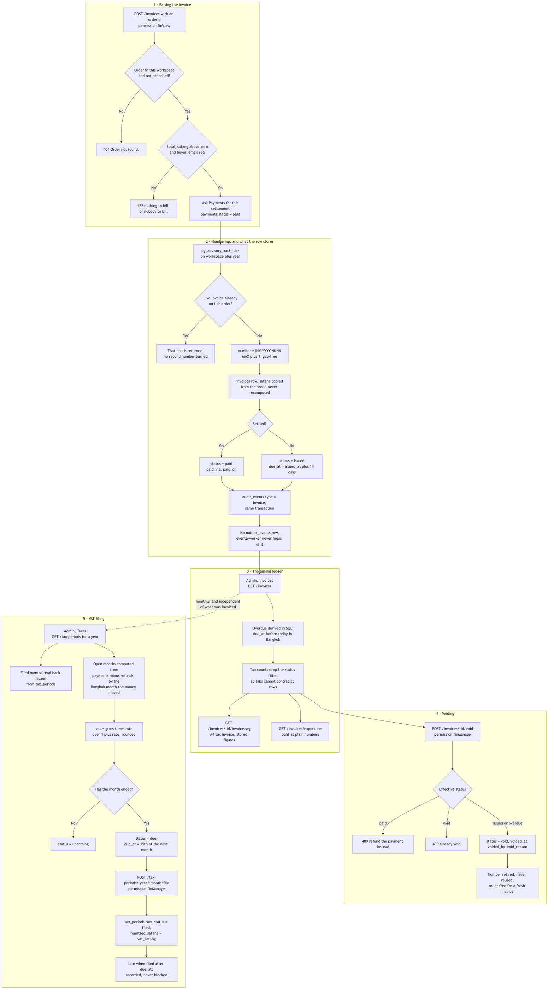
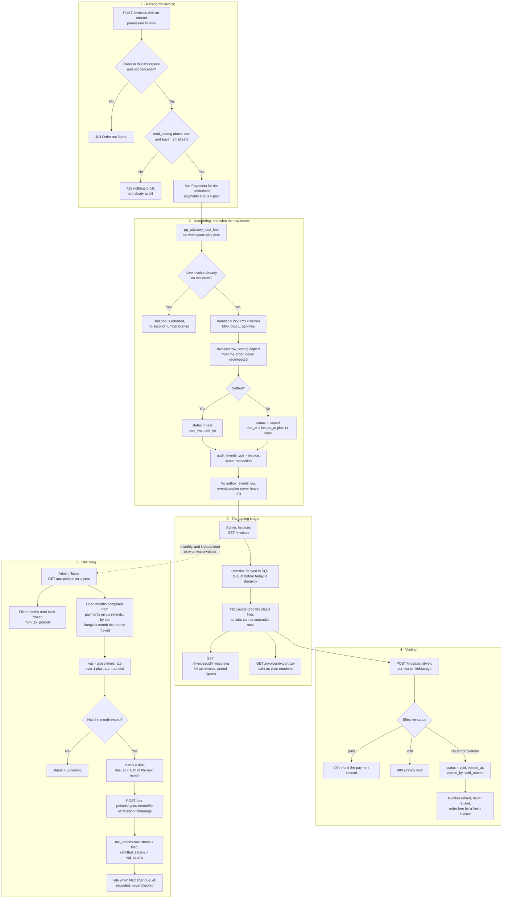

# Invoice, ageing and VAT filing

**Screens:** Admin Invoices, Taxes

How a paid-for order becomes a numbered Thai tax invoice, how the ledger ages it towards Overdue, and how a month's takings end up as a filed PP30 return. It is an organizer-only flow from start to finish — no attendee ever sees an `invoices` row — and, unlike almost everything else in Eventa, nothing in it is queued: the whole path is synchronous HTTP, and eventa-worker plays no part at any point.

1. **Raising the invoice.** Nothing issues an invoice by itself. `POST /invoices` takes one `orderId` and is the only thing that ever creates an `invoices` row — no webhook, no outbox consumer and no cron calls it — so a tax invoice is raised deliberately, against an order somebody chose. (The console has no button for it either: the Invoices page lists, downloads and voids, and the empty state says as much.) The permission is `finView`, the same one that reads the ledger, so an Organizer may invoice their own buyers; voiding and VAT filing need `finManage`, which of the built-in roles only Admin is granted. Checkout owns the `orders` table, so Invoices asks for the order through `InvoiceOrderPort` rather than joining across the boundary: it must belong to the caller's workspace and have a `status` other than `cancelled`, or the answer is a 404. Two further refusals are written for the person reading them — an `orders.total_satang` of zero or less is "This order has nothing to bill", and a missing `orders.buyer_email` is "this order has no buyer email, so the invoice has nobody to bill". Payments then answers `InvoicePaymentPort` with the newest `payments` row for the order whose `status = 'paid'`, giving its `method` and the Bangkok calendar date of its `paid_at`; that is what decides whether the invoice is born already settled (see [Checkout and payment](02-checkout-and-payment.md) for how `payments` gets there).
2. **Numbering, and what the row stores.** Thai invoice numbering may not have holes, which rules out a Postgres sequence — a rolled-back transaction would leave one. Instead the whole issue runs in one transaction that first takes `pg_advisory_xact_lock(hashtext('invoice:<org>:<year>'))`, so concurrent issuers queue rather than collide and a rollback hands the number back. Inside the lock it looks for a live invoice on the same order (`status <> 'void'`) and returns that one if it finds it; the partial unique index `uq_invoices_live_order` on `order_id WHERE status <> 'void'` closes the remaining race, so a double-submitted request yields one invoice and burns no second number. Otherwise `number` is `INV-<year>-<MAX + 1>` padded to four digits, unique per workspace by `uq_invoices_org_number`. The figures are **copied, never recomputed**: `amount_satang` is `orders.total_satang`, `vat_amount_satang` is the VAT recorded at checkout, and `subtotal_satang` is the difference — recomputing VAT here would let a later edit of `organizations.vat_rate` restate tax already collected at the old rate. `buyer_name` and `buyer_email` are snapshotted for the same reason: the document must still show who it was billed to after the buyer edits their account. `issued_at` is today's Bangkok date and `due_at` is fourteen days later (`INVOICE_TERM_DAYS`), both plain `date` columns. `status` is `paid` with `paid_via` and `paid_on` filled when a settlement was found, otherwise `issued`. An `audit_events` row with `type = 'invoice'` and the title "Issued invoice INV-2026-0001" commits in the same transaction, and **no `outbox_events` row is written at all** — issuing an invoice emails nobody and eventa-worker never learns of it, which is the thing readers arriving from the registration flows expect to work the other way.
3. **The ageing ledger.** `/admin/invoices` loads from `GET /invoices`, with `page`, `limit` (20 by default, 100 at most), `status`, `eventId` and `search` carried in the URL so the API does the paging and the back button works; `search` matches the invoice number or the buyer name. Rows come back newest `issued_at` first. The important part is that **`overdue` is never written to the column**: although it is a legal `invoice_status` value, the stored status is only ever `issued`, `paid` or `void`, and the ledger ages it in SQL — `paid` and `void` are terminal, anything else whose `due_at` is before today reads `overdue`. A stored flag would be wrong for the hours between midnight and whenever a nightly job ran. "Today" is the Bangkok calendar date, taken once per request and shared by the rows, the tab counts and the CSV, so the three cannot disagree; the four tab counts are deliberately computed **without** the status filter, so page 2 of Overdue still shows how many are Paid. The API also returns `canVoid` and `voidBlockedReason` per row, so a disabled control explains itself rather than the console guessing. Money crosses the wire as integer satang (`amountSatang`, `vatAmountSatang`) with a formatted `amountLabel` beside it; `paid_via` and `paid_on` are genuinely null until something settles and render blank, never `฿0`. **Export** fetches `GET /invoices/export.csv` with the same filters and no paging, up to 10,000 rows, and writes baht as plain numbers an accountant can sum — an empty result is a 409 with the API's own sentence rather than an empty file. **Invoice** fetches `GET /invoices/:id/invoice.svg`: a self-contained A4 page carrying `organizations.name`, `address`, `tax_id` and `vat_rate`, the buyer, the order reference, the event as the service line, and a VAT breakdown that reconciles to the amount — again from the stored figures, with a diagonal VOID watermark when the invoice is void. Both are fetched with the caller's bearer token rather than linked to, since a plain `<a href>` would arrive at a 401. The attendee's own portal is unaffected by any of this: its payment history labels the **order reference** as the invoice number, and never reads the `invoices` table.
4. **Voiding.** A correction is a void plus a brand-new invoice, never an edit — so `POST /invoices/:id/void` is the only mutation an existing invoice has, it is `finManage`, and it deletes nothing. It is refused with a 409 on an invoice that is already `void`, and on one that is `paid`: the refusal tells the organizer to refund the payment instead (see [Refund and cancellation](07-refund-and-cancellation.md)). Otherwise it sets `status = 'void'` with `voided_at`, `voided_by` and the optional `void_reason` (500 characters, recorded on the `audit_events` row's `meta`), and writes a second audit row titled "Voided invoice INV-2026-0001". The number stays in the sequence marked void, because a tax invoice that simply vanished is exactly the hole the Revenue Department expects not to find; `uq_invoices_org_number` keeps it from being reused. Because the live-order index ignores voided rows, the order is now free for a corrected invoice, which takes the next number rather than the old one.
5. **VAT filing.** `/admin/taxes` loads `GET /tax-periods?year=<year>` — the year is required, defaults to the current **Bangkok** year, and the picker goes five years back. The response is always twelve rows plus the year's headlines, so it is a fixed list rather than a page, and the screen has no empty state to show. Only **filed** months are stored: a `tax_periods` row exists solely once a return has been recorded, and it is read back frozen at the figures that were filed. Every other month is **computed on the spot** from what the payment ledger actually moved, via `TaxableSalesPort`: `payments` rows with `status IN ('paid', 'refunded')` and a non-null `paid_at` count positive, `refunds` rows with `status = 'succeeded'` count negative, and each is assigned to the Bangkok month of the date the **money moved** — `paid_at` for a payment, `coalesce(settled_at, issued_at)` for a refund. That is why "an adjustment to a period already filed carries into the next open one" needs no carry-forward ledger: a June ticket refunded in July simply reduces July. The gross is VAT-inclusive, so `vat_satang` is `round(gross × rate / (1 + rate))` at `organizations.vat_rate` and `sales_satang` is the remainder; a month whose refunds outweigh its sales goes negative and is carried rather than floored, because the period genuinely owes less. A period is `upcoming` until the month ends, then `due` from the 1st of the next month — filing *opens* when the month closes and `due_at`, the 15th, is only the deadline — and stays `due` however late it gets. `POST /tax-periods/:year/:month/file` is `finManage`; it refuses a period that is still running or already filed, and otherwise inserts one `tax_periods` row with `period` (`Jun`), `year`, `due_at`, the computed `sales_satang` and `vat_satang`, the optional `wht_satang` for Thai withholding, `remitted_satang` set to `vat_satang` — recording the filing *is* remitting it, so the figure is never keyed by hand and cannot disagree with the return — `status = 'filed'` and `filed_at`. `onConflictDoNothing` on `(organization_id, period, year)` makes a double-submitted filing a no-op. `late` is derived by comparing the Bangkok date of `filed_at` with `due_at` and is recorded rather than blocked, because the Revenue Department's surcharge depends on it and the organizer is the one who will be asked. The four headlines (collected, remitted, payable = collected − remitted, withholding) are summed over all twelve rows *before* any status filter, so narrowing to Due cannot make the year look like it owes less than it does. Eventa files nothing with anybody: the row records that a human did. Timestamps such as `filed_at` and `voided_at` are UTC in the database and rendered in Asia/Bangkok on screen; `issued_at`, `due_at` and `paid_on` are date-only columns already in Bangkok terms.

Mermaid source

[← All flows](README.md)
