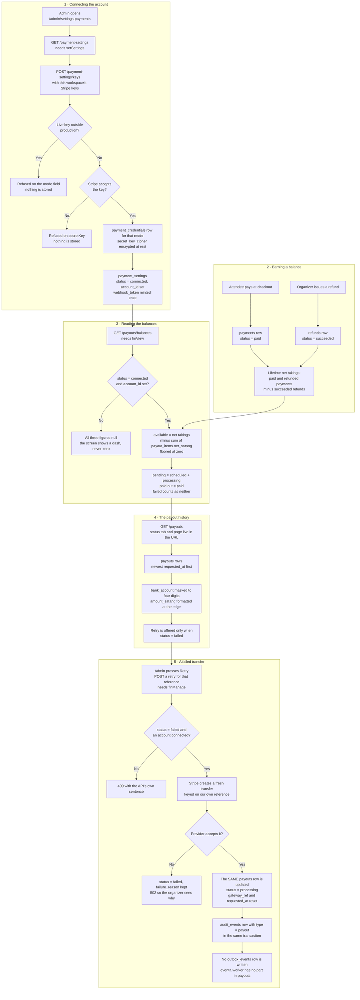

# Payouts and balances

**Screens:** Admin Payouts, Payment settings

How ticket money gets from Eventa to the organizer's bank. It starts in Settings → Payments, where an Admin connects the workspace's own Stripe account, and ends on `/admin/payouts`, where the three headline balances and every transfer are listed and a rejected one can be re-submitted. The organizer is the only persona here; an attendee never sees any of it.

1. **Connecting the account.** `/admin/settings-payments` reads `GET /payment-settings`, which finds or creates this workspace's single `payment_settings` row. An Admin pastes the workspace's own Stripe keys and `POST /payment-settings/keys` — which needs `setIntegrations`, where reading the page needs only `setSettings` — validates them in a deliberate order: the key prefixes must match the chosen `mode` (`test` or `live`), a `live` key is refused outright on any server whose `NODE_ENV` is not `production` — otherwise a seed script or a click around staging charges a real card — and only then is the key proved against Stripe with a read-only `accounts.retrieveCurrent()`. **Nothing is stored until Stripe agrees the key works**, because a workspace marked ready to take money on a key that never worked would discover it at a buyer's failed checkout. On success a `payment_credentials` row is written for that `mode` with `secret_key_cipher` and `webhook_secret_cipher` encrypted at rest (AES-256-GCM; the plaintext is never read back to a caller), and `payment_settings` is updated to `status = 'connected'` with `account_id`, `publishable_key`, `connected_at` and — on the first save only — a minted `webhook_token`, which is the unguessable segment of this workspace's own callback URL. Test and live keys are separate rows, so holding both is normal and neither erases the other. **Disconnect** deletes every `payment_credentials` row for the workspace and sets `status = 'disconnected'` with `disconnected_at`; past `payouts` rows are untouched. No card or bank detail enters this app at any point (see [Checkout and payment](02-checkout-and-payment.md)).

2. **Earning a balance.** Nothing in Eventa adds up a running total. The available figure is derived every time it is asked for, from the ledgers Payments owns: `payments` rows with `status` in (`paid`, `refunded`) counted as positive, minus `refunds` rows with `status = 'succeeded'`. A refunded payment therefore stays in the sum and its reversal is subtracted separately, so a refund backdated after the fact corrects itself rather than needing a compensating entry (see [Refund and cancellation](07-refund-and-cancellation.md)). Every figure is integer satang; nothing is formatted until it reaches the screen.

3. **Reading the balances.** `GET /payouts/balances` needs the `finView` permission, and the first thing it asks is whether the workspace can be paid at all — `payment_settings.status = 'connected'` **and** a non-null `account_id`, both required, because a row saying yes with no account reference names nobody to pay. An unconnected workspace gets `availableSatang`, `pendingSatang` and `paidOutSatang` all `null`, and the page renders each as "—". That is not pedantry: `฿0` would tell an organizer they have earned nothing, when the truth is that nobody has asked the provider yet. Connected, the three figures are **available** = lifetime net takings minus `sum(payout_items.net_satang)`, floored at zero (refunds can outrun the unallocated balance, and the shortfall belongs in the next payout rather than in a negative headline); **pending** = `sum(payouts.amount_satang)` where `status` is `'scheduled'` or `'processing'`; **paid out** = the same sum where `status = 'paid'`. A `failed` payout counts towards neither — that money is still available.

4. **The payout history.** `GET /payouts` pages server-side, newest `requested_at` first, and the status tab (`scheduled`, `processing`, `paid`, `failed`) and page number live in the URL rather than in component state, so the back button works and the counts cannot disagree with the rows. Each row carries `reference` (unique per workspace), `period_covered` as a plain label, `amount_satang`, `status`, `requested_at`, `completed_at` and `failure_reason`. The `bank_account` column is only ever a masked descriptor — Eventa never stores an account number — and the API masks it again on the way out, failing closed: a value too short to mask is hidden entirely rather than printed whole. `canRetry` is decided server-side as `status === 'failed'`, so the console cannot offer a button the API would refuse. A `null` `completed_at` renders as "—", not as a date. **Nothing in the API ever inserts a `payouts` or `payout_items` row**: these are the provider's own settlements, recorded for the organizer to read, and the unique constraint on `payout_items.payment_id` *alone* is what makes the available balance trustworthy — a payment can be allocated to at most one payout, so the same money can never go out twice.

5. **A failed transfer, and recovering it.** `POST /payouts/:reference/retry` needs `finManage`, the Admin-only tier, and refuses with a 409 and the API's own wording when the payout has not failed or when no account is connected. Stripe has no retry verb, so the adapter creates a fresh transfer with `payout-retry:<reference>` as the idempotency key — a double-tapped Retry produces exactly one. The **existing** `payouts` row is then updated rather than a second one inserted, so the organizer never sees two payouts for money that only moved once: `status` becomes `processing`, `gateway_ref` is replaced by the new provider reference, `failure_reason` is overwritten with whatever the provider now reports (null when it accepted), and `requested_at` is reset to now. An `audit_events` row with `type = 'payout'` and the acting user is written in the same transaction, so a recovery attempt is always traceable. If the provider refuses again — a closed account, an insufficient balance — the row stays `failed` with the reason kept and the organizer gets a 502 carrying that reason, because a rejected payout is something to act on rather than a 500 to swallow. **No `outbox_events` row is written anywhere in this flow and eventa-worker has no payout consumer**: nothing is emailed, and the only downstream effect is that a payout which reaches `status = 'paid'` with `completed_at` stamped appears in the notifications feed. All these timestamps are UTC in the database and rendered in Asia/Bangkok on screen. Where to change the bank account, the payout schedule or tax forms is not in Eventa at all — `POST /payouts/settings-link` mints a one-time link onto the provider's own dashboard, which is what keeps bank data out of this service entirely.

Mermaid source

[← All flows](README.md)
