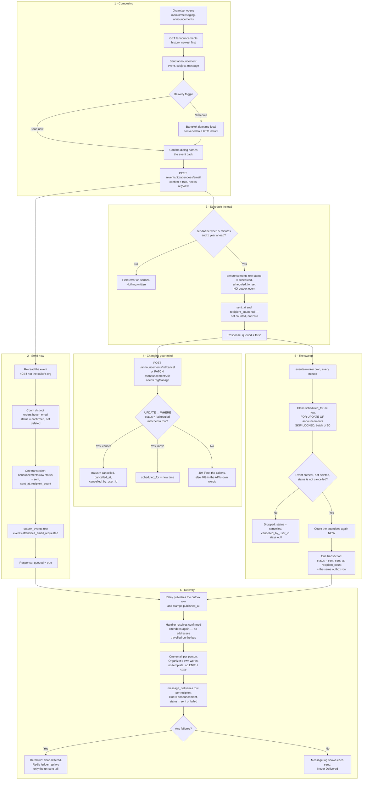

# Announcements, now and scheduled

**Screens:** Admin Announcements, email

A one-off email from an organizer to everyone holding a confirmed registration for one event — a venue change, a schedule update, a thank-you. It starts in the composer on the Announcements page and ends in each attendee's inbox, either within the minute or at a time the organizer picked and can still change.

1. **Composing.** The organizer opens **Announcements** at `/admin/messaging-announcements`. The loader calls `GET /announcements`, which pages the workspace's history newest first — ordered by `coalesce(sent_at, scheduled_for)`, so one still to go sits above what has already gone — and `?eventId=` narrows it to a single event. **Send announcement** opens the composer: an event, a subject of up to 150 characters, a message of up to 5,000, and a **Delivery** toggle of *Send now* or *Schedule*. Choosing *Schedule* reveals a `datetime-local` field read as **Bangkok** wall time and converted to a UTC instant before it leaves the browser; the API rejects a `sendAt` with no timezone rather than guess, because an instant without one would be read in the server's zone and move the send. A confirmation dialog names the event back before anything is submitted — the API will not send without `confirm: true`, and this is what makes that confirmation mean something. There is no audience picker and no channel picker: the broadcast goes to one event's confirmed attendees, by email, and a control offering more would be a promise the send cannot keep. Reading the history and sending both need the `regView` permission.
2. **Send now.** The composer posts to `POST /events/{id}/attendees/email` — the send lives on the event Monitor, because a broadcast is something you do to an event's attendees, and there is no second endpoint for it. The service re-reads the event first, so an id belonging to another workspace is a 404 before anything is written, then counts the audience: distinct `orders.buyer_email` for that event where `orders.status = confirmed` and `deleted_at IS NULL`. In **one transaction** it writes an `announcements` row with `status = sent`, `sent_at`, that `recipient_count` and `sent_by_user_id`, and an `outbox_events` row with `routing_key = events.attendees_email_requested`. The two commit together deliberately: an announcement listed but never sent is a lie to the organizer, and one sent but never listed is a broadcast to hundreds of people with no record of who did it. The response says `queued: true`; nothing is delivered inside the request.
3. **Schedule instead.** The same endpoint with a `sendAt` takes the other branch. The time must be at least five minutes ahead — scheduling exists so the organizer can change their mind, and a send a minute out is a send-now in all but name — and at most a year ahead, since anything further is almost certainly a mistyped year. Outside that range the API answers with a field error under `sendAt`, which the composer shows beneath the date field. The row is written with `status = scheduled` and `scheduled_for`, and with **no** `outbox_events` row at all: an outbox row now would email everybody now. `sent_at` and `recipient_count` stay null — null because nobody has counted this audience yet, not `0`, which would claim somebody counted and found nobody. The `ck_announcements_state` CHECK holds each status to the columns that go with it, whichever service writes the row. The response says `queued: false` and gives `scheduledFor` back.
4. **Changing your mind.** A `scheduled` row is the only one an organizer can still touch. `POST /announcements/{id}/cancel` sets `status = cancelled` with `cancelled_at` and `cancelled_by_user_id`; `PATCH /announcements/{id}` with a new `sendAt` moves `scheduled_for`, re-checking the same five-minute and one-year limits. Both need `regManage` rather than `regView`, because calling one off revokes somebody else's decision and Staff hold `regView` by default. Each is a single `UPDATE … WHERE status = 'scheduled'` rather than a read followed by a write: the worker's sweep locks a due row while it sends it, so this UPDATE waits for that lock, re-reads the committed row, finds it `sent` and changes nothing. When nothing was updated the API looks the row up and answers 404 if it is not the caller's, or 409 with the sentence written for the organizer — "This announcement has already started sending and can no longer be changed" — which the dialog shows verbatim in place of its own warning. A cancelled announcement stays in the history; changing your mind is part of the record too.
5. **The sweep.** Nothing in eventa-api sends a scheduled announcement. A cron in **eventa-worker** runs every minute — the organizer picked a minute, so a send up to a minute late is the worst anybody should notice — and claims the due rows: `status = 'scheduled'` and `scheduled_for <= now`, oldest first, capped at `SCHEDULED_ANNOUNCEMENTS_BATCH` (50 by default) and taken `FOR UPDATE OF announcements SKIP LOCKED`, which is the other half of the race in step 4. The sweep is deliberately cross-tenant; every row it writes carries the announcement's own `organization_id`. Each claimed row is left-joined to `events` on both id and organization. If the event is missing, soft-deleted, or `events.status = cancelled`, the announcement is **dropped** instead of sent — `status = cancelled` with `cancelled_at` and `cancelled_by_user_id` left null, because nobody did it — since those attendees have already had the cancellation notice (see [Refund and cancellation](07-refund-and-cancellation.md)) and these words were written while the event was still going ahead. Otherwise the audience is counted again **now**, by the same query the API used, and in one transaction the row becomes `status = sent` with `sent_at` and `recipient_count`, and exactly the `outbox_events` row a send-now writes. A failed tick is logged and swallowed; the transaction rolled back, the rows are still `scheduled`, and the next minute claims them again. There is no staleness cut-off, so a worker that was down sends what fell due while it was.
6. **Delivery.** The relay publishes unpublished `outbox_events` rows to RabbitMQ and stamps `published_at`. The handler for `events.attendees_email_requested` cannot tell a scheduled announcement from an immediate one, and must not need to — that is what keeps both paths identical. The payload carries no addresses, so the handler resolves the confirmed attendees again at send time, and sends **one email per person**, never a shared To or CC, so no attendee sees another's address. The organizer's own subject and body go out as written: unlike an automated message there is no template and no EN/TH copy to choose, and no `message_templates` switch to check. Each attempt writes a `message_deliveries` row with `kind = 'announcement'`, `channel = 'email'` and `status` of `sent` or `failed`, which is what the **Message log** at `/admin/messaging-log` reads back. A Redis ledger keyed per message and recipient email means a redelivery or a dead-letter replay sends only the un-sent tail; a partial failure is rethrown so the message dead-letters rather than being quietly acked. Nothing ever marks the `announcements` row delivered — `recipient_count` is who it was queued for, not a receipt, which is why the page says "1,340 attendees" and never "Delivered".

Mermaid source

[← All flows](README.md)
