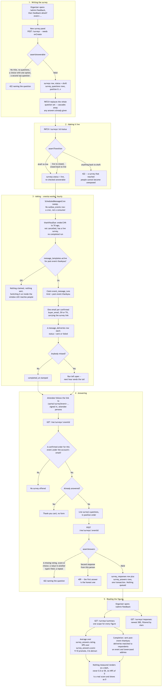

# Surveys, feedback and NPS

**Screens:** Admin Feedback, Portal survey, email

How an organizer finds out how an event went. It starts with a survey written against one event in the admin console, travels to attendees as the post-event thank-you email a day after the event ends, and ends as an average rating, an NPS and a completion rate on the Feedback page. Only somebody with a confirmed registration can answer, and each of them answers once.

1. **Writing the survey.** `/admin/feedback` lists every event in the workspace with what it has: how many surveys, how many of them are live, and how many people have answered (`GET /surveys/counts`, which groups `survey_responses` by `event_id`). Clicking through to `/admin/feedback-detail?event=<event id>` and opening **New survey** posts the form to `POST /surveys`, which writes a `surveys` row — `organization_id`, `event_id`, `title`, `status = draft` by default — and one `survey_questions` row per question, with `position` counted from 0 and `type` one of `rating`, `text`, `choice` or `nps`. `options` is stored only for a `choice` question; the others get an empty array, so switching a question's type cannot resurrect stale options. A survey belongs to an event rather than to the workspace, because "how was it?" is a question about something that happened. `assertAnswerable` refuses a blank title, a survey with no questions, a blank prompt, a `choice` with fewer than two non-blank options, and a *second* `nps` question — one recommendation score per survey, or a single person would be counted twice in that survey's NPS. Each refusal is a 422 naming the question number. Writing a survey needs the `evCreate` permission, the same one that shapes the event itself. `PATCH /surveys/{id}` replaces the whole question set rather than diffing it; because `survey_answers.question_id` references `survey_questions(id)` **ON DELETE CASCADE**, answers already given to the replaced questions go with them, so editing a survey that has collected answers is destructive. `POST /surveys/{id}/duplicate` makes a fresh `draft` titled "… (copy)" whatever the original's status, and `DELETE /surveys/{id}` cascades the questions, responses and answers away.
2. **Making it live.** `PATCH /surveys/{id}/status` moves the `surveys.status` enum, whose values are `draft`, `live` and `closed`. The only legal moves are `draft → live`, `live → closed` and `closed → live`; nothing ever returns to `draft`, because a survey that has been exposed to attendees cannot become unexposed and an organizer reading "Draft" on one that already holds answers would believe it held none. Reopening a closed survey is deliberately allowed — an organizer who closed one early should not have to rebuild it. Going live re-runs `assertAnswerable` against what is stored, not against what was just sent, so a survey saved before a rule existed cannot slip out under it. A `draft` collects nothing: the attendee lookup in step 4 only ever looks for a `live` one.
3. **Asking — eventa-worker, hourly.** This is the part readers get wrong: **nothing in the surveys module writes an `outbox_events` row.** The thank-you is not an outbox event consumed off the bus — it is a cron sweep in eventa-worker (`ScheduledMessagesCron`, every hour) that reads the database directly. `thankYousDue` selects events where `coalesce(end_at, start_at)` is between `FEEDBACK_REQUEST_DELAY_HOURS` ago (default 24) and `FEEDBACK_REQUEST_WINDOW_DAYS` ago (default 7), whose `status <> 'cancelled'` and `deleted_at IS NULL`, where a `surveys` row for the event has `status = 'live'`, and where no `event_message_runs` row for `kind = 'post-event-thankyou'` has a `completed_at` — a batch of `FEEDBACK_REQUEST_BATCH` (default 20), oldest first. An event with no `end_at` is measured from its `start_at`; it still happened. The window exists so a sweep that was down for a fortnight does not suddenly mail people about an event they have forgotten. Both sweeps need `PUBLIC_WEB_URL`: without it they send nothing and say why once, rather than mailing links that are dead in a mail client. `ScheduledSender` then checks `message_templates.active` for the slug — absent row means the catalog default, which for `post-event-thankyou` is **on** — and if the organizer has switched it off it returns without claiming anything, so switching it back on inside the window still reaches people. Otherwise it claims the run by inserting an `event_message_runs` row (`event_id`, `kind`, `requested_at`) with `ON CONFLICT DO NOTHING`, reads the confirmed recipients once for the batch (`orders` with `status = 'confirmed'` and `deleted_at IS NULL`, distinct by `buyer_email`, so one email per person however many orders they placed — see [Checkout and payment](02-checkout-and-payment.md) and [Free registration and confirmation](03-free-registration-and-confirmation.md) for how an order gets there, and [Approval](05-approval.md) for the registrations that reach `confirmed` by the organizer's hand), and sends one email each. The language is the attendee account's `users.locale`, falling back to `events.locale`, then `organizations.locale`, then `en`. The organizer's own subject and opening from `message_templates.email_subject_*` / `email_body_*` are used where they wrote any, with `{{first_name}}`, `{{event_name}}` and `{{survey_url}}` filled in — but the link itself is always appended by Eventa in both languages, so a rewritten greeting cannot produce a thank-you nobody can act on. The link is `<PUBLIC_WEB_URL>/portal/survey?event=<event id>`. Every send writes a `message_deliveries` row — `kind = 'post-event-thankyou'`, `channel = 'email'`, `status` either `sent` or `failed`, plus `recipient_email`, `recipient_name`, `event_id` and `sent_at` — and those rows are the only record of who was asked, which is what step 5's completion rate counts. A Redis per-recipient ledger keyed on `post-event-thankyou:<event id>` stops a resumed run mailing the head of the list twice. `completed_at` is stamped **only** when nothing failed; otherwise the run stays open and the next hour picks up the tail.
4. **Answering.** The attendee opens `/portal/survey?event=<event id>` signed in to their **attendee** account, which is a separate persona from any organizer account on the same address. The loader calls `GET /me/surveys/{eventId}`, and the identity is taken from the token, never from a parameter. `liveSurveyFor` first requires an `orders` row for that event whose `buyer_email` matches the account's email with `status = 'confirmed'` and `deleted_at IS NULL` — without that gate anyone holding the link could rate an event they never attended, and a satisfaction figure built from strangers is worse than none. It then takes the lowest-id `surveys` row with `status = 'live'` and its questions in `position`, then `id` order. `hasAnswered` checks `survey_responses` for this person, and the page shows the thank-you card instead of the form when it finds one. Submitting posts to `POST /me/surveys/{eventId}`, where `assertAnswers` requires an answer to every `rating`, `choice` and `nps` question (free `text` is optional — nobody should be made to write prose), refuses the same question twice, and refuses a value carried in another type's field: a score riding along in `rating` would land in the average rather than the NPS. A rating is 1–5, a score 0–10 — the latter also enforced in the database by `ck_survey_answers_score`. One transaction writes one `survey_responses` row (`survey_id`, `event_id` denormalised from the survey, `user_id`, `submitted_at` in UTC from the service clock) and one `survey_answers` row per answer, each filling exactly one of `rating`, `answer_text`, `choice` or `score` and leaving the rest null; blank text is trimmed to null rather than stored as an empty string. `uq_survey_responses_person` on `(survey_id, user_id)` and `uq_survey_answers_question` on `(response_id, question_id)` are what make "one response per person, one answer per question" true in the data and not only in the service. A second attempt is refused with a 409 — "You have already answered this survey." — rather than silently overwriting, because the first answer is the honest one. **Nothing is queued here:** answering writes no `outbox_events` row and sends no mail.
5. **Reading the figures.** Back on `/admin/feedback`, four tiles read `GET /surveys/summary`, which takes an optional `eventId` or `surveyId` and applies the same scope to every figure, so two numbers on one screen never describe different populations. **Responses** counts `survey_responses` rows in scope — people, one each, whether or not their survey asked for stars. **Average rating** and the five-bar breakdown are taken over every non-null `survey_answers.rating` in scope. **NPS** is taken over every non-null `survey_answers.score`: 9–10 promote, 7–8 are passive, 0–6 detract, and the score is the share of promoters less the share of detractors in whole points, pooled answer by answer so a workspace figure weighs each event by how many answered it. **Completion** is the awkward one: the denominator is the distinct `(event_id, lower(recipient_email))` pairs in `message_deliveries` with `kind = 'post-event-thankyou'` and `status = 'sent'`, and the numerator is how many of *those* pairs match a `(event_id, lower(users.email))` drawn from `survey_responses` — so somebody who answered from the portal without ever being mailed counts under Responses but completes nothing, and the rate cannot pass 100% without being capped. `null` is not `0` anywhere here: the average is `null` when nobody has rated and renders "—", never `฿`-style zero or `0.0`; the completion rate is `null` when `asked = 0` and renders "—", because nobody being asked and everybody ignoring the question are different facts; the NPS is `null` when nobody answered a recommendation question, while a real `0` — as many promoters as detractors — renders as "0". `GET /surveys/responses?eventId=…` lists the newest 500 responses with the first non-null `rating` and the first non-null `answer_text` of each lifted out as the row's score and comment, and clicking a bar in the breakdown puts `rating` in the address bar to filter the list. The per-survey cards on the detail page are the one place that shows "—" unconditionally: their mapper sets `responses` to `null` rather than counting, so a survey's own answer count comes from the event-level `/surveys/counts` figure instead. All of these reads sit behind `evCreate`. Times on the wire are UTC and `submitted_at` is rendered in Asia/Bangkok.

```mermaid
flowchart TD
  subgraph ONE["1 · Writing the survey"]
    A["Organizer opens /admin/feedback,<br/>then feedback-detail?event=..."] --> B["New survey panel<br/>POST /surveys — needs evCreate"]
    B --> C{"assertAnswerable"}
    C -- "No title, no questions,<br/>a choice with one option,<br/>a second nps question" --> D["422 naming the question"]
    C -- "Valid" --> E["surveys row, status = draft<br/>survey_questions rows,<br/>position 0..n"]
    E --> F["PATCH replaces the whole<br/>question set — cascades away<br/>any answers already given"]
  end

  subgraph TWO["2 · Making it live"]
    G["PATCH /surveys/:id/status"] --> H{"assertTransition"}
    H -- "draft to live" --> I["surveys.status = live,<br/>re-checked answerable"]
    H -- "live to closed,<br/>closed back to live" --> I
    H -- "anything back to draft" --> J["422 — a survey that reached<br/>people cannot become unexposed"]
  end

  subgraph THREE["3 · Asking — eventa-worker, hourly"]
    K["ScheduledMessagesCron sweep.<br/>No outbox_events row:<br/>a cron, not a consumer"] --> L["thankYousDue: ended 24h to 7d ago,<br/>not cancelled, has a live survey,<br/>no completed run"]
    L --> M{"message_templates.active<br/>for post-event-thankyou?"}
    M -- "Off" --> N["Nothing claimed, nothing sent.<br/>Switching it on inside the<br/>window still reaches people"]
    M -- "On" --> O["Claim event_message_runs<br/>kind = post-event-thankyou"]
    O --> P["One email per confirmed<br/>buyer_email, EN or TH,<br/>carrying the survey link"]
    P --> Q["A message_deliveries row each:<br/>status = sent or failed"]
    Q --> R{"Anybody missed?"}
    R -- "No" --> S["completed_at stamped"]
    R -- "Yes" --> T["Run left open —<br/>next hour sends the tail"]
  end

  subgraph FOUR["4 · Answering"]
    U["Attendee follows the link to<br/>/portal/survey?event=...<br/>signed in, attendee persona"] --> V["GET /me/surveys/:eventId"]
    V --> W{"A confirmed order for this<br/>event under the account's email?"}
    W -- "No" --> X["No survey offered"]
    W -- "Yes" --> Y{"Already answered?"}
    Y -- "Yes" --> Z["Thank-you card, no form"]
    Y -- "No" --> AA["Live survey's questions,<br/>in position order"]
    AA --> AB["POST /me/surveys/:eventId"]
    AB --> AC{"assertAnswers"}
    AC -- "A missing rating, score or<br/>choice; a value in another<br/>type's field; a repeat" --> AD["422 naming the question"]
    AC -- "Second response<br/>from this person" --> AE["409 — the first answer<br/>is the honest one"]
    AC -- "Valid" --> AF["survey_responses row plus<br/>survey_answers rows,<br/>one transaction. Nothing queued"]
  end

  subgraph FIVE["5 · Reading the figures"]
    AG["Organizer opens /admin/feedback"] --> AH["GET /surveys/summary<br/>one scope for every figure"]
    AH --> AI["Average over survey_answers.rating.<br/>NPS over survey_answers.score:<br/>9-10 promote, 0-6 detract"]
    AH --> AJ["Completion: sent post-event-thankyou<br/>deliveries matched to respondents<br/>on event and lowercased address"]
    AI --> AK["Nothing measured renders as a dash,<br/>never 0.0 or 0%. An NPS of 0<br/>is a real score and shows as 0"]
    AJ --> AK
    AG --> AL["GET /surveys/responses:<br/>newest 500, filtered by stars"]
  end

  F --> G
  I --> K
  S --> U
  T --> U
  AF --> AG
```

Mermaid source

[← All flows](README.md)
