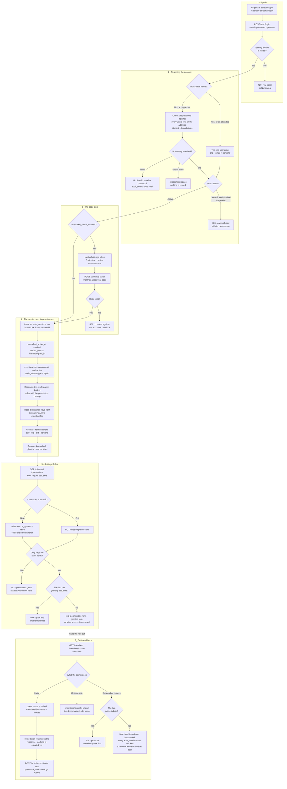

# Sign-in, roles and permissions

**Screens:** Sign-in, Settings Roles, Settings Users

How somebody gets into the organizer console and what they are allowed to do once they are there. It starts at a sign-in form — one for organizers, a separate one for attendees — and ends on the two settings screens where a workspace decides what each role may reach and who holds it. Everything downstream depends on this: the permission keys minted here are what [Approval](05-approval.md) and [Refund and cancellation](07-refund-and-cancellation.md) check before anybody can decide a registration or give money back.

1. **Sign-in.** Two doors, never one. An organizer signs in at `/auth/login` and an attendee at `/portal/login`, and those are separate accounts even on the same address: `users` carries a `persona` of `admin` or `attendee` and is unique on `(organization_id, email, persona)`. Both pages post to `POST /auth/login` through the same hook, and the one function that builds the body drops `orgSlug` for an attendee — attendee sign-in *refuses* a named workspace rather than ignoring it, because every attendee account lives in the single seeded platform organization (slug `eventa`) so that one person's tickets can span every organizer on the platform. Before any password is read, the attempt is checked against a Redis lock keyed on workspace + persona + email; `LOGIN_MAX_ATTEMPTS` consecutive misses set it for `LOGIN_LOCK_SECONDS`, and a locked attempt is a 429 that says how many minutes are left rather than "try again later". The counter is kept for an address that has no account at all, so the refusal never reveals whether one exists, and the whole throttle fails open — if Redis is unreachable, sign-in still works.
2. **Resolving the account.** The organizer's form no longer asks which workspace, because nobody knows the slug the product generated for them at sign-up. With no `orgSlug`, the API loads every `users` row on that address with `persona = 'admin'` — at most ten, since each one costs an argon2 verification — and checks the password against each. No match is a 401 "Invalid email or password", plus an `audit_events` row with `type = 'fail'` where the address did belong to a known account. Exactly one match signs in. Two or more — the same address *and* the same password in two workspaces — comes back as `chooseWorkspace` with each workspace's `slug` and `name` and no token at all; the form grows a picker and posts again naming one. That branch is only ever reached after the password has been proven, so it cannot be used to ask which workspaces an address belongs to. What follows is eligibility rather than credentials, read off `users.status`: `Active` continues; `Unconfirmed` is refused with a 403 and a fresh confirmation email; `Invited` is refused with a 403 telling them to open the invitation instead, since that email holds the token that actually works and a confirmation link would point at the wrong thing; `Suspended` is refused outright. None of the three counts towards the lockout — they are not password guessing.
3. **The code step.** When `users.two_factor_enabled` is set, a correct password buys a challenge and nothing else: no `auth_sessions` row and no tokens exist yet. The challenge is a five-minute `twofa` token carrying the user, the organization, the persona and the remember-me choice made on the password step. `POST /auth/two-factor` trades it, plus a TOTP code checked against `two_factors.secret_encrypted` or an unused `recovery_codes.code_hash`, for the session. Guesses are throttled per **account** on the same lock the password uses, because a six-digit code without a throttle is a keyspace rather than a secret. The account is re-read before the session opens, so somebody suspended between the password and the code gets no session.
4. **The session and its permissions.** Opening a session inserts an `auth_sessions` row whose uuid primary key *is* the session id — there is no separate refresh-token table. `device` is the User-Agent, `ip_address` the caller's IP, and `expires_at` is now plus `JWT_REFRESH_TTL`, or `JWT_REFRESH_TTL_SHORT` when remember-me was left unticked. `users.last_active_at` is touched and an `outbox_events` row with `routing_key = 'identity.signed_in'` is written; **eventa-worker** consumes that row and writes the `audit_events` entry with `type = 'signin'` and the title "Signed in from &lt;device&gt;". The audit trail is therefore populated a moment *after* the sign-in, by another process — it is not written on the request. Next, before the caller's keys are read, this workspace's built-in roles are reconciled against the permission catalog: a workspace is handed `DEFAULT_ROLES` once, the day it is created, so a key added to `permission_key` later never reaches an older workspace and an Admin described as "Full access" quietly cannot use the new feature. The repair only grants a key to a system role created *before* that key existed, and never overwrites an existing `role_permissions` row, so it fills a gap without reversing a decision. The caller's keys then come from their `memberships` row joined to `role_permissions`, counting only a membership with `status = 'Active'` and only rows with `granted = true`. Two JWTs are signed over `sub`, `org`, `sid` and `persona`; the browser keeps both in `localStorage` alongside the persona the *server* returned, and holds exactly one session, so signing into the portal signs you out of the console. `me.permissions` only tidies the console — it hides a button somebody cannot use — and decides nothing: `PermissionsGuard` re-reads the same keys on every guarded route and answers 403. What a key actually does is best seen in the money ones: a caller without `finView` gets `total_satang` back as `null` on the registrations list, which renders as "—" and never as `฿0`, because amounts travel as integer satang and are formatted only at the edge, and "you may not see this" is a different fact from "it was free".
5. **Settings → Roles.** `/admin/roles` loads `GET /roles` and `GET /permissions` together, both behind `setUsers`. `permissions` is a global, non-tenant lookup of the fifteen keys in the `permission_key` enum, grouped as `Events`, `Registrations`, `Finance` and `Settings`; `roles` is per workspace, and a new one starts with `Admin` (every key), `Organizer` and `Staff`, each flagged `is_system` and each carrying its member count. The split between neighbouring keys is deliberate — `regCheckin` works the door while `regManage` decides a registration, so Staff can admit people without being able to approve them. A custom role such as "Volunteer" is `POST /roles` and is written with `is_system = false`; a duplicate name is a 409 against `uq_roles_org_name`. Saving the switches is `PUT /roles/:id/permissions`, which replaces the role's grants wholesale and can be refused twice over: an actor who does not hold `setUsers` cannot grant a key they do not themselves hold (403), and no edit may take `setUsers` away from the last role that grants it (409), because nobody would then be able to grant it back. The write marks the chosen keys `granted = true` and *updates* the others to `false` rather than deleting them, so a deliberate removal is a recorded fact that the reconcile in step 4 will not quietly undo. A change binds immediately on the API, which re-reads the keys per request; the console's own copy refreshes the next time the shell calls `/auth/me`. Nothing here writes an `audit_events` row — the `perm` audit type exists in the enum but no code path uses it.
6. **Settings → Users.** `/admin/users` loads `GET /members`, which is paged server-side with its filters in the URL, plus `GET /members/counts` for the status tabs and `GET /roles` for the invite form and each row's role switcher — all behind `setUsers`. The tab counts deliberately ignore the status filter, so a tab still shows its own total while a different one is selected; search and role do narrow them. Inviting writes, in one transaction, a `users` row with `persona = 'admin'` and `status = 'Invited'` and a `memberships` row with the chosen `role_id`, the role's name denormalised into `memberships.role`, `status = 'Invited'` and `invited_at` — the invite lifecycle *is* the membership, and there is no separate table for teammate invitations. The invite token comes back in the response body rather than by email; wiring the mail provider is the one thing this screen still owes. (The **Resend** button on an `Invited` row posts `{ email }` to `POST /invitations`, which is the *event* invitation endpoint and requires an `eventId`, `recipientName` and `recipientEmail` — it does not re-send a workspace invite.) `POST /auth/accept-invite` spends the token, sets `users.password_hash` and flips both the user and the membership to `Active` with `joined_at`. Re-assigning somebody is `PATCH /members/:id`, updating `role_id` and the denormalised name together. Suspending sets both the membership and the user to `Suspended` and revokes every unrevoked `auth_sessions` row for them, so access ends in flight rather than whenever their access token happens to expire; reactivating puts both back to `Active` with the role untouched. Removing does the same and additionally stamps `deleted_at` on both rows, keeping their past work and leaving the address free to be invited again. Suspend and remove each refuse with a 409 when the member is the workspace's last `Active` Admin.

Mermaid source

[← All flows](README.md)
