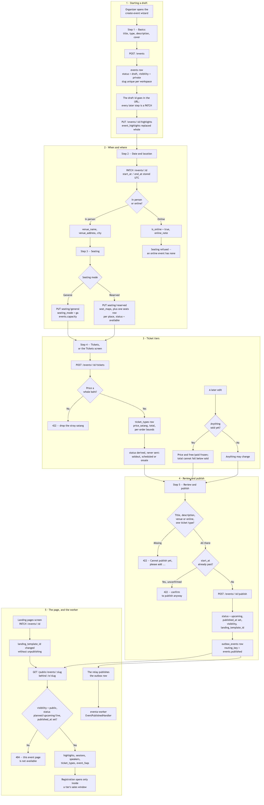
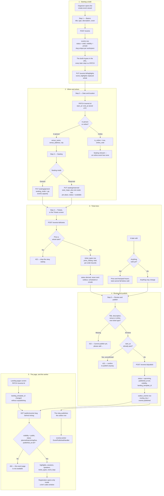

# Create and publish an event

**Screens:** Create event wizard, Landing pages, Tickets

How an organizer turns an idea into a public page an attendee can register on. It starts in the admin console's five-step wizard, which creates a draft on the first save and edits it from then on, and ends when the event is live at its own public address and eventa-worker has consumed the publish notice. Nothing here is attendee-facing: the organizer persona signs in at `/auth/login` for `/admin/*`, and the page it produces needs no account at all to read.

1. **Starting a draft.** The wizard at `/admin/event-form` opens blank and makes no calls at all until something is saved — on the API this is not one submit but a create followed by a long run of patches. The first save posts to `/events` (permission `evCreate`) with only a name, a type from the `event_type` enum, a start instant and an optional description, and inserts an `events` row with `status = 'draft'`, `bucket = 'active'`, `visibility = 'private'` and `published_at` still null. The slug is derived from the name, falls back to `event` when the name carries no latin alphanumerics (a Thai-only title, for instance), and is tried as `-2`, `-3`… until it is free, because `uq_events_org_slug` makes it unique per workspace rather than globally; `organizer_name` falls back to the workspace's own name and `created_by` records who did it. The description is rich text the organizer authors in Quill and an anonymous reader later loads, so it is sanitised on the way **in** and capped at 10,000 characters of markup. The new id goes straight into the URL — from then on a refresh or a closed tab cannot strand a draft nobody can find. The cover image is a separate two-step upload (`POST /events/cover/upload-url`, then `PUT` straight to storage, then `POST /events/cover`); it writes to no table, is staged per **organization** rather than per event because step 1 runs before a draft exists to key it to, and only the confirmed URL is saved, in `events.cover_image`. The Basics step's highlights are a `PUT /events/:id/highlights` that replaces `event_highlights` as a whole — at most 12 — so what the organizer sees is exactly what the page renders. FAQs work the same way into `event_faqs`, capped at 30.
2. **When and where.** Step 2 patches `events` with `start_at` and `end_at`, which are `timestamptz` — stored UTC, typed and displayed in Asia/Bangkok, with `events.timezone` defaulting to `'Asia/Bangkok'`. An end before or equal to the start is refused. An in-person event fills `venue_name`, `venue_address` and `city`; an online one sets `is_online = true` with an `online_note`, and the public page then never publishes a physical location even if one is stored. Step 3 is the room. General admission is a headcount: `PUT /events/:eventId/seating/general` sets `seating_mode = 'ga'` and writes the number into `events.capacity`. Reserved seating is a grid: `PUT /events/:eventId/seating/reserved` writes one `seat_maps` row per event (`uq_seat_maps_event`) carrying `layout` as `{ rows, seatsPerRow }` and `total_seats`, plus one `seats` row per position with `status = 'available'` — the `seat_status` enum is `available`, `held`, `reserved`, `sold`, `blocked`. Switching a reserved event back to general admission drops the map. Either way an **online** event is refused outright, and on an event that is no longer a draft a layout change that would remove a seat already `sold` is refused too. Note that a blank capacity is not a capacity of nought: the wizard's summary rail renders `—`, because "as many as the tiers allow" and "nobody may come" are different facts.
3. **Ticket tiers.** Step 4, and the standalone Tickets screen at `/admin/tickets`, both write `ticket_types` through `POST /events/:eventId/tickets` and `PATCH /events/:eventId/tickets/:ticketId`. `price_satang` is integer satang and VAT-inclusive; prices are set in whole baht, so a stray satang is refused, and the browser converts what was typed with `Math.round(baht × 100)` rather than sending a float. A free tier sets `is_free` and is held to a zero price by `ck_ticket_types_free_price`. `total` is the allocation, with `0` meaning unlimited; `ck_ticket_types_sold` keeps `sold` between 0 and `total`. `min_per_order` and `max_per_order` sit inside the platform's eight-seat booking cap and inside the allocation itself. What the tier is **not** given is its own availability: `status` is always derived server-side by the ticketing policy — `soldout` when the allocation is exhausted, `scheduled` while `sales_start_at` is still ahead, otherwise `onsale` — so the only value a human owns is `paused`, which survives until Resume and is refused a resume once `sales_end_at` has passed. Two rules protect sales already made: once `sold > 0` the price and the paid/free setting are frozen (a new tier is the answer), and `total` can never be set below `sold`. Raising `total` is the one edit with a side effect — the new places are offered to anyone waiting (see [Waitlist](04-waitlist.md)), and a failure there is reported as the offers being cut short rather than undoing the organizer's capacity change. Deleting a tier that never sold erases the row; one with sales is soft-deleted via `deleted_at`, so it leaves the list and stops selling while every issued ticket still resolves to it. The last remaining tier cannot go, and neither can one somebody is checking out with — an active `seat_holds` row refuses the delete with a sentence saying to pause it and try again.
4. **Review and publish.** `POST /events/:id/publish` needs the stronger `evPublish` permission, and refuses a draft that is not ready. The readiness gate asks for four things — a title, a description, a venue or an online link, and at least one ticket type — and answers a 422 naming the ones still missing ("Cannot publish yet — please add …"); the wizard's checklist applies the same four rules locally so the button and the server agree before it is pressed, and counts only tiers the API has actually stored. A start date already in the past is refused unless the request carries `confirmPastStart`, and a `version` that no longer matches is a 409 asking for a reload, which is what stops two people publishing different drafts of the same event. On success the row moves to `status = 'upcoming'` with `bucket = 'active'` and `published_at` stamped, and the request's optional `visibility` and `landing_template_id` are applied in the same write. Worth knowing: `planned` and `live` exist in the `event_status` enum and are accepted everywhere as live, but nothing ever writes them — publishing always lands on `upcoming`. In the same breath the service enqueues an `outbox_events` row with `aggregate_type = 'event'` and `routing_key = 'events.published'`, so the state change and the message about it commit together. Unpublishing is the exact reverse and loses nothing: `status` back to `draft`, `visibility` back to `private`, `published_at` cleared, every tier, seat and highlight preserved. Deleting is only ever available for a draft with no sales; a published event, or one with registrations, is routed to Cancel instead (see [Refund and cancellation](07-refund-and-cancellation.md)).
5. **The page, and the worker.** The public page lives at `/e/<slug>` and is served by `GET /public/events/:slug`, which returns a row only when `visibility = 'public'`, `status` is one of `planned`/`upcoming`/`live`, `published_at` is not null and `deleted_at` is null — anything else is a plain "This event page isn't available." `unlisted` is in the `visibility` enum but is not treated as reachable by that query, so today only `public` has a page. The payload is assembled read-only from `event_highlights`, `sessions`, `speakers`, `ticket_types` and `event_faqs`, with the accent colour falling back to `#2563EB` when none is stored or the stored one is not `#rrggbb`, and the template falling back to `aurora`. Registration is reported closed once `start_at` has passed and "not open yet" while every tier sits outside its sales window — a tier badged **On sale** is still refused at checkout by registration's own eligibility rules, which is deliberate (see [Checkout and payment](02-checkout-and-payment.md)); an event with `requires_approval` set confirms nothing at checkout either (see [Approval](05-approval.md)). The **Landing pages** screen offers the four designs — `aurora` (Classic), `noir` (Spotlight), `minimal` (Minimal), `atlas` (Vibrant), seeded into the global `landing_templates` lookup — and "Use template" is a plain `PATCH /events/:id` setting `landing_template_id`, deliberately so: it used to be settable only while publishing, which meant wanting a new look required taking a live event down. `PATCH /events/:id/page` additionally moves the slug (409 when it is taken in the workspace), the accent colour and the agenda/speakers headings, and `POST /events/page/preview` renders a page from values that have never been saved — it writes nothing and is flagged `noIndex` so a preview can never leak into search. Finally, the asynchronous part, which is the piece readers most often get wrong: **publishing sends no email.** The API only wrote the `outbox_events` row; the relay publishes it to RabbitMQ, and eventa-worker's `EventPublishedHandler` consumes `events.published`, validates the payload and records it — delivering the team's "Event published" notification is deferred, because the message carries a slug, a name and who published it, and no recipient addresses at all.

Mermaid source

[← All flows](README.md)
