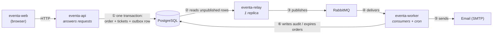

# How the services connect

A plain-language walkthrough of how **eventa-api**, **eventa-relay** and
**eventa-worker** fit together. The [SAD](software-architecture.md) is the formal
version; this is the five-minute one for anyone new to the codebase.

## The three services, one line each

| Service | Job | Talks to |
| --- | --- | --- |
| **eventa-api** | Answers requests. Takes money, issues tickets, writes the database. | Postgres, Stripe, the web app |
| **eventa-relay** | Carries messages from the database to the broker. Nothing else. | Postgres → RabbitMQ |
| **eventa-worker** | Does the slow things afterwards: sends email, writes audit rows, expires unpaid orders. | RabbitMQ, Postgres, SMTP |

The important thing to notice: **the API never talks to RabbitMQ, and the worker
never talks to the API.** They only ever meet through the database and the
broker.

## The picture



## Following one registration

Somebody books a ticket. Here is every hop.

**① The API commits one transaction.** The order, the tickets, the seat holds
*and* a row in `outbox_events` all land together. Either all of it happened or
none of it did.

**② eventa-relay notices.** Once a second it looks for rows where
`published_at IS NULL`.

**③ It publishes to RabbitMQ** with routing key `registration.confirmed`, and
waits for the broker to confirm before marking the row published.

**④ RabbitMQ delivers** to the `eventa.worker` queue, because the worker bound
that routing key at startup.

**⑤ The worker sends the email** — reads the live tickets, renders the message,
hands it to SMTP.

**⑥ The worker acks.** The message leaves the queue. Done.

Typical end-to-end: **about three seconds**.

## Why the database is in the middle

The obvious design is for the API to publish to RabbitMQ directly when a
registration happens. It doesn't, because RabbitMQ cannot join a Postgres
transaction — and there is no safe order to do two separate writes:

- **Commit the order, then publish** → the process dies in between, and a paying
  customer never gets a ticket. Nothing retries, because the intent only existed
  in memory.
- **Publish, then commit the order** → the commit fails, and somebody gets a
  confirmation email for an order that does not exist.

So the API writes the *intention to send* into a table it is already writing to,
and the relay carries it across afterwards. The trade is **"might be late"**
instead of **"might be lost"** — the right trade when a paid ticket is inside the
message.

That table is `outbox_events`. Its whole state machine is one column:
`published_at IS NULL` means *still owed*.

## What breaks when each one stops

This is the useful part, because the failure modes look nothing alike.

| Stopped | What users see | What happens to the data | Recovers by itself? |
| --- | --- | --- | --- |
| **eventa-api** | The site is down. Obvious immediately. | Nothing is written. | — |
| **eventa-relay** | **Nothing.** The site works, orders succeed, tickets issue. **No email is ever sent.** | Rows pile up unpublished. | ✅ Everything drains when it restarts |
| **eventa-worker** | Nothing. Orders succeed. No email is sent. | Messages queue in RabbitMQ. | ✅ Drains when it restarts |

**The relay is the dangerous one** — its absence is completely silent. Every
screen looks healthy while no email leaves the building. That has happened more
than once during development. If email has stopped, check the relay first:

```sql
-- Should be ~0. Growing means the relay is down or wedged.
SELECT count(*), min(created_at) AS oldest
  FROM outbox_events WHERE published_at IS NULL;
```

That query — **outbox lag** — is the single most useful health signal in the
platform, and worth more than a process liveness check. A relay that is running
but not publishing looks perfectly alive to a liveness probe.

## Who is allowed to touch what

- **eventa-api owns the database schema and all migrations.** Nothing else
  creates or alters a table.
- **eventa-relay** reads `outbox_events` and sets `published_at`. That is its
  entire footprint.
- **eventa-worker** reads what it needs for messaging, and writes `audit_events`
  plus — as the one agreed exception ([ADR-14](software-architecture.md#11-architecture-decisions-adrs))
  — `orders` and `seat_holds` when the expiry sweep closes an order nobody paid
  for.

Both the relay and the worker keep **typed mirrors** of the tables they touch.
Those mirrors must track eventa-api's enums: add a value there, add it in the
mirror in the same change, or a write will fail on a value the mirror has never
heard of.

## Two things the worker does that no message triggers

Most of the worker reacts to something the API published. Two jobs run on a
clock instead, because no event can announce the passing of time:

- **Order expiry** — closes orders whose seat hold lapsed before payment
  arrived, and retires the dead holds. Runs every minute.
- (Planned) **Event status transitions** — moving an event from `upcoming` once
  its start date passes.

See [ADR-14](software-architecture.md#11-architecture-decisions-adrs) for why
these live in the worker rather than the API.

## Running all of it locally

Four processes, and all four are required for email to work:

```bash
docker compose up -d          # in eventa-api: postgres, rabbitmq, mailpit
cd eventa-api    && pnpm dev
cd eventa-relay  && pnpm dev  # ← forget this and no email is ever sent
cd eventa-worker && pnpm dev
cd eventa-web    && pnpm dev
```

## One deployment rule

**eventa-relay runs at exactly one replica.** Its reader takes no row lock, so a
second instance would select the same rows and publish everything twice — and
consumers only dedupe *after* the first copy finishes, so two copies arriving
together are both handled. For a registration that means two confirmation emails
to the same buyer.

The API and the worker scale horizontally as normal. Scaling the relay requires
`FOR UPDATE SKIP LOCKED` in its reader first, so replicas claim disjoint rows.
