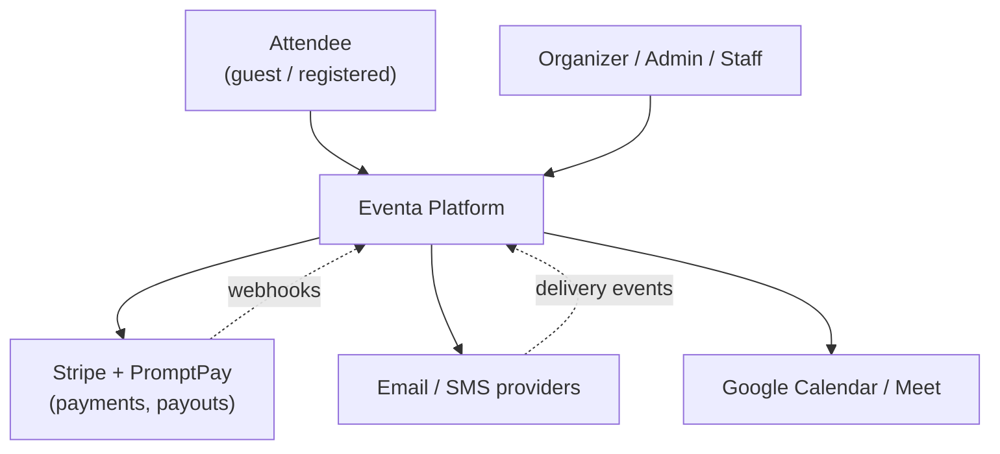
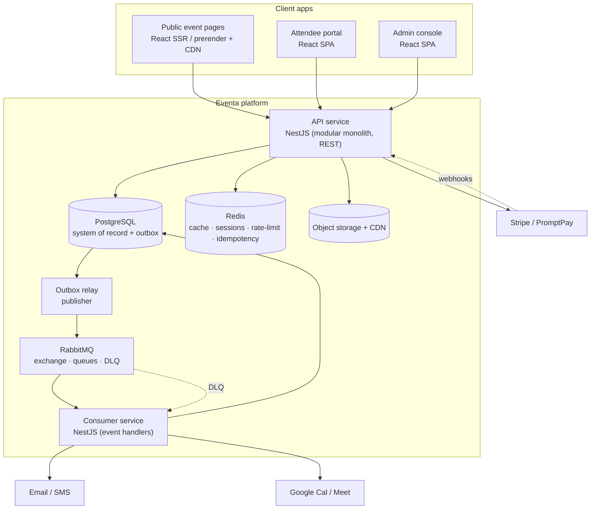
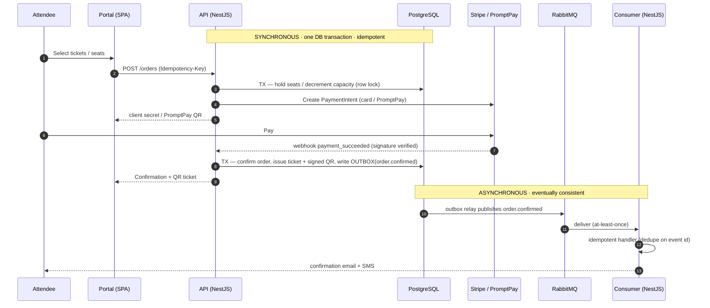
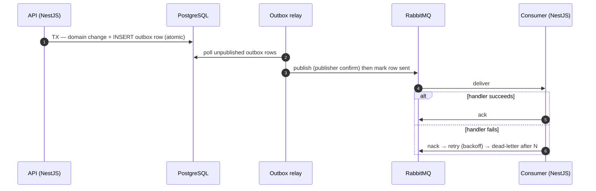
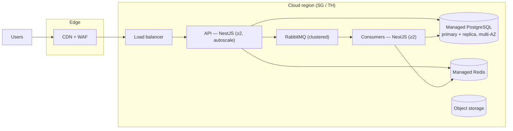

# Eventa — Software Architecture Document (SAD)

| | |
|---|---|
| **Author** | Software Architect |
| **Version** | 1.0 — **Baseline** |
| **Date** | 2026-07-23 |
| **Status** | Approved baseline (supersedes the earlier proposal) |
| **Companion docs** | Data model → [entities.md](entities.md) · [erd.md](erd.md) · Drivers → [non-functional requirements](../01-requirements-and-features/non-functional-requirements.md) · Scope → [product backlog](../01-requirements-and-features/functional-requirements.md) |

---

**Architecture coverage** — the four core parts of a software architecture are all addressed:

| Part | Where in this document |
|---|---|
| **Components** | §6.1 Containers · §6.2 API modules (bounded contexts) |
| **Interfaces** | §6.4 Interfaces & API contracts · §4.2 External interfaces |
| **Data flow** | §6.5 Data flow · §7 Runtime views |
| **Deployment environment** | §8 Deployment view |

## 1. Introduction & goals

Eventa is a multi-tenant, Thai-market **event registration & management** platform. This document is
the authoritative software architecture for building the MVP (Dec 2026) and evolving to v1.0
(Mar 2027) per the [project plan](../02-project-plan/project-plan.md). The **data architecture** lives
in [entities.md](entities.md) / [erd.md](erd.md); this document covers the system: components,
technology, runtime behaviour, deployment, and cross-cutting concerns.

**Top quality goals (drivers)**
1. **Money & inventory integrity** — never oversell a seat or double-charge a card.
2. **Elastic performance** — instant discovery and sub-2s checkout, including on-sale spikes.
3. **Security & compliance** — real payments (PCI SAQ-A) and Thai personal data (PDPA).
4. **Time-to-market** — MVP in ~4 months with a small team.

## 2. Constraints

| Type | Constraint |
|---|---|
| Technical | Reuse the existing React front-end (`../../eventa-web`); PostgreSQL as system of record; Stripe + PromptPay for payments |
| Stack | **NestJS** (API & consumers), **RabbitMQ** (eventing), **Redis** (cache/sessions), TypeScript end-to-end |
| Regulatory | PCI-DSS (SAQ-A via Stripe), Thailand PDPA (data residency, consent, retention, DSR) |
| Organisational | Small team; time-boxed release train; year-end freeze |

## 3. Architecture principles
1. **The server is the source of truth** — client validation is advisory; rules and money are enforced server-side.
2. **Money & inventory are synchronous and transactional** — decided in-request against the DB, never behind a queue (see §5, §7.1).
3. **Everything eventually-consistent is asynchronous** — notifications, calendar, reporting, search indexing flow through RabbitMQ.
4. **No event is ever lost** — domain change and its event are written in one DB transaction via the **transactional outbox**.
5. **Idempotency everywhere money, inventory, or a message is processed** — safe under retries and at-least-once delivery.
6. **One tenant can never see another's data** — enforced at the data layer, not just the UI.
7. **Modular now, splittable later** — NestJS modules align to bounded contexts (one module per responsibility, several per context — §6.2); extract services only on a real driver.

## 4. Context & scope

### 4.1 System context (C4 — Level 1)

### 4.2 External interfaces
| System | Direction | Purpose |
|---|---|---|
| Stripe (cards, Connect) + PromptPay | out + **webhooks in** | Charges, refunds, payouts; webhook = payment truth |
| Email / SMS providers | out + delivery webhooks | Confirmations, receipts, reminders, announcements |
| Google Calendar / Meet | out | Meeting invites & links |
| CDN / object storage | out | Media & static assets |

## 5. Solution strategy

**Style: a NestJS modular monolith for the API + an event-driven consumer tier over RabbitMQ, with
React SPAs and SSR public pages.** The decisive rule is the **consistency boundary**:

- **Synchronous path (in the API, one DB transaction):** authentication, authorization, seat/inventory
  reservation, order creation, payment confirmation, ticket issuance. These *cannot* be eventually
  consistent without risking oversell/double-charge.
- **Asynchronous path (RabbitMQ → consumers):** confirmation email/SMS, calendar invites, delivery-log
  updates, report/read-model aggregation, search indexing, webhook fan-out. These *should* be async to
  keep requests fast and resilient.
- **The bridge:** the **transactional outbox** — the API writes the domain change **and** an `outbox`
  row in the same transaction; an outbox relay publishes to RabbitMQ. No dual-write, no lost events.

## 6. Building-block view

### 6.1 Containers (C4 — Level 2)

| Container | Tech | Responsibility |
|---|---|---|
| Public event pages | React SSR/prerender + CDN | SEO-friendly, fast landing pages |
| Attendee portal / Admin console | React SPA (existing `eventa-web`) | Interactive attendee & organizer surfaces |
| **API service** | **NestJS**, REST/JSON | All business rules; **synchronous money/inventory**; writes outbox |
| **Outbox relay** | NestJS worker | Reads `outbox`, publishes to RabbitMQ (at-least-once) |
| **RabbitMQ** | RabbitMQ | Topic exchange, per-consumer queues, dead-letter exchange |
| **Consumer service** | **NestJS** microservice | Idempotent async handlers: email/SMS, calendar, read-models, indexing |
| PostgreSQL | Postgres 15+, primary + replica | System of record (see [ERD](erd.md)) + `outbox` |
| Redis | Redis | Sessions, cache, rate-limit, idempotency keys |
| Object storage + CDN | S3-compatible + CDN | Images / static assets |

### 6.2 API modules (bounded contexts, as NestJS modules)
Identity & Access · Organization · Events & Program · Ticketing · **Registration & Orders**
(owns the synchronous checkout) · Attendance · Payments & Finance · Engagement · Meetings ·
**Platform** (outbox, idempotency, audit, jobs). Modules own their tables and talk through
interfaces — no cross-module table access.

A context is the *architectural* unit; in code it may be delivered by **several flat, prefix-grouped
NestJS modules**, one per responsibility — Identity & Access ships as `auth` + `auth-signup` +
`auth-password` + `users` + `access`, Events & Program as `events` + `event-categories` + `event-program`
+ `event-seating` + `event-sharing` + `event-monitoring` + `event-duplication`. The boundary rule is
unchanged and applies between *modules*, not just contexts: depend on another module's exported service,
never on its tables or repository. See the development guide §2 and Appendix A.2 for the folder layout.

### 6.3 RabbitMQ topology
- **Exchange:** `eventa.events` (topic). Routing keys like `order.confirmed`, `payment.succeeded`,
  `registration.waitlisted`, `feedback.requested`.
- **Queues:** one per consumer concern (email, sms, calendar, read-model, search), bound to the keys
  they need — competing consumers scale horizontally.
- **Reliability:** publisher confirms; manual acks; **dead-letter exchange** `eventa.dlx` with retry
  (backoff) and a parking queue for poison messages.

### 6.4 Interfaces & API contracts
Interfaces are the defined interaction points between components — each a contract that hides the
component's internals.

**Client ↔ API — REST/JSON over HTTPS.** Versioned (`/api/v1`), authenticated by a Bearer JWT access
token, tenant-scoped. Resource groups map to modules (representative, not exhaustive — a full endpoint
catalogue is a follow-up artifact):

| Resource group | Module | Example endpoints |
|---|---|---|
| Auth & session | Identity & Access | `POST /auth/login`, `/auth/refresh`, `/auth/2fa/verify`, `DELETE /session` |
| Events & program | Events & Program | `GET/POST /events`, `POST /events/:id/publish`, `POST /events/:id/sessions` |
| Ticketing | Ticketing | `GET/POST /events/:id/ticket-types`, `POST /discounts` |
| Discovery (public) | Events | `GET /discover`, `GET /events/:slug` |
| Orders & checkout | Registration & Orders | `POST /orders` (Idempotency-Key), `GET /orders/:id` |
| Check-in | Attendance | `POST /check-ins` (scan), `GET /events/:id/check-in/stats` |
| Payments & finance | Payments & Finance | `GET /payments`, `POST /refunds`, `GET /invoices/:id.pdf`, `GET /payouts` |
| Engagement | Engagement | `POST /announcements`, `GET /notifications`, `POST /surveys` |
| Settings & team | Organization / Identity | `GET/PUT /org`, `POST /members`, `PUT /roles/:id` |

**Inter-module interfaces (in-process).** Each NestJS module exposes a typed service interface (a
provider); callers depend on the interface, never on another module's implementation or tables — this
is what keeps the monolith modular and splittable.

**Asynchronous contracts (domain events).** RabbitMQ messages are versioned contracts — routing key +
payload schema — that decouple producers from consumers:

| Event (routing key) | Key payload | Consumers |
|---|---|---|
| `order.confirmed` | orderId, eventId, attendee, tickets | email, sms, read-model, search |
| `payment.succeeded` / `refunded` | paymentId, orderId, amount | finance read-model, email |
| `registration.waitlisted` / `promoted` | registrationId, eventId | email, sms |
| `checkin.recorded` | ticketId, eventId, at | live-stats, read-model |
| `meeting.scheduled` | meetingId, attendees | calendar (Google Meet) |
| `feedback.requested` | eventId, attendee | email |

**Inbound webhooks (external → API).** Signature-verified and idempotent, handled by the API (not a
consumer): Stripe/PromptPay payment & payout events; email/SMS delivery callbacks (feed the delivery
log).

**Outbound external APIs.** Stripe, email/SMS gateway, Google Calendar/Meet (see §4.2) — each behind
an **adapter interface** so a provider can be swapped without touching business logic.

### 6.5 Data flow
The principal pathways data moves along (each detailed where noted). Every path is TLS-encrypted,
tenant-scoped, and passes server-side authorization — none bypasses it.

- **Read path** (discovery, landing, dashboards): client → CDN → API → Redis cache / read replica →
  PostgreSQL. Hot public reads come from cache/CDN; reporting reads hit the replica.
- **Write / checkout path** (integrity-critical): client → API → **PostgreSQL transaction** (hold +
  order) → Stripe; payment webhook → API → transaction (confirm + issue ticket + write outbox). Detailed in §7.1.
- **Async side-effect path**: API → `outbox` (same DB tx) → relay → RabbitMQ → consumer →
  DB/read-model + email/SMS/calendar. Detailed in §7.2.
- **Webhook ingress**: Stripe / providers → API (verify signature, dedupe) → DB and/or emit domain events.
- **Media path**: client → object storage (validated upload) → CDN → client.

Data-flow diagrams: system-level in §4.1, container-level in §6.1, and step-by-step in the §7 runtime views.

## 7. Runtime view

### 7.1 Checkout — synchronous, transactional, idempotent (integrity-critical)

The **webhook is the source of truth** for payment; the browser return is only a hint. Unpaid holds
expire and release inventory. Confirmation is idempotent, so duplicate webhooks never double-issue.

### 7.2 Reliable eventing — outbox → RabbitMQ → consumer

## 8. Deployment view

- **Environments:** dev → staging → production (parity) + ephemeral PR previews.
- **Packaging:** API, relay, and consumers ship as containers; managed Postgres/Redis/RabbitMQ.
- **CI/CD:** build → test → security scan → gated DB migration → rolling/blue-green deploy + auto-rollback.
- **IaC + secrets vault.**

## 9. Cross-cutting concepts

- **Domain & data** — see [entities.md](entities.md)/[erd.md](erd.md). Multi-tenant via
  `organization_id` + Postgres **row-level security**; money as **integer satang**; order→ticket
  commerce model.
- **Messaging & consistency** — RabbitMQ for side effects; **outbox** for atomic publish; **idempotent
  consumers** (dedupe on event id); DLQ + retry. At-least-once delivery is assumed.
- **Concurrency & inventory integrity** — capacity/seat changes only inside DB transactions with row
  locks / conditional updates; **short-lived seat holds** during checkout; idempotency keys on order
  create & confirm; unique constraints on QR tokens and discount redemptions.
- **AuthN/AuthZ** — **JWT**: short-lived access tokens (`Authorization: Bearer`, verified statelessly)
  plus long-lived **refresh tokens** persisted in `auth_sessions` so logout / compromise is revocable
  (a short access-TTL bounds the revocation window); **two separate identity realms** (attendee vs
  workspace member); TOTP 2FA; OAuth social sign-in; **RBAC** (12 permissions × 4 roles) enforced
  server-side on every mutating endpoint.
- **Payments & PCI** — Stripe hosted fields + PromptPay; platform is **SAQ-A** (never stores PANs/bank
  numbers); Connect for payouts; webhooks reconcile the ledger.
- **Privacy / PDPA** — SG/TH region; consent capture; documented retention & deletion (supports
  account deletion); data-subject-request tooling; cross-border controls.
- **Caching & performance** — CDN for public pages/images; Redis cache for hot reads
  (discover/landing/dashboards); read replica for reporting; indexes per the data model.
- **Search** — PostgreSQL full-text, bilingual (EN/TH) config, for discovery in the MVP.
- **Files & media** — validated uploads (type/size, virus-scan) in object storage via CDN; QR/flyer/
  ticket images generated client-side.
- **Observability** — structured logs + correlation ids, metrics, tracing (HTTP **and** message
  spans), error tracking, uptime checks, plus the business **audit log**.
- **Resilience & error handling** — timeouts, retries with backoff, circuit breakers on external
  calls, DLQ for messages, graceful degradation (read-only discovery from cache under stress).
- **Security** — TLS, WAF, per-IP + per-account rate limiting (Redis), secrets vault, encryption at
  rest, dependency scanning, least-privilege infra roles.

## 10. Technology stack

| Layer | Choice | Rationale |
|---|---|---|
| Front-end | React 19 · TypeScript · Vite · Tailwind v4 (existing) | Reuse prototype |
| Public pages | React SSR / prerender + CDN | SEO & first paint |
| **API** | **NestJS** (TypeScript, REST) | Modular, DI, testable; native RabbitMQ transport |
| **Eventing** | **RabbitMQ** (topic exchange, DLQ) | Reliable routing & retries for async work |
| **Consumers** | **NestJS** microservice | One stack; shared modules/DTOs with the API |
| Database | PostgreSQL 15+ (primary + replica) | Integrity, transactions, RLS, FTS (see [ERD](erd.md)) |
| Cache / sessions | Redis | Sessions, cache, rate-limit, idempotency |
| Payments | Stripe (cards, Connect) + PromptPay | PCI offload, Thai rails |
| Messaging out | Email + Thai SMS | Delivery + webhooks |
| Calendar | Google Calendar / Meet | Meetings |
| Storage/CDN | S3-compatible + CDN | Media |
| Infra | Containers, managed services, SG/TH region | Simplicity + PDPA residency |
| Observability | Logs + metrics + tracing + error tracking | Operability |

## 11. Architecture decisions (ADRs)

| ADR | Decision | Rationale / alternative |
|---|---|---|
| **ADR-1** | Modular monolith on **NestJS** (API); modules = bounded contexts | Structure + speed; splittable later. *Alt: microservices — premature.* |
| **ADR-2** | **Event-driven side effects via RabbitMQ** + NestJS consumer tier | Decouples async work; scales consumers. *Alt: Redis queue — less routing/DLQ.* |
| **ADR-3** | **Transactional outbox** for publishing | Eliminates dual-write loss. |
| **ADR-4** | **Checkout/inventory is synchronous & transactional**; async only for eventually-consistent side effects | Prevents oversell/double-charge. *Alt: fully event-sourced checkout — too risky for MVP.* |
| **ADR-5** | Shared PostgreSQL, multi-tenant `organization_id` + RLS | Strong isolation, low ops. *Alt: DB-per-tenant — overhead.* |
| **ADR-6** | Redis for cache/rate-limit/idempotency (separate from RabbitMQ) | Right tool per job. Sessions are stateless JWTs; refresh state lives in `auth_sessions`. |
| **ADR-7** | Stripe + PromptPay; SAQ-A; webhooks as truth | Minimal PCI scope. |
| **ADR-8** | **JWT access + refresh** (Bearer) + dual realms + TOTP 2FA; server-side RBAC | Stateless access checks; refresh tokens persisted in `auth_sessions` keep revocation (logout/compromise); persona separation. *Revised from server-side sessions.* |
| **ADR-9** | SSR/prerender public pages; SPA for portal/admin | SEO & speed where needed. |
| **ADR-10** | Postgres FTS (bilingual) for MVP search | Avoids extra infra now. |
| **ADR-11** | Host SG/TH region | Latency + PDPA residency. |
| **ADR-12** | Money as integer satang; ledger reconciled from Stripe | Avoids float errors; auditable. |
| **ADR-13** | Idempotent consumers + DLQ + retry/backoff | Safe under at-least-once delivery. |

## 12. Quality requirements (NFR → mechanism)

| NFR theme | Mechanism |
|---|---|
| Money integrity / reliability | Sync transactional checkout, seat holds, idempotency, webhook-as-truth, outbox |
| Performance | CDN + SSR, Redis cache, read replica, indexed queries |
| Scalability | Stateless autoscaled API, competing RabbitMQ consumers, replica offload |
| Security & Trust | Stripe SAQ-A, sessions + 2FA, server-side RBAC, WAF, rate limiting |
| Privacy / PDPA | Regional hosting, consent, retention/deletion, DSR, audit log |
| Availability | Multi-AZ Postgres, clustered RabbitMQ, ≥2 instances, backups + PITR |
| Localization | Bilingual FE + FTS, THB satang, Asia/Bangkok |
| Supportability | Structured logs, tracing across HTTP + messages, audit trail |

## 13. Risks & technical debt
- **Async used where sync is required** → architectural guardrail: money/inventory never behind the queue (§5, ADR-4); code review + tests enforce it.
- **Outbox relay lag / duplicate publish** → publisher confirms + idempotent consumers; monitor outbox depth.
- **RabbitMQ operational burden** → managed/clustered RabbitMQ; DLQ dashboards; alerting on queue depth.
- **Tenant data leakage** → RLS + scoped data layer + cross-tenant denial tests.
- **Monolith erosion** → enforced module boundaries; no cross-module table access; periodic fitness checks.

## 14. Evolution
Split a module into a service only on a real driver: a **payments/ledger** service for compliance
isolation; a **search** service (OpenSearch) if FTS is outgrown; a **check-in** service for event-day
scale. The §6.2 modules and RabbitMQ contracts are the seams to split along.

---

_Baseline architecture. Changes are made by superseding the relevant ADR; the data-level design is
maintained in [entities.md](entities.md) / [erd.md](erd.md)._
