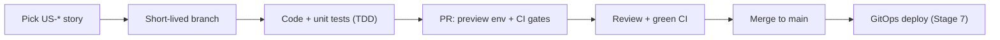

# Eventa — Development Guide

| | |
|---|---|
| **Author** | Tech Lead |
| **Version** | 1.0 · 2026-07-23 |
| **Audience** | Engineers building Eventa |
| **Grounded in** | [Software architecture](../04-architecture/software-architecture.md) · [Data model](../04-architecture/entities.md) · [Product backlog](../01-requirements-and-features/functional-requirements.md) · [CI/CD](../07-deployment/devops-ci-cd.md) |

The engineering handbook: how we turn the architecture and backlog into working, tested, shippable
code. It defines the repo layout, local setup, conventions, and the day-to-day workflow. It does **not**
restate the architecture (see the SAD) — it tells you how to build against it.

## 1. Tech stack (developer view)
| Area | Tech | Reference |
|---|---|---|
| Frontend | React 19 · TypeScript · Vite · Tailwind v4 (existing `../../eventa-web`, built from `../../eventa-ui-kit`) | [Design reference](../03-ux-ui-design/design-reference.md) |
| Backend | **NestJS** (TypeScript) — modular monolith; REST | [SAD §5–6](../04-architecture/software-architecture.md) |
| Data | PostgreSQL 15+ · **Drizzle ORM** (SQL-first, typed) · Redis | [entities.md](../04-architecture/entities.md) |
| Messaging | RabbitMQ (consumer + outbox relay) | [SAD §6.3, §7.2](../04-architecture/software-architecture.md) |
| Language baseline | TypeScript **strict**, ESLint + Prettier, end-to-end | §4 |

## 2. Repository structure (polyrepo)
Each deployable is its **own repository** — independent versioning, CI, and release. There is **no
shared contracts package**: the web↔api contract is the API's **OpenAPI** spec (web generates its
client from it); the api↔worker event contract is enforced by **runtime validation + Pact contract
tests**, each service owning its own event type.

| Repository | Deployable | Notes |
|---|---|---|
| **`eventa-web`** | web | React SPA + SSR (today's `../../eventa-web`) + generated API client |
| **`eventa-api`** | api (check-in pool image; ships the outbox relay) | NestJS modular monolith; **owns DB schema & migrations**; emits `openapi.json` |
| **`eventa-worker`** | worker | NestJS RabbitMQ consumers — async side effects |
| **`eventa-infra`** | — | Terraform + Helm + Argo CD (Stage 7) |

**`eventa-api`** — domain (bounded-context) modules, each a vertical slice:
```
eventa-api/
├── src/
│   ├── main.ts                     # HTTP entrypoint (also the check-in pool image)
│   ├── relay.ts                    # outbox publisher
│   ├── db/                         # Drizzle: schema/ · migrations/ (SQL) · meta/
│   ├── modules/
│   │   ├── identity/  organization/  events/  ticketing/
│   │   ├── registration/
│   │   │   ├── registration.controller.ts   # DTOs → drive OpenAPI
│   │   │   ├── registration.service.ts
│   │   │   ├── registration.repository.ts
│   │   │   ├── dto/
│   │   │   └── events/order-confirmed.event.ts   # producer owns its payload
│   │   ├── attendance/  payments/  engagement/
│   │   └── meetings/  platform/     # outbox, idempotency, audit, jobs
│   └── common/                      # guards, interceptors, filters, tenancy
├── test/contract/                   # Pact PROVIDER verification
└── openapi.json                     # generated → consumed by web
```

**`eventa-worker`** — the same domains, handler-shaped; channel adapters injected:
```
eventa-worker/
├── src/
│   ├── main.ts                      # consumer bootstrap
│   ├── modules/                     # mirror the api's domains
│   │   ├── registration/
│   │   │   ├── order-confirmed.handler.ts
│   │   │   └── order-confirmed.schema.ts     # zod: the shape it expects
│   │   ├── payments/  engagement/  meetings/
│   │   └── insights/                # read-model / projection builders
│   └── common/
│       ├── providers/               # email · sms · calendar (injected)
│       └── idempotency/  tenancy/  telemetry/
└── test/contract/                   # Pact CONSUMER tests
```

**`eventa-web`** — feature-based (unchanged), with a generated API client:
```
eventa-web/
└── src/
    ├── features/                    # events · ticketing · registration · portal · …
    ├── api/generated/               # typed client from eventa-api's openapi.json
    ├── components/ui/
    └── lib/
```

A NestJS **module = a bounded context** (SAD §6.2); modules depend on each other's **service
interface**, never on another module's tables. The **worker mirrors the api's domain modules** (same
names), with channel clients (email/sms/calendar) injected from `common/providers` — never used as the
folder structure.

**Contract safety (no shared package):**
- **web ↔ api** → `eventa-api/openapi.json` → `eventa-web/src/api/generated/`, regenerated in CI.
- **api ↔ worker** → each owns its event type (`events/*.event.ts` in api, `*.schema.ts` in worker);
  the worker validates every message (tolerant reader) and **Pact** tests in both `test/contract/`
  folders fail CI on drift. Payloads carry a `version` field for breaking-change overlap.
- **Schema ownership:** `eventa-api` owns migrations; `eventa-worker` touches only agreed read-model tables.

## 3. Local development setup
**Prerequisites:** Node LTS, pnpm, Docker. Clone each service repo you're working on.
1. **Shared infra** — in `eventa-infra` (or a dev compose), `docker compose up -d` → PostgreSQL, Redis, RabbitMQ.
2. In each repo: `pnpm install`; copy `.env.example` → `.env` (sandbox keys; never commit secrets — §12).
3. **`eventa-api`**: `pnpm migrate && pnpm seed` (api owns the schema), then `pnpm dev` (HTTP) and `pnpm relay`.
4. **`eventa-worker`**: `pnpm dev`.
5. **`eventa-web`**: `pnpm dev` (port 5180).

> The **front-end prototype runs today** against mock data; point it at the local API as endpoints
> land. Web regenerates its API client from `eventa-api`'s `openapi.json` in CI.

## 4. Coding standards & conventions
- **TypeScript strict** everywhere; no `any` without justification. ESLint + Prettier enforced in CI.
- **Frontend** — keep the existing **feature-based** structure and `components/ui` primitives; follow
  `../../eventa-web/CONVENTIONS.md`; Tailwind utilities, class-based light/dark.
- **Backend (NestJS)** — per module: `*.controller.ts` (HTTP), `*.service.ts` (rules), a data-access
  layer, `dto/` (request/response with validation), `events/` (published/consumed contracts). Use DI;
  keep controllers thin, rules in services.
- **No cross-module table access** — call the other module's service interface.
- **Money is integer satang**; format at the edge only. **Time** is stored UTC, displayed
  Asia/Bangkok. **All user-facing strings** are bilingual EN/TH.
- **Errors**: a standard error envelope (`code`, `message`, `details`); validation via DTOs; never leak internals.
- **Logging**: structured JSON with a correlation id (§13); never log secrets or PANs.

## 5. Building a feature (the playbook)
From a backlog story to shipped, every time:
1. **Pick a `US-*` story**; read its acceptance criteria (they become your tests) and the relevant SAD module.
2. **Model** — if new fields/tables are needed, add a migration (§6) consistent with [entities.md](../04-architecture/entities.md).
3. **DTOs + validation** for inputs/outputs.
4. **Service logic** in the owning module; **scope every query by `organization_id`** (multi-tenancy).
5. **Choose the consistency path (SAD §5):**
   - Money/inventory (checkout, seat holds, ticket issue) → **synchronous, in one DB transaction, idempotent** (accept an idempotency key). Never behind the queue.
   - Side effects (email/SMS, calendar, read-models, search) → write a row to the **`outbox`** in the *same* transaction; a consumer handles it. Never dual-write.
6. **Idempotency** on any money/inventory mutation and every consumer handler (dedupe on key/event id).
7. **Tests** — unit for rules/calculations (TDD), integration for the flow (§10).
8. **Expose** the REST endpoint (§7) and **integrate the frontend**.
9. **PR** with acceptance criteria verified in the preview env (§11).

## 6. Database & migrations
- **ORM: Drizzle** (SQL-first, fully typed) — chosen because the money path needs first-class row
  locking (`.for('update')` → `SELECT … FOR UPDATE`) and multi-tenant **RLS**
  (`SET LOCAL app.current_org` via a raw `sql` fragment), both of which Drizzle does cleanly while
  keeping inferred types. The schema of record is [entities.md](../04-architecture/entities.md)/[erd.md](../04-architecture/erd.md); `eventa-api` owns it.
- **Migration workflow** — the schema lives in TS (`src/db/schema`); `drizzle-kit` diffs it into **plain
  SQL** migration files (reviewed in the PR):
  - `pnpm drizzle-kit generate --name <change>` → emits `NNNN_<change>.sql` + a `meta/` snapshot.
  - `pnpm drizzle-kit migrate` → applies pending migrations (tracked in `__drizzle_migrations`).
  - Non-diffable SQL (RLS **policies**, functions) goes in a **custom** migration:
    `drizzle-kit generate --custom --name enable_rls`, then hand-write `CREATE POLICY …`.
- **Expand/contract** for zero-downtime: add columns/tables (expand) → deploy code that writes both →
  backfill → switch reads → remove old (contract). Never edit a shipped migration — add a new one.
- **Row-level security**: policies in a migration + `SET LOCAL app.current_org` per transaction + a
  tenant-scoped data layer (defence-in-depth).
- **Seed data** for local/test: ≥2 tenants, events across states, ticket types, test cards, sandbox PromptPay.

## 7. API conventions
- **REST/JSON**, versioned `/api/v1`, authenticated by a **Bearer JWT** access token (short-lived;
  refresh via `POST /auth/refresh`, revocable through `auth_sessions`), tenant-scoped (SAD §6.4).
- **DTO validation** on every input; consistent pagination, filtering, sorting.
- **Standard error envelope**; correct status codes; `403` for authz denial (enforced **server-side**, not just hidden UI).
- **Webhooks** (Stripe/PromptPay) land on the API, are **signature-verified and idempotent** (dedupe via `webhook_events`).

## 8. Async & messaging in code
- **Publish** only through the outbox (§5); the relay delivers to RabbitMQ with publisher confirms.
- **Consume** with idempotent handlers; ack on success, nack→retry→DLQ on failure.
- **Event contracts** are owned per service (no shared package): the producer defines the payload; each consumer validates it (tolerant reader) and pins expectations with **Pact** tests; payloads carry a `version` for breaking-change overlap.

## 9. Testing during development
- **Unit-test the rules** (VAT, fees, capacity, discounts) TDD-style; **integration-test** flows against
  the docker-compose stack and provider sandboxes.
- Every `US-*` acceptance criterion has a test (see [Stage 6](../06-testing/test-cases.md)); coverage gate in CI.
- Run locally before pushing; CI re-runs everything (§11).

## 10. Git workflow & code review
- **Trunk-based**: short-lived branches off `main` (`feat/US-EVT-010-…`, `fix/…`), **conventional commits**.
- Open a **PR** → gets a preview env + full CI gates ([CI/CD](../07-deployment/devops-ci-cd.md)); at least one review.
- **Review checklist:** acceptance criteria met · tenant scoping · idempotency on money/inventory · tests · no secrets · errors handled · a11y/i18n where relevant.
- Merge only when **CI is green and reviewed**; `main` stays releasable.



## 11. Definition of Done (developer)
Acceptance criteria pass · code reviewed & merged · unit/integration tests green · meets applicable
NFRs · no known S1/S2 defects · PO-accepted in staging. (Matches the [project plan](../02-project-plan/project-plan.md) §9.)

## 12. Security & quality in code (shift-left)
- **Secrets** come from env/vault, **never committed**; `.env` is git-ignored (secret-scanning in CI).
- **Validate all input**; parameterized queries; enforce **authz server-side** on every mutating endpoint.
- **Never handle card/bank data** — Stripe hosted fields only (PCI SAQ-A). Handle personal data per **PDPA** (minimize, retain, delete).
- Keep dependencies current; CI runs SAST/SCA/secret/container scans ([DevSecOps](../08-maintenance/devops-observability-sre.md)).

## 13. Observability in code
- Emit **structured logs** with a **correlation id** propagated across HTTP requests **and** RabbitMQ messages.
- Instrument **OpenTelemetry spans** on requests, DB calls, and message handlers; expose Prometheus metrics.
- Surface domain signals the SRE doc consumes (checkout success, outbox lag, queue depth) — see [Stage 8](../08-maintenance/devops-observability-sre.md).

---

_Living document — evolve it as the codebase and conventions mature._
