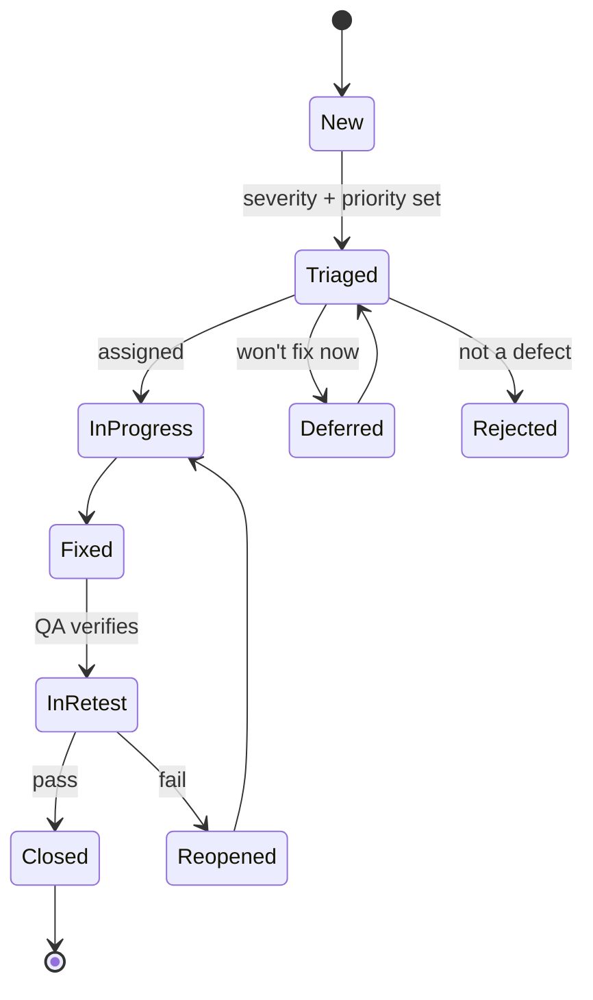

# Eventa — Test Plan

| | |
|---|---|
| **Product** | Eventa — Event Registration & Management Platform |
| **Author** | QA Engineer |
| **Version** | 1.0 · 2026-07-23 |
| **Test basis** | [Product backlog](../01-requirements-and-features/functional-requirements.md) (161 user stories) · [Quality requirements](../01-requirements-and-features/non-functional-requirements.md) (46 NFRs) · [Architecture](../04-architecture/software-architecture.md) |

**Testing-cycle coverage** — this plan and its companion [test-cases.md](test-cases.md) cover the 7-step cycle:

| Step | Where |
|---|---|
| 1. Requirement analysis | §2 |
| 2. Test planning | §3 |
| 3. Test case design | [test-cases.md](test-cases.md) (summary in §4) |
| 4. Test environment setup | §5 |
| 5. Test execution | §6 |
| 6. Defect reporting & tracking | §7 |
| 7. Test closure | §8 |

---

## 1. Introduction & scope
This plan defines how Eventa is verified against its requirements. **In scope:** functional,
usability, performance, security, compatibility, accessibility, and localization testing of the
attendee portal, public pages, and admin console, plus the API and integrations. **Out of scope:**
testing of third-party internals (Stripe, Google) beyond our integration contract; native mobile apps
(not built). Testing is **risk-based** — the core money path (discover → register → pay → ticket →
check-in) and multi-tenant isolation get the deepest coverage.

## 2. Requirement analysis (step 1)
- **Test basis is testable:** every user story already carries Given/When/Then acceptance criteria and
  every NFR a measurable target — these convert directly into test cases and pass/fail checks.
- **Traceability:** each test case references its `US-*` (functional) or `NFR-*` (quality) source; §8
  reports coverage so no requirement ships untested.
- **Ambiguities / assumptions to confirm with the PO/Architect before execution:**
  - Exact performance percentiles per endpoint (NFRs give targets; confirm measurement points).
  - PDPA specifics (retention periods, DSR SLAs) need legal sign-off to test against.
  - Payment edge behaviour (partial refunds, PromptPay timeout/expiry) — confirm expected outcomes.
  - Overselling/idempotency limits (max concurrent buyers per seat) — confirm acceptance thresholds.
- **Highest-risk areas (most test effort):** checkout/payment integrity, seat/inventory concurrency,
  multi-tenant data isolation, RBAC enforcement, check-in under parallel load.

## 3. Test planning (step 2)

**Objectives:** verify each story meets its acceptance criteria; confirm launch-critical NFRs; find
defects early; give a defensible go/no-go per milestone.

**Test levels & types**

| Level / type | Approach | Primary tooling |
|---|---|---|
| Unit | Per module, by developers; TDD on rules/calculations (VAT, fees, capacity) | Test framework in CI |
| Integration | Module ↔ DB ↔ RabbitMQ ↔ Stripe sandbox contracts | CI, provider sandboxes |
| System / E2E | The [test-cases.md](test-cases.md) suite through the UI/API | Playwright / Cypress |
| **Functional** | Test cases from acceptance criteria | Manual + automated E2E |
| **Usability** | Task-based sessions + heuristic review on the prototype | Moderated sessions |
| **Performance / load** | On-sale spike, concurrent multi-tenant check-in, report queries | k6 / JMeter |
| **Security** | AuthN/Z, **RBAC bypass**, **tenant isolation**, OWASP Top 10, rate limiting, PCI scope | ZAP + manual pentest |
| **Compatibility** | Chrome/Safari/Firefox/Edge + iOS/Android, responsive | BrowserStack |
| **Accessibility** | WCAG 2.1 AA — keyboard, screen reader, contrast | axe + manual |
| **Localization** | EN/TH, ฿ formatting, Asia/Bangkok, PromptPay | Manual |
| **Regression** | Automated suite re-run every release | CI |
| **UAT** | PO/stakeholder acceptance before each launch | Manual |

**Schedule (aligned to the [project plan](../02-project-plan/project-plan.md)):** testing is
continuous — test cases written alongside each sprint's stories; automated regression grows per
sprint; a dedicated **hardening/beta sprint (S8)** runs full system + load + security + UAT before
**M3 MVP launch (2026-12-08)**; the same gate repeats before **M5 v1.0 (2027-03-16)**.

**Entry criteria (start testing a build):** stories code-complete & unit-tested; build deployed to the
test env; test data seeded; acceptance criteria clarified.

**Exit criteria (per milestone):** 100% of in-scope test cases executed; **0 open S1/S2 defects**;
launch-critical NFRs met; regression green; UAT signed off; go/no-go recorded.

**Resources:** QA Engineer (lead) + developers (unit/integration) + PO (UAT/acceptance) per the
project-plan RACI.

**Deliverables:** this test plan · [test-cases.md](test-cases.md) · traceability coverage · defect
log · per-milestone **test summary report** (§8).

## 4. Test case design (step 3)
Detailed, executable test cases live in **[test-cases.md](test-cases.md)** — organized by epic, each
derived from a story's acceptance criteria and business rules, with ID, traceability (`US-*`),
priority, type, preconditions, test data, steps, and expected result. Coverage: a happy path plus the
key negative/edge/validation cases per story. Priority defaults from MoSCoW (Must→High, Should→Medium,
Could→Low). Beyond these, exploratory testing supplements scripted cases in high-risk areas.

## 5. Test environment setup (step 4)

| Environment | Purpose | Notes |
|---|---|---|
| Dev | Developer testing | Ephemeral; mock/seed data |
| **Test / Staging** | System, integration, regression, performance | Production-like; **Stripe & PromptPay sandbox**; email/SMS sandbox |
| UAT | PO/stakeholder acceptance | Stable release candidate |
| Perf | Load & spike tests | Isolated, production-sized data |

**Configuration:** locale THB (฿), VAT 7%, timezone Asia/Bangkok, EN + TH; feature flags per release.
**Test data:** ≥2 seed organizations (tenant-isolation tests), events across states
(draft/published/live/completed), ticket types (free/paid/reserved/GA), **Stripe test cards** &
**PromptPay sandbox**, waitlisted/checked-in attendees, and a large attendee set (tens of thousands)
for performance. **Prerequisites:** sandbox credentials, seeded data, test accounts per role
(Admin/Organizer/Staff/Attendee), signed QR test tickets for check-in.

## 6. Test execution (step 5)
Execute test cases, record **actual vs expected**, mark Pass/Fail/Blocked, and log defects for
mismatches. Run per sprint on each build; full suite + regression in the hardening gate. Automated E2E
and regression run in CI on every merge.

> **Current status:** the backend is not yet developed, so system execution is **pending a testable
> build** (this is expected at the design phase). Front-end prototype behaviour (`../../eventa-web`)
> *can* be exercised now for early functional/usability/accessibility feedback; those results feed the
> first execution cycle.

## 7. Defect reporting & tracking (step 6)

**Severity**

| Level | Definition | Example |
|---|---|---|
| **S1 — Critical** | Data loss, security breach, or **money/inventory wrong**; no workaround | Overselling a seat; double charge; wrong VAT; cross-tenant data leak |
| **S2 — Major** | Key feature unusable, no reasonable workaround | Can't check in attendees; can't publish an event; payment fails |
| **S3 — Minor** | Feature issue with a workaround | Filter miscount; a validation message missing |
| **S4 — Trivial** | Cosmetic | Copy/typo, minor alignment |

**Priority:** P1 (immediate) · P2 (this sprint) · P3 (backlog) · P4 (if time). Severity and priority
are set independently at triage.

**Defect lifecycle**

**Defect report template:** ID · title · severity · priority · environment/build · **steps to
reproduce** · **actual vs expected** · evidence (screenshot/log/network) · linked `TC-*` / `US-*` ·
reporter · status. **Triage cadence:** daily during the hardening gate, otherwise per sprint. **Rule:**
no S1/S2 open at a release gate.

## 8. Test closure (step 7)
At each milestone, evaluate the cycle and issue a **Test Summary Report**.

**Test Summary Report template**
- **Scope & build tested** (milestone, version).
- **Metrics:** test cases planned / executed / passed / failed / blocked; **requirement coverage %**
  (stories & NFRs with ≥1 executed case); defects by severity (found / fixed / open); regression result.
- **Quality assessment** vs exit criteria; launch-critical NFR results.
- **Open risks & known issues** (with severity and mitigation).
- **Go / No-Go recommendation.**
- **Lessons learned** (what to improve next cycle).

**Closure checklist:** exit criteria met · summary report issued & signed · defects closed or
consciously deferred · test assets (cases, automation, data) archived for regression reuse.

## 9. Risks & assumptions
- **No testable backend yet** → execution starts when development delivers builds; design work proceeds now.
- **Payment/PDPA edge behaviour unconfirmed** → resolve the §2 ambiguities before the relevant sprints.
- **Realistic load data** → performance tests need production-sized, multi-tenant data seeded early.
- **Third-party sandboxes** (Stripe/PromptPay/email/SMS) must be available for integration testing.

---

_Living document — updated each sprint; the summary report is re-issued at every milestone gate._
