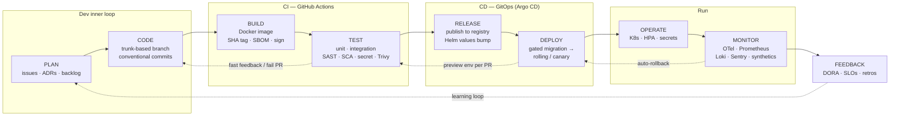
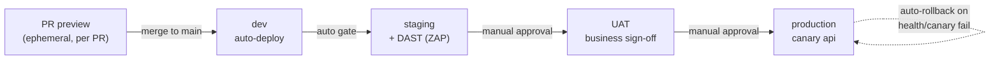
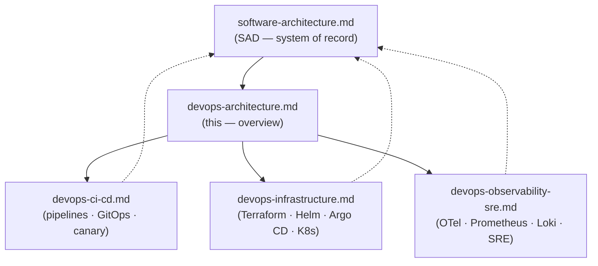

# Eventa — DevOps Architecture — Overview

| | |
|---|---|
| **Author** | Solution Architect |
| **Version** | 1.0 |
| **Date** | 2026-07-23 |
| **Status** | Baseline |
| **System of record** | [software-architecture.md](../04-architecture/software-architecture.md) (SAD) |
| **Detail docs** | [devops-ci-cd.md](devops-ci-cd.md) · [devops-infrastructure.md](devops-infrastructure.md) · [devops-observability-sre.md](../08-maintenance/devops-observability-sre.md) |

---

## 1. Purpose & scope

This document is the **entry point** to Eventa's DevOps architecture. It sets the principles, the
end-to-end lifecycle, the deployable units, the environments, the toolchain, and the delivery metrics
— then hands off to three detail docs for the depth. It does **not** restate the system design; that
lives in the [SAD](../04-architecture/software-architecture.md). Read this first, then dive into the relevant detail doc.

**In scope:** how Eventa is planned, built, secured, shipped, run, and measured — everything-as-code,
from a pull request to production and back through feedback.

**Out of scope:** application/domain design, the data model, and API contracts — see the
[SAD](../04-architecture/software-architecture.md), [entities.md](../04-architecture/entities.md), and [erd.md](../04-architecture/erd.md).

**Platform in one line** (from the SAD): a NestJS modular-monolith **api**, a NestJS RabbitMQ
**worker** (consumers), an outbox **relay**, and React front-ends (**web** — SSR public pages + the
SPA portal/admin), over managed PostgreSQL (primary + replica), Redis, RabbitMQ, and object
storage/CDN; multi-tenant, hosted in the **SG/TH** region under **PDPA** and **PCI SAQ-A**.

### How this document set is organized

| Doc | Owns | You go there for |
|---|---|---|
| **devops-architecture.md** (this) | Principles, lifecycle, environments, toolchain, DORA | The big picture and the map |
| [devops-ci-cd.md](devops-ci-cd.md) | Pipelines, GitOps promotion, canary, migrations, rollback, DevSecOps gates | "How does a commit reach prod?" |
| [devops-infrastructure.md](devops-infrastructure.md) | Terraform, Helm, Argo CD, Kubernetes, data services, secrets, DR | "How is the infra built and run?" |
| [devops-observability-sre.md](../08-maintenance/devops-observability-sre.md) | OTel, Prometheus/Grafana, Loki, Sentry, SLOs, alerting, runbooks | "How do we know it's healthy?" |

---

## 2. DevOps principles

Eventa's engineering culture is **CALMS** + the **Three Ways**. Everything-as-code; small, frequent,
reversible releases; shift-left quality & security; **you build it, you run it**.

### 2.1 CALMS mapped to this platform

| Pillar | Concrete practice on Eventa |
|---|---|
| **Culture** | *You build it, you run it* — the squad that owns a service owns its on-call, SLOs, and runbooks. Trunk-based development with short-lived branches + PRs; blameless post-incident reviews. |
| **Automation** | Everything-as-code: **Terraform** for infra, **Helm** for workloads, **GitHub Actions** for CI, **Argo CD** for CD. No manual `kubectl apply` to any shared environment; migrations run as a gated pre-deploy job. |
| **Lean** | Small batch sizes — one short-lived branch = one PR = one deployable change. Ephemeral **preview env per PR** kills integration debt early. WIP limited by trunk-based flow. |
| **Measurement** | The four **DORA** metrics (§7) plus Prometheus SLO burn-rates, Sentry error rates, and pipeline lead-time dashboards in Grafana. |
| **Sharing** | One monorepo-style toolchain and Helm chart library across `web/api/worker/relay`; shared Grafana/runbook library; correlation ids stitch traces across HTTP **and** RabbitMQ so any engineer can follow a request end-to-end. |

### 2.2 The Three Ways mapped to this platform

| Way | Concrete practice on Eventa |
|---|---|
| **First Way — Flow** (dev → ops, left to right) | Immutable **SHA-tagged** images promoted **unchanged** dev → staging → UAT → prod via GitOps; rolling by default, **canary for the api**; DB migrations as a gated pre-deploy job so schema never blocks the pod roll. |
| **Second Way — Fast feedback** (right to left) | CI fails fast on lint/typecheck/tests/SAST/SCA/secret/container scans; **DAST (ZAP)** against staging; automated health/canary checks trigger **automated rollback**; Sentry + Prometheus alerts page the owning squad. |
| **Third Way — Continual learning** | DORA + SLO reviews; blameless incident retros feeding runbook updates; chaos/DR game-days; preview envs as a safe place to experiment. |

---

## 3. The DevOps lifecycle

Plan → Code → Build → Test → Release → Deploy → Operate → Monitor → Feedback — a continuous loop.

| Stage | What happens on Eventa | Primary tools |
|---|---|---|
| **Plan** | Backlog, ADRs, trunk-based work items; PR opened early | Git, PRs, issues |
| **Code** | Short-lived branch, conventional commits, protected `main` | Git |
| **Build** | Immutable SHA-tagged Docker image; SBOM; image signed | Docker, GitHub Actions |
| **Test** | Lint + typecheck → unit + integration → SAST/SCA/secret/container scan; ephemeral PR preview | GitHub Actions, CodeQL/Semgrep, Trivy, gitleaks |
| **Release** | Publish signed image to registry; Argo CD promotes via Git | Registry, Argo CD, Helm |
| **Deploy** | Gated DB migration job → rolling (canary for api) → auto-rollback on failure | Argo CD, Helm, K8s |
| **Operate** | K8s Deployments + HPAs; External Secrets; config via ConfigMaps | Kubernetes, External Secrets |
| **Monitor** | Traces, metrics, logs, errors, synthetics; correlation ids over HTTP + AMQP | OTel, Prometheus/Grafana, Loki, Sentry |
| **Feedback** | DORA metrics, SLO burn, incident retros feed the next Plan | Grafana, retros |

---

## 4. Deployable services & their pipelines

Four container images + one dedicated pool. Every image is built **once**, **SHA-tagged**, signed,
and promoted **unchanged** through the environments. The check-in pool reuses the **`api`** image but
is its own Deployment + HPA with an independent scaling policy (event-day check-in spikes).

| Service | Image | Runtime shape | Update strategy | Autoscale signal | Notes |
|---|---|---|---|---|---|
| **web** | `web` | React **SSR** + static (portal/admin SPA + public pages) | Rolling | CPU + RPS | Fronted by CDN/WAF |
| **api** | `api` | NestJS modular monolith (REST) | **Canary** → rolling | CPU + RPS + p95 latency | Synchronous money/inventory; migrations gate its deploy |
| **worker** | `worker` | NestJS RabbitMQ consumers | Rolling | Queue depth + CPU | Idempotent handlers; competing consumers |
| **relay** | `relay` | Outbox publisher | Rolling, stop-then-start (`maxSurge=0`) | **None — does not autoscale** | **Exactly 1 replica**: the outbox reader takes no row lock, so a second publisher duplicates every event — see [devops-infrastructure.md](devops-infrastructure.md) §3.2. Publisher confirms |
| **check-in pool** | `api` (reused) | Same image, own Deployment/HPA | Rolling | RPS + p95 latency, aggressive min/max | Isolated so check-in load never starves core api |

All five share the **same CI pipeline template** (install → lint + typecheck → unit + integration →
SAST/SCA/secret → build + scan + sign image → publish). They differ only in the **CD** strategy above
and their Helm values. Full pipeline detail: [devops-ci-cd.md](devops-ci-cd.md).

---

## 5. Environments & promotion path

Four parity environments + ephemeral PR previews, all in the **SG/TH** region for PDPA residency.
Promotion is **pull-based GitOps**: Argo CD reconciles each environment to its Git-declared desired
state; promotion = a Git change to the target environment's Helm values (the image SHA), never a
rebuild.

| Environment | Purpose | Data | Promotion into it | Deploy gate |
|---|---|---|---|---|
| **PR preview** | Per-PR ephemeral env for review/QA | Synthetic/seed | Opening a PR (auto-provisioned, torn down on close) | CI green |
| **dev** | Continuous integration target | Synthetic/anonymized | Auto on merge to `main` | Migrations + smoke |
| **staging** | Prod-like; **DAST (OWASP ZAP)** runs here | Anonymized, prod-shaped | Auto after dev is healthy | DAST + integration + migration |
| **UAT** | Business/stakeholder sign-off | Curated UAT dataset | **Manual approval** | Acceptance sign-off |
| **production** | Live, multi-AZ | Real (PDPA-governed) | **Manual approval** | Canary (api) + health checks, else auto-rollback |

Config differs **only** by per-environment values (env/ConfigMaps) and secrets surfaced by **External
Secrets** from the managed secrets manager — never committed to Git. Full infra & env topology:
[devops-infrastructure.md](devops-infrastructure.md).

---

## 6. Toolchain summary

Lifecycle stage → tool, per the fixed DevOps decisions.

| Stage / concern | Tool(s) |
|---|---|
| SCM & workflow | **Git**, trunk-based, short-lived branches + PRs, protected `main`, conventional commits |
| CI orchestration | **GitHub Actions** |
| Build & packaging | **Docker** — immutable **SHA-tagged** images + **SBOM** + **signing** |
| Artifact store | Container **registry** |
| SAST | **CodeQL / Semgrep** |
| SCA (dependencies) | Dependency scanning |
| Container image scan | **Trivy** |
| IaC scan | **tfsec / Checkov** |
| Secret scan | **gitleaks** |
| DAST | **OWASP ZAP** (against staging) |
| Cloud infrastructure | **Terraform** (network, PostgreSQL, Redis, RabbitMQ, object storage, CDN+WAF, K8s, secrets) |
| App packaging | **Helm** charts |
| Continuous delivery | **Argo CD** (GitOps, pull-based) |
| Orchestration | **Kubernetes** (managed) — a Deployment per service, with an **HPA** on each except the singleton `relay` ([devops-infrastructure.md](devops-infrastructure.md) §3.2) |
| Config | 12-factor env / **ConfigMaps**, per-environment values |
| Secrets | Managed **secrets manager** → K8s via **External Secrets** |
| Tracing | **OpenTelemetry** (HTTP + RabbitMQ spans, correlation ids) |
| Metrics | **Prometheus + Grafana** |
| Logs | **Loki** (centralized) |
| Error tracking | **Sentry** |
| Uptime | **Synthetic** checks |
| Backups/DR | Automated **backups + PITR**, multi-AZ, DR runbooks |

---

## 7. DORA metrics

We track the four **DORA** metrics and review them in the monthly engineering retro. Targets are
"elite/high" bands; measurement is automated from Git, GitHub Actions, Argo CD, and Sentry/Prometheus.

| Metric | Target (aim) | How it's measured |
|---|---|---|
| **Deployment frequency** | On-demand — **multiple deploys/day** to prod | Count of Argo CD prod syncs per service, from GitOps commit history |
| **Lead time for changes** | **< 1 day** (commit → prod) | Timestamp delta: first commit on branch → prod Argo CD sync, from Git + CD logs |
| **Change-failure rate** | **< 15%** | Share of prod deploys triggering an auto-rollback, hotfix, or Sentry-linked incident |
| **MTTR** (time to restore) | **< 1 hour** | Incident open → resolved, from alert (Prometheus/Sentry) to recovery, in the incident tracker |

Dashboards and alert wiring live in [devops-observability-sre.md](../08-maintenance/devops-observability-sre.md).

---

## 8. Document map

| Document | Description |
|---|---|
| [software-architecture.md](../04-architecture/software-architecture.md) | The SAD — components, interfaces, data flow, deployment view. The system of record this set builds on. |
| [devops-ci-cd.md](devops-ci-cd.md) | CI stages, DevSecOps gates, image supply-chain, GitOps promotion, canary/rolling, gated migrations, automated rollback. |
| [devops-infrastructure.md](devops-infrastructure.md) | Terraform modules, Helm charts, Argo CD, Kubernetes topology, managed data services, secrets, reliability/DR, RTO/RPO. |
| [devops-observability-sre.md](../08-maintenance/devops-observability-sre.md) | OpenTelemetry, Prometheus/Grafana, Loki, Sentry, synthetics, SLOs/alerting, on-call, runbooks. |

Each detail doc links back to this overview and to the [SAD](../04-architecture/software-architecture.md).

---

_DevOps baseline. Aligned to the SAD's fixed DevOps decisions; changes are made by revising this
overview and the affected detail doc together._
