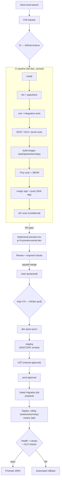
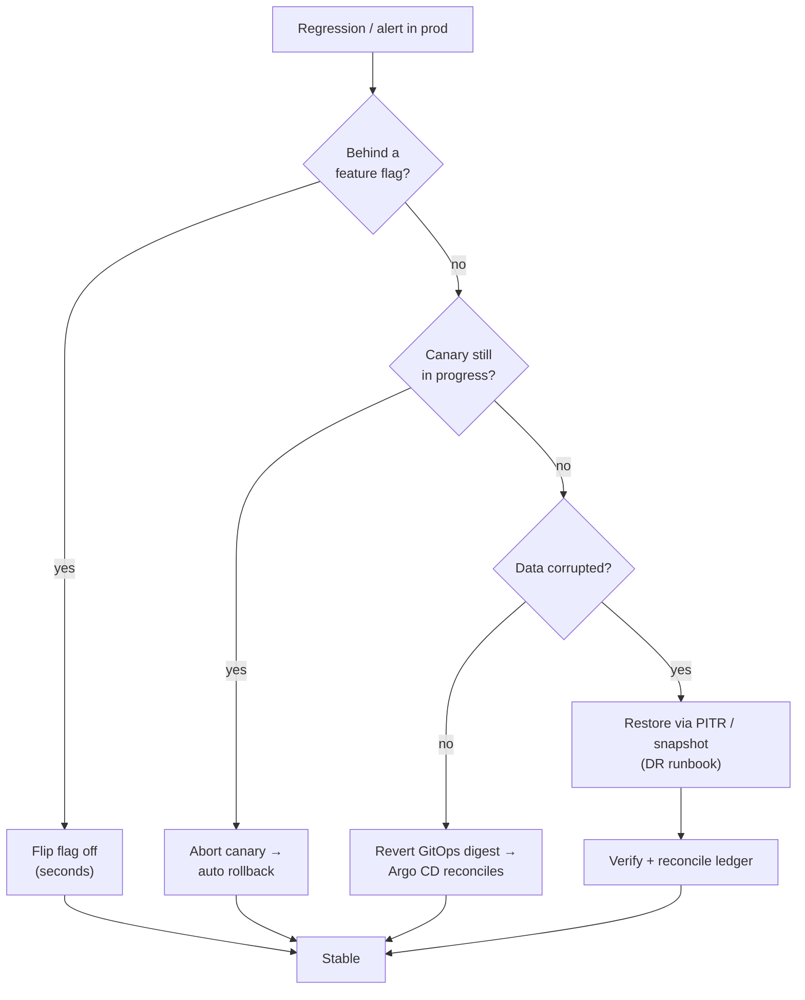

# Eventa — CI/CD Pipeline & Release Management

| | |
|---|---|
| **Author** | Solution Architect |
| **Version** | 1.0 |
| **Date** | 2026-07-23 |
| **Status** | Baseline |
| **Part of** | DevOps overview → [devops-architecture.md](devops-architecture.md) |
| **Sibling details** | Infrastructure → [devops-infrastructure.md](devops-infrastructure.md) · Observability & SRE → [devops-observability-sre.md](../08-maintenance/devops-observability-sre.md) |
| **System reference** | Software Architecture Document → [software-architecture.md](../04-architecture/software-architecture.md) |

---

## 0. Scope & context

This document is the authoritative reference for **how code becomes a running production
release** on Eventa. It covers source control, the CI pipeline, container build & supply-chain,
GitOps-based CD, database migrations, feature flags, release management, and rollback. It sits
under the DevOps overview ([devops-architecture.md](devops-architecture.md)) and does not restate
the platform design — for containers, modules, the outbox/RabbitMQ model, and deployment topology
see the SAD ([software-architecture.md](../04-architecture/software-architecture.md), §6–§8).

**What we ship (four images + one extra pool)** — fixed per the SAD:

| Image | Source | Runtime | Deployments |
|---|---|---|---|
| **web** | React SSR (public event pages) | Node SSR server | 1 Deployment + HPA |
| **api** | NestJS modular monolith | HTTP API | 1 Deployment + HPA (**canary**) **+** a dedicated **check-in api pool** (same image, own Deployment + HPA + scaling policy) |
| **worker** | NestJS RabbitMQ consumers | Queue consumers | 1 Deployment + HPA |
| **relay** | Outbox publisher | Poller/publisher | 1 Deployment + HPA (singleton-safe) |

**Guiding principles** — CALMS + the Three Ways: everything-as-code; small, frequent, reversible
releases; shift-left quality & security; *you build it, you run it*. Every change is measured
against the four **DORA** metrics (see [devops-observability-sre.md](../08-maintenance/devops-observability-sre.md)).

---

## 1. Source control & branching

**Model: trunk-based development.** One long-lived branch, `main`, is always releasable. Work
happens on **short-lived** branches (target < 1 day, hard ceiling 2 days) that merge back via PR.

| Rule | Setting |
|---|---|
| SCM | Git (single monorepo: `web/`, `api/` (shared by worker & relay via build targets), `charts/`, `infra/`) |
| Trunk | `main` — **protected**, linear history, no direct pushes |
| Branch naming | `feat/…`, `fix/…`, `chore/…`, `docs/…`, `hotfix/…` |
| Branch lifetime | Short-lived; delete on merge |
| Commits | **Conventional Commits** (`type(scope): subject`) — drives semver + changelog (see §7) |
| Merge strategy | **Squash-merge** to `main`; PR title must be a valid conventional-commit header |

**Protected-`main` required checks** (all must pass before merge is allowed):

- ✅ lint + typecheck
- ✅ unit + integration tests
- ✅ SAST (CodeQL/Semgrep), SCA (dependency scan), secret scan (gitleaks)
- ✅ container build + Trivy image scan
- ✅ IaC scan (tfsec/Checkov) — when `infra/` or `charts/` changed
- ✅ ≥ 1 approving review (CODEOWNERS-routed); ≥ 2 for `infra/`, migrations, or payments code
- ✅ branch up-to-date with `main`; conversations resolved; signed commits

**PR workflow**

1. Cut a short-lived branch from `main`.
2. Open PR early (draft allowed); conventional-commit title; link the backlog item.
3. CI runs the full pipeline (§2); an **ephemeral preview environment** is provisioned automatically.
4. Review + all required checks green → **squash-merge** to `main`.
5. Merge to `main` triggers the CD pipeline (§4): auto-deploy to **dev**, then gated promotion.

### 1.1 Ephemeral PR preview environments

Every PR gets a disposable, isolated environment so reviewers test the *real* running system.

| Aspect | Approach |
|---|---|
| Trigger | PR opened / synchronized → Argo CD `ApplicationSet` (PR generator) renders a per-PR app |
| Namespace | `preview-pr-<n>`; URL `pr-<n>.preview.eventa.dev` |
| Images | The exact SHA-tagged images built by that PR's CI run |
| Data | Ephemeral Postgres (seeded fixtures) + Redis + RabbitMQ (per-preview vhost); Stripe/PromptPay in **test mode**; email/SMS to a mailtrap sink; Google Meet stubbed |
| Isolation | Own tenant seed; **no production data ever** (PDPA); network-policy isolated |
| Teardown | Auto-destroyed on PR close/merge; TTL reaper (48 h idle) as backstop |

---

## 2. CI pipeline (GitHub Actions)

CI runs on every PR and on every push to `main`. Stages are ordered **fast-feedback first** (cheap
checks fail early) and are cached aggressively. A stage failing fails the run.

### 2.1 Stages & gates

| # | Stage | Tooling | Gate / output |
|---|---|---|---|
| 1 | **Install** | `npm ci`, restore caches | Deterministic deps (lockfile enforced) |
| 2 | **Lint + typecheck** | ESLint, Prettier check, `tsc --noEmit` | Zero errors |
| 3 | **Unit + integration tests** | Jest (unit); Jest + Testcontainers (Postgres/Redis/RabbitMQ) for integration | All pass; **coverage ≥ 80%** on changed packages |
| 4 | **SAST** | CodeQL + Semgrep (TS ruleset) | No new high/critical findings |
| 5 | **SCA (dependencies)** | `npm audit` + dependency scanner | No new high/critical vulns (allowlist w/ expiry) |
| 6 | **Secret scan** | gitleaks (full history on PR) | Zero secrets |
| 7 | **Build images** | Docker Buildx, multi-stage, per target (web/api/worker/relay) | Immutable **SHA-tagged** images (§3) |
| 8 | **Scan images** | Trivy (OS + libs, config, secrets) | No high/critical; SBOM produced |
| 9 | **Sign + publish** | cosign sign; push to registry | Signed images in registry; provenance attached |
| 10 | **IaC scan** *(conditional)* | tfsec + Checkov on `infra/`, `charts/` | No high-severity misconfig |
| 11 | **Deploy preview / notify GitOps** | Argo CD PR app (preview) / bump dev image (main) | Preview URL on PR; dev sync on main |

> **DAST (OWASP ZAP)** is *not* a PR gate — it runs on a schedule against **staging** (post-deploy),
> because it needs a full running stack. Findings feed the backlog; criticals block promotion to UAT.

### 2.2 Caching & performance

| Cache | Key | Purpose |
|---|---|---|
| npm / node_modules | `hash(package-lock.json)` | Skip re-install |
| Turbo/Nx build cache | task-input hash | Skip unchanged package builds/tests |
| Docker layer cache | registry-backed (`--cache-from/--cache-to`) | Reuse base + deps layers |
| Trivy DB / CodeQL DB | dated key | Avoid re-download / re-index |

**Path filtering** — a PR touching only `web/` skips `api/worker/relay` image builds (and vice
versa); `docs/`-only changes run lint/link-check only. Matrix builds the four images in parallel.

### 2.3 CI/CD flow diagram

---

## 3. Container build & registry (supply chain)

| Control | Implementation |
|---|---|
| Build | Docker multi-stage; distroless/slim runtime; non-root user; pinned base digests |
| **Immutable tags** | Every image tagged with the **Git commit SHA** (e.g. `api:sha-9f3c1a2`) — never overwritten. A moving `:main` / `:staging` alias may point at a SHA for readability, but **deployments always reference the SHA** |
| **SBOM** | CycloneDX SBOM generated per image, attached as an OCI attestation |
| **Signing** | `cosign` keyless (OIDC) signatures + SLSA provenance attestation |
| **Verify at admission** | Cluster policy (Kyverno/cosign admission) rejects any image that is unsigned or not from the trusted registry |
| Scanning | Trivy in CI (§2) **and** periodic re-scan of deployed digests for newly-disclosed CVEs |
| Registry | Private container registry in-region; retention: keep last N per branch + all prod-deployed digests |

**Promotion is by digest, not rebuild.** The identical image scanned and signed in CI is what runs
in dev → staging → UAT → prod. No environment ever rebuilds its own image.

---

## 4. CD pipeline — GitOps with Argo CD

**Pull-based delivery.** CI never `kubectl apply`s to a cluster. Instead CI updates a **desired-state
Git repo** (Helm values / image digests); **Argo CD** running in each cluster continuously
reconciles actual state to the repo. Git is the single source of truth; the cluster pulls.

### 4.1 Environment promotion

| Env | Trigger | Data / integrations | Purpose |
|---|---|---|---|
| **dev** | Auto-sync on merge to `main` | Synthetic data; test-mode payments | Continuous integration target |
| **staging** | Auto-promote after dev healthy | Prod-like, anonymized; test-mode payments | DAST (ZAP), smoke + e2e, perf checks |
| **UAT** | **Manual approval** (PO/QA) | Prod-like; sandbox payments | Business acceptance |
| **production** | **Manual approval** (release mgr) | Real tenants; live Stripe/PromptPay | Live (SG/TH region, PDPA) |

Each environment is a folder/branch of values in the GitOps repo; promotion = a PR that bumps the
target env's image digest (automated for dev→staging, gated by approval for UAT/prod). All four
environments maintain **parity** (same charts, differ only in per-env values/secrets — see §6 of
the SAD and [devops-infrastructure.md](devops-infrastructure.md)).

### 4.2 Rolling vs canary

Strategy is **per workload**. Default is rolling; the **api uses canary** because it is the
integrity-critical, highest-blast-radius surface (checkout, payments, auth).

| Workload | Strategy | Why |
|---|---|---|
| **api** | **Canary** (Argo Rollouts): 10% → 25% → 50% → 100%, analysis at each step | Guards checkout/payment paths; catch regressions on a small slice |
| **check-in api pool** | Rolling (surge-friendly) | Same image, scaled independently; event-day burst, no long-lived state |
| **web** (SSR) | Rolling | Stateless; fast to shift |
| **worker** (consumers) | Rolling | At-least-once + idempotent consumers tolerate mixed versions (§5.3) |
| **relay** (outbox) | Rolling, `maxSurge=0`/`maxUnavailable=1` | Publisher; avoid two overlapping publishers racing — brief single-replica cutover |

**Canary analysis (api)** — automated `AnalysisTemplate` queries Prometheus at each step; the step
must satisfy all gates before advancing, else the rollout **aborts and rolls back**:

| Gate | Threshold (canary vs baseline) |
|---|---|
| HTTP 5xx rate | ≤ 1% and not > baseline + 0.5pp |
| p95 latency (checkout endpoints) | ≤ 1.2× baseline |
| Pod readiness / crashloops | 0 restarts attributable to new rev |
| Sentry new-error rate | No new high-frequency issue signature |
| Synthetic checkout probe | Passing |

### 4.3 Health, readiness & rollback

- **Probes** — every workload defines `startup`, `readiness`, `liveness` probes; readiness gates
  traffic. SSR checks render; api checks DB/Redis/RabbitMQ connectivity; relay checks it can read
  the outbox and reach RabbitMQ.
- **Sync waves** — Argo CD ordering: (1) migration pre-deploy job → (2) api/worker/relay → (3) web.
- **Automated rollback** — on failed health/canary/SLO checks, Argo Rollouts aborts and pins the
  previous stable ReplicaSet; Argo CD self-heal reverts drift. See §8 for the full procedure.

---

## 5. Database migrations & the outbox/RabbitMQ interaction

Eventa is zero-downtime by contract: rolling/canary deploys mean **old and new code run
simultaneously** against **one** database. Migrations must never break the version still running.

### 5.1 Gated pre-deploy migration job

| Property | Value |
|---|---|
| Runner | Kubernetes **Job** (Argo CD sync-wave 1, `PreSync` hook) — runs **before** new pods roll |
| Tool | NestJS/TypeORM (or Prisma) migrations, forward-only |
| Gate | Job must succeed (exit 0) or the deploy **halts** — new pods never start against an un-migrated schema |
| Safety | Wrapped in a **pre-migration backup / snapshot** checkpoint (PITR marker); lock timeout + statement timeout to avoid long table locks |
| Idempotency | Migrations tracked in a `_migrations` table; re-run is a no-op |

### 5.2 Backward-compatible expand / contract

Every schema change is decomposed so each deployed step is compatible with the code on **both** sides
of it. A destructive change spans **multiple releases**, never one.

| Phase | Release | What happens | Compatibility |
|---|---|---|---|
| **Expand** | R1 (pre-deploy) | Add new column/table/index as **nullable / with default**; add new; don't remove | Old code ignores it; new code can use it |
| **Migrate** | R1 runtime → R2 | New code writes both old+new (or backfill job populates new) | Both shapes valid |
| **Contract** | R3 (later, after old code fully gone) | Drop old column / constraint / rename cleanup | Only new code remains |

Rules: **additive first**, columns nullable-or-defaulted, backfill in batches (online, throttled),
add indexes `CONCURRENTLY`, renames are add-new + dual-write + drop-old across releases. No `DROP`
or `NOT NULL`-tightening in the same release that introduces the dependent code.

### 5.3 Outbox & RabbitMQ across deploys

The transactional **outbox** (SAD §5, §7.2) and RabbitMQ are what make deploys safe for async work:

- **No lost events during a deploy** — the API writes the domain change **and** the outbox row in one
  DB transaction. If a pod is killed mid-roll, the row is still there; the **relay** publishes it
  after restart. Nothing depends on in-flight memory surviving the deploy.
- **Consumers tolerate mixed versions** — messages are **versioned contracts**; consumers are
  **idempotent** (dedupe on event id) and handle at-least-once delivery, so an old worker and a new
  worker consuming the same queue is safe. Add new event *fields* additively; introduce a new routing
  key rather than repurposing an existing one.
- **Relay during rollout** — deployed with `maxUnavailable=1`/`maxSurge=0` so publishing briefly
  narrows to one replica rather than running two overlapping publishers; publisher confirms + the
  `sent` marker make a duplicate publish harmless (consumers dedupe).
- **Draining** — workers/relay handle `SIGTERM` with a grace period: stop accepting new messages,
  finish in-flight handlers, `ack`, then exit. `terminationGracePeriodSeconds` ≥ longest handler.
- **DLQ safety net** — a poison message during a deploy dead-letters (SAD §6.3) and does not block
  the queue or the rollout.
- **Migration ↔ event ordering** — expand migrations land (sync-wave 1) before workers that emit/
  consume the new event shape roll (sync-wave 2), so a consumer never sees a payload its schema
  can't store.

---

## 6. Feature flags & progressive exposure

Deployment ≠ release. Code ships **dark** behind flags and is exposed independently of the rollout,
which decouples the two riskiest moments and lets us trunk-merge unfinished work safely.

| Use | Flag type | Example |
|---|---|---|
| **Trunk-based safety** | Release toggle | Merge a half-built feature to `main` behind an off flag |
| **Progressive exposure** | Percentage / cohort | Enable new checkout UI for 5% → 50% → 100% of tenants |
| **Tenant targeting** | Multivariate / allowlist | Beta feature for pilot organizations only |
| **Ops kill-switch** | Circuit-breaker flag | Disable a flaky Google Meet integration instantly, no deploy |
| **Permission-gated** | Entitlement | Feature bound to plan/role |

| Aspect | Approach |
|---|---|
| Store | Managed flag service (or self-hosted, e.g. Unleash) — flags are **config, not code**; changing one needs no deploy |
| Evaluation | Server-side in the api (never trust the client for gated logic — SAD principle) |
| Scoping | Flag context carries `organization_id` (multi-tenant) + user cohort |
| Progressive rollout | Combine with api canary: canary proves the *build*, flags roll out the *feature* |
| Hygiene | Every release flag has an **owner + expiry**; a stale-flag report + cleanup ticket prevents debt |
| Auditing | Flag changes are audit-logged (who/when/what) — same rigor as config changes |

**Kill-switch first-response** — because flags flip in seconds without a deploy, a bad feature is
disabled by flag *before* considering a rollback (§8). Rollback is for bad *builds*, flags for bad
*features*.

---

## 7. Release management

### 7.1 Versioning & changelog

- **Semantic Versioning** `MAJOR.MINOR.PATCH`, derived automatically from **Conventional Commits**
  merged since the last tag: `fix:` → PATCH, `feat:` → MINOR, `feat!:`/`BREAKING CHANGE:` → MAJOR.
- A release job (release-please/semantic-release) computes the next version, generates/updates
  **`CHANGELOG.md`**, tags `vX.Y.Z`, and cuts a GitHub Release — all from commit metadata.
- The tag maps to the **exact signed image digests** (§3) promoted through the environments.

### 7.2 Cadence

| Track | Cadence | Notes |
|---|---|---|
| **Continuous to dev** | Every merge to `main` | Always-releasable trunk |
| **Staging** | Continuous (auto after dev) | DAST + e2e run here |
| **Production** | **On-demand / ≥ weekly train**, business-hours SG/TH | Small, frequent, reversible (DORA: high deploy freq, low lead time) |
| **Freeze windows** | On-sale events, year-end | Documented; hotfix path stays open |

### 7.3 Hotfix path

For a production-critical defect that can't wait for the train:

1. Branch `hotfix/…` **from the release tag** (or `main` if trunk is clean).
2. Minimal fix + regression test; PR runs the **full CI pipeline** (no gate skipped — security scans included).
3. Fast-tracked review (2 approvers), squash-merge to `main` → auto-forward so the fix isn't lost.
4. Promote through staging (abbreviated smoke) → prod with the **normal canary + gates** (speed comes
   from a small diff, not from skipping safety).
5. `fix:` commit → automatic PATCH release + changelog entry.
6. Post-incident: record MTTR (DORA) and a brief retro (Three Ways — continual learning).

---

## 8. Rollback & recovery

**Preferred order of response** — cheapest/fastest reversal first:

| # | Response | Reverses | When |
|---|---|---|---|
| 1 | **Flip a feature flag off** (§6) | A bad *feature* | Behavior is flag-gated (seconds, no deploy) |
| 2 | **Abort canary** (Argo Rollouts) | An in-progress bad *build* | Canary gate/health failing — auto or manual |
| 3 | **Roll back to previous digest** | A fully-rolled bad build | Regression found after 100% |
| 4 | **DB / PITR recovery** | Data corruption | Only if a migration/bug damaged data |

### 8.1 Application rollback

- **Automated** — failed health/readiness or canary-analysis gates make Argo Rollouts abort and pin
  the last **stable** ReplicaSet; no human needed for the common case.
- **Manual** — revert the image-digest bump in the GitOps repo (or `argo rollouts undo`); Argo CD
  reconciles the cluster back to the previous signed digest. Because promotion is by digest, rollback
  is deterministic — the exact previously-running image returns.
- **Rollback is fast because forward-only migrations are backward-compatible** (§5.2): the old code
  runs fine against the already-expanded schema, so an app rollback needs **no** schema rollback.

### 8.2 Migration/data rollback

- We **do not** blindly reverse-migrate in production. Expand/contract means a rollback of code
  works against the expanded schema.
- If a migration itself is bad, the pre-deploy gate (§5.1) catches it before pods roll. If data was
  corrupted, recover via **PITR / snapshot** (RTO/RPO and DR runbooks live in
  [devops-observability-sre.md](../08-maintenance/devops-observability-sre.md) and [devops-infrastructure.md](devops-infrastructure.md)).

### 8.3 Rollback decision flow

Every rollback is captured in the incident record; **MTTR** and **change-failure rate** (DORA) are
tracked from these events — see [devops-observability-sre.md](../08-maintenance/devops-observability-sre.md).

---

## 9. Summary — how the fixed decisions map here

| Decision area | This document |
|---|---|
| Trunk-based + PR + preview envs | §1 |
| GitHub Actions stages & gates | §2 |
| SHA tags + SBOM + signing | §3 |
| Argo CD GitOps, rolling vs canary (api) | §4 |
| Gated migrations, expand/contract, outbox/RabbitMQ | §5 |
| Feature flags & progressive exposure | §6 |
| SemVer, changelog, cadence, hotfix | §7 |
| Automated rollback & recovery | §8 |

For infrastructure (Terraform/Helm, clusters, data services, secrets/External Secrets, WAF/CDN) see
[devops-infrastructure.md](devops-infrastructure.md); for OpenTelemetry/Prometheus/Grafana/Loki/
Sentry, SLOs, DORA dashboards, and DR runbooks see [devops-observability-sre.md](../08-maintenance/devops-observability-sre.md);
for the overall DevOps picture see [devops-architecture.md](devops-architecture.md); for the system
design itself see the SAD, [software-architecture.md](../04-architecture/software-architecture.md).
