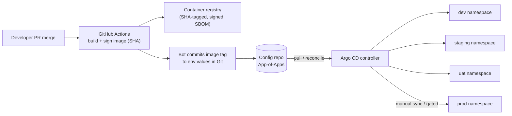
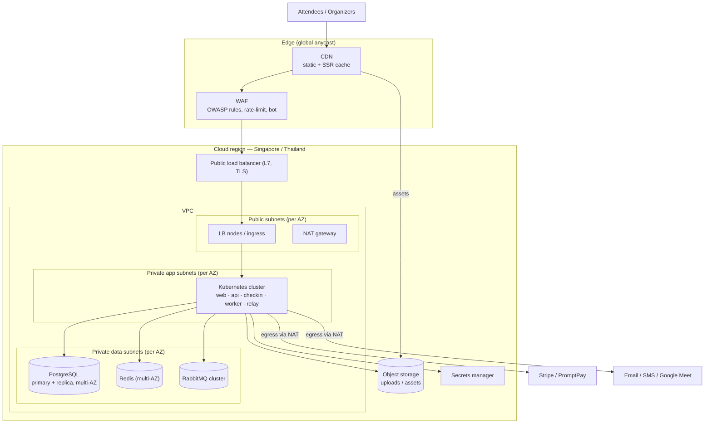

# Eventa — Infrastructure & Environments (IaC)

| | |
|---|---|
| **Author** | Solution Architect |
| **Version** | 1.0 |
| **Date** | 2026-07-23 |
| **Status** | Baseline |
| **Part of** | DevOps documentation set |
| **Related** | Overview → [devops-architecture.md](devops-architecture.md) · Details → [devops-ci-cd.md](devops-ci-cd.md) · [devops-observability-sre.md](../08-maintenance/devops-observability-sre.md) · System architecture → [software-architecture.md](../04-architecture/software-architecture.md) |

---

This document specifies the **infrastructure and environments** for Eventa: how cloud
resources, the Kubernetes platform, managed data services, and application config are
declared as code and promoted through environments. It is a detail doc under the DevOps
overview ([devops-architecture.md](devops-architecture.md)); the CI/CD pipeline that
*builds and delivers* into this infrastructure is in [devops-ci-cd.md](devops-ci-cd.md),
and how we *observe and operate* it is in
[devops-observability-sre.md](../08-maintenance/devops-observability-sre.md). The system it hosts (containers
**web / api / worker / relay** + the dedicated **check-in api pool**, and the data stores)
is defined in the SAD, [software-architecture.md](../04-architecture/software-architecture.md) §6/§8 — this
document does not restate it.

Guiding principle: **everything-as-code**. No console click is a source of truth. Cloud
infra is Terraform, app workloads are Helm, and the live cluster state is reconciled from
Git by Argo CD (GitOps, pull-based). Region is **SG/TH** for PDPA data residency.

---

## 1. Infrastructure as Code

Three layers of "as code", each with a clear owner and blast radius:

| Layer | Tool | Owns | State / source of truth | Applied by |
|---|---|---|---|---|
| Cloud infrastructure | **Terraform** | VPC, subnets, NAT, K8s cluster, managed PostgreSQL/Redis/RabbitMQ, object storage, CDN + WAF, LB, IAM, secrets-manager, DNS | Remote state (object storage + state lock table), one state per environment | CI plan → gated `apply` (see [devops-ci-cd.md](devops-ci-cd.md)) |
| App workloads | **Helm** charts | Deployments, Services, HPAs, PDBs, NetworkPolicies, ConfigMaps, ExternalSecrets, Ingress | Chart + per-env `values-<env>.yaml` in Git | Argo CD renders + syncs |
| Cluster/app desired state | **Argo CD** (GitOps) | Which chart version + values run in which namespace | Git repo (App-of-Apps) | Argo CD controller (pull) |

### 1.1 Terraform layout

Root modules per environment compose reusable child modules — parity comes from **the same
modules** with different `.tfvars`, not copy-paste.

```
infra/
  modules/                     # reusable, versioned building blocks
    network/                   # VPC, subnets (public/private/data), NAT, routes
    k8s-cluster/               # managed K8s, node pools, IRSA/workload-identity
    postgres/                  # primary + read replica, multi-AZ, PITR
    redis/                     # managed Redis, multi-AZ
    rabbitmq/                  # clustered broker, mirrored queues
    object-storage/            # buckets + lifecycle + CDN origin
    edge/                      # CDN, WAF rules, TLS certs
    secrets/                   # secrets-manager + IAM for External Secrets
    observability/             # log/metric sinks, alert routing
  envs/
    dev/        main.tf  dev.tfvars       backend.tf
    staging/    main.tf  staging.tfvars   backend.tf
    uat/        main.tf  uat.tfvars       backend.tf
    prod/       main.tf  prod.tfvars      backend.tf
  global/                      # DNS zone, registry, org IAM (single state)
```

- **Remote state:** object-storage backend, **one state file per environment**, with state
  **locking** (DynamoDB-style lock table) to serialise applies. No local state, ever.
- **Environment parity:** dev/staging/uat/prod call identical modules; only sizing,
  replica counts, and retention differ via `*.tfvars`. Drift is caught by scheduled
  `terraform plan` in CI.
- **Module versioning:** child modules are pinned by Git tag/ref so a prod apply is
  reproducible and a module change rolls forward dev → prod like any other release.
- **Security in the loop:** every Terraform PR runs **tfsec/Checkov** (IaC scan) and
  `terraform plan` is posted to the PR; `apply` is a **gated** manual approval on protected
  branches (details in [devops-ci-cd.md](devops-ci-cd.md)).

### 1.2 Helm for app workloads

One umbrella chart per service (**web, api, worker, relay**) plus a **check-in** chart that
reuses the `api` image with its own Deployment/HPA. Shared templates (probes, PDB,
NetworkPolicy, ExternalSecret, HPA) live in a common library chart to keep the four
services consistent.

```
deploy/charts/
  _library/                    # shared templates: probes, hpa, pdb, netpol, externalsecret
  web/                         # values.yaml + values-<env>.yaml
  api/
  worker/
  relay/
  checkin/                     # same 'api' image, distinct Deployment + scaling policy
```

Image tags are **immutable SHA tags** — a values override sets `image.tag=<git-sha>`; Argo
CD promotes an environment by moving that pinned tag, never `latest`.

### 1.3 GitOps with Argo CD

Pull-based delivery: the cluster reconciles *toward* Git; CI never holds cluster
credentials.



- **App-of-Apps:** a root Argo `Application` points at child apps (one per service per env),
  so adding a service or environment is a Git change.
- **Promotion** dev → staging → UAT → prod is a tag bump in the target env's values;
  prod sync is gated (manual/approved). Rollback = revert the Git commit (Argo re-syncs).
- **Self-heal + drift detection:** manual cluster edits are reverted to match Git.

---

## 2. Cloud topology (region SG/TH)

Single region for **PDPA data residency**; multi-AZ *within* region for HA. Public edge is
CDN + WAF; everything stateful sits in private/data subnets with no public ingress.



| Tier | Placement | Public? | Notes |
|---|---|---|---|
| Edge (CDN + WAF) | Global anycast | Yes | TLS termination option, caches static + SSR HTML, absorbs on-sale spikes, WAF enforces OWASP + rate limits before the LB |
| Load balancer | Public subnets | Yes | L7, health-checked, routes to Ingress; only ingress path into the VPC |
| App subnets | Private, per-AZ | No | K8s worker nodes; outbound only via NAT to Stripe/PromptPay/comms |
| Data subnets | Private, per-AZ | No | Postgres/Redis/RabbitMQ; reachable only from app subnets via NetworkPolicy + security groups |
| Object storage / CDN origin | Regional | Via CDN | Signed URLs for private uploads; public assets fronted by CDN |
| Secrets manager | Regional | No | Surfaced to K8s via External Secrets (§5) |

**Residency:** all primary data (DB, replica, backups, object storage, logs) stays in the
SG/TH region. Third-party processors (Stripe, comms) are contracted PDPA sub-processors;
card data never touches Eventa infra (PCI SAQ-A — Stripe hosted fields).

---

## 3. Kubernetes

Managed Kubernetes; **one Deployment + HPA per service**, plus the dedicated **check-in
pool** as its own Deployment/HPA. Namespaces isolate environments.

### 3.1 Namespaces

| Namespace | Purpose |
|---|---|
| `eventa-dev` | Continuous integration target |
| `eventa-staging` | Pre-prod, DAST + perf, prod-like |
| `eventa-uat` | Business acceptance |
| `eventa-prod` | Production |
| `preview-<pr>` | Ephemeral PR preview, torn down on merge/close |
| `platform` | Argo CD, External Secrets, ingress controller, observability agents |

### 3.2 Workloads

| Workload | Image | Purpose | Min replicas (prod) | Scaling signal |
|---|---|---|---|---|
| `web` | web | React SSR public pages | 3 | CPU + RPS |
| `api` | api | Core API (canary-deployed) | 3 | CPU + RPS + p95 latency |
| `checkin` | api | **Dedicated check-in pool** — QR scan/entry at door | 2 (scales hard for events) | CPU + RPS + custom check-in queue depth |
| `worker` | worker | RabbitMQ consumers (notifications, calendar, indexing) | 2 | CPU + **RabbitMQ queue depth** |
| `relay` | relay | Transactional outbox publisher | 2 | CPU + outbox lag |

The **check-in pool is deliberately separate** so a door-scanning surge during a live event
(bursty, latency-sensitive) autoscales and fails independently of the main `api` serving
browse/checkout traffic — one tenant's on-site rush cannot starve another's checkout.

### 3.3 Resources, probes, disruption, network

**Requests/limits** (starting points; tuned from Prometheus, see
[devops-observability-sre.md](../08-maintenance/devops-observability-sre.md)):

| Workload | CPU req / limit | Mem req / limit |
|---|---|---|
| web | 250m / 1000m | 512Mi / 1Gi |
| api | 500m / 2000m | 512Mi / 1Gi |
| checkin | 500m / 2000m | 512Mi / 1Gi |
| worker | 250m / 1000m | 512Mi / 1Gi |
| relay | 100m / 500m | 256Mi / 512Mi |

- **Readiness probe:** `GET /health/ready` — checks DB/Redis/broker deps; gates traffic and
  rolling updates. **Liveness probe:** `GET /health/live` — process-alive only, restarts a
  wedged pod. **Startup probe** on api/worker to cover cold NestJS boot before liveness
  applies. Workers/relay use exec/TCP checks (no HTTP server) plus broker-connection health.
- **PodDisruptionBudget:** `minAvailable: 50%` (or `maxUnavailable: 1`) per service so node
  drains/upgrades never take a service below quorum. relay uses `maxUnavailable: 0` behavior
  via `minAvailable: 1` to keep at least one publisher live.
- **NetworkPolicies:** default-deny per namespace. Explicit allows: ingress → web/api/checkin;
  api/checkin/worker/relay → Postgres/Redis/RabbitMQ; worker/relay → RabbitMQ; egress to
  Stripe/PromptPay/comms via NAT only. No pod-to-pod that isn't declared.
- **Rolling updates** by default (`maxSurge: 1, maxUnavailable: 0`); **api uses canary**
  (see [devops-ci-cd.md](devops-ci-cd.md)). **Anti-affinity** spreads replicas across AZs.
- **DB migrations** run as a **gated pre-deploy Job**, never inside app startup, so schema
  changes are ordered and reviewed (details in [devops-ci-cd.md](devops-ci-cd.md)).

---

## 4. Managed data services

All managed, multi-AZ, backed up, reachable only from private data subnets. Sizing below is
the v1.0 baseline — scale via Terraform `*.tfvars`.

| Service | Topology | HA | Backups / recovery | Prod baseline size | Notes |
|---|---|---|---|---|---|
| **PostgreSQL** | Primary + **read replica**, multi-AZ | Automatic failover to standby | **Automated backups + PITR**; documented RTO/RPO (see [devops-observability-sre.md](../08-maintenance/devops-observability-sre.md)) | 4 vCPU / 16 GB, gp3 w/ headroom | System of record. Writes → primary; heavy reads/reporting → replica. Connection pooling in front |
| **Redis** | Managed, multi-AZ w/ replica | Automatic failover | Snapshotable; treated as cache/session (rebuildable) | 2 vCPU / 8 GB | Cache, sessions, idempotency keys, rate-limit counters |
| **RabbitMQ** | **Clustered** (3 nodes), quorum/mirrored queues | Node loss tolerated; quorum queues survive failover | Definitions backed up; messages durable | 3 × 2 vCPU / 8 GB | Eventing backbone; DLQs per queue; consumers are `worker`, publisher is `relay` |
| **Object storage** | Regional bucket(s) + lifecycle | Regionally redundant | Versioned; lifecycle to cold tier | usage-based | Uploads, tickets/QR, exports; private via signed URLs, public assets via CDN |

**Sizing knobs**: Postgres replica count and instance class, Redis memory, RabbitMQ node
count/queue type, and object-storage lifecycle are all module inputs so on-sale seasons can
be pre-scaled and previews stay tiny.

---

## 5. Configuration & secrets

Strict 12-factor separation: **config is not secret, secret is never in Git**.

| Kind | Mechanism | Example | Per-env |
|---|---|---|---|
| Non-secret config | **ConfigMaps** (from `values-<env>.yaml`) | log level, feature flags, region, queue names, replica hints | Yes |
| Secrets | **Managed secrets manager** → K8s via **External Secrets Operator** | DB DSN, Redis auth, RabbitMQ creds, Stripe/PromptPay keys, SMTP/SMS tokens, signing keys | Yes |

- **External Secrets Operator** watches `ExternalSecret` CRs (templated by Helm) and
  materialises them into K8s Secrets pulled from the managed secrets manager at runtime.
  Secret **values are never committed** — Git holds only the *reference* (path + key).
- **Per-environment stores/paths** (`/eventa/dev/*` … `/eventa/prod/*`) with least-privilege
  IAM per namespace via workload identity — a dev pod cannot read prod secrets.
- **Rotation:** secrets manager rotates DB/broker credentials on a schedule; External
  Secrets `refreshInterval` re-syncs and rolling-restarts consumers, so rotation is
  zero-touch. Stripe keys rotated per Stripe guidance; signing keys support overlap
  (two active) for graceful rollover.
- **Precedence:** chart defaults → `values-<env>.yaml` → ExternalSecret. No secret ever
  lands in a container image, ConfigMap, or Git.

---

## 6. Scaling & capacity

Eventa's load is **spiky and multi-tenant**: ticket **on-sale bursts** (browse + checkout)
and **parallel check-in** at concurrent live events. Autoscaling is layered.

| Layer | Mechanism | Trigger | Behaviour |
|---|---|---|---|
| Edge | CDN cache | cache hit | Absorbs static + SSR read spikes before they reach pods |
| Pods | **HPA per service** | CPU, RPS, p95 latency (api), **queue depth** (worker/relay), custom check-in metric | Scale out on-sale (`web`,`api`) and door-rush (`checkin`) independently |
| Consumers | HPA on **RabbitMQ queue depth** | backlog growth | `worker` scales to drain events; `relay` scales with outbox lag |
| Nodes | **Cluster autoscaler** | unschedulable pods | Adds/removes nodes; separate node pool can back the burstable check-in pool |
| Data | Terraform-tuned sizing | seasonal / event calendar | Pre-scale Postgres replica/RabbitMQ nodes ahead of known on-sales |

- **On-sale spike:** `web` + `api` HPAs scale on RPS/latency; canary protects the rollout;
  DB read pressure offloads to the **read replica**; Redis absorbs hot reads and rate-limit
  counters.
- **Parallel multi-tenant check-in:** the **dedicated check-in pool** scales on its own HPA
  (custom scan-throughput metric), isolated from checkout traffic and per-tenant bursts.
- **HPA hygiene:** sensible `minReplicas` (never 0 for prod services), `maxReplicas`
  ceilings, stabilization windows to avoid flapping, and PDBs so scale-in respects quorum.
- **Right-sizing loop:** requests/limits are re-tuned from Prometheus utilisation
  (see [devops-observability-sre.md](../08-maintenance/devops-observability-sre.md)).

---

## 7. Environments matrix

Four parity environments plus ephemeral PR previews. All in the SG/TH region.

| Env | Namespace | Purpose | Data | Access | Deploy trigger |
|---|---|---|---|---|---|
| **dev** | `eventa-dev` | Integrate merged trunk; fast feedback | Synthetic / seeded; **no real PII** | All engineers | Auto on merge to main |
| **staging** | `eventa-staging` | Prod-like; **DAST (OWASP ZAP)**, perf, migration rehearsal | Anonymised/masked; **no raw prod PII** | Engineering + QA | Auto after dev green |
| **UAT** | `eventa-uat` | Business/stakeholder acceptance | Curated realistic; masked | Product + selected stakeholders | Gated promotion |
| **production** | `eventa-prod` | Live tenants | Real (PDPA-governed) | SRE/on-call; least-privilege, audited | **Gated** manual/approved sync |
| **PR preview** | `preview-<pr>` | Per-PR ephemeral review env | Synthetic seed; **scale-to-zero** when idle | PR author + reviewers | Auto on PR open; torn down on close |

- **Parity:** same Terraform modules + Helm charts; environments differ only in sizing,
  replica counts, retention, and data sensitivity.
- **Data governance:** real PII exists **only in production**; lower environments use
  masked/synthetic data (PDPA). Prod access is least-privilege and audited.
- **Previews** are full-stack (all services + throwaway data) so reviewers exercise real
  behaviour without touching shared envs (CI wiring in [devops-ci-cd.md](devops-ci-cd.md)).

---

## 8. Cost / FinOps

Cost is a design constraint, kept in code and observable.

| Lever | Practice |
|---|---|
| **Right-sizing** | Requests/limits and instance classes tuned from real Prometheus utilisation, not guesses; over-provisioned pods reclaimed each iteration |
| **Preview scale-to-zero** | Ephemeral PR envs autoscale to **zero** when idle and are **destroyed on PR close** — no lingering spend; tiny data + minimal replicas |
| **Autoscaling both ways** | HPAs and cluster autoscaler scale **in** after spikes; non-prod scales down/off outside working hours |
| **Environment sizing** | dev/staging/uat run smaller replica counts and single-node data services vs prod (via `*.tfvars`) |
| **Storage lifecycle** | Object-storage lifecycle rules tier/expire old exports and assets; backups retained to policy, not forever |
| **Data pre-scale, not always-on** | Postgres replica / RabbitMQ node counts raised ahead of known on-sales and lowered after, rather than permanently over-provisioned |
| **Budgets & alerts** | Cloud **budgets with alerts** per environment; cost anomaly alerts routed like any other signal (see [devops-observability-sre.md](../08-maintenance/devops-observability-sre.md)); resources tagged by env/service for showback |
| **Registry hygiene** | Image retention policy prunes old SHA-tagged images while keeping what's deployed + signed |

---

## Cross-references

- **Overview:** [devops-architecture.md](devops-architecture.md)
- **CI/CD & progressive delivery:** [devops-ci-cd.md](devops-ci-cd.md)
- **Observability & SRE (probes, RTO/RPO, DR, DORA):** [devops-observability-sre.md](../08-maintenance/devops-observability-sre.md)
- **System architecture (SAD):** [software-architecture.md](../04-architecture/software-architecture.md)
