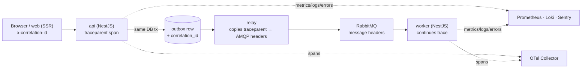
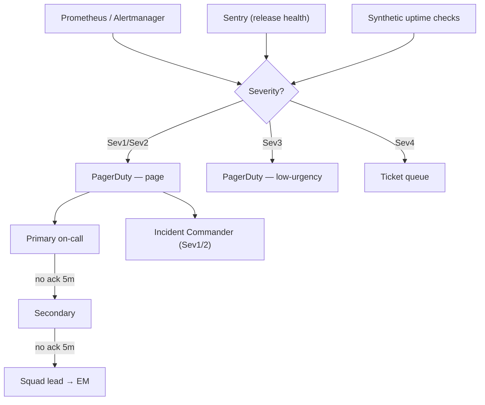

# Eventa — Observability, SRE & DevSecOps

| | |
|---|---|
| **Author** | Solution Architect |
| **Version** | 1.0 |
| **Date** | 2026-07-23 |
| **Status** | Baseline |
| **Part of** | DevOps documentation set |
| **Overview** | [devops-architecture.md](../07-deployment/devops-architecture.md) |
| **Sibling details** | [devops-ci-cd.md](../07-deployment/devops-ci-cd.md) · [devops-infrastructure.md](../07-deployment/devops-infrastructure.md) |
| **System architecture (SAD)** | [software-architecture.md](../04-architecture/software-architecture.md) |

---

This document is the operations contract for running Eventa in production: what we measure, the service
levels we commit to, how we get paged, how we handle incidents, how we keep the pipeline secure and
compliant, and how we recover from disaster. It assumes the platform described in the
[SAD](../04-architecture/software-architecture.md) — **web** (React SSR), **api** (NestJS modular monolith), **worker**
(RabbitMQ consumers), **relay** (outbox publisher), plus the autoscaled **check-in api pool** — and the
CI/CD and infrastructure decisions detailed in the [overview](../07-deployment/devops-architecture.md) and its
[CI/CD](../07-deployment/devops-ci-cd.md) / [infrastructure](../07-deployment/devops-infrastructure.md) siblings. It does not restate the
SAD; it operationalises it.

**Operating principle — you build it, you run it.** Each squad owns the SLOs, dashboards, alerts, and
runbooks for the services it ships. Observability, error budgets, and blameless postmortems are the
feedback loops of the **Three Ways** (flow, fast feedback, continual learning); measurement and sharing
are two of the five **CALMS** pillars.

---

## 1. Observability — the three pillars

Four telemetry signals, one correlation model. Everything is tenant-aware (`organization_id`) and
region-pinned to **SG/TH** (PDPA residency — telemetry backends run in-region; see [infrastructure](../07-deployment/devops-infrastructure.md)).

| Pillar | Tooling | Emitted by | Retention | Primary use |
|---|---|---|---|---|
| **Metrics** | Prometheus (scrape + remote-write) → **Grafana** | all 5 workloads via `/metrics`, plus RabbitMQ, Postgres, Redis exporters | 15 days raw, 13 months downsampled | SLIs, dashboards, alert rules, capacity |
| **Logs** | **Loki** (structured JSON, label-indexed) | all workloads via stdout → agent | 30 days hot, 1 year archived (object storage) | Debugging, audit trail, forensics |
| **Traces** | **OpenTelemetry** SDK → OTel Collector → tracing backend | api, web, worker, relay | 7 days (tail-sampled) | Latency breakdown, cross-service causality |
| **Errors** | **Sentry** (per-release, per-tenant tags) | web (browser + SSR), api, worker | 90 days | Exception grouping, regression detection, release health |

### 1.1 Correlation model — HTTP **and** RabbitMQ

A single `correlation_id` (a.k.a. trace id) follows a request from the browser through the synchronous
API path, across the outbox, over RabbitMQ, and into the worker — so one id joins a log line in `web`,
a span in `api`, and an exception in `worker`.

- **Ingress:** edge/WAF assigns `x-correlation-id` if absent; `web` and `api` propagate W3C
  `traceparent`.
- **HTTP → HTTP:** OpenTelemetry auto-instrumentation propagates `traceparent` on every outbound call.
- **HTTP → async (the bridge):** when `api` writes the **outbox** row (same DB transaction as the domain
  change — see [SAD §5](../04-architecture/software-architecture.md)), it persists `correlation_id` and the serialized
  `traceparent` in the outbox payload/headers.
- **relay → RabbitMQ:** the relay copies `traceparent` and `correlation_id` into AMQP message headers on
  publish (publisher confirms).
- **RabbitMQ → worker:** the consumer extracts the header, continues the same trace, and stamps every log
  line and Sentry event with `correlation_id`, `message_id`, `routing_key`, and `organization_id`.

**Standard log fields (every line, every service):** `ts`, `level`, `service`, `env`, `correlation_id`,
`organization_id`, `user_id?`, `route`/`routing_key`, `latency_ms`, `status`, `error_code?`. Never log
PANs, card data, full PII, or secrets (see §6 PCI/PDPA controls).

### 1.2 Key dashboards (Grafana)

| Dashboard | Audience | Contents |
|---|---|---|
| **Service golden signals** (per workload) | on-call | Rate, errors, duration (p50/p95/p99), saturation (CPU/mem), HPA replica count |
| **Checkout journey** | payments squad | Order create rate, checkout success %, checkout latency, PaymentIntent errors, hold-expiry rate, webhook processing lag |
| **Check-in day** | attendance squad | Scan throughput (scans/s), scan p95 latency, check-in pool replica count, error rate, per-event live gauge |
| **Eventing health** | platform squad | **Outbox lag**, relay publish rate, **RabbitMQ queue depth per queue**, **DLQ depth**, consumer ack/nack rate, redelivery count |
| **Data tier** | platform squad | Postgres primary/replica lag, connections, slow queries, Redis hit rate/evictions, RabbitMQ node health |
| **SLO & error budget** | eng leadership | Burn-down per journey (§4), 28-day compliance, budget remaining |
| **DORA** | eng leadership | Deployment frequency, lead time, change-failure rate, MTTR (source: CI/CD + incidents — see [CI/CD](../07-deployment/devops-ci-cd.md)) |
| **Release health** (Sentry) | releasing squad | Crash-free sessions, new-issue count by release SHA, adoption |

---

## 2. Domain SLIs

Service Level Indicators are measured from telemetry, tenant-agnostic in aggregate but sliceable by
`organization_id`. "Good" is defined per indicator; SLIs feed the SLOs in §3.

| SLI | Definition (good ÷ valid) | Source | Why it matters |
|---|---|---|---|
| **Checkout success rate** | confirmed orders ÷ (confirmed + failed order attempts, excluding user-abandoned) | api metrics + orders read-model | Core revenue path; oversell/double-charge guardrail |
| **Checkout latency** | p95 wall time `POST /orders` → client secret / QR returned | api HTTP histogram | On-sale spike responsiveness (SAD driver: sub-2s) |
| **Check-in scan throughput** | successful `POST /check-ins` per second, per event | check-in pool metrics | Event-day gate flow; capacity for door surges |
| **Check-in scan latency** | p95 `POST /check-ins` response time | check-in pool histogram | Queue-at-the-door experience |
| **Outbox lag** | age (seconds) of the oldest unpublished `outbox` row | relay gauge / DB query exporter | Async side-effects freshness; relay health |
| **RabbitMQ queue depth** | ready + unacked messages per queue | RabbitMQ exporter | Consumer keeping up; backpressure signal |
| **DLQ depth** | messages parked in `eventa.dlx` dead-letter/parking queues | RabbitMQ exporter | Poison messages / failing handlers |
| **Discovery latency** | p95 `GET /discover` and `GET /events/:slug` (cache + replica path) | api / web SSR histogram | First impression; SEO landing speed |
| **Payment webhook processing** | success rate & p95 latency of signature-verified Stripe/PromptPay webhooks reaching a terminal state | api webhook handler metrics | Payment = source of truth (SAD §7.1); reconciliation |
| **Notification delivery** | order-confirmed email/SMS dispatched ÷ orders confirmed (within 5 min) | worker metrics + delivery log | Attendee gets ticket/receipt |

**Alerting-relevant thresholds** (rule detail in §3/§4): outbox lag `> 30s` warn / `> 120s` page; any
DLQ depth `> 0` warn, `> 10` or rising 15 min page; RabbitMQ queue depth `> 5×` its rolling baseline page.

---

## 3. SLOs & error budgets

SLO windows are **rolling 28 days**. The error budget is `(1 − target) × valid events`; when a journey's
budget is consumed, an **error-budget policy** trips (below the table). Latency SLOs use the stated
percentile as the objective.

| Journey | SLI | SLO target (28d) | Error budget | Latency objective |
|---|---|---|---|---|
| **Discover** | Discovery availability | **99.9%** successful | 0.1% (~40 min/28d) | p95 `< 400 ms` (cached), `< 800 ms` (SSR cold) |
| **Discover** | Discovery latency | 99% of reads meet objective | 1% | p95 `< 800 ms` |
| **Checkout** | Checkout success | **99.5%** success | 0.5% | — |
| **Checkout** | Checkout latency | 99% meet objective | 1% | **p95 `< 2000 ms`** |
| **Checkout** | Payment webhook processing | **99.9%** processed to terminal state | 0.1% | p95 `< 5 s` end-to-end |
| **Check-in** | Check-in availability | **99.95%** success (event-day critical) | 0.05% | — |
| **Check-in** | Scan latency | 99% meet objective | 1% | **p95 `< 500 ms`** |
| **Eventing** | Outbox → consumer freshness | 99.9% of events processed `< 60 s` | 0.1% | p95 outbox-to-ack `< 60 s` |

**Multi-window burn-rate alerting** (Google SRE pattern) on the budget:

| Burn rate | Windows (fast + slow) | Budget consumed | Action |
|---|---|---|---|
| **14.4×** | 1 h and 5 m both breaching | 2% in 1 h | **Page** (Sev2, or Sev1 if checkout/check-in) |
| **6×** | 6 h and 30 m both breaching | 5% in 6 h | **Page** (Sev3→2) |
| **3×** | 24 h and 2 h both breaching | 10% in 24 h | **Ticket** — investigate next business day |

**Error-budget policy.** When a journey's rolling budget is exhausted: (1) freeze non-essential releases
to the affected service — only reliability fixes ship; (2) the owning squad's next-sprint priority
shifts to reliability work; (3) the freeze lifts when the SLO recovers within window. Freezes are
enforced through the GitOps promotion gate (see [CI/CD](../07-deployment/devops-ci-cd.md)). Check-in has a standing
**event-day change freeze** regardless of budget.

---

## 4. Alerting & on-call

**Routing:** Prometheus/Alertmanager → **PagerDuty** (paging) and a chat channel (awareness). Every
alert carries `severity`, `service`, `runbook_url`, `dashboard_url`, and `correlation_id`/query links.
Alerts are **symptom-based** (SLO burn, user-facing) for paging; **cause-based** alerts (e.g. high CPU)
are ticket-only unless they predict imminent SLO breach.

| Severity | Meaning | Example trigger | Response | Notify |
|---|---|---|---|---|
| **Sev1** | Critical — revenue/check-in down, data at risk | Checkout success < 95% 5 m; check-in pool down on event day; payment webhooks failing; DB primary unreachable | **Page immediately, 24×7**, incident channel, ack ≤ 5 min | On-call + secondary + IC + eng lead |
| **Sev2** | Major degradation, budget burning fast (14.4×) | Checkout p95 > 2 s sustained; outbox lag > 120 s; DLQ rising | Page, ack ≤ 15 min | On-call + secondary |
| **Sev3** | Minor / slow burn (6×) | Discovery latency SLO 6 h burn; single consumer lagging | Business-hours page/ticket | On-call |
| **Sev4** | Informational / cause-based | HPA at max replicas; cert expiry T-14d; Redis evictions rising | Ticket, triage next day | Owning squad |

**On-call & escalation.** Per-squad weekly rotation (primary + secondary). Escalation policy in
PagerDuty: **primary (5 min no-ack) → secondary (5 min) → squad lead → engineering manager**. A
dedicated **Incident Commander (IC)** role is paged for any Sev1/Sev2. Follow-the-region coverage is
SG/TH business-aligned with 24×7 paging for Sev1/Sev2. Runbook links (§7) are attached to every alert
rule so the responder lands on the procedure, not a blank dashboard.

**Synthetic monitoring.** External uptime checks probe the discover page, a canary checkout (test
tenant, Stripe test mode), and a check-in health endpoint every 60 s from in-region and one external
vantage; failures raise Sev-appropriate alerts and feed the availability SLIs.

---

## 5. Incident management

### 5.1 Severities & response process

Incident severity maps to the alert severity in §4 (Sev1–Sev4). The process is lightweight and
consistent:

1. **Detect** — alert, synthetic, or human report opens an incident (auto-created from PagerDuty).
2. **Declare** — responder confirms; for Sev1/Sev2 an **IC** is assigned and a dedicated incident
   channel + bridge opens. Roles: IC (coordinates), Ops lead (hands on keyboard), Comms (status/stakeholders), Scribe (timeline).
3. **Mitigate first** — restore service before root-causing. Standard levers: **automated rollback** of
   the bad release (GitOps revert to last-good SHA — see [CI/CD](../07-deployment/devops-ci-cd.md)), scale the relevant
   HPA, drain/replay DLQ, fail over DB, toggle a feature flag, shed load.
4. **Communicate** — status updates on a cadence (Sev1 every 30 min) to a status page / stakeholders;
   PDPA-relevant incidents notify the DPO within statutory timelines.
5. **Resolve** — service back within SLO; incident downgraded/closed with a timestamped timeline
   (the Scribe's log).
6. **Learn** — postmortem for every Sev1/Sev2 (and any Sev3 by request).

### 5.2 Blameless postmortems

- **Mandatory** for all Sev1 and Sev2 incidents; drafted within **3 business days**, reviewed within **5**.
- **Blameless** — focus on systems and contributing conditions, never individuals. Ask "how did the
  system allow this," not "who did it."
- **Template:** summary · customer/tenant impact (scope, duration, SLO/budget spent) · timeline (from the
  scribe) · detection (how, MTTA) · root cause & contributing factors (5-whys / contributing-conditions)
  · what went well / what didn't / where we got lucky · **action items** (owner + due date + tracking id).
- **Sharing** (CALMS): every postmortem is published internally and reviewed in a recurring
  learning forum; recurring themes feed the reliability backlog.

### 5.3 Action tracking

Action items are filed as tracked tickets with an owner and due date, tagged `postmortem` and the
incident id, and reviewed at the reliability review until closed. Repeat-incident and
action-item-aging metrics are reported alongside the **DORA MTTR** and change-failure-rate trends so
prevention work is visible and prioritised.

---

## 6. DevSecOps — shift-left security in the pipeline

Security is a pipeline concern, not a gate at the end. Every control below runs in **GitHub Actions**
and **blocks the merge/promotion** on failure (thresholds noted). Full stage ordering lives in
[CI/CD](../07-deployment/devops-ci-cd.md); this is the security view.

| Stage | Tool | Runs on | Gate |
|---|---|---|---|
| **SAST** | CodeQL / Semgrep | every PR | Block on new high/critical; ruleset covers injection, authz, secrets-in-code |
| **SCA (dependencies)** | Dependency scanning | every PR + daily | Block on high/critical CVE with a fix; grace window for no-fix, tracked |
| **Secret scan** | **gitleaks** | every PR + pre-commit hook + full-history | Block on any verified secret; rotate immediately if leaked |
| **Container scan** | **Trivy** | on image build | Block on high/critical OS/lib CVE; base-image freshness enforced |
| **IaC scan** | **tfsec / Checkov** | on Terraform PRs | Block on high-severity misconfig (public buckets, open SGs, unencrypted volumes) |
| **SBOM** | SBOM generator (CycloneDX/SPDX) | on image build | Attached as artifact + attestation; required to publish |
| **Image signing** | Sigstore/cosign | on publish | Images **signed**; Argo CD / admission control **verifies signature** before deploy |
| **DAST** | **OWASP ZAP** | against **staging** (post-deploy, scheduled) | Baseline + auth scan; high findings block promotion to UAT/prod |

**Supply-chain chain of custody.** Immutable **SHA-tagged** images → SBOM + signature attestation → Argo
CD deploys **only signed, provenance-verified** images (pull-based GitOps). No mutable tags, no manual
`kubectl apply` to prod — the cluster reconciles from Git ([overview](../07-deployment/devops-architecture.md)).

### 6.1 PCI SAQ-A controls in the pipeline

Eventa is **SAQ-A**: card data is entered into **Stripe hosted fields**; the platform never sees or
stores a PAN (SAD §9). The pipeline enforces the scope boundary:

- **No cardholder data in scope** — SAST/secret rules flag any code path that could receive or log raw
  card/PAN data; log scrubbing (§1.1) drops payment fields; DAST checks that payment forms load Stripe's
  hosted fields over TLS only.
- **Integrity of payment pages** — `web`/SSR served over HTTPS with CSP + Subresource Integrity; image
  signing + GitOps prevent unauthorised changes to the payment page; change management is auditable in Git.
- **Third-party (Stripe) attestation** tracked; webhook endpoints signature-verified and idempotent
  (SAD §7.1) — verified by integration tests in CI.
- **Access & change control** — protected `main`, mandatory PR review, and signed commits give the
  auditable change trail SAQ-A expects.

### 6.2 PDPA controls in the pipeline

- **Data residency** — Terraform pins all data stores, backups, and **telemetry backends** (Loki/Sentry/
  traces) to the **SG/TH** region; `tfsec/Checkov` policy fails any resource created out-of-region.
- **Data minimisation in telemetry** — CI lint/SAST rules and log schema validation prevent PII (email,
  phone, national ID) and secrets in logs, traces, and error events; Sentry PII scrubbing enabled.
- **DSR support** — deletion/export tooling (SAD §9) is exercised by integration tests; retention windows
  (§1) are enforced on telemetry stores.
- **Consent & cross-border** — configuration for consent and cross-border transfer is
  environment-scoped and reviewed.

### 6.3 Secret rotation & audit

| Concern | Control |
|---|---|
| **Secret storage** | Managed secrets manager; surfaced to K8s via **External Secrets**; never in Git (SAD/[overview](../07-deployment/devops-architecture.md)) |
| **Rotation** | DB/Redis/RabbitMQ creds and API keys rotated on schedule (≤ 90 days) + on-demand after any suspected exposure; Stripe keys rotated per Stripe guidance |
| **Leaked-secret response** | gitleaks hit → revoke + rotate immediately, rewrite history if needed, postmortem |
| **Least privilege** | Per-workload IAM roles / service accounts; check-in pool scoped to its needs; no shared "god" credentials |
| **Audit** | Business **audit log** (SAD §9) + infra audit trail (cloud audit logs, K8s API audit, Argo CD sync history, Git history) retained in-region; who-changed-what for infra, deploys, and secret access |

---

## 7. Reliability & DR

Managed data services run **multi-AZ**; workloads autoscale via **HPA** (the check-in pool has its own
Deployment + scaling policy). See [infrastructure](../07-deployment/devops-infrastructure.md) for the Terraform-managed
topology.

### 7.1 Backups, PITR & targets

| Data store | Backup | PITR | RPO | RTO |
|---|---|---|---|---|
| **PostgreSQL** (primary + replica, multi-AZ) | Automated daily snapshot + continuous WAL | **Yes — to any second in window** | **≤ 5 min** | **≤ 30 min** (failover) / ≤ 2 h (restore) |
| **Redis** | Managed snapshot (cache — regenerable) | N/A | ≤ 1 h (best-effort) | ≤ 15 min (rebuild/warm) |
| **RabbitMQ** | Clustered + durable queues; definitions backed up | Message replay from outbox | Near-zero (outbox is source) | ≤ 30 min |
| **Object storage** | Versioning + cross-AZ replication | Versioned | ~0 | ≤ 15 min |
| **Outbox** | Part of Postgres backup | Via Postgres PITR | ≤ 5 min | With DB |

**RPO/RPO rationale.** The **outbox** makes RabbitMQ effectively recoverable: unpublished events survive
in Postgres and the relay republishes after recovery, so a broker loss does not lose domain events (SAD
§5). Idempotent consumers make replay safe.

### 7.2 High availability

- **Multi-AZ** managed Postgres (primary + standby), Redis, and clustered RabbitMQ.
- **≥ 2 replicas** per Deployment; HPA scales on CPU + custom metrics (e.g. RabbitMQ queue depth for
  workers, request rate for the check-in pool).
- **Rolling** updates by default with health-gated readiness; **canary** for the api; **automated
  rollback** on failed health/canary checks; **DB migrations as a gated pre-deploy job** (see [CI/CD](../07-deployment/devops-ci-cd.md)).
- **Graceful degradation** — discovery serves read-only from cache/CDN under stress (SAD §9).

### 7.3 DR drills & capacity reviews

| Activity | Cadence | Goal |
|---|---|---|
| **DB failover drill** | Quarterly | Verify RTO ≤ 30 min; validate app reconnection |
| **PITR restore test** | Quarterly | Restore to a scratch env; validate RPO + data integrity |
| **Region/AZ-loss game day** | Semi-annual | Exercise DR runbooks end-to-end, blameless review |
| **Backup restore verification** | Monthly (automated) | Prove backups are restorable, not just present |
| **Capacity review** | Monthly + pre-large-event | Headroom vs. HPA max, DB connections, RabbitMQ throughput; scale limits ahead of on-sales & big check-in days |
| **Load / soak test** | Before major releases & flagship events | Validate checkout p95 and check-in throughput SLOs under spike |

DR runbooks are the executable side of these targets — indexed below.

---

## 8. Runbooks index

Runbooks live in the ops repo (`/runbooks`), are linked from every alert rule, and each states:
**symptom → dashboard → diagnosis steps → mitigation → verification → escalation**.

| Runbook | Trigger / alert | Core mitigation |
|---|---|---|
| **Checkout failing / elevated errors** | Checkout success SLO burn; PaymentIntent errors | Check Stripe status, canary rollback, verify webhook processing, DB locks |
| **Payment webhook backlog** | Webhook processing SLO breach | Inspect signature failures, replay from Stripe dashboard, scale api |
| **Failed payout / Stripe Connect issue** | Payout error alert / finance report | Reconcile ledger vs. Stripe, retry payout, escalate to finance + Stripe |
| **RabbitMQ backlog / queue depth high** | Queue depth > 5× baseline | Scale worker HPA, check consumer errors, inspect slow handler, add temporary consumers |
| **DLQ / poison messages** | DLQ depth > 0 rising | Inspect parked messages, fix handler, **replay** from parking queue, drop confirmed-bad after review |
| **Outbox lag / relay stalled** | Outbox lag > 120 s | Check relay health & DB poll, restart relay, verify publisher confirms, check RabbitMQ reachability |
| **DB failover / primary unreachable** | Postgres primary down (Sev1) | Trigger/confirm managed failover, verify app reconnect, check replica lag, PITR if corruption |
| **DB migration failure** | Gated pre-deploy migration job fails | Halt deploy (auto), roll migration back, restore from PITR if partial, re-run after fix |
| **Check-in pool overload (event day)** | Scan latency/availability SLO breach | Pre-scale check-in pool, verify HPA max, offline-scan fallback, war-room |
| **Certificate / TLS rotation** | Cert expiry T-14/T-7 alert | Rotate via cert manager / Terraform, verify chain, confirm WAF/LB pickup |
| **Secret leaked / rotation** | gitleaks hit / suspected exposure | Revoke + rotate via secrets manager + External Secrets, invalidate sessions, postmortem |
| **Redis outage / cache cold** | Redis unreachable / hit-rate collapse | Fail over managed Redis, protect DB (rate-limit/shed), warm cache, verify sessions |
| **Elevated 5xx / bad release** | Golden-signal error spike post-deploy | GitOps revert to last-good SHA (automated rollback), confirm canary metrics |
| **Region / AZ degradation** | Multi-AZ health alarms | Execute DR plan, shift traffic, validate data-tier standby, comms + status page |

---

## 9. How this satisfies the platform's operating goals

| Goal (from SAD / DevOps decisions) | Where addressed |
|---|---|
| Correlation across HTTP **and** RabbitMQ | §1.1 |
| Domain-specific SLIs (outbox, DLQ, check-in, checkout) | §2 |
| SLOs + error budgets for discover/checkout/check-in | §3 |
| PagerDuty routing, severity, escalation, runbook links | §4, §8 |
| Blameless postmortems + action tracking | §5 |
| Shift-left DevSecOps (SAST/SCA/container/IaC/secret/DAST/SBOM/signing) | §6 |
| PCI SAQ-A + PDPA controls in the pipeline; secret rotation; audit | §6.1–§6.3 |
| Backups + PITR, RTO/RPO, multi-AZ, DR drills, capacity | §7 |
| DORA metrics as the health signal of the whole system | §1.2, §5.3 |
| CALMS + Three Ways feedback loops | intro, §5 |

---

_Detail document in the DevOps set. Back to the [overview](../07-deployment/devops-architecture.md) · siblings
[devops-ci-cd.md](../07-deployment/devops-ci-cd.md), [devops-infrastructure.md](../07-deployment/devops-infrastructure.md) · system
architecture [software-architecture.md](../04-architecture/software-architecture.md). Changes follow the same
supersede-and-baseline model as the SAD._
